

# Martlet

### Meet your AI companion. She talks, listens, watches and lives right on your desktop.

&nbsp;

[Features](#-everything-shes-got) · [Coming soon](#-coming-soon) · [Screenshots](#-take-a-look) · [Get started](#-up-and-running-in-minutes) · [Wiki](https://github.com/throndir2/Martlet/wiki)

 

<picture>
  <source media="(prefers-color-scheme: dark)" srcset="docs/images/hero-dark.png">
  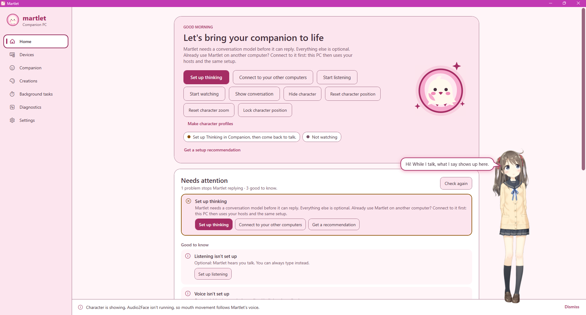
</picture>

<i>She stands on top of everything, games included, and every word she says pops up in a speech bubble.</i>

---

## 💗 Say hi to Martlet

Martlet is the friend in the room who's always up for a chat. Just talk (or
type) and she answers out loud in a voice you picked, while her animated
character speaks right there on your screen.

She can **watch your game and cheer you on**, **read your screen**, **react
when you touch her**, **remember what matters to you**, **draw you pictures**,
**write and sing you songs**, **dim your lights** and **help out on your PC**.
And it all runs where you want: privately on your own computer, on a beefier
PC down the hall, spread across all your computers, or with your favorite
cloud AI.

<table>
<tr>
<td align="center" width="25%">🎙️ <b>Just talk</b> Hands-free or push-to-talk</td>
<td align="center" width="25%">✨ <b>She's alive</b> An animated character with lip-sync</td>
<td align="center" width="25%">🔒 <b>Yours</b> Runs on your PC, no account needed</td>
<td align="center" width="25%">🖥️ <b>Everywhere</b> The same Martlet on all your computers</td>
</tr>
</table>

## 🆕 What's new in 0.67.0

- 👨‍👩‍👧 **Martlet for the whole household**: Martlet signs you in with your Windows account, and anyone else can **Add a person** or switch at the bottom left. Each person has their own characters, personalities, memories, creations and settings, while your computers, hosts and paid API keys stay shared.
- 🤝 **Share characters and memories**: share a character as a copy or together, so the same character remembers everyone, and copy or move memories to the household or another person.
- 🗣️ **Martlet knows who's talking**: link a voice on People to your account. Voices are always shared with all your computers, so Martlet learns everyone's voice everywhere.
- 🔐 **Your own Account page**: add a password and an authenticator app, lock your account with a PIN or Windows Hello on a shared PC, and sign in as someone else.
- 🔗 **Link any sign-in**: link your Windows login, Google, Microsoft, Authentik, Discord or Steam to your account, set a provider up once for every host, and let a new computer join by signing in.

[Full changelog](CHANGELOG.md) · [All releases](https://github.com/throndir2/Martlet/releases)

## 🔮 Coming soon

Everything finished so far shipped in 0.67.0. See [Unreleased](CHANGELOG.md#unreleased) in the changelog for what lands next.

## 💬 Things you can say

> 🎮 **"Ugh, this boss again. Any ideas?"**
> Press **Start watching** and she glances at your screen now and then, joining in like she's on the couch with you (and staying quiet the rest of the time).

> 🎨 **"Draw me a fox curled up in the snow."**
> She paints it in the background while you keep chatting, then shows it to you and saves it in **Creations**.

> 🎤 **"Write a song about rainy Sundays and sing it for me."**
> She writes the lyrics and music, then sings it in the voice of your choice.

> 💭 **"Can you plan a week of dinners? Take your time."**
> She'll tell you she's thinking it over, work it out while you keep talking, and bring it up when it's ready.

> 🧠 **"What did we talk about yesterday?"**
> She remembers the things that matter to you and can pick up earlier conversations, all kept on your PC.

> 🏠 **"Turn the living room lights down."**
> Hook her up to Home Assistant and your smart home answers to her voice.

> 🖥️ **"How much space is left on my D: drive?"**
> Give her tools and she can lend a hand on your PC, always asking before she does anything.

> 🤗 *(Pat her on the head.)*
> She leans in, smiles and might say something about it, just like she would.

## 🌸 Everything she's got

<table>
<tr>
<td width="50%" valign="top">

### 🗨️ Conversations that feel natural
- Talk hands-free from **Start listening** to **Stop listening**, or hold the talk button (or Space) to talk.
- Replies start fast and are spoken sentence by sentence. Interrupt her any time, and she remembers only what she actually said aloud.
- She hears when you've finished talking, so she doesn't jump in mid-thought.
- **Voice ID** knows your voice and ignores other people talking.
- She learns who else is around and the names they go by.
- Prefer typing? The **talk window** is a simple chat that sits beside your work.

</td>
<td width="50%" valign="top">

### ✨ A character who's really there
- **Live2D** and **VRM** characters float on your desktop, over full-screen games too.
- Drag her anywhere, zoom, lock her in place or let clicks pass through her while you play.
- **Speech bubbles** and **subtitles** show what she's saying.
- She blushes, winks, pouts and shows anime emotes like heart eyes, sweat drops and anger veins, alone or in combos.
- Her mouth moves with her voice, or go all out with NVIDIA **Audio2Face**.
- Starts with a built-in character; add as many of your own as you like.

</td>
</tr>
<tr>
<td valign="top">

### 🗣️ Any voice you want
- Expressive voices that **laugh, sigh and whisper**, and one that turns on the drama when the moment calls for it.
- **Clone a voice** from a few seconds of audio. No training required.
- Seven voice engines to choose from (Chatterbox Turbo, Original and Nano, F5, XTTS, GPT-SoVITS, Dia), plus Windows, OpenAI and **ElevenLabs** voices. Chatterbox Nano even runs without a graphics card.
- Switch voices with one click, and compare them side by side.
- She can laugh, gasp or giggle in her own voice when you touch her.

</td>
<td valign="top">

### 💭 Smart, your way
- **Free and private** with Ollama on your own PC. Martlet picks a model that fits your graphics card, or uses the model app you already run (LM Studio, llama.cpp, vLLM).
- Or use **OpenAI**, **Google Gemini**, **OpenRouter**, **NVIDIA Build** or any compatible service.
- A **Thinking pool** shares background work across all your models and computers: thinking longer, web research, check-ins and summaries, without making you wait.
- A backup model steps in if the main one has a hiccup or is slow to start.

</td>
</tr>
<tr>
<td valign="top">

### 👀 Plays along with you
- Comments on **your screen**, the window you're in, a **webcam or capture card**, or even your **phone's camera**.
- **Reads your screen**, small text included (Windows OCR or PP-OCRv5), and notices a new score or message.
- **Hears what your PC plays**, like music, a video or a game, and how you sound when you talk.
- Knows which app you're in, so she talks about your game or show, not its menus.
- Never looks at password managers, private browsing or her own windows.
- You decide how chatty she is: Quiet, Normal or Chatty.

</td>
<td valign="top">

### 🎭 Make her your own
- Write **personas** and switch between them.
- **Character profiles** swap her look, voice and personality in one step.
- Import **character cards** and **lorebooks** from SillyTavern.
- An optional **Adult content (18+)** setting for adult characters, off by default.
- **Memory** and **conversation history** stay on your PC, and you can see, edit or delete everything.

</td>
</tr>
<tr>
<td valign="top">

### 🤗 She feels your touch
- Poke, pat, hold or stroke her: every part of her body is a **touch zone** that reacts the way her personality would.
- Martlet finds the zones for you, even for tails, wings and ears that swing.
- Pick each zone's emotes, gestures, motions and sounds, or use a **touch temperament**.
- She has **moods of her own**: angry or warm, she can change how she takes your touches for a while, and you can undo it.

</td>
<td valign="top">

### 🔔 Check-ins
- Every so often, your Thinking pool checks in on how things are going and helps her stay on track.
- Built-in check-ins welcome you back, follow up on a question you skipped and keep her quiet on calls.
- Write your own: choose what they know (your screen, your mic, your touches, what was said), when they run and what they do.
- Check-ins can **use tools**, like emotes, gaze, her next words and reminders, and can start when you touch her.

</td>
</tr>
<tr>
<td valign="top">

### 🎨 Creative side
- **Sings** songs she writes, with SoulX or VevoSing, and lip-syncs them.
- **Paints pictures** with ComfyUI, OpenRouter or NVIDIA Build.
- **Web research** reports, made in the background.
- Everything she makes waits for you in **Creations**.

</td>
<td valign="top">

### ⏰ Always on time
- **Reminders** from the computer you used last.
- **Background tasks** have their own page, so you can see what she's working on.
- **Quick jobs** and **long jobs** can each have their own machines, so a long job never holds up a quick one.

</td>
</tr>
<tr>
<td valign="top">

### 🧰 Connected to your world
- **Tools**: browse the MCP Registry and install tool servers with a click.
- **Ask your AI assistant to set her up**: Martlet's own MCP server lets GitHub Copilot, Claude or VS Code make characters (even from a SillyTavern card) and change settings for you. Run `scripts\Register-MartletMcp.ps1` from a checkout ([how](docs/MCP.md#use-martlet-from-an-ai-assistant)).
- A built-in **Terminal** (off until you turn it on) that asks before every command.
- **Home Assistant** for lights, climate and more.
- Chat with her on **Discord** (she can join voice calls and even show up on camera), **Telegram** and **WhatsApp**.

</td>
<td valign="top">

### 🖥️ One Martlet, all your computers
- The same companion, voices, memories and characters on every PC.
- Let your gaming rig do the heavy lifting while you chat from a laptop.
- A **Devices** map shows every computer, what it's doing and how much of it each part uses.
- If a computer goes offline, another one running the same engine picks up the job.
- **Share your computers with friends**, and sign in from outside home.
- Runs on Windows (Arm PCs too), with early **Linux** and **Mac** apps.

</td>
</tr>
</table>

**And all the little things:** a friendly welcome tour, a Home page that tells
you exactly what needs attention and how to fix it, a **Recommended setup**
that makes the best use of all your computers, quick sounds while she thinks,
automatic updates, living quietly in your notification area, starting with
Windows, and pretty pink, rose dark, character-colored and fully **custom**
themes.

## 📸 Take a look

<table>
<tr>
<td width="50%">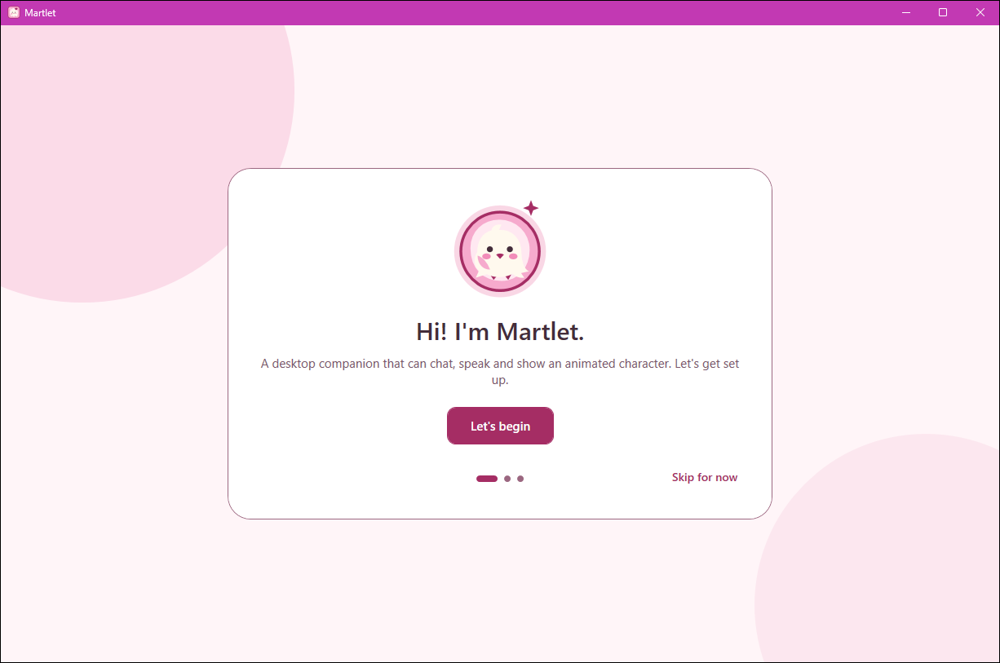
<b>A warm welcome</b> A quick tour gets you set up.
</td>
<td width="50%">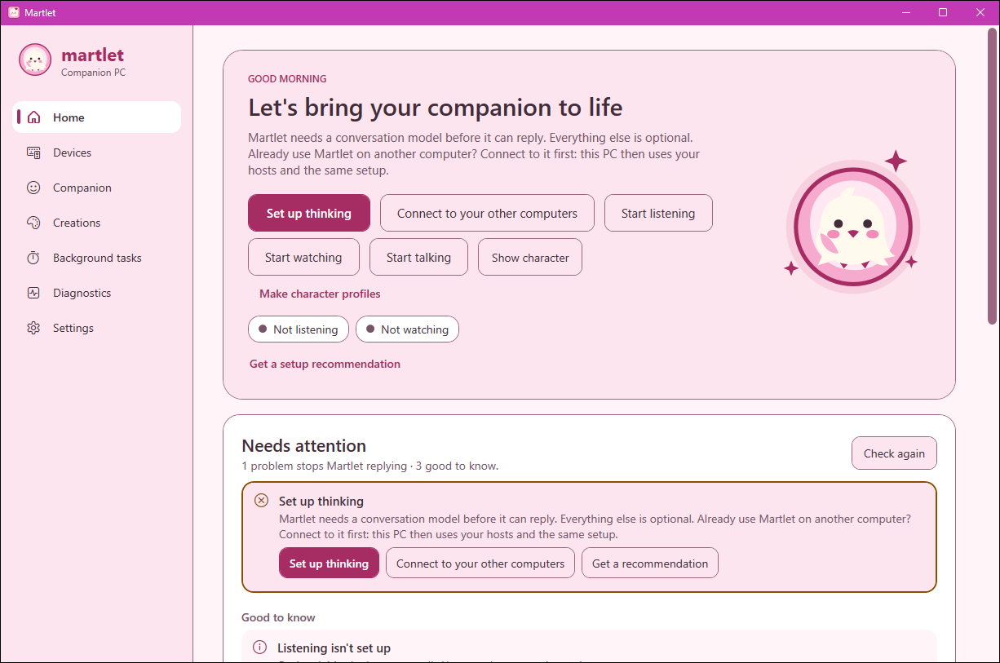
<b>Home</b> Start talking, listening or watching in one click.
</td>
</tr>
<tr>
<td>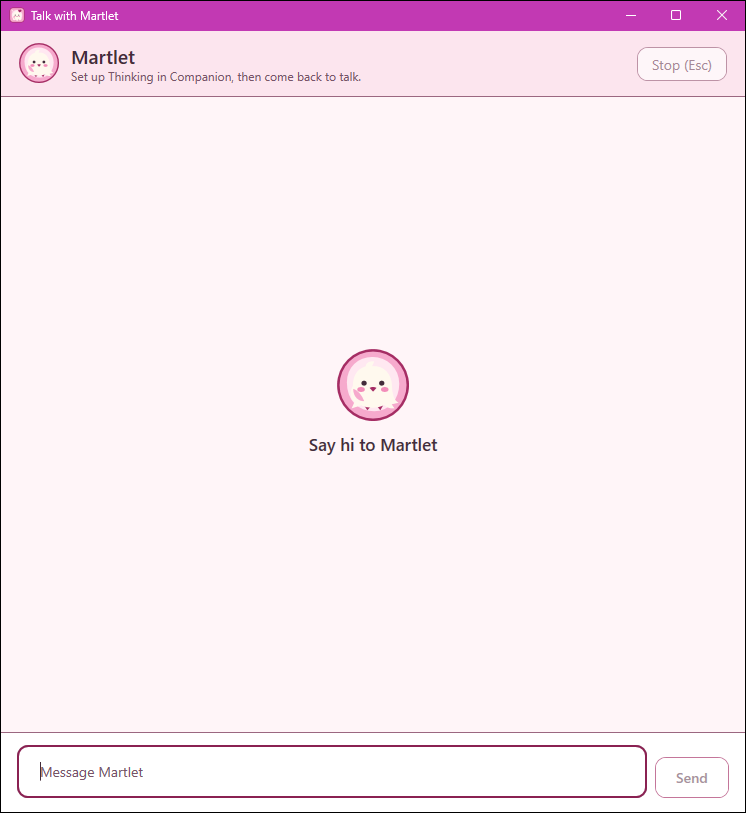
<b>Talk window</b> A simple chat that stays out of your way.
</td>
<td>
<picture>
  <source media="(prefers-color-scheme: dark)" srcset="docs/images/character-bubble-dark.png">
  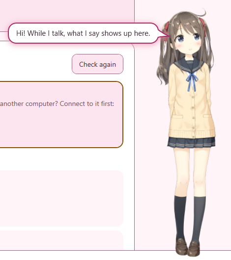
</picture>

<b>Always by your side</b> Speech bubbles follow her wherever you put her.
</td>
</tr>
<tr>
<td>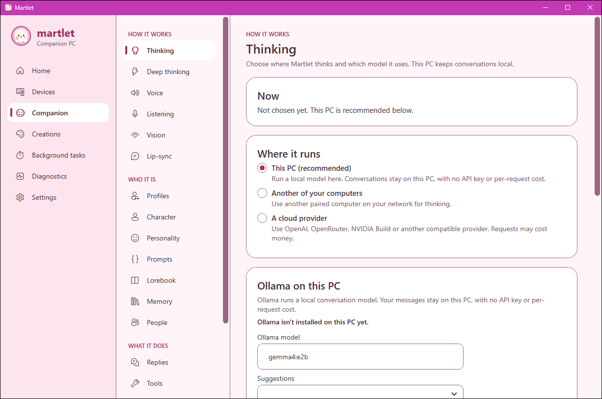
<b>Your PC, your choice</b> Run locally, on another computer or in the cloud.
</td>
<td>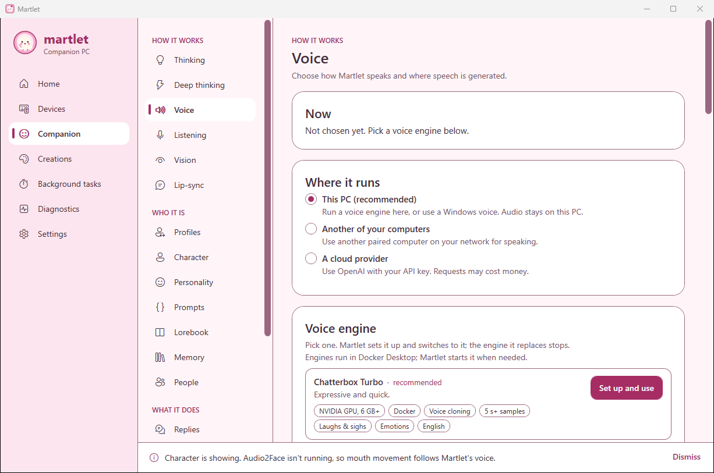
<b>Pick her voice</b> One-click setup for every voice engine.
</td>
</tr>
<tr>
<td>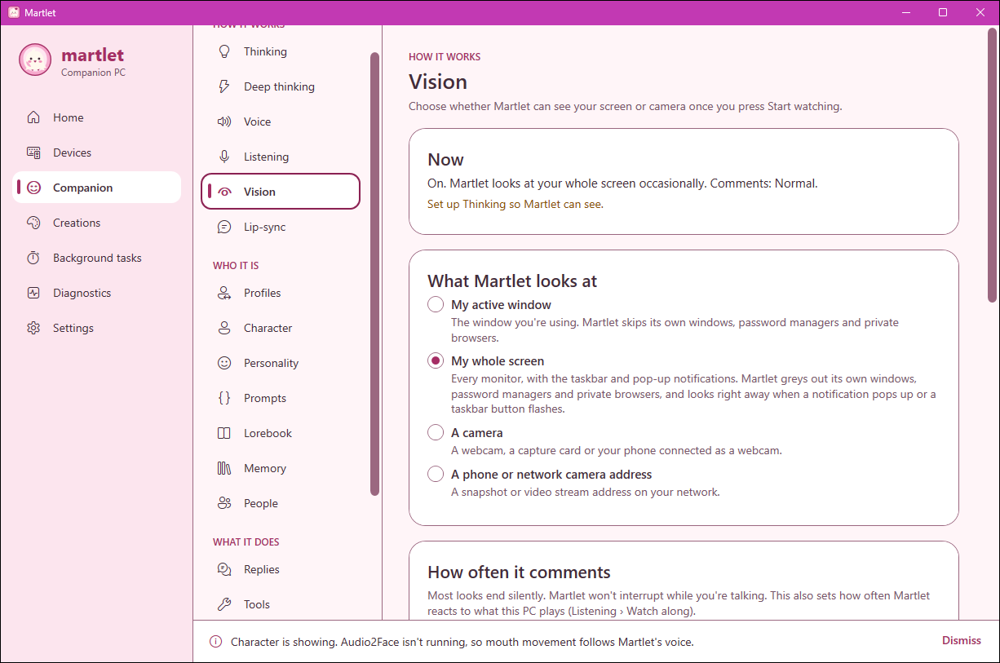
<b>She sees what you see</b> Your screen, the active window or a camera.
</td>
<td>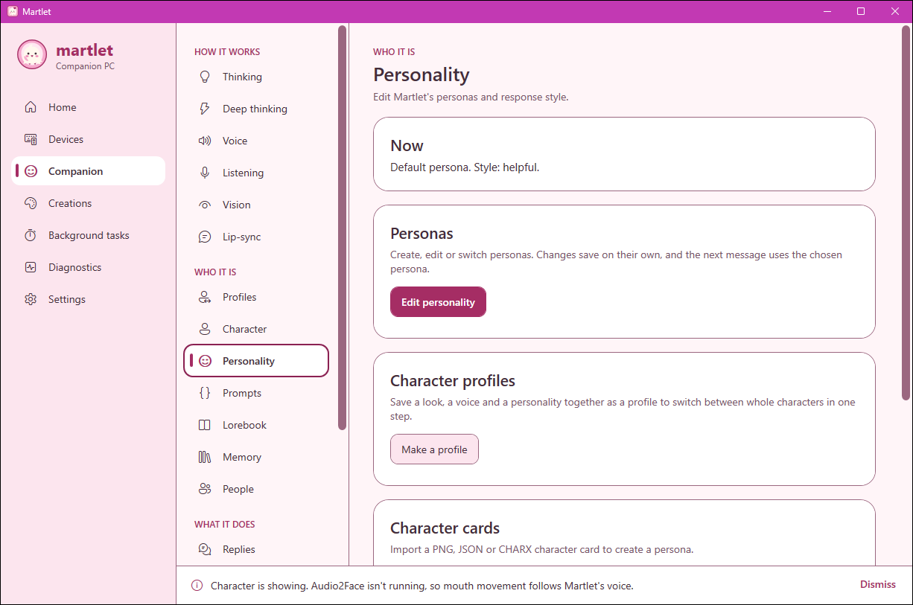
<b>Her personality</b> Personas, profiles and character cards.
</td>
</tr>
<tr>
<td>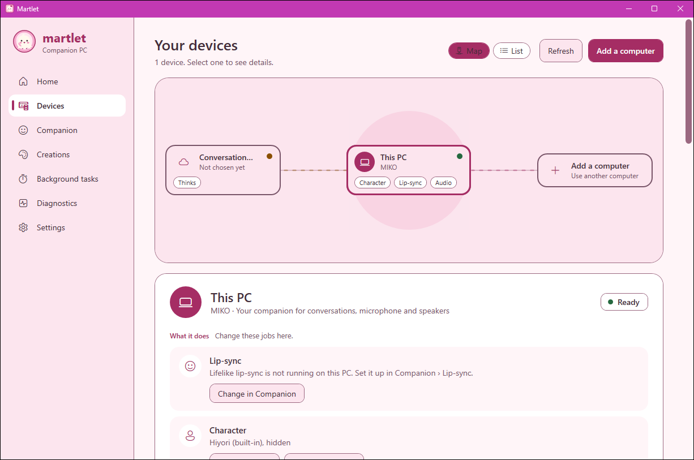
<b>All your devices</b> Every computer working together.
</td>
<td>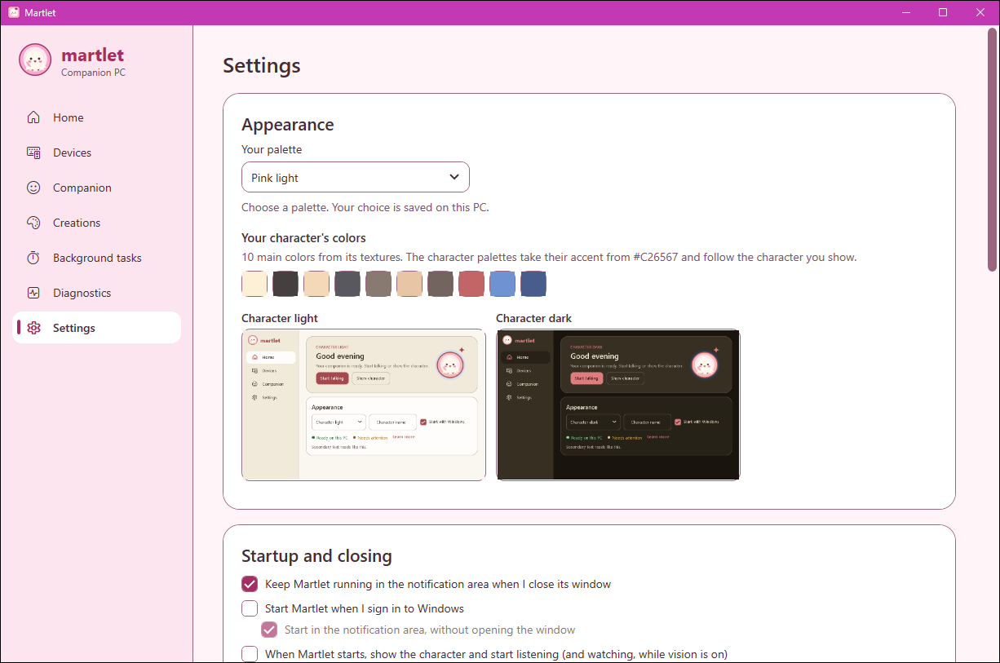
<b>Make it pretty</b> Themes that even match your character.
</td>
</tr>
</table>

## 🚀 Up and running in minutes

1. **[Download Martlet](https://github.com/throndir2/Martlet/releases/latest)**
   (`Martlet-<version>-win-x64.exe`) and run it. No administrator rights needed.
2. **Follow the welcome tour** and choose **Set it all up for me**. Martlet
   picks what fits your PC and installs it after one confirmation: the
   smallest local model that also hears your voice for **thinking**, your
   default microphone for **listening**, and a **voice** on your graphics card
   when it has room (a lighter one on the processor when it doesn't).
3. **Start talking, start listening and show the character.** Say hi! 👋

Prefer something else, like a cloud provider or another of your computers?
Change any of it in **Companion**, click **Recommended setup** to make the best
use of all your computers, or click **Plan a setup from scratch**.

> [!NOTE]
> Martlet runs on Windows 10 (version 2004 or later) and Windows 11, 64-bit,
> and on Windows 11 on Arm PCs such as Snapdragon X laptops (under Windows' x64
> emulation; Windows 10 on Arm isn't supported). A
> graphics card is optional: with a cloud provider any PC will do (cloud
> providers may charge for use). The installer isn't code-signed, so Windows may
> ask you to confirm before it runs.

**Linux and Mac (early desktop companion):** each release also has
`Martlet-<version>-linux-x64.AppImage` / `martlet_<version>_amd64.deb` (and
`arm64` versions) and `Martlet-<version>-macos-arm64.dmg` (Apple silicon) /
`-macos-x64.dmg` (Intel, macOS 14 or later). On Ubuntu or Debian run
`sudo apt install ./martlet_<version>_amd64.deb`; the AppImage needs WebKitGTK
4.1 and libsecret. The Mac app isn't notarized: the first time, choose **Done**,
then **System Settings > Privacy & Security > Open Anyway**. See
[Linux and macOS](docs/DESKTOP_LINUX_MACOS.md#installers-part-of-the-release-build).

## 🔒 Private by design

- **Nothing turns on by itself.** The microphone, camera and screen stay off until you press a button.
- **Your data stays home.** Memories, conversations, voices and characters live on your own computers.
- **You're in charge.** She asks before using tools, and risky smart-home actions like unlocking doors are blocked or need your click.
- **Keys stay safe.** API keys are kept in Windows Credential Manager.

## ☕ Support Martlet

Martlet is a labor of love, made by one person. If she brightens your day, a
coffee helps keep her growing!

## 📚 Learn more

The **[Martlet Wiki](https://github.com/throndir2/Martlet/wiki)** has guides for
every feature, troubleshooting, setting up extra computers, and everything for
developers who want to build Martlet themselves (see also
[Contributing](CONTRIBUTING.md)).

---

Martlet's source, artwork and documentation are [all rights reserved](LICENSE).
Official releases are free for personal, noncommercial use. Third-party
components keep their own terms; the built-in Hiyori character is a Live2D
sample model.
