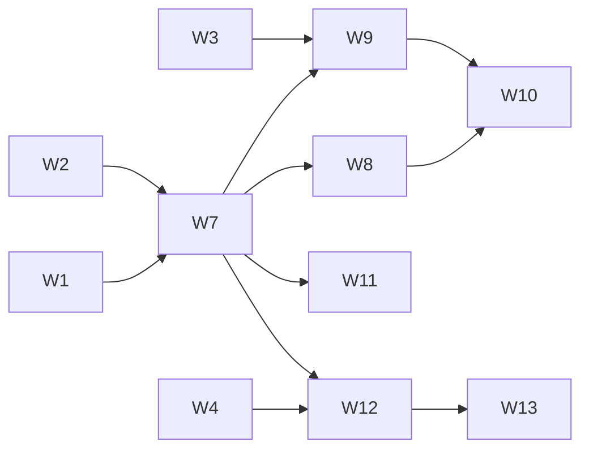

# Accounts and households

Status: **design and work plan**. The work plan below marks the workstreams
that shipped. Each workstream updates this page and the user guides when it
ships. This
page is the contract that the parallel workstreams share: change a contract
here (in the same PR) before code depends on a different one.

## Goal

Several people use Martlet in one home. Each person has their own companion:
their own characters, personalities and memories, so each person's character
seems like its own individual. The household shares its computers, hosts, paid
API keys, Home Assistant and the voices Martlet recognizes.

Requirements from the owner:

1. Each Windows sign-in (Microsoft account, work account or local account) is a
   Martlet user. It signs in automatically, with no password, until the person
   adds one.
2. A person can make a Martlet account and link any login to it: Windows
   logins, a Martlet password, Google, Microsoft, Authentik and other
   providers.
3. A local Windows account is a separate person until that person links it.
4. A person can switch accounts on one Windows login, and can add a new person.
5. Each account has its own characters, personalities and everything that goes
   with a character.
6. Each account has its own memories. Every host keeps every account's memories,
   because people share computers.
7. A person can share a character, and can share memories, with the household.
8. Voiceprints are always shared, so Martlet learns everyone's voice.
9. Paid API keys are shared in the household.

## Model

| Thing | What it is | Key |
| --- | --- | --- |
| Household | The [Martlet network](NETWORK.md): the hosts and devices of one home | Network ID (exists) |
| Account | A person. Owns characters, personalities, memories, history and preferences | Account ID |
| Login | One way to prove an account | `(kind, provider, subject)` |
| Device | One Windows user on one PC: a roster entry with its own network key | Device ID |
| Memory space | One memory store with one owner | Space ID |

Rules:

- A login proves an account. A voice never proves an account: a voice only
  tells whom a fact is about.
- An account has one or more logins.
- A device acts for an account only while that account is signed in on it.
- Linking a login to an existing account always needs a **Prove** sign-in
  (below), so a PC cannot take over someone else's account.

### Logins

| Kind | Proof | Checked by |
| --- | --- | --- |
| `windows` | Windows signed the person in | This device. Valid only on the device that made it |
| `martlet` | User name and password, optional authenticator code | Hosts, or a cached verifier on a PC where the account signed in before |
| `oidc` | Google, Microsoft, Authentik, Authelia, Keycloak, Pocket ID | Hosts (they keep the client secret) |
| `discord`, `steam` | Provider sign-in | Hosts |

Two strengths of sign-in:

- **Unlock** switches to an account that is already signed in on this device:
  the Windows login, a PIN, Windows Hello or the password. It works offline.
- **Prove** adds an account to a new device, links a login, signs in from
  outside home or changes household settings: the password (and the
  authenticator when set), a provider, or **Allow** on a device where the
  account is signed in (with the six-digit check number that joining uses).

A Microsoft or work e-mail on a Windows login is a **hint** only. When it
matches an account, Martlet asks *Continue as Sam?* and then needs a Prove
sign-in.

### Scopes

Every setting, file and synced document has exactly one scope.

| Scope | Holds | Changed by | Synced to |
| --- | --- | --- | --- |
| Device | Microphone, speakers, cameras, screens, terminal, local engines, pairings, network key | That device | Nowhere |
| PC | Companion or host PC, the host service on it, large downloaded models | Any Windows user of that PC | Nowhere (machine-wide folder) |
| Household | Hosts, who does what, work sharing, Thinking, Listening and Speaking routes **and paid API keys**, Thinking fallback, Home Assistant, updates, model abilities, People and voiceprints, speaking voices, character models and their emotes, the account directory | Owner and admins | Every host and household device |
| Account | Characters, personalities, character profiles, prompts, reply style, lorebooks, the character shown, how you talk, speech display, theme, Voice ID filter, reminders, creations, conversations, memory on or off | That account | Every host; only devices where the account is signed in |
| Memory space | Facts | See [Memory spaces](#memory-spaces) | Every host; only devices that may read the space |

Today's shared-settings sections:

| Household | Account |
| --- | --- |
| `thinking`, `listening`, `speaking`, `thinking-fallback`, `character-actions`, `voice-recognition`, `smart-home`, `updates`, `model-abilities`, `work-sharing`, `pc.*`, `role.*`, the voice list, speaking voices, character models, the cluster plan | `companion`, character profiles, `replies`, `prompts`, `memory`, `lorebooks`, `character`, `talk`, `speech-display`, `appearance`, `appearance-custom`, `voice-id`, `reminders.*` (per account, not per device), creations |

People and voiceprints sync even when *Keep Martlet the same on all my
computers* is off.

### PC scope

Built (W6). What the PC is for is the same for every Windows user of the PC:

- **Where.** The PC folder is `%ProgramData%\Martlet` when Martlet uses the
  default data folder (`%LOCALAPPDATA%\Martlet`). Martlet started with any other
  `--data-directory` (tests, MCP verification) keeps these files in that data
  folder, so it never changes the real PC. `MARTLET_PC_DIRECTORY` points several
  data folders at one PC folder for verification.
- **What.** `device-role.txt` (companion or host PC) and
  `this-pc-host-roles.txt` (the roles of this PC's host service, with the SID of
  the Windows user whose Docker Desktop Martlet read them in). No secrets.
- **Who may change it.** Martlet installs per user and never asks for
  elevation. The Windows user who makes the folder gives `BUILTIN\Users`
  *Modify*, inherited by its files, so every Windows user of the PC can change
  them.
- **Moving.** On the first start after the update, a Windows user's earlier
  `device-role.txt` (and host roles) moves to the PC folder when the PC folder
  has none. Each data folder keeps its own copy of the last choice made or
  followed there: it marks that this Windows user chose (or skipped the welcome
  tour), and an older Martlet reads it.
- **Following.** A running Martlet reads the PC folder every 30 seconds and
  follows a switch made by another Windows user. A switch asked from another
  computer (`role.<device ID>`) writes the PC folder, so every Windows user of
  the PC follows it. The `role.<device ID>` entry's time is the time the PC
  folder's choice last changed.
- **Welcome tour.** It shows when nobody on the PC chose yet, and for a Windows
  user who hasn't chosen yet on a companion PC. On a host PC a new Windows user
  lands on the host dashboard.
- **Host service.** Docker Desktop keeps its containers for the Windows user
  who runs it. A host PC starts the host roles by itself only in the Docker
  Desktop of the Windows user who ran them. Another Windows user sees *in
  another Windows user's Docker Desktop: sign in to Windows as that user to
  manage it*. The pairing with the host service stays with each device (Device
  scope).
- **Not built yet.** Large downloaded models (Ollama models, Parakeet, voice
  models) stay where each engine keeps them, mostly per Windows user.

MCP: `pc_scope` and the desktop's `DeviceRoleWhere` ([MCP](MCP.md)).

### Memory spaces

| Space | Owner | Read by default |
| --- | --- | --- |
| `account-<id>` | One account | All characters of that account |
| `character-<id>` | One character set to *its own memories*, or shared together | That character |
| `household` | The household | Every character |

- A fact keeps `voice_id`: whom the fact is about. The space tells who
  remembers the fact.
- Recall reads the active character's space, `household` and any space shared
  with the account. It loads them at sign-in or switch, so recall stays as fast
  as now.
- Every host keeps every space. A device downloads only the spaces it may read.

### Sharing

| Choice | Effect |
| --- | --- |
| Private (default) | Only the owner sees and uses the character |
| Share a copy | Household members can **Use a copy**: personality, look, voice, emotes and lorebooks are copied to their account, with its own memories |
| Share together | Household members talk to the same character. It uses a `character-<id>` space and remembers everyone |
| Share a fact | The Memory window moves or copies a fact to `household` or to another account's space |
| Share new memories about me | New facts about this person also go to `household` |

### Voices

The People list is one household list. A voice can link to one account
(*This is me* becomes *This voice is Sam*). When Alex speaks at Sam's PC, Sam's
character answers and saves the fact in Sam's space with Alex's voice ID. A
voice never switches the account, unlocks settings or spends money.

### Roles

| Role | May |
| --- | --- |
| `owner` | Everything. The current install becomes the owner |
| `admin` | Household settings, paid keys, invite and remove people, allow devices |
| `member` | Their own account; use household engines and keys |

### Flows

- **First start for a Windows user.** A device with an account binding signs
  that account in. Else, when the Windows e-mail matches an account, Martlet
  asks *Continue as ...?* and needs Prove. Else it makes a new account named
  after the Windows display name, bound to this Windows login, with no password.
- **Switch account** (avatar menu): accounts signed in on this device, *Sign in
  as someone else* and *Add a person*. Switching ends the conversation, stops
  listening and reloads the account. It never happens during a reply.
- **Account page**: add a password and an authenticator, link a provider, link
  or unlink this Windows login, *Ask for my password on this PC*, and *Merge
  another account into this one* (after Prove for both).

### Migration

1. The current install becomes the **owner** account.
2. Every existing member desktop binds to the owner account on update.
3. Today's personalities, profiles, prompts, memories, creations and reminders
   go to the owner's account. Facts keep their `voice_id`. The *This is me*
   voice links to the owner.
4. Each host's owner login and its `member` identities become logins of the
   owner account. Friends stay friends.
5. Hosts keep serving the old `/martlet/v1/memories` document as the owner's
   space to desktops on an older Martlet.

### Privacy

Accounts are kept apart, not secret from a person with administrator rights on
a host or PC. An account lock can encrypt that account's folder on a shared
Windows login: *Encrypt my files on this PC while locked*
([Account security](#encrypted-files-while-locked)), opt-in and off by default.
End-to-end encrypted spaces are later work.

### Latency

Sign-in, switching and space loading happen at start or at a switch, never in a
reply. Per-speaker context stays in the message notes. The start of each
Thinking request stays stable for each account.

## Shared contracts

All workstreams use these forms. Change them here first.

| Contract | Form |
| --- | --- |
| Account ID | `Guid`. In JSON as a normal `Guid`; in paths and space IDs as 32 lowercase hex digits (`"N"`) |
| Space ID | `household`, `account-<32 hex>` or `character-<32 hex>`; regex `^(household\|account-[0-9a-f]{32}\|character-[0-9a-f]{32})$` |
| Device ID | Existing devices keep theirs. New ones: `desktop-<pc name>-<6 of [a-z0-9]>`, at most 64 characters. Kept in `device.json` (`{"version":1,"deviceId":"..."}`) in the data folder, one per Windows user; `DeviceIds` in `Martlet.Core.Network`, `NetworkIdentity.ThisDevice` in the desktop |
| Windows login | `WindowsLogin.Current` in Martlet.Desktop: `Sid`, `Kind` (`microsoft`, `work` or `local`), `UserName`, `DisplayName` and `EmailHint`. The e-mail is a hint and personal data: never logged and never in MCP output |
| Login | `kind` (`windows`, `martlet`, `oidc`, `discord`, `steam`), `provider` (`windows`: the device ID; `martlet`: `martlet`; others: the household provider ID), `subject` (`windows`: the SID; `martlet`: the lowercase user name; others: the provider's subject). A `windows` login can belong to several accounts (*Add a person* binds each new person to the same Windows login); another kind belongs to one account, and on a conflict the account that added it first wins |
| Role | `owner`, `admin`, `member` |
| Account directory | `accounts.json` beside `network.json` on desktops and beside `host.json` on hosts. One last-writer-wins entry per account with the hybrid revision of [shared settings](CLUSTER.md#conflicts-and-offline-changes), signed by the writing member desktop's network key. Public facts only, never secrets. Format and rules: [Account directory](#account-directory) |
| Owner account ID | `OwnerAccount.IdFor(networkId)`: a UUID version 5 (RFC 9562) with the namespace `e44b5fc7-4473-46d2-9844-25457de2bfa8` and the name `"martlet-household-owner\n" + networkId` (one LF, no trailing newline). `"net-example"` gives `8a58da66-fddc-5c5b-9282-fb119c84915f`. Its `created_by` is the device that founded the network |
| E-mail hint | Lowercase hex SHA-256 of the UTF-8 text `"martlet-email-hint-v1\n<network ID>\n<trimmed, lowercase e-mail>"` (`Account.EmailHintFor`). The directory keeps only hints, never an e-mail address |
| Directory routes | `GET /martlet/v1/accounts`, `GET /martlet/v1/accounts/digest`, `POST /martlet/v1/accounts` (merge and return). Paired member devices only; friends are refused |
| Memory space routes | `GET /martlet/v1/memories/spaces/{space}`, `GET .../{space}/digest`, `POST .../{space}` (merge and return). The document is today's `SharedMemories`. The old `/martlet/v1/memories` keeps working. Answers name the `space`. A host keeps at most 64 spaces (`memories.spaces_full`). An access hook on the host (`GatewayMemorySpaces.Access`) may refuse a device (`memories.space_denied`); a POST needs read and write access. `Martlet.Core.Sync.MemorySpaceId` makes and checks space IDs. Client: `ReadMemorySpaceAsync`, `ReadMemorySpaceDigestAsync`, `MergeMemorySpaceAsync` |
| Account attestation | `AccountAttestation` in `Martlet.Core.Accounts`: a host's signed statement that an account proved itself on a device. JSON (snake case): `schema_version` 1, `network_id`, `host_id`, `account_id`, `device_id`, `login` (an `AccountLoginKey`; never `windows`), `issued_at`, `expires_at` (1 minute to 30 days; 10 minutes by default), `algorithm` (`ES256` or `PS256`), `host_key` (base64url SubjectPublicKeyInfo of the host's **TLS key**, the key the roster pins as the host's `spki`) and `signature` over `"martlet-account-attestation-v1"` and the other fields, one per line (account ID as 32 hex digits, times as Unix milliseconds). `Check(roster, at)` accepts it only for an active host of that network whose pin is the SHA-256 of `host_key`, with a good signature, within its lifetime (5 minutes of clock skew). Its text form (`AccountAttestation.ToText()`, base64url of compact JSON, at most 4,096 ASCII characters) goes in a device binding's `attestation`. See [host sign-in](#host-sign-in-for-accounts) |
| Desktop account session | `AccountSession` in Martlet.Desktop (built by W7; see [Desktop account session](#desktop-account-session)): `AccountId`, `AccountFolder` (`<data>\accounts\<32 hex>`), `HouseholdFolder` (the data folder root), `Current` and `SignedIn` (ID, name, role, pending), `OwnerId`, `AddChangeStep(Func<AccountChange, CancellationToken, Task>)`, `StartAsync`, `SwitchToAsync`, `AddPerson`, `SignIn(attestation, roster, now)` and the `AccountChanged` event, raised only between replies after every change step ran. The session file is `accounts\session.json` (`AccountSessionState` in `Martlet.Core.Accounts`, device scope, never synced) |
| Device binding rule | `AccountBindingRules` in `Martlet.Core.Accounts`, called by `AccountDirectory.Refusal` on desktops and hosts: a binding needs a proof (`creator`, `attestation`, `migration` or `merged`). See [the binding rule](#the-binding-rule) |
| Device unlock file | `<data>\account-locks\<32 hex>.json`, device scope, never synced, outside the account's folder (`AccountLockStore`). Plain choices (`ask_on_this_pc`, `remember`, `hello`, `has_pin`, `has_password`, `encrypt`, `failures`, `retry_after`) and a DPAPI-protected part with PBKDF2 verifiers and wrapped file keys. See [Unlock on this PC](#unlock-on-this-pc) |
| Locked account folder | While an account with *Encrypt my files on this PC while locked* is not active on this PC, its folder holds `<name>.mlock` files. Nothing reads or writes another account's folder; a change step loads an account's files only after it became active |
| Account merge step | `IAccountMergeStep` in Martlet.Desktop: one per kind of account data; *Merge another account into this one* runs each before it removes the merged account. See [Merging accounts](#merging-accounts) |
| PC folder | `PcFolder` in `Martlet.Core.Installation`: `%ProgramData%\Martlet` for the default data folder, else the data folder itself, or `MARTLET_PC_DIRECTORY`. `BUILTIN\Users` may change it. Holds `device-role.txt` and `this-pc-host-roles.txt`; never secrets |

## Account directory

Built by W2. Code: `src\Martlet.Core\Accounts\` (`Account.cs`,
`AccountDirectory.cs`, `OwnerAccount.cs`), the host store and routes in
`src\Martlet.Gateway\GatewayAccountDirectory.cs`, the desktop's host client in
`src\Martlet.Avatar.Audio2Face\Remote\HostAccounts.cs`. The MCP tool
`accounts_sync_selftest` rehearses it end to end ([MCP](MCP.md)).

### Entry

`accounts.json` is JSON, snake case, schema 1, at most 2 MiB and 256 accounts:
`{"schema_version": 1, "accounts": [<entry>, ...]}`. One entry per account:

| Field | Form |
| --- | --- |
| `id` | The account ID (a normal `Guid`) |
| `name` | 1-64 characters, trimmed, no control characters |
| `role` | `owner`, `admin` or `member` |
| `logins` | At most 16: `kind`, `provider`, `subject`, optional `label` (at most 128 characters; shown, never trusted), `added_at` |
| `devices` | At most 64 device bindings: `device_id`, `login` (`kind`, `provider`, `subject`), `signed_in_at`, optional `attestation` (1-4,096 printable ASCII characters; the [account attestation](#shared-contracts) text) |
| `voices` | At most 16 voice IDs from People (32 lowercase hex digits) that are this person |
| `email_hints` | At most 8 [e-mail hints](#shared-contracts) for *Continue as ...?* |
| `sharing` | `characters` (`private`, `copy` or `together`) and `memories_about_me` (*Share new memories about me*) |
| `removed` | A removed account stays as a tombstone with its ID and name and no logins, devices, voices or hints |
| `merged_into` | Only on a removed account: the account it was merged into |
| `created_by` | The device that created the account. It never changes |
| `revision`, `updated_at`, `updated_by` | The hybrid revision, the time (UTC) and the writing desktop's device ID |
| `signature` | base64url ECDSA P-256 (IEEE P1363) by `updated_by`'s network key |

The signature covers every other field. The signed text is
`"martlet-account-v1\n"` and then each field on its own line: each text as
`<length>:<text>` (`-` for none), each number in decimal, each time as UTC
ticks, and the lists in sorted order. It does not include the network ID, so a
desktop can sign entries before it is in a network.

### Rules

- `AccountDirectory.Put(signer, account, now)` stamps and signs an entry. It
  keeps the `created_by` that the copy has. A new account takes the
  `created_by` it was given (the migrated owner takes the founder's device ID),
  or else the writer's device ID. A removed account can't change.
- `AccountDirectory.Merge(left, right)` keeps, per account, the entry with the
  highest (removed, revision, writer, content). A removal always wins, so a
  removed account never comes back. The merge is commutative, associative and
  idempotent.
- `AccountDirectory.Accept(current, incoming, roster)` takes the incoming
  entries that `AccountDirectory.Refusal(accepted, incoming, roster)` lets in,
  then merges. Hosts and desktops use it for every copy they receive.
  `Refusal` is the one place that decides. It refuses `account.no_network` (no
  roster), `account.signer` (not signed by an active member desktop with the
  key that the roster lists), `account.creator` (the entry changes
  `created_by`) and, since W12, `account.binding` (a device binding without
  proof; see [the binding rule](#the-binding-rule)).
- A host takes no entry while it is in no network. Entries it took earlier stay
  when their signer leaves the network, as with roster entries.
- A host keeps `accounts.json` when it leaves a network, as it keeps its other
  shared documents.

### Routes

| Route | Result |
| --- | --- |
| `GET /martlet/v1/accounts` | `host_id`, `digest`, `rejected` (0) and `accounts` (the directory) |
| `GET /martlet/v1/accounts/digest` | `host_id` and `digest` |
| `POST /martlet/v1/accounts` | Accepts and merges the posted directory; returns the same document as GET, with `rejected` set to the number of refused entries |

Only paired devices may call them, over their signed, pinned connection.
Friends (`access.friend`) and API keys are refused. The desktop client is
`Audio2FaceHostConnection.ReadAccountsAsync`, `ReadAccountsDigestAsync` and
`MergeAccountsAsync`. A desktop checks what a host returns with
`AccountDirectory.Accept` and its own roster.

### Lookups

- `Find(id)`, `Live`.
- `FindByLogin(login)`: the live account that added the login first.
- `AccountsWith(login)`: every live account with the login (several share a
  `windows` login).
- `SignedInOn(deviceId)`: the live accounts bound to a device, the latest
  sign-in first.
- `Account.Key` (32 hex digits) and `Account.SpaceId` (`account-<32 hex>`).

## Host sign-in for accounts

Built by W4. Code: `src\Martlet.Gateway\GatewaySignIn.cs` and
`GatewaySignInHttp.cs`, `src\Martlet.Core\Accounts\AccountAttestation.cs`, the
desktop client in `src\Martlet.Avatar.Audio2Face\Remote\HostSignIn.cs`. The
user guide is [NETWORK.md](NETWORK.md#household-accounts-on-a-host); the MCP
tool `signin_lab` with `mode` `account` rehearses it ([MCP](MCP.md)).

- `signin.json` keeps, as before, the owner login (always with an
  authenticator), providers and allowed identities, and now also
  `owner_account_id`, `accounts` (other accounts' `martlet` logins: account ID,
  user name, password verifier, optional authenticator and recovery codes) and
  `account_id` on allowed member identities. Files written before accounts
  load unchanged.
- The owner login and member identities without an `account_id` prove the
  owner's account: `owner_account_id`, else `OwnerAccount.IdFor` of the host's
  network. Friends prove no account (`signin.no_account`).
- A `martlet` login without an authenticator proves its account on a paired
  computer, but never adds a computer (`signin.needs_authenticator`). Outside
  access still needs the owner login or an allowed provider identity.
- **Prove route:** `POST /martlet/v1/signin/begin` (provider `martlet`, `owner`
  or a provider ID), then `POST /martlet/v1/signin/prove`, signed by the paired
  computer (not a friend's), with `attempt_id`, `proof` and optional
  `lifetime_seconds`. It answers `account_id`, `signed_in` and `attestation`
  for that computer. `/signin/complete` also answers `account_id` and
  `attestation` for the computer it adds. Desktop client:
  `Audio2FaceHostConnection.ProveWithPasswordAsync`, `ProveInBrowserAsync`,
  `BeginProveAsync` and `ProveAsync` (`HostAccountProof`), and
  `HostSignInIdentity.AccountId` and `Attestation` after joining.
- **Settings:** `POST /martlet/v1/signin/settings` actions `owner-account`,
  `account`, `remove-account-authenticator`, `remove-account`,
  `recovery-codes` with `account_id`, `allow` with `account_id` and `link`.
  `GET` answers `owner_account_id`, `accounts` (`account_id`, `user`,
  `has_authenticator`, `recovery_codes_left`) and `allowed[].account_id`, never
  a secret. Who may change them: see [Roles on a host](#roles-on-a-host).

## Account security

Built by W12. Code: `src\Martlet.Core\Accounts\AccountBindingRules.cs`,
`src\Martlet.Gateway\GatewaySignInRoles.cs` and, in Martlet.Desktop,
`AccountWindow` (the Account page), `AccountUnlockWindow`,
`AccountProveWindow`, `AccountLocks.cs`, `AccountProtection.cs`,
`AccountVault.cs`, `WindowsHello.cs`, `AccountLinks.cs`,
`AccountSecurityService.cs`, `AccountChoiceDialog.cs` and
`MainWindow.AccountSecurity.cs`, with small hooks in W7's `AccountSession`
(`SignIn` with a binding login, `BindWith`, `SignOut`, `UseAtStart`,
`UseOnExit`), the account menu and `App` (Unlock at start, exit). MCP:
`account_security_status` and the account windows' automation IDs
([MCP](MCP.md)).

### The Account page

Open it from the account menu (**Account…**). It shows the account's logins
and how it unlocks on this PC, and has (while the account waits to reach the
household's directory, only *On this PC* works):

- **Martlet password**: a user name, a password (12 or more characters) and,
  optionally, an authenticator app (a key, an `otpauth` link and a current
  code). Martlet keeps it on every host of this PC's network that it is
  paired with (W4's `account` action; the owner's account uses `owner` and
  always has an authenticator). The answer shows each host's recovery codes
  once. This PC then keeps a verifier of the password, so the password
  unlocks the account here offline. **Remove the authenticator** removes it on
  every host.
- **This Windows login**: **Link this Windows login** adds this PC's Windows
  login (device ID and SID) to the account and makes this PC's binding use
  it, with the proof the binding already has. **Unlink** removes it; it is
  refused when it is the account's only login. With a password remembered
  here, this PC stays signed in with the password and asks for it from then
  on; else the account signs out of this PC.
- **On this PC**: *Ask for my password on this PC*, **Set PIN** and **Remove
  PIN**, *Unlock with Windows Hello*, *Encrypt my files on this PC while
  locked*, *Remember me on this PC*, **Lock now** and **Sign out of this PC**.
- **Merge another account into this one** ([Merging accounts](#merging-accounts)).

### Unlock on this PC

Switching to an account that is signed in on this PC needs an **Unlock** when:

- the account doesn't have this PC's Windows login among its logins (it signed
  in with *Sign in as someone else*), or
- *Ask for my password on this PC* is on, or
- its files are encrypted here.

The Unlock window takes the PIN, the password or Windows Hello, offline. It
shows at start before the account loads and before every switch, never during
a reply. **Choose another account** lists the other accounts signed in here
(*Choose an account*), **Sign in as someone else** opens Prove. Closing the
Unlock window at start closes Martlet; during **Lock** it shows again.

`<data>\account-locks\<32 hex>.json` (device scope, never synced, written with
an ACL for this Windows user only) keeps how the account unlocks here:

- The PIN (4 to 12 digits, Martlet's own for that account, not the Windows
  PIN) and the password only as PBKDF2-SHA256 verifiers (600,000 iterations,
  16-byte salt), in a part protected with DPAPI for this Windows user, so other
  Windows users of the PC can't read them. People who share the Windows login
  can; the PBKDF2 cost is what slows their guessing.
- Five wrong PINs or passwords are free; then each try waits, from one second
  doubling up to 15 minutes, also after a restart.
- The password verifier is made after a Prove sign-in with the password or a
  password change from this PC, and replaced at the next one.

**Windows Hello** is Windows' own check of this Windows login's face,
fingerprint or Windows PIN (`UserConsentVerifier`, called without Windows
Runtime projections). It can't tell apart people who share one Windows login,
so it keeps accounts apart only when nobody else set up Windows Hello on that
login. The Account page says so. It releases no key, so it is off while the
files are encrypted.

### Sign in as someone else

From the account menu or the Unlock window: a [Prove](#logins) sign-in through
one of this PC's own hosts (`AccountProveWindow`: user name, password and the
authenticator code when the login has one). The host answers its attestation;
the desktop checks it with its own roster, then writes this PC's binding to
that account with the attestation in the account directory
(`AccountLinks.SignedIn`), keeps a verifier of the password and switches.
*Remember me on this PC* (on by default): off, Martlet signs the account out of
this PC when it closes (the binding and the unlock file go; the account's
folder stays). Provider sign-ins (W13) add a method to the same window.

**Continue as ...?** At first start, when the Windows login's e-mail hint
matches an account's hint (`Account.HasEmail`) and that account has a
Martlet password, Martlet asks *Continue as Sam?*. **Yes** runs Prove for that
account (the e-mail alone never signs anyone in), links this Windows login and
binds this PC with the attestation. **No**, a failed Prove or an account
without a password makes a new account as before.

### The binding rule

A device acts for an account only when it proved that account. Desktops and
hosts check every device binding of an incoming entry
(`AccountBindingRules`, from `AccountDirectory.Refusal`) and refuse the entry
(`account.binding`) when one has no proof:

| Proof | When |
| --- | --- |
| (accepted) | This computer already accepted exactly that binding (it was checked then; a host removed since doesn't undo it) |
| `creator` | The device made the account (`created_by`, which never changes) |
| `attestation` | Its `attestation` checks out (`AccountAttestation.Check`) against the roster at the binding's `signed_in_at`, for that device and that account |
| `migration` | The owner's account (`OwnerAccount.IdFor`) and an active member desktop of the roster that binds itself, with its own Windows login, in an entry it wrote: every desktop of a household from before accounts was the owner's |
| `merged` | It came from an account merged into this one (that account's creator, or an attestation for it), and the device that wrote the merge is bound to this account by one of the proofs above |

So linking a login to an existing account, *Sign in as someone else* and
*Continue as* always need a Prove, and nobody carries a PC into someone else's
account by merging an account of their own into it. Limits: a member desktop
can still bind itself to the owner's account as a migration; a modified
desktop of the network can always do harm (it signs roster entries).

### Roles on a host

Once the household has accounts in a host's account directory, only a desktop
bound to an `owner` or `admin` account may change that host's sign-in settings
(`GatewaySignInRoles`, `signin.denied` otherwise). A desktop bound only to
member accounts may change those accounts' own password logins (`account`,
`remove-account-authenticator`, `recovery-codes` and `remove-account` with that
`account_id`). A household without accounts keeps the earlier rule: any member
desktop. The host sees devices, not people: a desktop bound to an admin's
account counts as an admin's whichever of its accounts is active, and the
desktop shows household sign-in only to an owner or admin.

### Merging accounts

*Merge another account into this one*, for one person with two accounts:

1. Choose the other account. Sign in as it (Prove), and as this account too
   when it has a Martlet password.
2. Each `IAccountMergeStep` moves the other account's data into this one
   through its own store and sync: today the account's folder files that this
   one lacks; W8, W9 and W11 add their steps for characters and account
   settings, memories (`account-<id>` space) and voice links. A step that
   fails stops the merge before anything is removed.
3. `AccountLinks.Merge` gives this account the other's logins, device
   bindings, voices, e-mail hints and the higher role, and removes the other
   with `merged_into` (both signed by this PC). A PC where the merged account
   is signed in signs it out, and switches to the kept account when that one
   is signed in there too. The owner's account can't be merged into another;
   merge the other way.

The merged account's password logins stay on the hosts: they prove the merged
account, and its `merged_into` leads to this one.

### Encrypted files while locked

*Encrypt my files on this PC while locked* (opt-in, off by default; needs a PIN
here):

- A random 256-bit file key, wrapped with AES-256-GCM under a key from the PIN
  (PBKDF2), and under one from the password when you type it while turning
  this on or change the password here. Windows Hello can't open it, so it is
  off.
- When the account stops being active on this PC (a switch to another account,
  or Martlet closing), every file of `<data>\accounts\<32 hex>\` is encrypted
  in place to `<name>.mlock` (AES-256-GCM, the file's path in the folder as
  associated data), one file at a time with an atomic replace. Unlock decrypts
  them before the account loads. A crash leaves each file whole; when both
  copies exist, the plain one wins. A file another program has open stays
  plain and is logged. **Lock now** shows Unlock without encrypting (the
  account's files are in use).
- It keeps people on one Windows login apart. It is not secret from an
  administrator or from someone who guesses a short PIN. Forgetting the PIN
  (when the password didn't wrap the key) loses this PC's copy; the hosts keep
  the account's synced data.

## Desktop account session

Built by W7. Code: `src\Martlet.Desktop\AccountSession.cs` (the session, first
start, change steps, switching, *Add a person*, Prove sign-ins and the
directory reconcile), `src\Martlet.Desktop\MainWindow.Accounts.cs` (the account
button, the picker and the directory sync), `AddPersonDialog.cs` and
`src\Martlet.Core\Accounts\AccountSessionState.cs` (the session file). MCP:
`accounts_status` and the picker's automation IDs ([MCP](MCP.md)).

- **Session file** `accounts\session.json` (device scope, never synced):
  `windows_sid`, `current`, `signed_in` (most recently used first), `pending`
  (`id`, `name`, `role`, `created_at`: accounts the household directory doesn't
  have yet) and `proofs` (`id`, `login`, `attestation`, `signed_in_at`: accounts
  signed in with a Prove sign-in). Every other signed-in account unlocks with
  the Windows login `windows_sid`, with no password.
- **Open** (App start, after `NetworkIdentity.UseDataDirectory`): the saved
  session when its `windows_sid` is this Windows login; else the accounts
  bound to `(windows, device ID, SID)` in `accounts.json`; else, for a member
  desktop with no `accounts.json` (an install from before accounts), the owner
  account `OwnerAccount.IdFor(networkId)`; else a new account named after the
  Windows display name, `owner` while the household has no owner, else
  `member`. The account folder is made then. `MARTLET_SIMULATE_WINDOWS_LOGIN`
  (a display name) uses a fixture SID instead, for MCP checks on a disposable
  data folder.
- **Change steps** (`AddChangeStep`): `AccountChange(From, To, FromFolder,
  ToFolder, HouseholdFolder, New)`; `From` is null at start and `New` means the
  folder was just made. App runs them at start (`StartAsync`, before the theme
  loads; the starting thread waits, so a step must not wait for the window's
  thread then). A switch awaits them without blocking the window's thread; a
  step that throws stops the switch and the session stays on the old account.
  W7 moves no files: settings and characters (W8) and memories (W9) do.
- **Switching** (the account button at the bottom of the navigation rail):
  refused while Martlet replies or saves a change; it ends the conversation
  (listening and watching stop), runs the change steps, saves the session and
  raises `AccountChanged`.
- **Add a person**: a name (1 to 64 characters, not one already on this PC)
  makes a `member` account bound to this Windows login with no password, then
  switches to it.
- **Prove sign-in** (`SignIn`, for W12 and W13): an `AccountAttestation` valid
  now for the roster and naming this device signs the account in here. Its
  device binding carries the attestation and its login, not the Windows login.
- **Directory sync**: every 30 seconds while this PC is in a network (even
  with *Keep Martlet the same on all my computers* off) and never during a
  reply. It reads each member host's digest, takes the copies it vouches for
  (`Accept`), then writes this PC's accounts (`AccountSession.Reconcile`):
  pending accounts get their entry, and each signed-in account gets this
  device's binding again when a concurrent write dropped it. A pending `owner`
  is written as `member` when the directory already has another owner, so a
  household keeps one owner. Pending accounts wait until a host's copy was
  read. Then it pushes the merged copy to hosts whose digest differs.
- Someone who deletes both `accounts.json` and `accounts\session.json` on a
  member desktop is migrated again as the owner; account locks (W12) close this.

## Work plan

Each workstream is one session, one branch and one PR into `main`. Merges are
serial: refresh `origin/main` and reconcile before each merge. Shared files
(`CHANGELOG.md`, `docs/MCP.md`, `src/Martlet.Mcp.Protocol/McpServer.cs`, the
host client in `src/Martlet.Avatar.Audio2Face/Remote`, route registration in
`src/Martlet.Gateway`) get additive edits only.

| ID | Workstream | Owns | Needs |
| --- | --- | --- | --- |
| W1 | Device ID per Windows user; Windows login detection (SID, Microsoft, work or local, e-mail hint, display name). **Shipped** ([NETWORK.md](NETWORK.md#trust-model), device ID) | `LocalLogs.ThisDeviceId`, `HostSetup.SuggestedDeviceId`, `NetworkIdentity`, new `WindowsLogin.cs` | - |
| W2 | Account directory: contracts, merge, signatures, host storage and routes, client. **Shipped** ([Account directory](#account-directory)) | new `src/Martlet.Core/Accounts/`, new `GatewayAccountDirectory.cs`, new `HostAccounts.cs` client | - |
| W3 | Host memory spaces: storage, routes, access hook, client. **Shipped** ([MEMORY.md](MEMORY.md#memory-spaces-on-every-host)); the hook admits every member device until W9 | `GatewayMemories.cs` and new space files, `HostMemories.cs` | - |
| W4 | Host sign-in for accounts: several account logins in `signin.json`, identities linked to account IDs, account attestations. **Shipped** ([Host sign-in for accounts](#host-sign-in-for-accounts)) | `GatewaySignIn*.cs`, `GatewayAccounts.cs`, `GatewaySignInHttp.cs` | - |
| W5 | People always shared | `MainWindow.People.cs` voice sync | - |
| W6 | PC scope: companion or host role and host service machine-wide for all Windows users. **Shipped** ([PC scope](#pc-scope)) | `DeviceRole.cs` and its callers, `PcFolder.cs` | - |
| W7 | Desktop account session, owner migration, account picker, *Add a person*, first start, directory sync. **Shipped** ([Desktop account session](#desktop-account-session)) | new `AccountSession.cs`, new `MainWindow.Accounts.cs` | W1, W2 |
| W8 | Account-scoped settings: split `settings.json` and shared settings into household and account parts; characters per account | `AppSettingsSections`, `SharedSettings*`, character profiles | W7 |
| W9 | Desktop memory spaces: a store per space, recall over spaces, space sync, host access checks | `DesktopMemoryService`, `MainWindow.MemorySync.cs`, `MemorySyncNode` | W3, W7 |
| W10 | Sharing: character copy and together, the household space, fact sharing | Characters page, Memory window | W8, W9 |
| W11 | Voice-to-account links on People; Voice ID filter per account | People page, `voices.json` | W7 |
| W12 | Account security: password and authenticator per account, PIN and Windows Hello lock, sign in as someone else, remember on this PC, merge accounts. **Shipped** ([Account security](#account-security)) | Account page | W4, W7 |
| W13 | Provider logins linked to accounts; new devices join by account sign-in | Sign-in windows | W4, W12 |

W1 to W6 run in parallel now. W7 starts when W1 and W2 merge. W8, W9, W11 and
W12 run in parallel after W7. W10 and W13 come last.
