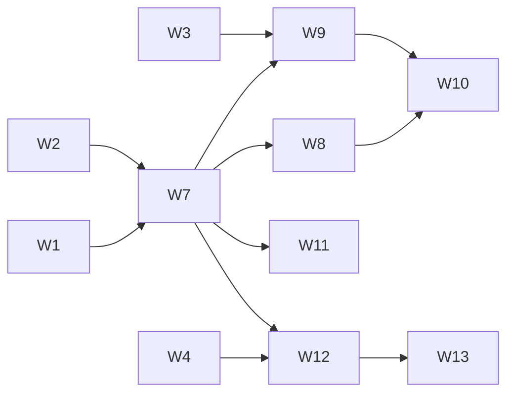

# Accounts and households

Status: **design and work plan**. Nothing in this page is built yet. Each
workstream below updates this page and the user guides when it ships. This
page is the contract that the parallel workstreams share: change a contract
here (in the same PR) before code depends on a different one.

## Goal

Several people use Martlet in one home. Each person has their own companion:
their own characters, personalities and memories, so each person's character
seems like its own individual. The household shares its computers, hosts, paid
API keys, Home Assistant and the voices Martlet recognizes.

Requirements from the owner:

1. Each Windows sign-in (Microsoft account, work account or local account) is a
   Martlet user. It signs in automatically, with no password, until the person
   adds one.
2. A person can make a Martlet account and link any login to it: Windows
   logins, a Martlet password, Google, Microsoft, Authentik and other
   providers.
3. A local Windows account is a separate person until that person links it.
4. A person can switch accounts on one Windows login, and can add a new person.
5. Each account has its own characters, personalities and everything that goes
   with a character.
6. Each account has its own memories. Every host keeps every account's memories,
   because people share computers.
7. A person can share a character, and can share memories, with the household.
8. Voiceprints are always shared, so Martlet learns everyone's voice.
9. Paid API keys are shared in the household.

## Model

| Thing | What it is | Key |
| --- | --- | --- |
| Household | The [Martlet network](NETWORK.md): the hosts and devices of one home | Network ID (exists) |
| Account | A person. Owns characters, personalities, memories, history and preferences | Account ID |
| Login | One way to prove an account | `(kind, provider, subject)` |
| Device | One Windows user on one PC: a roster entry with its own network key | Device ID |
| Memory space | One memory store with one owner | Space ID |

Rules:

- A login proves an account. A voice never proves an account: a voice only
  tells whom a fact is about.
- An account has one or more logins.
- A device acts for an account only while that account is signed in on it.
- Linking a login to an existing account always needs a **Prove** sign-in
  (below), so a PC cannot take over someone else's account.

### Logins

| Kind | Proof | Checked by |
| --- | --- | --- |
| `windows` | Windows signed the person in | This device. Valid only on the device that made it |
| `martlet` | User name and password, optional authenticator code | Hosts, or a cached verifier on a PC where the account signed in before |
| `oidc` | Google, Microsoft, Authentik, Authelia, Keycloak, Pocket ID | Hosts (they keep the client secret) |
| `discord`, `steam` | Provider sign-in | Hosts |

Two strengths of sign-in:

- **Unlock** switches to an account that is already signed in on this device:
  the Windows login, a PIN, Windows Hello or the password. It works offline.
- **Prove** adds an account to a new device, links a login, signs in from
  outside home or changes household settings: the password (and the
  authenticator when set), a provider, or **Allow** on a device where the
  account is signed in (with the six-digit check number that joining uses).

A Microsoft or work e-mail on a Windows login is a **hint** only. When it
matches an account, Martlet asks *Continue as Sam?* and then needs a Prove
sign-in.

### Scopes

Every setting, file and synced document has exactly one scope.

| Scope | Holds | Changed by | Synced to |
| --- | --- | --- | --- |
| Device | Microphone, speakers, cameras, screens, terminal, local engines, pairings, network key | That device | Nowhere |
| PC | Companion or host PC, the host service on it, large downloaded models | Any Windows user of that PC | Nowhere (machine-wide folder) |
| Household | Hosts, who does what, work sharing, Thinking, Listening and Speaking routes **and paid API keys**, Thinking fallback, Home Assistant, updates, model abilities, People and voiceprints, speaking voices, character models and their emotes, the account directory | Owner and admins | Every host and household device |
| Account | Characters, personalities, character profiles, prompts, reply style, lorebooks, the character shown, how you talk, speech display, theme, Voice ID filter, reminders, creations, conversations, memory on or off | That account | Every host; only devices where the account is signed in |
| Memory space | Facts | See [Memory spaces](#memory-spaces) | Every host; only devices that may read the space |

Today's shared-settings sections:

| Household | Account |
| --- | --- |
| `thinking`, `listening`, `speaking`, `thinking-fallback`, `character-actions`, `voice-recognition`, `smart-home`, `updates`, `model-abilities`, `work-sharing`, `pc.*`, `role.*`, the voice list, speaking voices, character models, the cluster plan | `companion`, character profiles, `replies`, `prompts`, `memory`, `lorebooks`, `character`, `talk`, `speech-display`, `appearance`, `appearance-custom`, `voice-id`, `reminders.*` (per account, not per device), creations |

People and voiceprints sync even when *Keep Martlet the same on all my
computers* is off.

### Memory spaces

| Space | Owner | Read by default |
| --- | --- | --- |
| `account-<id>` | One account | All characters of that account |
| `character-<id>` | One character set to *its own memories*, or shared together | That character |
| `household` | The household | Every character |

- A fact keeps `voice_id`: whom the fact is about. The space tells who
  remembers the fact.
- Recall reads the active character's space, `household` and any space shared
  with the account. It loads them at sign-in or switch, so recall stays as fast
  as now.
- Every host keeps every space. A device downloads only the spaces it may read.

### Sharing

| Choice | Effect |
| --- | --- |
| Private (default) | Only the owner sees and uses the character |
| Share a copy | Household members can **Use a copy**: personality, look, voice, emotes and lorebooks are copied to their account, with its own memories |
| Share together | Household members talk to the same character. It uses a `character-<id>` space and remembers everyone |
| Share a fact | The Memory window moves or copies a fact to `household` or to another account's space |
| Share new memories about me | New facts about this person also go to `household` |

### Voices

The People list is one household list. A voice can link to one account
(*This is me* becomes *This voice is Sam*). When Alex speaks at Sam's PC, Sam's
character answers and saves the fact in Sam's space with Alex's voice ID. A
voice never switches the account, unlocks settings or spends money.

### Roles

| Role | May |
| --- | --- |
| `owner` | Everything. The current install becomes the owner |
| `admin` | Household settings, paid keys, invite and remove people, allow devices |
| `member` | Their own account; use household engines and keys |

### Flows

- **First start for a Windows user.** A device with an account binding signs
  that account in. Else, when the Windows e-mail matches an account, Martlet
  asks *Continue as ...?* and needs Prove. Else it makes a new account named
  after the Windows display name, bound to this Windows login, with no password.
- **Switch account** (avatar menu): accounts signed in on this device, *Sign in
  as someone else* and *Add a person*. Switching ends the conversation, stops
  listening and reloads the account. It never happens during a reply.
- **Account page**: add a password and an authenticator, link a provider, link
  or unlink this Windows login, *Ask for my password on this PC*, and *Merge
  another account into this one* (after Prove for both).

### Migration

1. The current install becomes the **owner** account.
2. Every existing member desktop binds to the owner account on update.
3. Today's personalities, profiles, prompts, memories, creations and reminders
   go to the owner's account. Facts keep their `voice_id`. The *This is me*
   voice links to the owner.
4. Each host's owner login and its `member` identities become logins of the
   owner account. Friends stay friends.
5. Hosts keep serving the old `/martlet/v1/memories` document as the owner's
   space to desktops on an older Martlet.

### Privacy

Accounts are kept apart, not secret from a person with administrator rights on
a host or PC. An account lock can encrypt that account's folder on a shared
Windows login. End-to-end encrypted spaces are later work.

### Latency

Sign-in, switching and space loading happen at start or at a switch, never in a
reply. Per-speaker context stays in the message notes. The start of each
Thinking request stays stable for each account.

## Shared contracts

All workstreams use these forms. Change them here first.

| Contract | Form |
| --- | --- |
| Account ID | `Guid`. In JSON as a normal `Guid`; in paths and space IDs as 32 lowercase hex digits (`"N"`) |
| Space ID | `household`, `account-<32 hex>` or `character-<32 hex>`; regex `^(household\|account-[0-9a-f]{32}\|character-[0-9a-f]{32})$` |
| Device ID | Existing devices keep theirs. New ones: `desktop-<pc name>-<6 of [a-z0-9]>`, at most 64 characters |
| Login | `kind` (`windows`, `martlet`, `oidc`, `discord`, `steam`), `provider` (`windows`: the device ID; `martlet`: `martlet`; others: the household provider ID), `subject` (`windows`: the SID; `martlet`: the lowercase user name; others: the provider's subject) |
| Role | `owner`, `admin`, `member` |
| Account directory | `accounts.json` beside `network.json` on desktops and beside `host.json` on hosts. One last-writer-wins entry per account with the hybrid revision of [shared settings](CLUSTER.md#conflicts-and-offline-changes), signed by the writing member desktop's network key. Public facts only, never secrets |
| Directory routes | `GET /martlet/v1/accounts`, `GET /martlet/v1/accounts/digest`, `POST /martlet/v1/accounts` (merge and return). Paired member devices only; friends are refused |
| Memory space routes | `GET /martlet/v1/memories/spaces/{space}`, `GET .../{space}/digest`, `POST .../{space}` (merge and return). The document is today's `SharedMemories`. The old `/martlet/v1/memories` keeps working |
| Account attestation | A host's signed statement that an account proved itself on a device: network ID, host ID, account ID, device ID, login, issue and expiry times, signature by a host key that the roster pins. Verified in `Martlet.Core` by desktops and hosts |
| Desktop account session | `AccountSession` in Martlet.Desktop: the current account ID, its folder `<data>\accounts\<32 hex>\`, the household folder (the data folder root) and an `AccountChanged` event raised only between replies |

## Work plan

Each workstream is one session, one branch and one PR into `main`. Merges are
serial: refresh `origin/main` and reconcile before each merge. Shared files
(`CHANGELOG.md`, `docs/MCP.md`, `src/Martlet.Mcp.Protocol/McpServer.cs`, the
host client in `src/Martlet.Avatar.Audio2Face/Remote`, route registration in
`src/Martlet.Gateway`) get additive edits only.

| ID | Workstream | Owns | Needs |
| --- | --- | --- | --- |
| W1 | Device ID per Windows user; Windows login detection (SID, Microsoft, work or local, e-mail hint, display name) | `LocalLogs.ThisDeviceId`, `HostSetup.SuggestedDeviceId`, `NetworkIdentity`, new `WindowsLogin.cs` | - |
| W2 | Account directory: contracts, merge, signatures, host storage and routes, client | new `src/Martlet.Core/Accounts/`, new `GatewayAccountDirectory.cs`, new `HostAccounts.cs` client | - |
| W3 | Host memory spaces: storage, routes, access hook, client | `GatewayMemories.cs` and new space files, `HostMemories.cs` | - |
| W4 | Host sign-in for accounts: several account logins in `signin.json`, identities linked to account IDs, account attestations | `GatewaySignIn*.cs`, `GatewayAccounts.cs`, `GatewaySignInHttp.cs` | - |
| W5 | People always shared | `MainWindow.People.cs` voice sync | - |
| W6 | PC scope: companion or host role and host service machine-wide for all Windows users | `DeviceRole.cs` and its callers | - |
| W7 | Desktop account session, owner migration, account picker, *Add a person*, first start, directory sync | new `AccountSession.cs`, new `MainWindow.Accounts.cs` | W1, W2 |
| W8 | Account-scoped settings: split `settings.json` and shared settings into household and account parts; characters per account | `AppSettingsSections`, `SharedSettings*`, character profiles | W7 |
| W9 | Desktop memory spaces: a store per space, recall over spaces, space sync, host access checks | `DesktopMemoryService`, `MainWindow.MemorySync.cs`, `MemorySyncNode` | W3, W7 |
| W10 | Sharing: character copy and together, the household space, fact sharing | Characters page, Memory window | W8, W9 |
| W11 | Voice-to-account links on People; Voice ID filter per account | People page, `voices.json` | W7 |
| W12 | Account security: password and authenticator per account, PIN and Windows Hello lock, sign in as someone else, remember on this PC, merge accounts | Account page | W4, W7 |
| W13 | Provider logins linked to accounts; new devices join by account sign-in | Sign-in windows | W4, W12 |

W1 to W6 run in parallel now. W7 starts when W1 and W2 merge. W8, W9, W11 and
W12 run in parallel after W7. W10 and W13 come last.
