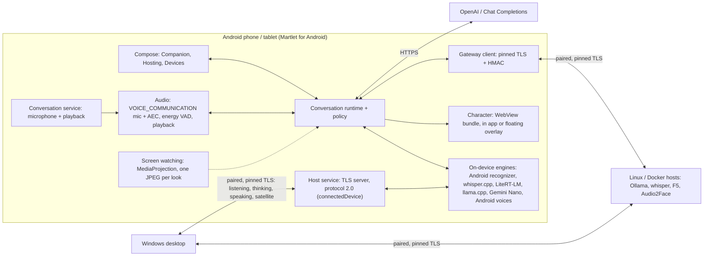

# Android phones and tablets: what it takes, and the plan

**Plan, 2026-09-30. No Android code, build or device test exists yet;
everything below is design and dated platform research, and every device
result is NOT RUN.** The owner asked for Android in the same two roles as
[iOS](IOS.md), with the wider goal of **making use of any old hardware you
already own**, old phones and tablets included:

- **A. Companion on an Android phone/tablet:** Martlet runs on the device you
  play on, keeps talking with you while an Android game is in front, watches
  the game when you allow it and floats the character over it.
- **B. Android device as a host:** a paired phone or tablet lends one or more
  Martlet roles (listening, thinking, speaking, microphone/speaker) to the
  Windows desktop or to another companion, like a Linux/Docker host does today.
- **C. Old hardware:** a 2018-2020 phone with 3-4 GB of RAM in a drawer
  becomes a room microphone/speaker, a voice host or a cloud-backed companion.

This is a separate post-MVP track. It does not change the Windows product or
promise a cross-platform desktop ([non-goals](../DEVELOPMENT_PLAN.md#explicit-non-goals-for-mvp)).

## Short answer

1. **A native Kotlin + Jetpack Compose app, not a port.** Every API the plan
   needs (foreground services, screen capture, overlay windows, Quick Settings
   tiles, on-device speech, voices, Keystore, LiteRT-LM, ML Kit GenAI) is
   first-class in Kotlin. .NET for Android could reuse the portable C#
   libraries, but the host server, Google's AI libraries and the UI would still
   be rewritten or bound. See [Technology decision](#technology-decision).
2. **The gateway protocol is the seam, shared with iOS.** An Android device
   that implements gateway protocol 2.0 pairs with today's desktop through the
   existing `martlet-pair-v1.` code and serves routes the desktop **already
   dispatches** (`martlet.gateway.transcription.v1`,
   `martlet.gateway.ollama-chat.v1`). C# stays the protocol authority: Kotlin
   proves conformance against the golden vectors from iOS slice **IO01**. The
   small desktop changes (engine labels, "managed on the device" hosts, a
   generic speech route, satellite routes) are the same ones iOS needs;
   whichever platform lands first builds them once.
3. **Unlike iOS, Android can host with the screen off.** A foreground service
   with a visible notification keeps a TLS server running in the background,
   and Android places no network limits on a process that runs one. A phone on
   its charger can host around the clock. The exception is Gemini Nano, which
   Google blocks whenever Martlet is not the app in front.
4. **While gaming on the same device** Martlet keeps listening and speaking in
   the background, watches only the game after a system consent each time,
   and floats the character in a "Display over other apps" window. The limits
   are real but manageable: shared-microphone rules, device-dependent echo
   cancellation, Android 12's touch rules for overlays, and on-device models
   competing with the game for memory and heat.
5. **Old phones are useful.** Android 8.0 (API 26) is the minimum. A
   3-4 GB phone makes a good satellite microphone/speaker, Android-voice host
   or cloud-backed companion, and can run whisper tiny/base or a 0.5-1B
   language model slowly. See [Old hardware](#android-versions-and-old-hardware).
6. **Builds need no Mac and no paid certificate.** A manual-dispatch workflow
   on GitHub's Ubuntu runner builds and signs one APK and attaches it to the
   GitHub release. Android requires every APK to be signed with the developer's
   own key (no certificate authority is involved), and updates must use the
   same key forever, so the key is an owner decision. **New since today:**
   Google's developer verification blocks unregistered apps on certified
   devices in Brazil, Indonesia, Singapore and Thailand from 2026-09-30 and
   worldwide from 2027, except through ADB or a one-time "advanced flow".
   Registering is an owner decision ([Owner decisions](#owner-decisions-and-inputs)).

**Recommended order:** release and updates first (AN01-AN02), then the host
and satellite (AN03-AN06: smallest path to an old phone doing real work for
the existing desktop, and it builds the protocol stack the companion needs),
then the companion (AN07-AN10). See [Delivery slices](#delivery-slices).

## Feature matrix

"Today" is the Windows desktop. **Yes** = planned with a known Android
mechanism; **Partial** = planned with a stated limit; **No** = not planned.
Per-engine detail by Android version is in the
[capability table](#capability-table-for-the-platform-matrix).

| Feature | Today (Windows) | A. Android companion | B. Android host | Android mechanism | Slice |
| --- | --- | --- | --- | --- | --- |
| Typed conversation | Yes | Yes | - | HTTPS streaming to OpenAI / Chat Completions | AN07 |
| Push-to-talk | Yes | Yes (on-screen button, notification action, Quick Settings tile) | - | `TileService`, notification actions | AN07 |
| Hands-free listening | Yes (energy VAD) | Partial: also while a game is in front; echo and shared-microphone limits | - | `microphone` foreground service, `VOICE_COMMUNICATION` source, `AcousticEchoCanceler` | AN07 |
| Listening: OpenAI STT | Yes | Yes | - | Upload like Windows | AN07 |
| Listening: on-device | Windows speech, whisper.cpp | **Yes: Android on-device recognizer (Android 12+) or whisper.cpp** | **Yes: serves the existing transcription route** | `createOnDeviceSpeechRecognizer`, ML Kit speech, whisper.cpp (JNI) | AN04, AN07 |
| Listening: paired host whisper | Yes | Yes | - | Gateway client | AN10 |
| Thinking: OpenAI / OpenRouter / NVIDIA Build / any Chat Completions | Yes | Yes | - | Same HTTPS APIs | AN07 |
| Thinking: on-device | Loopback Ollama/LM Studio | **Partial: small models (LiteRT-LM, llama.cpp); Gemini Nano only while Martlet is in front** | **Yes: serves the existing chat route** | LiteRT-LM, llama.cpp, ML Kit GenAI Prompt API | AN04, AN07 |
| Thinking: paired host Ollama | Yes | Yes | - | Gateway client | AN10 |
| Speaking: OpenAI TTS | Yes | Yes | - | Streaming PCM | AN07 |
| Speaking: on-device voices | Windows voices | **Yes: installed Android voices** | **Yes: new generic speech route** | `TextToSpeech.synthesizeToFile` | AN05, AN07 |
| Speaking: F5 voice cloning | Paired host | Yes via paired NVIDIA host | **No** (NVIDIA only) | Gateway client | AN10 |
| Voice ID (only respond to me) | Yes | Yes (port of the GE2E encoder) | - | Kotlin port checked against C# vectors | AN10 |
| Persona, response styles, participation policy | Yes | Yes (port) | - | Kotlin port | AN07 |
| Local memory | Yes | Yes (port of the lexical store) | - | Kotlin port, app-private storage | AN10 |
| Watch my screen (game commentary) | Yes | **Yes: system consent each start; share only the game on Android 14+** | - | `MediaProjection` | AN08 |
| Vision model for screen commentary | OpenAI, Chat Completions, host Ollama | Same, plus small on-device vision models (not while gaming) | Chat route accepts the image for vision models | LiteRT-LM (Gemma 3n), Prompt API image input | AN04, AN08 |
| Character (VRM / Live2D) | Yes (overlay) | Yes in the app; reuses the web bundles | - | `WebView` (WebGL) | AN09 |
| Character over a full-screen game | Yes | **Partial: floating window; touch rules, games may hide it** | - | `TYPE_APPLICATION_OVERLAY` ("Display over other apps") | AN09 |
| Character beside a game | - | Yes (split screen on tablets and foldables) | - | Multi-window | AN09 |
| Loudness lip-sync | Yes | Yes | - | PCM level to the web view | AN09 |
| Audio2Face lip-sync | This PC or host | Yes via paired NVIDIA host | **No** (NVIDIA only) | Gateway client | AN09 |
| Status while in a game | Tray | Ongoing notification with Talk/Stop; system microphone indicator | Hosting notification | Foreground service notification | AN03, AN07 |
| Pair with hosts, who does what, failover | Yes | Yes (QR or pasted code) | Appears as a host node | Gateway client, cluster plan | AN03, AN10 |
| Microphone/speaker satellite for the PC companion | - | - | **Yes** (new satellite routes) | `AudioRecord`, `AudioTrack` | AN06 |
| Host role install/remove over SSH/Docker | Yes | No | No: roles are toggled on the device | - | - |
| Setup advisor, prerequisites installer, Doctor, MCP | Yes | Minimal in-app checks only | Hosting checks (battery, maker restrictions, heat) | - | AN03, AN07 |
| App updates | GitHub Releases | GitHub Releases, you confirm each install | Same | `PackageInstaller` | AN02 |
| Voice Studio training | Planned | No | No | - | - |

## Platform constraints and the design answer

### While gaming on the same device (companion)

| Constraint (source) | Design answer |
| --- | --- |
| A `microphone` foreground service cannot be started while the app is in the background (Android 12+), on Android 14+ not even through the usual exemptions, and never from boot ([background starts](https://developer.android.com/develop/background-work/services/fgs/restrictions-bg-start), [service types](https://developer.android.com/develop/background-work/services/fgs/service-types)) | The conversation service (`microphone` + `mediaPlayback`) starts only when you press **Start listening** or talk in the Martlet screen, exactly the Windows "while Start listening is on" rule. Once running it keeps the microphone while you switch to the game. Tile and notification controls act on a running session; with no session the tile opens Martlet (`startActivityAndCollapse(PendingIntent)`, required on Android 14+). Whether a tile tap is a background-start exemption is undocumented, so Martlet does not rely on it. A tile or notification action is a tap, not a hold: tap to talk, and Martlet ends the turn when you pause. |
| Android 13+ Task Manager **Stop** kills the whole app ([docs](https://developer.android.com/develop/background-work/services/fgs/handle-user-stopping)) | Treated like Exit: capture and playback end; the next launch says the session was stopped. |
| Android 12+ enforces audio focus: a game taking full focus fades and mutes media/game players; since Android 8 the system ducks other apps automatically for "may duck" requests ([audio focus](https://developer.android.com/media/optimize/audio-focus)) | Replies play as `USAGE_ASSISTANT` with a transient may-duck request per reply, so the game dips under Martlet's voice and comes back; Martlet never takes full focus (that would pause your music). Verify on devices (AN07). |
| Android 10+ lets only one ordinary app capture at a time; an app with visible UI beats a background one; before Android 10 the first app keeps the microphone ([sharing audio input](https://developer.android.com/media/platform/sharing-audio-input)) | If the game uses voice chat, Martlet gets silence. Martlet detects being silenced (Android 10+) and says "another app is using the microphone" instead of listening to nothing. |
| Echo cancellation, noise suppression and gain control exist only where `isAvailable()` says so; the `VOICE_COMMUNICATION` source is "tuned for VoIP" ([AcousticEchoCanceler](https://developer.android.com/reference/android/media/audiofx/AcousticEchoCanceler), [AudioSource](https://developer.android.com/reference/android/media/MediaRecorder.AudioSource)) | Capture with `VOICE_COMMUNICATION` and attach the echo canceller when available; keep the energy VAD and Voice ID filter. Push-to-talk stays the default. Whether game audio from the same speaker is cancelled is measured per device (AN07); headphones are recommended for hands-free while gaming. |
| Screen capture: a fresh consent per session on Android 14+ (the token and its virtual display are single-use), a `mediaProjection` service started first, `registerCallback` required; Android 14 lets the user share **one app**; Android 15 QPR1 adds a status bar chip with Stop and stops sharing when the device locks; captured content is scaled into the virtual display ([MediaProjection](https://developer.android.com/media/grow/media-projection)) | **Start watching** shows Android's consent screen every time (never automatic, never saved as on); pick just the game. The virtual display is at most 1024 px on its long edge, so Android does the downscaling. Every 3 s Martlet reads the newest frame, compares a 16x9 grey thumbnail and runs the same [pacer](SCREEN_COMMENTARY.md#how-it-works); a look sends one JPEG to the Thinking route. The chip, a lock or Stop ends watching, matching the Windows lock rule. |
| `FLAG_SECURE` windows are kept out of screenshots and screen shares ([FLAG_SECURE](https://developer.android.com/reference/android/view/WindowManager.LayoutParams#FLAG_SECURE)); Android 15 lets an app learn when it is being recorded ([features](https://developer.android.com/about/versions/15/features)) | A black frame is skipped like protected video on Windows. A game that reacts to being recorded is its choice; Martlet never tries to evade it. |
| Overlays need the user's **Display over other apps** toggle; Android 12+ blocks touches that pass through another app's window unless it is at most 80% opaque; Android 12+ games can hide overlays; Android Go disables the permission; Play treats it as a special permission ([Android 12 changes](https://developer.android.com/about/versions/12/behavior-changes-all), [tapjacking](https://developer.android.com/privacy-and-security/risks/tapjacking), [Android Go](https://developer.android.com/guide/topics/androidgo), [Play policy](https://support.google.com/googleplay/android-developer/answer/16558241)) | The character window is sized to the character, not the screen. Two modes: **Touch the character** (drag it; it covers that patch of the game) and **Let touches through** (not touchable, drawn at 80% opacity so your taps reach the game; a small handle or the notification moves it). If a game hides overlays the voice continues and the in-app character remains. Go devices get the in-app character only. |
| WebGL in an overlay costs GPU time the game wants | Frame cap (30 fps, 15 fps "light" mode), loudness lip-sync by default, and an option to show the character only while it speaks. Frame cost is measured in AN09. |
| Gemini Nano: "inference is permitted only when the app is the top foreground application ... including using a foreground service" returns `BACKGROUND_USE_BLOCKED`; per-app quotas; an allowlist of recent flagships ([ML Kit GenAI](https://developers.google.com/ml-kit/genai)) | Gemini Nano is offered only for talking in the Martlet screen, labelled "not while a game is in front"; it is never a silent fallback. While gaming on the same phone the advisor recommends cloud Thinking or a paired host, as [on Windows](RECOMMENDED_SETUPS.md#choose-a-goal). |
| The default `SpeechRecognizer` uses whatever service the device has and "is likely to stream audio to remote servers"; it is not for continuous recognition ([SpeechRecognizer](https://developer.android.com/reference/android/speech/SpeechRecognizer)) | `android-speech` uses `createOnDeviceSpeechRecognizer` only when `isOnDeviceRecognitionAvailable` says so (Android 12+). Otherwise the system recognizer is labelled "may send audio to its maker (often Google)" and needs its own upload permission, like OpenAI STT. Martlet's VAD decides utterances; the recognizer never listens continuously. |
| Android 17 apps targeting API 37 need `ACCESS_LOCAL_NETWORK` for any LAN connection, incoming or outgoing ([local network permission](https://developer.android.com/privacy-and-security/local-network-permission)) | Asked on first pairing or hosting, with the reason, like iOS. Older targets keep implicit access. |
| Credentials and pairing secrets | Encrypted with a non-exportable AES key in Android Keystore, app-private, excluded from cloud backup and device transfer. |

### As a host

| Constraint (source) | Design answer |
| --- | --- |
| Doze suspends network access for idle apps, but a process **running a foreground service has no network restrictions**, and a charging device has none at all ([Doze](https://developer.android.com/training/monitoring-device-state/doze-standby), [power limits](https://developer.android.com/topic/performance/power/power-details)) | Hosting runs in a foreground service with an ongoing notification ("Hosting for GAMING-PC: Listening, Speaking"). A charger is recommended. |
| Android 14+ requires a service type. `connectedDevice` covers "interactions with external devices that require a ... network connection" (prerequisite: the normal `CHANGE_NETWORK_STATE` permission); `dataSync`/`mediaProcessing` stop after 6 hours a day; `specialUse` is reviewed by Play; Android 15 boot rules block `microphone` and `mediaProjection` but not `connectedDevice` ([service types](https://developer.android.com/develop/background-work/services/fgs/service-types), [Android 15](https://developer.android.com/about/versions/15/behavior-changes-15)) | Host service type `connectedDevice` (`specialUse` only if a store review ever requires it). **Start hosting at boot** is an option for Listening, Thinking and Speaking. The satellite adds the `microphone` type, which cannot start at boot or from the background, so it resumes only when you open Martlet. |
| Battery-optimization exemptions are "not acceptable" for most Play apps; phone makers add their own killers (Samsung "sleeping apps", Xiaomi autostart and others) ([Doze](https://developer.android.com/training/monitoring-device-state/doze-standby), [dontkillmyapp.com](https://dontkillmyapp.com/problem)) | Martlet does not request the exemption by itself. The Hosting screen has a **Keep Martlet running** checklist: battery setting (opens the system page), the maker's extra steps (linked from dontkillmyapp.com) and charging. The desktop shows the host unreachable as today, and opt-in [failover](CLUSTER.md#failover) applies. |
| A partial wake lock keeps the CPU running; `WIFI_MODE_FULL_HIGH_PERF` is deprecated (Android 14) and the low-latency Wi-Fi lock works only with the screen on and the app in front ([PowerManager](https://developer.android.com/reference/android/os/PowerManager), [WifiManager](https://developer.android.com/reference/android/net/wifi/WifiManager)) | No Wi-Fi lock. A partial wake lock is held while a job runs and, on a charger, while hosting. Screen-off reachability and first-reply delay are measured (AN03 acceptance). |
| Thermal status (Android 10+) and headroom (Android 11+) ([PowerManager](https://developer.android.com/reference/android/os/PowerManager)) | New jobs pause at `SEVERE` with a visible reason; the desktop sees `busy`, not silent slowness. Android 8-9 hosts report "heat unknown". |
| Android Keystore keeps a non-exportable EC P-256 key and makes a self-signed certificate for it, but offers no way to add the IP-address name and server-auth usage that the desktop's pinned client and gateway rules require ([Keystore](https://developer.android.com/privacy-and-security/keystore), [KeyGenParameterSpec.Builder](https://developer.android.com/reference/android/security/keystore/KeyGenParameterSpec.Builder), `GatewaySecurity.cs`) | Martlet builds its own certificate for the phone's Wi-Fi address, signed by the Keystore key, and renews it with the same key, so the SPKI pin never changes. Host ID and pin use the gateway's existing derivation. If the TLS stack cannot serve with a Keystore key (unverified), the fallback is a software key encrypted with a Keystore AES key, documented as weaker. TLS 1.2 everywhere, 1.3 on Android 10+ ([SSLContext](https://developer.android.com/reference/javax/net/ssl/SSLContext)), matching the gateway. |
| Server stack: Ktor's server platform table lists Android only as Kotlin/Native targets, not as a server inside an ordinary Android app ([Ktor](https://ktor.io/docs/server-platforms.html)); Netty is heavy for a phone | A small HTTP/1.1 server on the platform's `SSLServerSocket`: the protocol needs about ten routes, strict size limits and NDJSON streaming, and hand-written parsing can mirror the gateway's bounds exactly. Ktor (CIO engine) is the fallback if that proves fragile, decided in AN03. |
| The desktop pairs with an address; phones get theirs from DHCP | Recommend a router address reservation. If the address changes, the host re-issues its certificate for the new address (same pin) and says to pair again. |
| `NsdManager` can advertise a service; receiving multicast needs a battery-costly lock ([NSD](https://developer.android.com/develop/connectivity/wifi/use-nsd), [MulticastLock](https://developer.android.com/reference/android/net/wifi/WifiManager.MulticastLock)) | Not needed: the pairing code carries the address. Optional later; discovery supplies an address, never trust, as on Windows. |
| A phone kept on a charger for months wears its battery; old phones no longer get security updates from their maker | Turn on the phone's charge limit if it has one, keep it cool and uncovered, and check for a swollen battery. The host binds only its private Wi-Fi address and answers only paired, signed requests. |

### Distribution

| Constraint (source) | Design answer |
| --- | --- |
| Every APK must be signed, and an update must carry the same key or a rotation proof from it (v3, v3.1 on Android 13+) ([APK signing](https://source.android.com/docs/security/features/apksigning), [v3.1](https://source.android.com/docs/security/features/apksigning/v3-1)) | One release key, generated once by the owner and never committed. Losing it means users must uninstall (losing pairings and memory) to install a build signed with a new key. |
| An App Bundle (`.aab`) cannot be sideloaded ([app bundles](https://developer.android.com/guide/app-bundle)) | Ship an APK. An AAB only matters if Play publication is chosen later. |
| Play Protect scans sideloaded apps and blocks those that request SMS, notification-listener or accessibility permissions ([Play Protect guidance](https://developers.google.com/android/play-protect/warning-dev-guidance)) | Martlet never requests those permissions (no accessibility service for overlays or game detection). |
| An app that installs its own updates needs your **Install unknown apps** permission for itself, and Android shows its own install confirmation ([PackageInstaller.SessionParams](https://developer.android.com/reference/android/content/pm/PackageInstaller.SessionParams)) | Like Windows, update checks are off by default. Martlet asks for the permission once with the reason; you confirm every update in Android's dialog. Only the exact `Martlet-<version>-android.apk` asset is offered, checked against GitHub's SHA-256 digest (integrity, not publisher identity). |
| **Developer verification:** from **2026-09-30** apps must be registered by a verified developer to be installed **and updated** on certified devices in Brazil, Indonesia, Singapore and Thailand; worldwide from 2027. ADB and a one-time **advanced flow** (developer options, a "not being coached" check, restart, a one-day wait, then **Install anyway**, for 7 days or indefinitely) remain. Free limited-distribution accounts cover up to 20 devices ([rollout](https://android-developers.googleblog.com/2026/03/android-developer-verification-rolling-out-to-all-developers.html), [advanced flow](https://android-developers.googleblog.com/2026/03/android-developer-verification.html)) | Owner decision on registration. Until then the install guide explains the advanced flow for affected countries; nothing changes elsewhere before 2027. The APK's package name and key are chosen once, because registration binds to them. |
| GitHub's `ubuntu-latest` image ships Android SDK platforms 34-37, build tools, NDK 27-29, JDK 17/21 and Gradle; secrets are limited to 48 KB ([runner image](https://github.com/actions/runner-images/blob/main/images/ubuntu/Ubuntu2404-Readme.md), [secrets](https://docs.github.com/en/actions/reference/security/secrets)) | A one-job workflow with no SDK setup steps; the keystore fits in a secret as base64. |

## Android versions and old hardware

**Minimum: Android 8.0 (API 26). Target: the newest SDK on the runner
(Android 17, API 37).** Android 8.0 brings the overlay window type, notification
channels, automatic ducking and per-source "Install unknown apps", and covers
phones from 2017 on. Supporting Android 7 would need older overlay handling for
very few devices. Google no longer publishes per-version share numbers on its
public dashboard ([dashboards](https://developer.android.com/about/dashboards)),
so this choice is by features, not market share.

| Android (API) | What lights up in Martlet |
| --- | --- |
| 8.0-8.1 (26-27) | Baseline: everything cloud-based, host core, satellite, Android voices, whisper.cpp, overlay character, screen watching (whole screen) |
| 9 (28) | llama.cpp's documented NDK build level |
| 10 (29) | Detecting a silenced microphone, TLS 1.3, thermal status, `mediaProjection` service type |
| 11 (30) | Thermal headroom, speech to a file descriptor |
| 12 (31) | **On-device speech recognizer** and ML Kit speech (basic mode), microphone indicator and toggle, overlay touch rule (80%), games hiding overlays, enforced audio focus, background service-start limits |
| 13 (33) | Notification permission, "add tile" prompt, feeding host audio to the recognizer, recognizer language downloads, signing-key rotation v3.1, Task Manager Stop |
| 14 (34) | Mandatory service types, consent per watching session, **share only the game**, tile opens Martlet through a `PendingIntent` |
| 15 (35) | Boot cannot start microphone or projection services, sharing chip with Stop and stop on lock (QPR1), games can detect recording |
| 16 (36) | Stricter background job quotas (Martlet's hosting uses no jobs) |
| 17 (37) | Local network permission for apps targeting it |

**What a 3-4 GB phone from 2018-2020 can still do** (sizes from upstream;
speeds on such phones are not measured):

| Use | Verdict | Why |
| --- | --- | --- |
| Satellite microphone/speaker for the PC companion | **Best fit** | Capture, VAD and playback only; leave it on a charger in another room |
| Cloud-backed companion (OpenAI, OpenRouter, NVIDIA Build) | Good | Network and audio only; screen watching sends one JPEG per look to the cloud model |
| Speaking host with Android voices | Good | The system engine is light |
| Listening host or on-device whisper | Possible | `tiny` (~273 MB memory) or `base` (~388 MB); `small` needs ~852 MB ([whisper.cpp](https://github.com/ggml-org/whisper.cpp)) |
| Small Thinking model (host or companion) | Possible, slow | Qwen2.5-0.5B (521 MB) or Gemma 3 1B (~1 GB) on LiteRT-LM; even a 2024 flagship decodes only ~24-34 tokens/s with Gemma 3 1B ([LiteRT-LM](https://developers.google.com/edge/litert-lm/overview)) |
| Gemini Nano | No | Recent flagships only |
| Character over a game | Limited | WebGL on an old GPU competes with the game; use light mode or the in-app character |
| Android Go phones (1-2 GB) | Satellite or cloud companion only | No overlay permission on Go ([Android Go](https://developer.android.com/guide/topics/androidgo)) |

**Termux (unofficial route): not planned.** Termux runs a Linux userland on
Android; it ships from F-Droid and GitHub (the Play build is experimental), and
Android 12+ may kill its processes beyond 32 ([termux-app](https://github.com/termux/termux-app)).
llama.cpp documents a Termux build ([android.md](https://github.com/ggml-org/llama.cpp/blob/master/docs/android.md)).
It still does not fit Martlet: a llama.cpp or whisper.cpp server there has no
pairing, pinned TLS or HMAC; the desktop's Chat Completions route accepts plain
HTTP only on loopback and does not trust self-signed LAN certificates; the
Martlet gateway is .NET, which has no supported Android (bionic) Linux build
(unverified), and `martlet-host` targets x86_64 Ubuntu with Docker or systemd.
The native app runs the same engines with proper pairing, background
behaviour and updates. Power users may experiment; it stays unsupported.

## Technology decision

| Option | For | Against |
| --- | --- | --- |
| **Native Kotlin + Jetpack Compose, with a pure-Kotlin `martlet-kit` module (chosen)** | Direct access to every needed API; LiteRT-LM's Kotlin API is stable ([LiteRT-LM](https://developers.google.com/edge/litert-lm/overview)); ML Kit GenAI is Kotlin/Java; whisper.cpp and llama.cpp ship official Android examples; small APK; one language for app, services and host | Conversation and protocol logic is written a third time (C#, Swift, Kotlin); IO01 vectors keep it honest |
| .NET 10 for Android, with or without MAUI | Reuses the portable `net10.0` libraries (`Martlet.Core`, `Conversation`, `Providers`, `Participation`, `Memory`, `VoiceActivity`) | Kestrel's docs cover production hosting on Windows/Linux; ASP.NET Core inside an Android app is not a documented scenario, so the host server is rewritten anyway ([Kestrel](https://learn.microsoft.com/aspnet/core/fundamentals/servers/kestrel?view=aspnetcore-10.0)); LiteRT-LM and ML Kit GenAI need hand-made bindings for coroutine APIs; no Compose; .NET 10 runs Mono on Android, NativeAOT is experimental, and .NET 11 switches to CoreCLR with API 24 minimum ([.NET 11](https://learn.microsoft.com/dotnet/core/compatibility/maui/11/android-minimum-api-level), [XA1040](https://learn.microsoft.com/dotnet/android/messages/xa1040)); larger APK |
| Kotlin Multiplatform shared with iOS | One Kotlin core for both phones; KMP and Compose Multiplatform are stable on iOS ([platforms](https://kotlinlang.org/docs/multiplatform/supported-platforms.html), [1.8.0](https://blog.jetbrains.com/kotlin/2025/05/compose-multiplatform-1-8-0-released-compose-multiplatform-for-ios-is-stable-and-production-ready/)) | The [iOS plan](IOS.md#technology-decision) already chose Swift for Apple-only engines and a memory-limited broadcast extension; switching reopens it. Shared vectors already keep both in step. |

`martlet-kit` imports nothing from Android, so it can become a Kotlin
Multiplatform module later if the owner wants Android and iOS to share code;
that is not part of this plan. A protocol change lands in C# first, with
regenerated vectors (IO01), as for iOS.

Proposed layout:

```text
android/
  settings.gradle.kts, gradle/libs.versions.toml   pinned versions
  martlet-kit/            pure Kotlin: pairing code, pinning, HMAC signer/verifier, canonical bytes,
                          cluster merge, turn runtime, sentence segmenter, participation policy,
                          energy VAD, Voice ID encoder; tests against contracts/gateway vectors
  app/                    Compose app: Companion, Hosting, Devices, Settings; services; engines
    src/main/cpp/         JNI for whisper.cpp and llama.cpp (pinned releases)
    src/main/assets/avatar/   the existing VRM and Live2D web bundles
.github/workflows/android-release.yml   manual dispatch only; builds, signs and attaches the APK
```

## Architecture



As on Windows, the device you talk to owns consent, capture, playback,
orchestration and credentials. Hosts never call each other or the cloud; each
role has one destination and never silently falls back. Any companion
(Windows, iOS or Android) can pair with an Android host.

## What an Android host implements

The same subset of [gateway protocol 2.0](../src/Martlet.Gateway/README.md) as
the [iOS host](IOS.md#what-an-ios-host-implements), with the same bounds,
strict JSON and NDJSON event streams:

| Endpoint | Notes for Android |
| --- | --- |
| `GET /health/live`, `GET /health/ready` | Unchanged documents |
| `POST /martlet/v1/pair` | Starts only from **Pair a computer** on the Hosting screen: one-use 5-minute invitation shown as a QR code and as the `martlet-pair-v1.` line; the phone screen is the local approval. Permanent pairing, rotation and revocation follow protocol 2.0 |
| `GET /martlet/v1/version`, `capabilities`, `status` | Advertises only roles switched on and ready (no chat route while Gemini Nano is the engine and the Hosting screen is not in front) |
| `GET /martlet/v1/machine` | Device model, Android version and API level, memory, SoC, `method: native`, GPU vendor `other`, charging and heat state |
| `GET`/`POST /martlet/v1/cluster` | Stores its copy like a Linux host; never acts on it |
| `POST /martlet/v1/inference/transcription` | Existing contract (16 kHz mono PCM16, at most 30 s) served by whisper.cpp (model `tiny`/`base`/`small`) or, when verified, the on-device recognizer fed with the request audio (model `android-speech-<locale>`) |
| `POST /martlet/v1/inference/ollama-chat` | Existing contract served by LiteRT-LM or llama.cpp (model IDs such as `litert:gemma-4-e2b`, `gguf:qwen3-0.6b-q4`) or `gemini-nano` while in front; the screen image is accepted only for vision-capable models |
| `POST /martlet/v1/inference/speech` | **New** generic text-to-PCM route (24 kHz mono PCM16, named voice) from iOS IO04, served by Android voices: `synthesizeToFile` writes a WAV file whose PCM Martlet resamples to 24 kHz mono. Engines differ (Google, Samsung and others), so voices are listed from the installed engine and network-only voices are hidden |
| `POST /martlet/v1/inference/satellite-*` | **New** microphone/speaker routes from iOS IO10 |
| `POST /martlet/v1/inference/cancel` | whisper.cpp abort, LiteRT-LM/llama.cpp cooperative stop, TTS stop |

Every request uses the existing `Martlet-HMAC` scheme. Unpaired callers see
only liveness and pairing. Models are downloaded on demand from the
publisher's Hugging Face repository at a pinned revision with a SHA-256 check,
like the Linux `stt` role. Apache-2.0 models (Gemma 4, Qwen) are offered by
default; Gemma 3 and 3n are under the [Gemma Terms of Use](https://ai.google.dev/gemma/terms)
and need their licence accepted first. LiteRT-LM is used rather than the
MediaPipe LLM Inference API, which Google has put in maintenance-only mode
([MediaPipe](https://developers.google.com/edge/mediapipe/solutions/genai/llm_inference)).

**Desktop changes** are those listed for iOS: engine labels from the
advertised route and model ("Listening: whisper on Pixel 6"), a **managed on
the device** host type whose roles are toggled on the phone, the generic
speech route, vision classification for on-device model IDs, and a phone icon
on the Devices map. Failover already works by advertised route.

## Delivery slices

Sizes are relative (S/M/L). Risk: L low, M medium, H high. All device
acceptance is manual on a real device and stays NOT RUN until done. Slices
that touch C# (IO01, IO03's desktop changes, IO04, IO10) are built once for
both phones by whichever platform gets there first.

| ID | Deliverable | Depends on | Acceptance | Size / risk |
| --- | --- | --- | --- | --- |
| AN01 | `android/` Gradle project, `martlet-kit` protocol core passing the IO01 vectors, and `android-release.yml` (manual dispatch only, `ubuntu-latest`, no tests; builds `Martlet-<version>-android.apk`, signs it with the release key from repository secrets and attaches it to the `v<version>` GitHub release); version code derived from `Directory.Build.props` | IO01; release-key decision | Workflow produces an APK that `apksigner verify` accepts; it sideloads on an Android 8.0+ device and launches | M / M |
| AN02 | **App updates.** Off by default like Windows; checks GitHub Releases for the exact asset, verifies GitHub's SHA-256 digest, installs through `PackageInstaller` with Android's own confirmation; guides "Install unknown apps" and, where it applies, developer verification | AN01 | An installed build updates to the next one from **Install** and keeps its data; a wrong digest is refused | S / L |
| AN03 | **Host core.** Hosting screen, `connectedDevice` service and notification, Keystore TLS identity with an IP-address certificate, pairing (QR + code), version/capabilities/status/machine/cluster/cancel, local network permission, wake lock on charger, heat `busy`, **Keep Martlet running** checklist, optional start at boot; desktop "managed on the device" host type | AN01 (+ IO03 desktop work) | Desktop pairs by pasting the code and shows the phone on the Devices map; a phone on its charger with the screen off stays reachable for 8 hours and after a reboot when chosen | M / H |
| AN04 | **Host Listening and Thinking.** Transcription route with whisper.cpp and the verified on-device recognizer; chat route with LiteRT-LM and llama.cpp, Gemini Nano only while the Hosting screen is in front; image input for vision models | AN03 | Desktop holds a voice conversation with Listening and Thinking on the phone, screen off; Gemini Nano reports not ready when the screen goes off, with no silent switch | L / H |
| AN05 | **Host Speaking.** Android voices on the generic speech route (IO04's C# contract), network-only voices hidden | AN03, IO04 | Desktop speaks replies with an Android voice; F5 and OpenAI routes unchanged | M / M |
| AN06 | **Satellite.** The Windows companion listens and speaks through a paired Android device (VAD-cut utterances and reply playback on the IO10 routes); `microphone` service started from the Hosting screen | AN03, IO10 | Talk to the Windows companion for an hour from another room through a 2018-2020 phone on a charger | M / M |
| AN07 | **Companion conversation.** Typed, push-to-talk and hands-free (`VOICE_COMMUNICATION`, echo canceller, energy VAD port, re-arm after reply) with OpenAI, Chat Completions and on-device engines; conversation service; may-duck replies; notification and Quick Settings controls; silenced-microphone notice; persona and styles; per-action authorization mirroring Windows; Keystore credentials | AN01 | Hands-free conversation continues for 30 minutes with a game in front and its audio ducking under replies; Stop in the notification ends capture; nothing uploads without the per-action permission | L / M |
| AN08 | **Watch my screen.** MediaProjection with per-session consent and single-app sharing, 1024 px virtual display, thumbnail change detection, pacer port, vision through the current Thinking route; ends on chip Stop or lock | AN07 | During a game shared alone, remarks follow the Windows pacer rules; Stop in the status bar chip or locking ends watching | M / M |
| AN09 | **Character.** VRM and Live2D web bundles in a `WebView` in the app and as a floating overlay (two touch modes, frame cap, light mode), loudness lip-sync, Audio2Face via a paired NVIDIA host, side-by-side layout on tablets | AN07, AN10 for Audio2Face | Character talks in sync over a full-screen game for 10 minutes; taps on the game still register in "let touches through"; frame cost recorded on a modern and an old phone | M / H |
| AN10 | **Devices, cluster, memory, Voice ID.** Pair the companion with hosts (QR or paste), use host Ollama/whisper/F5/Audio2Face routes, join who-does-what sync and failover; port local memory and the GE2E Voice ID encoder, checked against C# vectors added to the IO01 generator | AN03, AN07 | Companion uses a Linux host's roles; a Who does what change on Windows reaches the phone within a check; Voice ID scores match C# within tolerance | L / M |

## Capability table for the platform matrix

Columns: companion (modern) = Android 12+ (API 31+); companion (old) =
Android 8.0-11 (API 26-30); host likewise. Nothing runs on Android today, so
every status is planned or not planned.

| Job or feature | Engine id | Android as companion (modern, API 31+) | Android as companion (old, API 26-30) | Android as host (modern) | Android as host (old) | Minimum API level | Hardware/permission requirement | Status |
| --- | --- | --- | --- | --- | --- | --- | --- | --- |
| Listening: OpenAI transcription | openai-stt | yes | yes | no: hosts never hold cloud keys; the companion calls the cloud itself | no: hosts never hold cloud keys | 26 | Internet, microphone permission, OpenAI key, per-action upload permission | planned AN07 |
| Thinking: OpenAI | openai-llm | yes | yes | no: hosts never hold cloud keys | no: hosts never hold cloud keys | 26 | Internet, OpenAI key | planned AN07 |
| Speaking: OpenAI | openai-tts | yes | yes | no: hosts never hold cloud keys | no: hosts never hold cloud keys | 26 | Internet, OpenAI key | planned AN07 |
| Thinking: any Chat Completions (OpenRouter, NVIDIA Build) | chat-completions | yes | yes | no: hosts never hold cloud keys | no: hosts never hold cloud keys | 26 | Internet, HTTPS endpoint and key | planned AN07 |
| Thinking on a paired Linux/Windows host | ollama | yes | yes | no: Ollama has no Android build; the phone serves the same chat route with llama-cpp, litert-llm or gemini-nano | no: Ollama has no Android build | 26 | A paired Martlet host on the LAN; local network permission when targeting Android 17 | planned AN10 |
| Listening: whisper.cpp | whisper | yes | limited: tiny/base on the device, speed on 2018-2020 CPUs unmeasured; or a paired host | yes | limited: tiny/base models; speed unmeasured | 26 | 75-466 MB model download, 0.3-0.9 GB free memory | planned AN04 (host), AN07 (on device), AN10 (via host) |
| Speaking: F5 cloned voice | f5 | yes | yes | no: needs an NVIDIA GPU with CUDA | no: needs an NVIDIA GPU with CUDA | 26 | A paired NVIDIA F5 host | planned AN10 |
| Lip-sync: Audio2Face | audio2face | yes | yes | no: NVIDIA only | no: NVIDIA only | 26 | A paired NVIDIA Audio2Face host | planned AN09 |
| Lip-sync: voice loudness | loudness-lipsync | yes | yes | no: companion feature | no: companion feature | 26 | Android System WebView with WebGL | planned AN09 |
| Listening: Android recognizer | android-speech | limited: on-device only where the device reports it and the language is installed | limited: system recognizer only, which may send audio to its maker (often Google); shown with that warning and its own permission | unknown: verify the on-device recognizer (Android 13 audio-source extra or ML Kit file input) takes the desktop's audio in the background and never opens the phone's microphone instead | no: below Android 12 there is no on-device guarantee | 31 on-device (33 to feed host audio); 26 for the system recognizer | Microphone permission, installed language pack, recognizer package visibility | planned AN04 (host), AN07 (companion) |
| Thinking: Gemini Nano | gemini-nano | limited: supported flagships only, and only while Martlet is the app in front, never while a game is in front | no: recent flagships only | limited: only while the Hosting screen is in front; blocked in the background even with a foreground service | no: recent flagships only | unknown: gated by Google's device allowlist, not an API level | ML Kit GenAI device allowlist (for example Pixel 9-11, Galaxy S25/S26); per-app quota; no unlocked bootloaders | planned AN04 (host), AN07 (companion) |
| Thinking: LiteRT-LM (Gemma 4 E2B, Gemma 3 1B, Qwen) | litert-llm | limited: competes with a game for memory and heat; Gemma 4 E2B (2.6 GB) needs a recent phone | limited: 0.5-1B models only, slow | yes | limited: 0.5-1B models only, slow | unknown: verify LiteRT-LM's minimum (planned 26) | arm64; 0.5-3 GB free memory; GPU optional | planned AN04 (host), AN07 (companion) |
| Thinking: llama.cpp (GGUF) | llama-cpp | limited: competes with a game for memory and heat; CPU, OpenCL on Snapdragon 8 Gen 3/8 Elite | limited: 0.5-1B models on the CPU, slow, Android 9+ | yes | limited: 0.5-1B models on the CPU, slow, Android 9+ | 28 (llama.cpp's documented NDK level; 26 unverified) | arm64; free memory for the model | planned AN04 (host), AN07 (companion) |
| Speaking: Android voices | android-tts | yes | yes | yes | yes | 26 | An installed TTS engine and voice; network-only voices hidden | planned AN05 (host), AN07 (companion) |
| Watch my screen | screen-watch | yes | limited: whole screen only | no: companion feature | no: companion feature | 26 | System consent each start; `mediaProjection` service (API 29+); a vision-capable Thinking route | planned AN08 |
| Character over games | character-overlay | limited: touches pass through only at 80% opacity or less; games can hide overlays | limited: not on Android Go; WebGL cost on old GPUs | no: companion feature | no: companion feature | 26 | Display over other apps; Android System WebView with WebGL | planned AN09 |
| Voice ID | voice-id | yes | yes | no: runs on the companion that owns the conversation (the PC for a satellite) | no: runs on the companion | 26 | Microphone permission for enrollment | planned AN10 |
| Local memory | memory | yes | yes | no: companion feature | no: companion feature | 26 | None | planned AN10 |
| Push-to-talk controls | ptt-control | yes | limited: no "add tile" prompt before Android 13; add the tile by hand | no: companion feature | no: companion feature | 26 (tile 24, add prompt 33) | Notification permission on Android 13+; a running conversation session | planned AN07 |
| Hands-free listening | hands-free | limited: echo cancellation varies by device and may not remove game audio; silence while a game uses the microphone | limited: same; before Android 10 the first app keeps the microphone | no: companion feature | no: companion feature | 26 | Microphone permission; `microphone` service started from the Martlet screen | planned AN07 |
| Satellite microphone/speaker | satellite | no: host role (turn on hosting on the same device) | no: host role | yes | yes | 26 | Microphone permission; `microphone` service started from the Hosting screen (not at boot); charger | planned AN06 |

## Owner decisions and inputs

- **Release signing key (required before AN01 publishes).** Recommended: the
  owner runs `keytool` once on their own PC (RSA 4096, 30-year validity,
  PKCS12), keeps two offline backups, and stores it base64-encoded with its
  passwords as repository secrets (`ANDROID_KEYSTORE_BASE64`,
  `ANDROID_KEYSTORE_PASSWORD`, `ANDROID_KEY_ALIAS`, `ANDROID_KEY_PASSWORD`) so
  agents can publish releases. Alternative: the workflow builds unsigned and
  the owner signs each release locally with `apksigner`. The key is never
  committed or generated by an agent.
- **Developer verification.** Options: a free limited-distribution account
  (email only, up to 20 devices; fits a personal project), full verification
  (government ID; Google implies a registration fee, amount unverified), or no
  registration (users in enforced countries use the advanced flow or ADB;
  worldwide from 2027). This is an identity and possibly a spending decision.
- **Package name** (permanent, tied to the key and registration): proposed
  `io.github.throndir2.martlet`.
- **Releases:** attach the APK to the same `v<version>` GitHub release as the
  Windows installer (recommended) rather than separate tags.
- **Test devices:** one modern phone (Android 14+, 8 GB), one 2018-2020 phone
  (Android 8-11, 3-4 GB) for the host, satellite and old-hardware claims,
  optionally a tablet (split screen) and a Gemini Nano device (Pixel 9 or newer).
- **Models offered by default:** Apache-2.0 models (Gemma 4, Qwen) only, or
  also Gemma 3/3n behind their licence acceptance.
- **Google Play publication** stays out of scope unless the owner decides
  otherwise; it needs a developer account fee and a review of the overlay,
  service types and self-update.

## Not planned

Host role installation over SSH/Docker from or onto Android; Audio2Face, F5 or
Voice Studio training on Android; the Termux route; running the C# gateway on
Android; root-only features; an accessibility service (Play Protect blocks
sideloaded apps that request one); capturing game audio (playback capture
would hear the game, but Martlet does not silently monitor system audio, as on
Windows); always-on or automatic screen capture; MCP control; Android TV,
Wear OS and Android Auto.

## Sources

Accessed 2026-09-30. Platform facts are upstream statements, not Martlet
measurements.

- Foreground services and background: [service types](https://developer.android.com/develop/background-work/services/fgs/service-types),
  [types required (Android 14)](https://developer.android.com/about/versions/14/changes/fgs-types-required),
  [background-start restrictions](https://developer.android.com/develop/background-work/services/fgs/restrictions-bg-start),
  [user stopping (Task Manager)](https://developer.android.com/develop/background-work/services/fgs/handle-user-stopping),
  [Android 15 behavior changes](https://developer.android.com/about/versions/15/behavior-changes-15),
  [Android 16 changes for all apps](https://developer.android.com/about/versions/16/behavior-changes-all),
  [Android 17 behavior changes](https://developer.android.com/about/versions/17/behavior-changes-17),
  [Doze and App Standby](https://developer.android.com/training/monitoring-device-state/doze-standby),
  [power management limits](https://developer.android.com/topic/performance/power/power-details),
  [PowerManager](https://developer.android.com/reference/android/os/PowerManager),
  [WifiManager](https://developer.android.com/reference/android/net/wifi/WifiManager),
  [dontkillmyapp.com](https://dontkillmyapp.com/problem)
- Audio: [audio focus](https://developer.android.com/media/optimize/audio-focus),
  [sharing audio input](https://developer.android.com/media/platform/sharing-audio-input),
  [AcousticEchoCanceler](https://developer.android.com/reference/android/media/audiofx/AcousticEchoCanceler),
  [MediaRecorder.AudioSource](https://developer.android.com/reference/android/media/MediaRecorder.AudioSource),
  [playback capture](https://developer.android.com/media/platform/av-capture),
  [AudioAttributes](https://developer.android.com/reference/android/media/AudioAttributes)
- Screen and overlay: [media projection](https://developer.android.com/media/grow/media-projection),
  [FLAG_SECURE](https://developer.android.com/reference/android/view/WindowManager.LayoutParams#FLAG_SECURE),
  [Android 15 features](https://developer.android.com/about/versions/15/features),
  [Android 12 behavior changes](https://developer.android.com/about/versions/12/behavior-changes-all),
  [tapjacking](https://developer.android.com/privacy-and-security/risks/tapjacking),
  [Window.setHideOverlayWindows](https://developer.android.com/reference/android/view/Window#setHideOverlayWindows(boolean)),
  [Android Go](https://developer.android.com/guide/topics/androidgo),
  [Play permissions policy](https://support.google.com/googleplay/android-developer/answer/16558241),
  [WebView](https://developer.android.com/develop/ui/views/layout/webapps/webview),
  [Live2D web samples tested browsers](https://github.com/Live2D/CubismWebSamples)
- Controls: [TileService](https://developer.android.com/reference/android/service/quicksettings/TileService),
  [StatusBarManager.requestAddTileService](https://developer.android.com/reference/android/app/StatusBarManager)
- Speech and voices: [SpeechRecognizer](https://developer.android.com/reference/android/speech/SpeechRecognizer),
  [RecognizerIntent (EXTRA_AUDIO_SOURCE, API 33)](https://developer.android.com/reference/android/speech/RecognizerIntent),
  [ML Kit GenAI speech recognition](https://developers.google.com/ml-kit/genai/speech-recognition/android),
  [TextToSpeech](https://developer.android.com/reference/android/speech/tts/TextToSpeech)
- On-device models: [ML Kit GenAI overview](https://developers.google.com/ml-kit/genai),
  [Prompt API](https://developers.google.com/ml-kit/genai/prompt/android),
  [Gemini Nano](https://developer.android.com/ai/gemini-nano),
  [LiteRT-LM overview](https://developers.google.com/edge/litert-lm/overview),
  [LiteRT-LM Android](https://developers.google.com/edge/litert-lm/android),
  [MediaPipe LLM Inference (maintenance only)](https://developers.google.com/edge/mediapipe/solutions/genai/llm_inference),
  [Gemma 3n](https://ai.google.dev/gemma/docs/gemma-3n),
  [Gemma terms](https://ai.google.dev/gemma/terms),
  [Gemma 4 under Apache 2.0](https://opensource.googleblog.com/2026/03/gemma-4-expanding-the-gemmaverse-with-apache-20.html),
  [llama.cpp Android](https://github.com/ggml-org/llama.cpp/blob/master/docs/android.md),
  [llama.cpp OpenCL](https://github.com/ggml-org/llama.cpp/blob/master/docs/backend/OPENCL.md),
  [whisper.cpp](https://github.com/ggml-org/whisper.cpp),
  [whisper.android](https://github.com/ggml-org/whisper.cpp/tree/master/examples/whisper.android)
- Networking and security: [local network permission](https://developer.android.com/privacy-and-security/local-network-permission),
  [NSD](https://developer.android.com/develop/connectivity/wifi/use-nsd),
  [MulticastLock](https://developer.android.com/reference/android/net/wifi/WifiManager.MulticastLock),
  [Android Keystore](https://developer.android.com/privacy-and-security/keystore),
  [KeyGenParameterSpec.Builder](https://developer.android.com/reference/android/security/keystore/KeyGenParameterSpec.Builder),
  [SSLContext](https://developer.android.com/reference/javax/net/ssl/SSLContext)
- Technology: [Kestrel](https://learn.microsoft.com/aspnet/core/fundamentals/servers/kestrel?view=aspnetcore-10.0),
  [.NET 11 Android minimum](https://learn.microsoft.com/dotnet/core/compatibility/maui/11/android-minimum-api-level),
  [.NET for Android build properties](https://learn.microsoft.com/dotnet/android/building-apps/build-properties),
  [XA1040 NativeAOT](https://learn.microsoft.com/dotnet/android/messages/xa1040),
  [Kotlin Multiplatform platforms](https://kotlinlang.org/docs/multiplatform/supported-platforms.html),
  [Compose Multiplatform 1.8.0](https://blog.jetbrains.com/kotlin/2025/05/compose-multiplatform-1-8-0-released-compose-multiplatform-for-ios-is-stable-and-production-ready/),
  [Ktor server platforms](https://ktor.io/docs/server-platforms.html),
  [termux-app](https://github.com/termux/termux-app)
- Signing and distribution: [APK signing](https://source.android.com/docs/security/features/apksigning),
  [v3](https://source.android.com/docs/security/features/apksigning/v3),
  [v3.1](https://source.android.com/docs/security/features/apksigning/v3-1),
  [app signing](https://developer.android.com/studio/publish/app-signing),
  [app bundles](https://developer.android.com/guide/app-bundle),
  [PackageInstaller.SessionParams](https://developer.android.com/reference/android/content/pm/PackageInstaller.SessionParams),
  [Play Protect guidance](https://developers.google.com/android/play-protect/warning-dev-guidance),
  [developer verification rollout](https://android-developers.googleblog.com/2026/03/android-developer-verification-rolling-out-to-all-developers.html),
  [advanced flow](https://android-developers.googleblog.com/2026/03/android-developer-verification.html),
  [Play target API level](https://support.google.com/googleplay/android-developer/answer/11926878),
  [dashboards](https://developer.android.com/about/dashboards),
  [ubuntu-24.04 runner image](https://github.com/actions/runner-images/blob/main/images/ubuntu/Ubuntu2404-Readme.md)
  (image 20260920),
  [GitHub Actions secrets](https://docs.github.com/en/actions/reference/security/secrets)

**Unverified and to be checked on a device or against current Google terms:**
whether a Quick Settings tile tap may start a microphone service (not relied
on); how well echo cancellation removes game audio from the same speaker, and
call-quality audio on Bluetooth headsets; whether `USAGE_ASSISTANT` replies
escape the Android 12+ focus fade; whether the platform TLS stack can serve
with an Android Keystore private key; screen-off server reachability and
first-reply delay without a Wi-Fi lock, and stable randomized MAC addresses
for router reservations; whether the on-device recognizer and ML Kit speech
accept injected host audio in the background without opening the microphone;
whether ML Kit's background block also covers basic-mode speech, and whether
split screen counts as "top foreground"; Gemini Nano's minimum Android version;
LiteRT-LM's minimum API level and 32-bit support, llama.cpp builds below
Android 9, and Gemma 4 E2B image input; whisper.cpp and small-model speed on
2018-2020 phones; WebGL performance of the web bundles in a `WebView` overlay
(Live2D tests Android Chrome, not WebView); TTS output sample rates per engine
and network-voice detection; developer-verification details (full-account
fee, how limited distribution counts devices, how registration binds the
signing key); reports that AndroidX libraries now need API 23-24; .NET on
Termux/bionic and Termux's exec restrictions; maker charge-limit settings;
headset-button push-to-talk while a game is in front.
