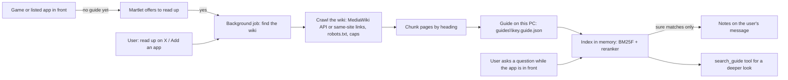

# App guides: game and app knowledge from the web

Design for **app guides**: Martlet reads up on a game or app the user runs (its
fan wiki, its help pages) and keeps what it read on this PC as a searchable
guide. When the user then asks *"hey Martlet, where do I find iron ore?"* or
*"how do I mask a layer in Photoshop?"*, Martlet answers from that guide.

This came from a community request: a gaming assistant that answers "where do
I find...?" and "what is this?", that scrapes game wikis into a local
knowledge base, that notices when you start a game and asks *"I see you
started Elden Ring. Want me to read up on it?"*, that lets you add your own
apps and wiki pages, and that ranks what it finds well (a reranker).

## What the user sees

1. Turn on **Companion › App guides** (off by default, because reading up
   sends the app's name to a search engine and the wiki sites see the
   requests). The page says what leaves the PC.
2. Start a game. When Martlet sees a game (or an app on the list) in front and
   it has no guide yet, it asks once a session, in character: *"I see you
   started Elden Ring. Want me to read up on it so I can help?"* It asks only
   in a conversation that runs, and only while *Ask when I start a game or
   app* is on (on by default). A yes starts a background job, *Reading up on
   Elden Ring*, in the talk window's task list; a no is remembered and Martlet
   doesn't ask about that app again (**Ask again** on the page undoes it).
3. Or say *"read up on Stardew Valley"*, or use **Add an app** on the page:
   the app's name, optional program names (as Windows names the program, if
   they differ) and optional wiki addresses. **Add and read up** reads at
   once.
4. While the app is in front (or the user names it), each question the user
   asks is searched in its guide. The best matching sections go with the
   message as reference notes, and the reply uses them. A message that isn't
   about the app gets nothing.
5. When Martlet is done, it says so in character (*"I've read up on Elden
   Ring: 42 pages."*).
6. The App guides page lists every app: its pages, size, when it was read, the
   pages it reads from, its program names, the last problem and whether the
   user said no. Each app has **Read up now** (or **Read again**), **Delete**
   and, after a no, **Ask again**. The page also says what is in front, as App
   guides sees it.

## How it works

### Finding and reading the wiki (no model needed)

Reading up needs no Thinking or Deep thinking model, so it never competes with
the conversation for a graphics card.

- **Start pages**: the addresses the owner gave. Otherwise Martlet tries the
  usual wiki hosts by name (`<name>.fandom.com`, `<name>.wiki.gg`) and then a
  web search for *"<name> wiki"*, and prefers wiki hosts (Fandom, wiki.gg,
  Fextralife, official wikis) over shops and video sites.
- **MediaWiki sites** (Fandom, wiki.gg and most game wikis) are read through
  their `api.php`: the most linked and largest content pages first, as clean
  HTML without menus. Other sites are crawled breadth first through links on
  the same site and under the same path, with navigation, edit, talk, user,
  file and special pages left out.
- **Politeness and safety**: `robots.txt` is obeyed, one request at a time per
  site with a delay between them, an honest user agent, and the same safe web
  client as web research (`WebAccess`: public internet addresses only, every
  redirect checked, size and time caps).
- **Caps**: 60 pages, 12 MB downloaded, 2 sites and 15 minutes a guide by
  default (`GuideBuildLimits`).
- **Text**: each page keeps its headings as Markdown lines, so sections stay
  together when the page is cut into chunks of at most 1,200 characters.

### Searching a guide (on the reply's path, with no added wait)

[Never add conversation latency](../AGENTS.md#never-add-conversation-latency)
decides the design: the search runs in this process, in well under a
millisecond, and no model is asked.

- **Words**: `SearchTerms` (Martlet.Core) makes the words: lower case, common
  grammar words left out, light English stems (*swords* finds *sword*,
  *mining* finds *mined*).
- **First stage, BM25F**: BM25 with the page title and section heading
  weighted above the body, so a question that names a page or section finds
  it.
- **Second stage, the reranker**: the best candidates are scored again by how
  many of the question's words they have, how close together they are, exact
  phrase matches and title matches, then near-duplicate chunks of one page are
  left out (maximal marginal relevance), so the notes cover different sources.
- **Relevance**: each hit has a relevance from 0 to 1. Only hits at or above
  the threshold go with the message (at most 3 chunks and 2,400 characters),
  so a message that isn't about the app gets nothing and its request is what
  it always was.

**Why no embeddings or vector database (yet).** A guide is a few thousand
chunks, which an in-memory index searches faster than any database call.
Dense embeddings would need an embedding model call on every message, which
adds a wait before the first word, and on a gaming PC it can push the
conversation's model out of the graphics card. Game questions are full of
proper names (items, places, bosses), where lexical search is strong. A later
step can add embeddings made while reading up and used only by the
`search_guide` tool, where a short wait is expected.

### What goes to the model, and what stays in the guide

The question this answers is *what goes straight to the model and what stays
in the database*: everything stays in the guide on disk, and only the few
sections that match the current question go with the message, as notes after
the conversation's cached start. Instructions and earlier messages don't
change, so prompt caches still hold. The notes say the text is reference
material read from the web, which may be wrong, and never instructions.

### Tools

While App guides are on and the Thinking route does function calling, every
reply gets three tools after Martlet's other tools, always worded the same, with
the *App guides* prompt (Companion › Prompts), so the start of every request
stays the same:

- `read_up_on(app, sites?)`: starts the reading-up job (the user asked, or said
  yes to the offer) and returns at once.
- `search_guide(app?, question)`: searches a guide for more than the notes
  carried (the app in front when `app` is left out) and returns the sections
  with their page titles, links and relevance.
- `skip_guide(app)`: the user said no to the offer; Martlet never offers that
  app again.

## On the desktop

- **The library** (`AppGuideService`) keeps `<data folder>\guides` in memory
  and one search index per app with a guide. Indexes are built off the reply's
  path: when Martlet starts, when an app with a guide comes to the front and
  after a guide is made. A message never waits for one; it goes without until
  it is ready.
- **Detection** (`AppGuideWatch`) runs only while App guides are on, on a
  thread-pool timer every 4 seconds: it reads the name and file of the program
  in front (`ActiveApp`), whether it fills its screen and whether Windows says a
  game runs in exclusive full screen, and tells a game with
  `PcActivity.Classify` (a game library folder or exclusive full screen). It
  matches the program to the list by key, name or program names, ignoring case
  and punctuation (*ELDEN RING™* is *Elden Ring*). Martlet's own windows are
  passed over.
- **The offer** is a notice (`guideoffer`) that the conversation brings up as
  soon as Martlet is free, with the *App guides: offer to read up* prompts. It
  goes only to a conversation that runs (Martlet never starts one for it), and
  an offer dropped before Martlet said it may come again (at most 3 times a
  session).
- **The job** (`guide`: one at a time, 4 an hour, 20 minutes, *Reading up on*)
  runs the wiki reader, the chunker and the store; no model is asked. Its
  result tells the reply how many pages it read. Reading up from the page runs
  in the conversation when one runs, else on its own.
- **Notes**: on each of the user's own messages, while App guides are on, the
  guide of the app the words name (else of the app in front) is searched with
  the user's words. Sections the conversation already carries aren't sent
  again, and a message too long to fit drops the guide's sections first after
  earlier conversations. The latency timeline marks *app guide*; the desktop
  log notes counts, relevance and time only.
- **MCP**: `app_guides_check` rehearses all of this against a fixture wiki on
  loopback and measures the notes step; `app_guides_status` reads a data
  folder's library; the page's status lines are `SafeValues` (see
  [MCP](MCP.md)).

**Latency.** On a full-size guide (2,000 sections) the notes step takes about
0.3 ms (median) for a message about the app and nothing while App guides are
off; the first search in a new process takes about 3 ms, because building an
index also loads the search code. While on, the three tools and the prompt add
about 2.3 KB to every request, the same every time, so prompt caches keep them.

## Files

| Part | Where |
| --- | --- |
| Shared types and interfaces | `src\Martlet.Conversation\Guides\GuideContracts.cs` |
| Search words | `src\Martlet.Core\Text\SearchTerms.cs` |
| Chunker, index and reranker | `src\Martlet.Conversation\Guides\GuideChunker.cs`, `GuideIndex.cs` |
| Store (`guides\library.json`, `<key>.guide.json`) | `src\Martlet.Conversation\Guides\FileAppGuideStore.cs` |
| Wiki reader | `src\Martlet.Conversation\Guides\WebGuideBuilder.cs` |
| Notes on the message | `src\Martlet.Conversation\Guides\GuideRecall.cs` |
| Library service, tools, job kinds and texts | `src\Martlet.Conversation\Guides\AppGuideService.cs`, `AppGuideTools.cs` |
| Detection | `src\Martlet.Desktop\AppGuideWatch.cs` |
| Tools, job, offer and notes in the conversation | `src\Martlet.Desktop\LiveConversationController.Guides.cs`, `LiveConversationWindow.AppGuides.cs` |
| The App guides page | `src\Martlet.Desktop\MainWindow.AppGuides.cs` |
| MCP | `src\Martlet.Mcp.Protocol\AppGuidesCheck.cs` |

## Privacy

- Off by default; turning it on says what leaves the PC (the app's name in a
  search, and requests to the wiki sites).
- Detection reads only the program's name and whether it fills the screen
  (`ActiveApp`, `PcActivity`), never window titles or the screen.
- Guides hold public web pages only, never the conversation. The desktop log
  notes counts (pages, chunks, bytes, time), never questions, links or text.

## Delivery

The contract (this document, the types and simple first versions) landed
first. These workstreams then ran in parallel, one pull request each:

1. **Retrieval and store**: BM25F, the reranker, relevance, the chunker and a
   bounded, atomic store.
2. **Wiki reader**: wiki discovery, `robots.txt`, the MediaWiki API, the
   same-site crawl and heading-preserving text.
3. **Desktop**: detection, the offer, the tools, the job, notes on the
   message, the App guides page and MCP.
4. **Memory recall**: the same search words, BM25 and a reranker for
   remembered facts ([Memory](MEMORY.md)).
5. **Past conversations**: the same for earlier conversations.
