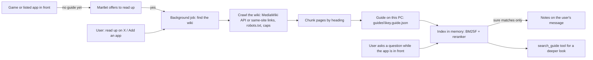

# App guides: game and app knowledge from the web

Design for **app guides**: Martlet reads up on a game or app the user runs (its
fan wiki, its help pages) and keeps what it read on this PC as a searchable
guide. When the user then asks *"hey Martlet, where do I find iron ore?"* or
*"how do I mask a layer in Photoshop?"*, Martlet answers from that guide.

This came from a community request: a gaming assistant that answers "where do
I find...?" and "what is this?", that scrapes game wikis into a local
knowledge base, that notices when you start a game and asks *"I see you
started Elden Ring. Want me to read up on it?"*, that lets you add your own
apps and wiki pages, and that ranks what it finds well (a reranker).

## What the user sees

1. Turn on **Companion › App guides** (off by default, because reading up
   sends the app's name to a search engine and the wiki sites see the
   requests). The page says what leaves the PC.
2. Start a game. When Martlet sees a game (or an app on the list) in front and
   it has no guide yet, it asks once a session, in character: *"I see you
   started Elden Ring. Want me to read up on it so I can help?"* It asks only
   in a conversation that runs, and only while *Ask when I start a game or
   app* is on (on by default). A yes starts a background job, *Reading up on
   Elden Ring*, in the talk window's task list; a no is remembered and Martlet
   doesn't ask about that app again (**Ask again** on the page undoes it).
3. Or say *"read up on Stardew Valley"*, or use **Add an app** on the page:
   the app's name, optional program names (as Windows names the program, if
   they differ) and optional wiki addresses. **Add and read up** reads at
   once.
4. While the app is in front (or the user names it), each question the user
   asks is searched in its guide. The best matching sections go with the
   message as reference notes, and the reply uses them. A message that isn't
   about the app gets nothing.
5. When Martlet is done, it says so in character (*"I've read up on Elden
   Ring: 42 pages."*).
6. The App guides page lists every app: its pages, size, when it was read, the
   pages it reads from, its program names, the last problem and whether the
   user said no. Each app has **Read up now** (or **Read again**), **Delete**
   and, after a no, **Ask again**. The page also says what is in front, as App
   guides sees it.

## How it works

### Finding and reading the wiki (no model needed)

Reading up needs no Thinking or Deep thinking model, so it never competes with
the conversation for a graphics card. The reader is `WebGuideBuilder` and the
files next to it in `src\Martlet.Conversation\Guides` (`WikiDiscovery`,
`MediaWikiReader`, `SiteCrawler`, `RobotsRules`, `GuideRun`, `HtmlOutline`).

- **Start pages**: the addresses the owner gave. Martlet reads only those
  sites, and looks for others only when none of them can be read.
- **Wiki farms**: with no start pages, Martlet tries the app's name as a
  Fandom or wiki.gg site (`<name>.fandom.com`, `<name>.wiki.gg`: the name run
  together, with hyphens, and without a leading "the"). It asks each site's
  `api.php` for its name and size, and uses a site whose name is about the app
  and that has at least 10 articles, the biggest first.
- **Web search**: then a search for *"<name> wiki"*, and for *"<name> help"*
  and *"<name> guide"* when nothing was read yet. Wiki hosts (Fandom, wiki.gg,
  Fextralife, `/wiki/` addresses) and help sites (`help.`, `support.`, `docs.`
  hosts, `/help` and `/docs` addresses) score higher. Shops, video, social,
  forum and encyclopedia sites (Wikipedia) are left out. A result counts only
  when its title or address names the app (its whole name, or more than half
  of its words).
- **MediaWiki sites** (Fandom, wiki.gg and most game wikis) are read through
  their `api.php`, found from the farm's address or from the page's `EditURI`
  link, search link or script path. The pages to read are the main page's
  links and the site's most linked pages (`Mostlinked`), scored by both and by
  size. Stubs, disambiguation pages, version history and very large pages are
  left out. Each page picked from a category lowers the score of the others in
  that category, so a guide covers the game's different parts (fish, cooking,
  minerals), not one navigation box (every villager). Then come the pages that
  the pages read link to most. Each page comes from `action=parse` with
  redirects followed and edit links and the table of contents off.
- **Other sites** are read breadth first through links on the same site and
  under the start page's folder (its parent while the folder has fewer than 5
  of the page's links), each page once by its canonical address. Links with a
  query, and edit, talk, user, file, special, media, login, search and shop
  pages, are left out. A wiki whose `robots.txt` forbids its `api.php`
  (minecraft.wiki) is read this way.
- **Text**: each page keeps its headings as Markdown lines, so sections stay
  together when the page is cut into chunks of at most 1,200 characters.
  Paragraphs, list items and table rows are lines of their own. A table cell
  is named by its column heading ("Season: Spring; Price: 75g"), a cell that
  spans rows is repeated on each row, and infobox facts are "Key: Value"
  lines. Navigation boxes, references, edit links, galleries, images,
  struck-through text and hidden parts are left out.
- **Politeness and safety**: each site's `robots.txt` is read once and obeyed
  (RFC 9309): the group that names Martlet, else the group for every agent,
  with the longest rule deciding and `Allow` winning a tie. A
  `Content-Signal` with `ai-input=no` means Martlet reads nothing there. A
  site that refuses its `robots.txt` (4xx) has no rules; a site that can't
  serve it (5xx or no answer) is left alone. A page a redirect took to
  another place is kept only when that place's `robots.txt` allows it.
  Martlet sends one request at a time to a site (a host), waits the longer of
  `GuideBuildLimits.Delay` and the site's `Crawl-delay` between two, and asks
  nothing more of a site that answers 429 or 503. Two web searches also have
  that pause between them, and a refused search ends the searching. Its user
  agent is honest:
  `Martlet/1.0 (app guides; +https://github.com/throndir2/Martlet)` (wiki
  hosts refuse browser-like agents from programs). Every request goes through
  the same safe web client as web research (`WebAccess`: public internet
  addresses only, every redirect checked, size and time caps, at most 2 MB a
  document).
- **Caps**: 60 pages, 12 MB downloaded, 2 sites and 15 minutes a guide by
  default (`GuideBuildLimits`), and at most 3 requests a page (plus 30). A
  pause that would pass the time cap ends the job, and cancelling stops it at
  once.
- **Progress** is a few plain words ("Looking for its wiki", "Reading the
  wiki's page list", "Reading pages (3 of at most 60)"), never a link.

### Searching a guide (on the reply's path, with no added wait)

[Never add conversation latency](../AGENTS.md#never-add-conversation-latency)
decides the design: the search runs in this process and no model is asked. A
search over 5,000 chunks takes about 0.2 ms on average
(`AppGuideRetrievalTests` keeps a loose guard on it). The hot methods are
compiled fully optimized from the first call, because a user sends too few
messages for the runtime to optimize them later.

Build the index with `GuideIndex.Build(guide)`, or with
`GuideIndex.Build(chunks, names)` to give the app's program names too, so the
app's own name in a question is handled (below). An index is read-only and
thread-safe.

1. **Words** (`SearchTerms`, Martlet.Core): runs of letters and digits in
   lower case, accents on Latin letters left out (*Pokémon* finds
   *pokemon*), common grammar words and contractions left out (*don't*,
   *dont*, *I'm*), and a light English stem: plurals, *-ing*, *-ed*, *-ied*,
   *-ly* and common irregular forms (*swords* finds *sword*, *found* finds
   *find*, *wolves* finds *wolf*, *manually* finds *manual*).
2. **The question** (`GuideQuery`):
   - Conversational filler is left out: *hey*, *martlet*, *wtf*, *tf*, *um*,
     *please*, *lol* and similar.
   - The app's full name is left out (*in Elden Ring*). A part of the name
     (*in Stardew*) and question scaffolding (*find*, *use*, *best way*,
     *spawn*, *any tips*) are *soft*: they help the order when a chunk has
     them, and never lower relevance when it does not.
   - *Where* adds soft *location*, *find* and *spawn*, so a wiki's
     *Locations* section comes first. *Who* adds *sell*.
   - Two words that the guide writes as one match it (*fire ball* finds
     *Fireball*), and one word that the guide writes as two matches them
     (*greatsword* finds *great sword*). A short list of spellings and
     near-synonyms match each other (*colour* and *color*, *picture* and
     *image*, *buy* and *sell*).
3. **First stage, BM25F** (`GuideIndex`): each chunk has three fields: the
   page title, the section headings (without the title) and the text. BM25F
   adds each field's term frequency, weighted and length-normalized per
   field, and then saturates the sum once. Weights: title 2.5, section 3.5,
   text 1; length normalization (b): 0.3, 0.4 and 0.6; k1 1.2. The best 40
   chunks go to the second stage.
4. **Second stage, the reranker** (`GuideReranker`). For each candidate it
   measures:
   - *coverage*: the IDF-weighted share of the question's words that the
     chunk has. A word that the guide does not have weighs as much as a
     fairly rare word (one in twenty chunks), so a question about something
     else stays unsure;
   - *proximity*: the smallest window of the text that holds all matched
     words (the "minimum cover"); words that a heading names count as close;
   - *phrases*: question words that are also neighbours in the chunk
     (*iron ore*);
   - *headings*: the share of the question that the title or section names;
   - *specificity*: whether a matched word means something. A word in a
     heading, or one that is rare in the guide, counts fully. An everyday
     chat word (*bed*, *morning*, *love*) that only the text has, or in a
     longer heading (*Your first day* for *how was your day*), counts about
     a third.
5. **Relevance**, from 0 to 1: coverage^1.25 × specificity × (0.7 + 0.3 ×
   closeness), where closeness is the best of proximity, phrases and
   headings (1 for a one-word question). `GuideRecall` sends only hits at or
   above 0.5 (at most 3 chunks and 2,400 characters). On the fixture below,
   every question has a right section at or above 0.5 except one, and no
   off-topic chat gets above 0.39.
6. **Diversity**: maximal marginal relevance (λ 0.8) on word overlap and
   page. A chunk with 80% or more of the same words as one already chosen is
   left out, and a page gives at most 2 hits before every other candidate
   has had its turn.

**Chunks** (`GuideChunker`): a new chunk at each heading, so a section stays
together. Lines (paragraphs, list items, table rows) are gathered up to 1,200
characters; a line is cut only when it alone is longer, at a sentence end. A
section too short to be a chunk (*Price*: *7 gold*) joins a neighbour as
*Price: 7 gold* instead of being lost. When a long section continues in the
next chunk, that chunk starts with the last sentence of the chunk before (at
most 160 characters), or with the table's header row when a table
continues.

**The store** (`FileAppGuideStore`): `guides\library.json` and one
`<key>.guide.json` for each app. Each file starts with its `formatVersion`.
The store keeps at most 200 apps, guide files of at most 20 MB, at most
25,000 chunks of at most 4,000 characters each. It refuses a file that it
cannot read, that breaks a bound or that a newer Martlet wrote, with an
`AppGuideFileException` (an `IOException`) that names the file, and it never
resets the library. Saving a whole new library over an unreadable one keeps a
copy (`library.json.unreadable`). Each write goes to a temporary file that is
written through to the disk and then replaces the earlier file. All stores on
one folder in a process share one lock.

**How well it works.** `tests\Martlet.Conversation.Tests\Fixtures\app-guides-held-out.json`
is a synthetic game wiki and an image editor's help site, with pages that
mention everything in passing (main page, patch notes, item lists,
achievements, a glossary). It has 88 questions (half used to choose the
weights, half held out), which include plurals, verb forms, item and place
names, *how do I ... in Photoshop* and filler-heavy voice questions, and 31
off-topic chat lines. Plain BM25 (the first version) against BM25F with the
reranker:

| All 88 questions | Plain BM25 | BM25F + reranker |
| --- | --- | --- |
| Page recall@3 | 1.00 | 1.00 |
| Page MRR | 0.95 | 0.98 |
| Section recall@3 | 1.00 | 1.00 |
| Section MRR | 0.89 | 0.97 |
| Right section sent with the message (relevance ≥ 0.5) | 0.90 | 0.99 |
| Highest relevance of off-topic chat | 1.00 | 0.39 |

On the 44 held-out questions: section MRR 0.91 → 0.97 and answers sent
0.93 → 0.98.

**Choices, from current practice.** BM25F (Robertson, Zaragoza and Taylor,
2004) is the standard way to weight fields such as titles and headings: it
weights term frequency per field before the one saturation, which stops a
term repeated in several fields from counting too much. Proximity scoring
(Büttcher, Clarke and Lushman, 2006; Tao and Zhai, 2007) rewards query terms
that occur close together; the minimum cover window is cheap to find from
the stored positions. Maximal marginal relevance (Carbonell and Goldstein,
1998) is the usual greedy way to trade relevance for variety. The section
headings that every chunk keeps are a form of the "contextual chunk"
technique: context added to each chunk helps lexical search find it. A
cross-encoder reranker or an embedding model would need a model call on
every message, so this workstream uses none (see below).

**Why no embeddings or vector database (yet).** A guide is a few thousand
chunks, which an in-memory index searches faster than any database call.
Dense embeddings would need an embedding model call on every message, which
adds a wait before the first word, and on a gaming PC it can push the
conversation's model out of the graphics card. Game questions are full of
proper names (items, places, bosses), where lexical search is strong. A later
step can add embeddings made while reading up and used only by the
`search_guide` tool, where a short wait is expected.

### What goes to the model, and what stays in the guide

The question this answers is *what goes straight to the model and what stays
in the database*: everything stays in the guide on disk, and only the few
sections that match the current question go with the message, as notes after
the conversation's cached start. Instructions and earlier messages don't
change, so prompt caches still hold. The notes say the text is reference
material read from the web, which may be wrong, and never instructions.

### Tools

While App guides are on and the Thinking route does function calling, every
reply gets three tools after Martlet's other tools, always worded the same, with
the *App guides* prompt (Companion › Prompts), so the start of every request
stays the same:

- `read_up_on(app, sites?)`: starts the reading-up job (the user asked, or said
  yes to the offer) and returns at once.
- `search_guide(app?, question)`: searches a guide for more than the notes
  carried (the app in front when `app` is left out) and returns the sections
  with their page titles, links and relevance.
- `skip_guide(app)`: the user said no to the offer; Martlet never offers that
  app again.

## On the desktop

- **The library** (`AppGuideService`) keeps `<data folder>\guides` in memory
  and one search index per app with a guide. Indexes are built off the reply's
  path: when Martlet starts, when an app with a guide comes to the front and
  after a guide is made, each with the app's name and program names, so a
  question that names the app isn't matched on the name. A message never waits
  for an index; it goes without until it is ready. A library or guide file the
  store can't read (or a newer Martlet wrote) is never reset: the page says
  which file and why, and a message about that app goes without. A guide the
  store refuses (too large, a full library) becomes the app's problem.
- **Detection** (`AppGuideWatch`) runs only while App guides are on, on a
  thread-pool timer every 4 seconds: it reads the name and file of the program
  in front (`ActiveApp`), whether it fills its screen and whether Windows says a
  game runs in exclusive full screen, and tells a game with
  `PcActivity.Classify` (a game library folder or exclusive full screen). It
  matches the program to the list by key, name or program names, ignoring case
  and punctuation (*ELDEN RING™* is *Elden Ring*). Martlet's own windows are
  passed over.
- **The offer** is a notice (`guideoffer`) that the conversation brings up as
  soon as Martlet is free, with the *App guides: offer to read up* prompts. It
  goes only to a conversation that runs (Martlet never starts one for it), and
  an offer dropped before Martlet said it may come again (at most 3 times a
  session).
- **The job** (`guide`: one at a time, 4 an hour, 20 minutes, *Reading up on*)
  runs the wiki reader, the chunker and the store; no model is asked. Its
  result tells the reply how many pages it read. Reading up from the page runs
  in the conversation when one runs, else on its own.
- **Notes**: on each of the user's own messages, while App guides are on, the
  guide of the app the words name (else of the app in front) is searched with
  the user's words. Sections the conversation already carries aren't sent
  again, and a message too long to fit drops the guide's sections first after
  earlier conversations. The latency timeline marks *app guide*; the desktop
  log notes counts, relevance and time only.
- **MCP**: `app_guides_check` rehearses all of this against a fixture wiki on
  loopback and measures the notes step; `app_guides_status` reads a data
  folder's library; the page's status lines are `SafeValues` (see
  [MCP](MCP.md)).

**Latency.** On a full-size guide (2,000 sections) the notes step takes about
0.13 ms (median; 0.23 ms worst) for a message about the app and nothing while App guides are
off; the first search in a new process takes about 3 ms, because building an
index also loads the search code. While on, the three tools and the prompt add
about 2.3 KB to every request, the same every time, so prompt caches keep them.

## Files

| Part | Where |
| --- | --- |
| Shared types and interfaces | `src\Martlet.Conversation\Guides\GuideContracts.cs` |
| Search words | `src\Martlet.Core\Text\SearchTerms.cs` |
| Chunker, index and reranker | `src\Martlet.Conversation\Guides\GuideChunker.cs`, `GuideIndex.cs`, `GuideQuery.cs`, `GuideReranker.cs` |
| Store (`guides\library.json`, `<key>.guide.json`) | `src\Martlet.Conversation\Guides\FileAppGuideStore.cs` |
| Wiki reader | `src\Martlet.Conversation\Guides\WebGuideBuilder.cs` |
| Notes on the message | `src\Martlet.Conversation\Guides\GuideRecall.cs` |
| Library service, tools, job kinds and texts | `src\Martlet.Conversation\Guides\AppGuideService.cs`, `AppGuideTools.cs` |
| Detection | `src\Martlet.Desktop\AppGuideWatch.cs` |
| Tools, job, offer and notes in the conversation | `src\Martlet.Desktop\LiveConversationController.Guides.cs`, `LiveConversationWindow.AppGuides.cs` |
| The App guides page | `src\Martlet.Desktop\MainWindow.AppGuides.cs` |
| MCP | `src\Martlet.Mcp.Protocol\AppGuidesCheck.cs` |

## Privacy

- Off by default; turning it on says what leaves the PC (the app's name in a
  search, and requests to the wiki sites).
- Detection reads only the program's name and whether it fills the screen
  (`ActiveApp`, `PcActivity`), never window titles or the screen.
- Guides hold public web pages only, never the conversation. The desktop log
  notes counts (pages, chunks, bytes, time), never questions, links or text.

## Delivery

The contract (this document, the types and simple first versions) landed
first. These workstreams then ran in parallel, one pull request each:

1. **Retrieval and store**: BM25F, the reranker, relevance, the chunker and a
   bounded, atomic store.
2. **Wiki reader**: wiki discovery, `robots.txt`, the MediaWiki API, the
   same-site crawl and heading-preserving text.
3. **Desktop**: detection, the offer, the tools, the job, notes on the
   message, the App guides page and MCP.
4. **Memory recall**: the same search words, BM25 and a reranker for
   remembered facts ([Memory](MEMORY.md)).
5. **Past conversations**: the same for earlier conversations.
