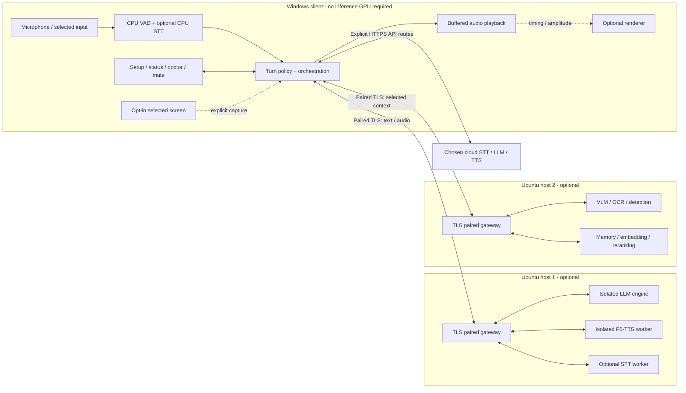

# Architecture and provider contracts

**Broader proposed design.** The implemented D02/F01 subset and remaining
conformance work are recorded in [Foundation boundaries](FOUNDATION.md);
the subsequent internal fixture/session/sink/status implementation is recorded
in [Delivery](DELIVERY.md) and [Diagnostics](DIAGNOSTICS.md#offline-fixture-experience-f03c).
the components and remote protocols below are not all implemented.
The subsequent [V04b app integration](CONVERSATION.md) composes setup/vault,
explicit typed/PTT capture, named STT, participation policy and the existing
streaming conversation runtime under one app-shared operation owner. It does
not implement learned VAD, automatic listening or the proposed remote topology.
The separate [H02b native Ollama chat adapter](../src/Martlet.Providers/OLLAMA_CHAT.md)
is a fixture-backed Providers library surface only: explicit literal-loopback
origin, constructed `:local` request, exact-action trusted-caller permit and
retained HTTP/lease ownership. It reuses Core text contracts without generalizing
OpenAI conversation authority. No production issuer, gateway/Desktop route,
immutable model binding or qualified runtime/host locality is established.
The [companion requirements](COMPANION_REQUIREMENTS.md) add explicit persona,
reference-voice, model-selection and listen-first/barge-in controls. These
remain future work, not extensions already implemented by V04b or the
standalone post-capture VAD library.
Read [the development plan](../DEVELOPMENT_PLAN.md)
for scope and approvals, [installation/support](INSTALLATION_SUPPORT.md) for
lifecycle, and [delivery](DELIVERY.md) for task ownership. Source IDs refer to
[the research ledger](RESEARCH.md). D02 must turn these contracts into schemas
and conformance fixtures before adapters are built independently.

## 1. Components, ownership, and topology

| Component | Proposed technology / owner | Responsibilities and failure boundary |
| --- | --- | --- |
| Desktop shell | WPF/.NET 10, client team | Accessible setup/status/tray UI, hotkeys, device selection, consent, typed conversation; no Docker/admin privileges |
| Audio engine | WASAPI/NAudio + CPU ONNX VAD, audio team | Capture, format conversion, endpoint events, meters, buffered playback; device failure does not disable text/doctor |
| Session core | Shared .NET library, core team | Turn state machine, policy, provider routing, cancellation, queues, settings; one source of truth for UI and CLI |
| Provider adapters | .NET interfaces plus versioned external worker contracts, provider team | Vendor-specific auth/schemas, health, limits, error translation; no leaking vendor shape into UI |
| Doctor | Shared probe registry, support team | Same bounded read-only probes in UI, CLI, gateway; provenance of fixture vs live results |
| Host gateway | ASP.NET Core in dedicated non-root Linux image, host team | Paired TLS/auth, capability/readiness reporting, authenticated job transport, bounded scheduling; no Docker socket or arbitrary commands |
| Inference workers | One pinned image/runtime per engine, runtime team | Ollama candidate LLM; dedicated Python F5 worker; optional STT/VLM/OCR/detection/reranker; private container networks |
| Host lifecycle tool | Reviewed packaged host utility, host/release team | Local preflight, installation journal, Compose reconciliation, backup/repair; explicit local administrative boundary |
| Optional memory service | Single-owner SQLite database plus replaceable retrieval adapters, memory team | Consent, source provenance, retention, export/delete; embeddings/index are derived data, not a second authority |
| Optional avatar process | Renderer selected in A01, avatar team | Local animation/playback events only; bounded IPC; crash does not interrupt voice or expose credentials |

The diagram shows alternatives, not simultaneous mandatory dependencies.
P1 has no Ubuntu gateway. P3 co-locates selected roles behind one gateway.
P4 gives the client separate host identities and route assignments; host 1
need not call or wait for host 2. STT can remain on the client CPU; remote STT
means microphone audio crosses the selected boundary.

Persist routing by role/provider/host ID, not a mutable hostname alone. A
personality is data, not a plugin executing arbitrary code. Maintain the
same core turn behavior regardless of provider and avatar state.

### Proposed implementation layout

Create only when implementation is authorized: `src\Martlet.Desktop`,
`src\Martlet.Core`, `src\Martlet.Audio`, `src\Martlet.Providers`,
`src\Martlet.Diagnostics`, `src\Martlet.Doctor`, `src\Martlet.Gateway`,
`workers\f5`, `contracts`, `tests\fixtures`, `packaging\windows`, and
`deploy\ubuntu`. Keep schema ownership with D02 and installer identity ownership
with F02; do not let parallel tasks invent their own protocol or settings store.

## 2. Trust, data, and permission boundaries

Default capture is stopped until the user starts a session. Persisted choices
do not authorize background capture after every launch. The UI always shows
mic state, speaking state, enabled perception, and destination badges by role.
Closing the window may leave the tray open only after explaining that behavior;
Exit ends capture and playback. Pause-all stops capture, jobs, and playback.
Mic mute, output mute, and screen-capture disable are separate controls:
output mute alone must not misleadingly imply the microphone is off.

| Data | Proposed default | Boundary / control |
| --- | --- | --- |
| Raw mic frames | Bounded in-memory buffer, no recording file | Only selected STT destination; PTT-only or explicitly armed continuous mode |
| Transcripts and response context | Session-memory only; bounded context | Selected LLM, and TTS receives only response text; no routine transcript logs |
| Credentials | OS credential store; config contains only credential references | No export/logs/URLs/command lines; per-provider origin binding |
| Screens and OCR | Disabled; selected window/region preview when enabled | Local or host-2 processing by default; cloud vision needs separate explicit consent |
| Persistent memory | Off; consented records only when enabled | Inspect, edit, delete, export; private user store; documented backup retention |
| Diagnostics | Metadata only, bounded retention | No automatic upload; preview/export requires user action |
| Voice references | No bundled unlicensed voice | User confirms rights, storage location, and remote processing; encrypted storage where supported |

An API-backed name-listening mode may send *every VAD-qualified utterance* to
cloud STT before the name can be recognized. Suppressing the subsequent LLM
response does not undo that disclosure or cost. Explain this on the mode
selector. PTT is the default; a name spoken in a transcript is not an acoustic
wake-word detector. A future local wake detector is a different licensed/tested
component and cannot be claimed from VAD alone.

For multiple people, require permission to capture their speech. Do not
silently monitor system/Discord audio. Do not send screenshots or retrieved
private records merely because a provider accepts images or long context.
Display cloud retention links; "not used for training by default" is not
"nothing is retained" ([S12](RESEARCH.md#s12)).

### LAN pairing and authentication

1. Host setup starts the gateway on loopback for local readiness. A deliberate
   Pair device action selects a LAN interface/address and a configurable port
   (proposed `7443`), creates a host identity, and opens a short pairing window.
2. The local host utility displays host ID, address, certificate/SPKI fingerprint,
   and a high-entropy one-use pairing token with a five-minute lifetime. A QR
   code or locally transferred pairing file carries these; discovery supplies
   only an address, never trust. Manual entry remains supported.
3. The Windows user imports/compares the fingerprint out of band before sending
   the token over the pinned TLS connection. No "accept any certificate" mode,
   no token in URL/query/history, and no assumption that a short PIN alone
   authenticates a hostile LAN. Rate-limit pairing and require local approval.
4. Exchange the token for a cryptographically random, scoped device credential;
   store it in Windows Credential Manager and only a verifier on the host.
   Bind to host ID and least-privilege roles: voice, perception, or memory.
   Pairing never grants host administration or shell execution.
5. Host UI/CLI lists and revokes devices. Proposed default expiry is 90 days
   with explicit renewal and advance warning; rotation has a brief bounded
   overlap. Old tokens and revoked credentials fail. Lost credentials require
   re-pairing; the old credential is not resurrected from a settings backup.
6. Renew certificates with the pinned key only under a documented policy.
   Host key change requires re-pairing or an authenticated old-key-signed
   transition; never silently trust a changed host. Expiry and clock skew
   remain visible errors even with pinning. Do not install a global trusted CA.

Use standard cryptographic/TLS libraries, not custom crypto. Threat-model and
exercise bootstrap, expiry, revocation, replay, and key rotation in H03.
Unpaired clients may access only a minimal liveness/pairing surface, not
model inventories, system data, logs, or job results.

Do not publish raw inference ports. Bind only the chosen private interface,
allow only the intended client addresses/subnet, account for IPv4 **and** IPv6,
and never enable router forwarding/UPnP by default. Docker published ports can
bypass UFW rules; validate from an unauthorized LAN machine rather than trust
a UI firewall checkbox ([S19](RESEARCH.md#s19)). No remote Docker TCP/socket
access, privileged gateway, host-network default, or automatic SSH key
installation. Existing LAN services must use authenticated TLS or a separately
configured trusted tunnel; plain HTTP is development-loopback-only.

Secrets live in Credential Manager on Windows and in root/admin-controlled
host secret storage with service-scoped mounts/permissions on Ubuntu, not
world-readable Compose environment files. Explain that an OS key store is not
protection from malware already executing as that user. Bind provider credentials
to approved origins; reject credential-bearing cross-origin redirects and
never reuse a cloud key for a user-entered endpoint.

## 3. Capability negotiation and provider contract

Contracts use a major/minor `protocol_version`, with additive optional fields
within a major version. Unknown optional fields are ignored; unknown enum
values are reported unsupported. Major mismatch blocks that route with
`PROVIDER_VERSION`; do not interpret it as an authentication or network error.
Backlog D02 owns maximum payload sizes and JSON schemas, including errors.

Proposed gateway surface (not an OpenAI impersonation):

| Operation | Contract |
| --- | --- |
| `GET /health/live` | Minimal process heartbeat, no inference readiness claim |
| `GET /martlet/v1/capabilities` | Authenticated version, role/model capabilities and limits |
| `GET /martlet/v1/status` | Authenticated worker state, model readiness, queue depth, last probe age |
| `POST /martlet/v1/stt` | Bounded WAV upload and turn metadata; final transcript and optional segments |
| `POST /martlet/v1/llm` | Typed request; SSE event stream or negotiated complete response |
| `WSS /martlet/v1/tts` | One synthesis request per socket, JSON control/format messages and binary PCM frames |
| `DELETE /martlet/v1/turns/{turn_id}` | Idempotent cancellation scoped to owning client/session; acknowledges local discard and upstream cancel capability |
| Optional vision/memory endpoints | Separately versioned role capabilities; not assumed on a voice host |

Desktop-to-cloud adapters normalize native APIs into the same internal
interfaces. Third-party endpoints need a named adapter + version/model
configuration; they do not need to implement Martlet routes.

Each capability response records provider/adapter version, model IDs and
revision/digest when known, supported operations, accepted audio/image
formats, language/voice choices, max input bytes/duration/tokens, context and
output limits, concurrency, and readiness. Streaming is granular:
`llm_text_deltas`, `stt_partials`, `tts_audio_transport`, and
`tts_incremental_synthesis` are separate flags. Cancellation distinguishes
`discard_only`, `request_abort`, and `cooperative_compute_cancel`.
Include tool/image support only when both engine **and model** pass probes.
Unsupported or unverified is not false-ready.

Minimum viable operation by role:

| Role | Minimum | Optional, never inferred |
| --- | --- | --- |
| VAD | CPU frame activity/segment boundaries with monotonic sample positions | Acoustic wake-word matching, AEC, speaker identity |
| STT | Bounded mono audio -> final text or explicit no-speech/error, language when known | Partial text, timestamps, speaker labels, calibrated confidence |
| LLM | Bounded text conversation -> final user-visible text or explicit refusal/error | Token deltas, usage, tools, images, structured output, compute cancellation |
| TTS | Text + selected voice -> declared audio format with definite end/error | Audio transport streaming, incremental synthesis, phonemes, visemes, voice cloning |
| Vision | Selected image + question -> timestamped observation/uncertainty | Bounding boxes, OCR spans, game-specific state, tools |
| Memory | Query -> bounded records with provenance; delete/export semantics | Embeddings, reranking, semantic summaries |

List models only through known APIs or configured catalogs, then run
small role-specific checks with permission. An accessible `/models` endpoint
or HTTP 200 is not readiness. Read-only health checks incur no inference
charge; an actual provider self-test is separately labeled billable and
requires approval. Cache capability probes with timestamps and refresh on
configuration/model/version change.

### User-controlled persona, voice and model revisions

R19-R21 require settings-backed named persona profiles, validated F5
reference-audio/transcript presets, and independent LLM/VLM selections. Keep
persona/style data separate from routing and permissions. Import/export is
data-only; model choices use named adapters and verified role capabilities,
not a universal OpenAI-compatible assumption.

Apply changes only when idle or after stopping and completing current owned
cleanup. New requests snapshot persona/style, route/model and voice-reference
revisions; reject stale intents/authorizations/results instead of mixing old
and new selections within a response. File replacement at an unchanged F5
reference path requires revalidation and cache invalidation. Selection/save
does not authorize upload, playback, download, warmup or inference. Re-budget
context and revalidate capabilities/consent after model changes. Exact UI and
failure requirements are in [R19-R21](COMPANION_REQUIREMENTS.md).

### Common identifiers, events, and errors

Every request includes `session_id`, `turn_id`, `request_id`, deadline, and
selected route/model. Responses echo identifiers. `request_id` identifies
an attempt; retries retain a parent correlation ID but use new attempt IDs.
Use W3C trace context across gateways where possible. No raw user content
belongs in trace attributes.

Stream events include `type`, monotonically increasing `seq`, IDs, payload,
and optional timing/usage. Valid terminal states are completed, refused,
canceled, or failed; EOF without a terminal marker is a stream failure, not
success. Duplicated events and late canceled-turn data are discarded. Persist
no hidden chat-provider thread IDs as an unreviewed memory system.

Errors normalize to `code`, stage, retryability, user-safe summary,
`action_id`, trace ID, and sanitized technical detail. Examples include
`AUTH_EXPIRED`, `QUOTA_EXCEEDED`, `PROVIDER_CAPABILITY`,
`MODEL_NOT_READY`, `GPU_OOM`, `AUDIO_DEVICE_LOST`, and `STREAM_TRUNCATED`.
Do not return invented transcripts, placeholder speech, or green status on
failure. Typed fallback is visibly a degraded mode.

## 4. Turn execution and conversational policy

Turn state machine:

`idle -> capturing -> transcribing -> deciding -> generating -> synthesizing/playing -> completed`

Any active state may become canceled or failed. `deciding -> suppressed`
is a normal, observable outcome. Generation, synthesis, and playback may
overlap, but share a single active turn generation/epoch. Committing UI text
does not imply its audio has played.

1. Capture and resample locally; VAD closes a bounded utterance after silence.
2. Send only consented utterance audio to STT; do not submit silence or keep
   unbounded recordings while waiting for connectivity.
3. Apply deterministic policy to the final transcript and activity state.
   Empty/hallucination-prone no-speech output is not a reason to start LLM.
4. For an allowed turn, assemble bounded personality/history context and only
   explicitly enabled, fresh optional context. Treat retrieved text and
   screenshot instructions as untrusted data, not executable instructions.
5. Stream LLM text if supported. A sentence segmenter commits stable text
   boundaries to TTS; incomplete tokens, reasoning channels, tool JSON, URLs,
   and markup are not read aloud accidentally.
6. TTS jobs preserve sentence order. Decode/normalize audio, prebuffer, play,
   and show progress. Optional avatar events derive from **actual playback**
   timestamps, not LLM token arrival.
7. On stop/new turn, advance the epoch, clear queued audio/text, abort active
   requests where supported, and ignore all late results. Do not assume
   disconnecting the socket frees GPU compute.

### Policy is not the LLM prompt

Default PTT mode: one deliberate press/release authorizes a bounded utterance.
An optional name mode matches configurable aliases/direct address against
final transcripts and waits for a conversational gap. Personality cannot
enable a route or override mute. Unknown confidence is `unknown`, not 1.0.

Proposed conservative controls: 600 ms end-of-utterance silence, 1.2 s minimum
gap for unsolicited participation, 8 s cooldown, one active response,
120-token response preference, 256-token hard output cap. Values are tuning
targets; provider context/token rules still apply.

| Priority | Condition / reason code | Outcome |
| --- | --- | --- |
| 1 | `PAUSED`, `MIC_MUTED`, `CONSENT_MISSING` | No new capture/submission; mute/pause cancel relevant queued work |
| 2 | `SELF_AUDIO`, `NO_SPEECH`, `LOW_CONFIDENCE` | Suppress; show why. Do not fabricate confidence from arbitrary vendor numbers |
| 3 | `EXPLICIT_PTT`, `WAKE_NAME`, `DIRECT_ADDRESS` | Request turn; explicit stop cancels current speech; require gap unless deliberate manual interruption |
| 4 | `BUSY_SUPPRESSED`, `BUSY_REPLACED`, `COOLDOWN` | Default discard unsolicited turns; keep at most one explicit pending turn with short expiry |
| 5 | `POLICY_DISABLED`, `NOT_ADDRESSED`, `INSUFFICIENT_GAP` | Remain silent normally |
| 6 | `PARTICIPATION_ALLOWED` | Only in opt-in conversational mode, at gap/cooldown/participation-budget limits |

For MVP, conversational mode is a deterministic, conservative heuristic over
address cues and recent turn state, not a second billable LLM. Maximum two
unsolicited turns/minute is a proposed ceiling; default is zero until opted in.
Save a metadata-only decision timeline with reason codes and configurable
local debug text. Tests cover name-in-quotation, similar names, multiple
speakers, silence hallucination, continuous talk, wake during playback,
and ignored input. Changing policy never silently activates continuous cloud STT.

### Listen-first context and response styles

[R22/R24](COMPANION_REQUIREMENTS.md) extend, rather than replace, the policy
boundary. Caller-owned, consented observations may be retained as bounded
session context without creating a reply per observation. Proposed limits are
120 seconds, 32 observations and 16 KiB UTF-8 text, further bounded by model
tokens; this is neither a pending-turn queue nor persistent memory. Expired
intents cannot become dispatchable by retaining their text. Clear context on
session end, pause/lock or consent revocation, and require explicit authorization
before sending retained context to a changed route.

New activity invalidates a proposed gap-based dispatch. Only a fresh eligible
decision can lead to LLM/TTS; quiet accumulation uses no second inference
model. Participation frequency/gap/cooldown and opt-in capture remain separate
from per-persona helpful/sarcastic/silly/distracted/teasing weights. Select a
style only after admission, using a testable weighted selector; persona/style
never overrides truthfulness, explicit controls or permission. The current
V04b path has no persona/history injection or automatic observation collector.

## 5. Audio, streaming, cancellation, and budgets

Capture at the device's supported shared-mode format (commonly 44.1/48 kHz),
then explicitly convert to mono 16 kHz PCM signed 16-bit little-endian for
VAD/STT. Use 20 ms transport/ring-buffer frames; accumulate the exact sample
window required by the pinned VAD model, rather than assuming its frame size
is 20 ms. Maintain sample-time mapping through resampling.

F5's inspected default is 24 kHz; adapters normalize output to mono 24 kHz
PCM signed 16-bit little-endian for Martlet transport, then the Windows
playback engine resamples to the selected device. Never reinterpret floating
point waveform bytes as PCM16 or assume an arbitrary provider uses 24 kHz.
Check rate, channel count, sample encoding, duration, and byte alignment.
WAV adapters parse headers; compressed cloud formats need a qualified decoder.

For proposed TTS WebSocket framing, initial JSON declares format, IDs, and
maximum frame duration. Each binary message starts with a fixed little-endian
sequence number and sample offset, followed by aligned PCM. D02 freezes header
widths/limits and golden binary fixtures. JSON completion includes final
sample count; cancel/error is explicit. No base64 audio in routine JSON logs.
One socket per synthesis segment keeps correlation unambiguous. Cloud HTTP
audio streams are converted by their adapter; upstream transports need not
match this wire format.

**F5 streaming boundary:** `_infer_basic` samples and vocodes an entire text
chunk; the streaming iterator then yields waveform slices. A smaller first
sentence can improve time to first audio but alter prosody and overhead.
Treat this as `tts_audio_transport=true`, `tts_incremental_synthesis=false`
for the inspected path. Measure TTFA, inter-sentence gaps, reference handling,
clipping, and cancellation on the chosen GPU. Do not import upstream
demonstration benchmark numbers as Martlet performance ([S16](RESEARCH.md#s16)).

| Resource / deadline | Proposed initial bound | Behavior on limit |
| --- | --- | --- |
| Capture | 500 ms preroll; 30 s maximum utterance; at most 2 MiB captured PCM per utterance | End segment visibly; never buffer an offline conversation indefinitely |
| Requests | One active conversation; one explicit pending turn, 5 s expiry | Replace stale pending explicit turn with notification; suppress unsolicited backlog |
| HTTP connect / TLS | 5 s | Distinguish DNS, connect, TLS, auth; no infinite spinner |
| STT | 20 s completion for bounded utterance | Fail stage; retain no raw audio beyond configured retry/session lifetime |
| LLM | 15 s first event, 10 s inter-event idle, 60 s total | Cancel; show partial text as partial, not a completed answer |
| TTS | 20 s first audio, 10 s idle, 90 s total per response | Stop on timeout, preserve explicit partial state; no automatic duplicate playback |
| Speech staging | 2 pending text segments; 5 s decoded playback buffer; 256-token output cap | Apply backpressure; if unsupported, cancel on bounded overflow rather than grow memory |
| Playback | 150 ms initial prebuffer; at most 1 s recovery wait for underrun | Resume only contiguous current-turn samples; otherwise stop with remedy |
| Optional context | 750 ms interactive deadline; one latest frame/query | Skip with visible context-unavailable indicator, never block voice indefinitely |
| Perception | Off; opt-in proposal 0.2 frames/s, max 1 frame/s, longest edge 1280 px, 1 MiB payload | Latest-frame-wins, drop stale results; user preview/allowlist remains mandatory |
| Worker concurrency | One synthesis job initially; per-model LLM limits; vision lower priority | `BUSY` plus retry hint, not unbounded host queues |

Cold model warmup is a separate setup/readiness state with its own bounded
deadline (proposed five minutes), not an excuse to hide live request timeouts.
Settings may relax bounds explicitly; persist them and expose measured values.

Retries: read-only probes may retry twice with exponential backoff/jitter.
Inference retries are allowed only before any user-visible output and only
when duplicate execution/cost is ruled out by the adapter's verified semantics.
Otherwise offer a deliberate Retry. Respect `Retry-After`, deadlines, session
spend/turn budgets, and cancellation. Never auto-retry after audible speech,
replay canceled segments, or claim universal idempotency.

### Feedback protection and device churn

Headsets and half-duplex are the MVP default: automatic speech capture is
gated during Martlet playback, with a short measured acoustic tail. Manual
PTT/Stop can interrupt instantly and start a new utterance after playback is
flushed. This is supported manual barge-in, not full-duplex acoustic AEC.

R23 makes automatic speech barge-in a required future companion capability,
opt-in and gated on H07 evidence using qualified feedback protection and an
echo reference/AEC path where needed. In that mode, local VAD must remain
active during playback; confirmed external speech onset goes directly to
Stop/epoch invalidation/PCM and unsaid-segment flush, without waiting for STT
or a name match. Target p95 <=250 ms from confirmed onset event to last rendered
sample; acoustic detection latency is separately measured. Request upstream
abort where supported, but never equate local silence with freed GPU work.
Further transcription/reply still needs permission and fresh admission after
owned cleanup; interruption cannot resurrect the canceled answer.

Until native privacy and the selected topology qualify, keep automatic barge-in
unavailable and manual PTT/Stop usable. Do not claim the post-capture VAD library,
transcript equality, or lowering speaker volume solves echo. Default system
loopback capture stays disabled; future
app-scoped remote-participant capture must exclude Martlet output or supply
an appropriate echo reference, with each participant's consent.

Device choice distinguishes a fixed endpoint from "follow Windows default."
Subscribe to endpoint add/remove/state/default-role events
([S05](RESEARCH.md#s05)). Fixed-device loss stops capture/playback and presents
an explicit replacement choice; do not switch a headset conversation to room
speakers unexpectedly. A default-follow policy can re-open the new endpoint
after a visible notification and safe buffer reset. Reconnection rechecks
formats; canceled or partially played audio is never replayed automatically.
Bluetooth profile/rate switches, USB churn, sleep/resume, and exclusive-device
contention require actual device tests.

## 6. Optional perception, memory, and avatar

P01 starts with user-triggered selected-window capture. Continuous capture
needs separate permission and the budget above; no secure desktop capture,
game injection, or permission bypass. Stop on session lock, source closure,
or permission loss. Users can preview the exact image and destination.

P02 selects **useful** tasks before selecting models: OCR for visible text,
VLM for a question about a screenshot, detector only for a demonstrated
latency/accuracy need. Evaluate mature upstream libraries in isolated workers;
do not implement inference from scratch. Every observation has timestamp,
source, confidence/uncertainty, and expiry. An old screenshot is not current
game state. Background queues never compete unboundedly with voice; measure
game frame-time impact and host VRAM under combined workloads.

P03 begins with user-saved facts and lexical retrieval in SQLite, not an
always-recording vector database. Add embedding/reranking only when a labeled
retrieval evaluation shows benefit. Store source consent, timestamps, model
revision, retention/expiry, and provenance with each record. Delete cascades
to embeddings/caches, increments a memory revision to invalidate in-flight
retrieval, and explains that previously exported/backed-up copies are outside
immediate erasure. Export is readable, versioned, and contains no credentials.
Do not transmit the complete memory store on every turn.

A01-A03 choose a rights-cleared renderer after classifying Live2D SDK use.
Only then accept user assets with limits on archive expansion, paths, file
types, and resources; no arbitrary scripts or network-loading assets.
Start with amplitude-based lip sync driven by actual PCM, blinking, breathing,
idle variation, and bounded gaze/speaking motions. Visemes/phoneme sync require
provider support or a separately validated local analyzer. The avatar is off
by default, has no provider credentials, and can be stopped/uninstalled without
altering conversation history, provider setup, or voice reliability.

## 7. Explicit degradation

| Failure | Still usable | Must be visible / forbidden |
| --- | --- | --- |
| Mic/VAD/STT fails | Typed input, text conversation, output test, doctor | Show failed stage; no generated substitute transcript |
| LLM fails or quota exhausted | Audio tests, settings, past current-session text | No hidden provider/model switch; no fixture response presented as real |
| TTS/output fails | Text answer and status | Mark voice unavailable; retries after partial playback require user action |
| Host 1 unreachable | Local UI/doctor; API route only if explicitly selected | No automatic cloud fallback or buffering captured speech for later upload |
| Host 2 unreachable | Voice without optional context | Warn that vision/memory is unavailable, never fabricate context |
| Model warming / GPU unavailable | Setup/status and other independent roles | Distinguish warming, busy, failed, and unsupported; process-up is not ready |
| Avatar crashes | All voice/text paths | Renderer error and independent restart; no restarting the session core |
| Network drops mid-stream | Stop stale playback, preserve partial text indication | No duplicate audio, no silent restart of a billable turn |
