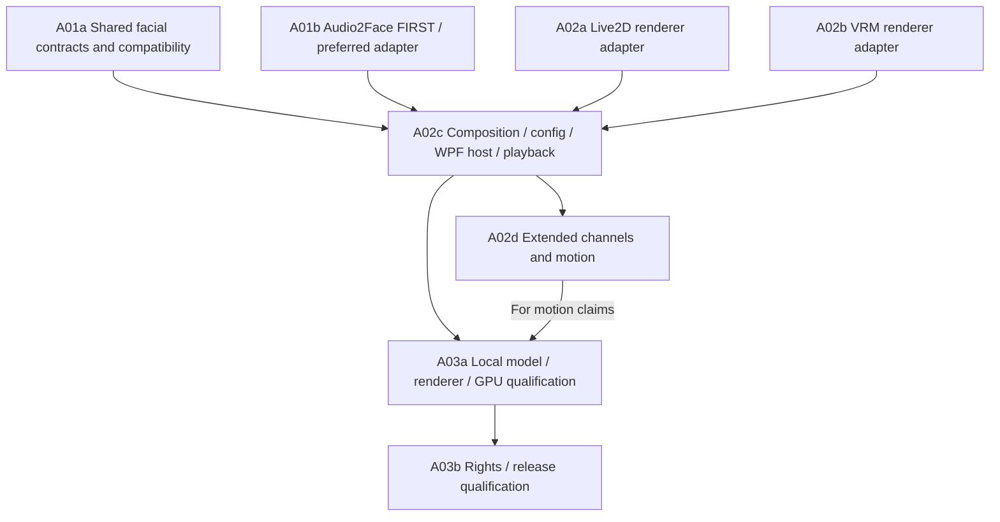

# Avatar guide: Live2D, VRM and speech animation

**Default character shipped, 2026-09-28.** Official builds bundle the Live2D
Cubism runtime and the Hiyori sample model. **Show character** on the main window
opens her as a transparent desktop overlay: authored idle motions, eye blink,
breathing, physics, cursor look-at and lip-sync (while Martlet watches your screen
it can [decide where she looks](SCREEN_COMMENTARY.md#where-the-character-looks):
your mouse, something that just popped up, or what it remarks on). Automatic lip-sync uses a local
Audio2Face service when one is running on the PC, else a paired Martlet host that
runs Audio2Face on its NVIDIA GPU (host role installed with [`martlet-host add audio2face`](../deploy/host/README.md)),
else the loudness of Martlet's own voice; no microphone or upload is used. Users can switch
to their own Live2D `.model3.json` (including VTube Studio model folders, with
names in any script and textures up to 8192 pixels) or VRM `.vrm` model in **Character settings**
and optionally show the character automatically at launch. See the
[Desktop integration guide](../src/Martlet.Avatar.Hosting/README.md) and the
[Live2D module](../src/Martlet.Avatar.Live2D/README.md#bundled-runtime-and-default-character).
The local package producer and current reader are implemented with manifest 3 /
provenance 2 / CycloneDX 1.6; reader support for legacy manifest 1 and manifest
2 / provenance 1 is preserved.

The character is **OFF until the user shows it**. No-avatar voice/text is a
normal supported product path. Live2D's Expandable Application review (required
because users can load their own models) has been applied for by the owner; a
public release bundling Live2D waits for that approval.

## Character profiles

A character profile switches who Martlet is in one step: its **look** (the
built-in character or one of your characters from Companion › Character), its
**voice** (one of your voices from Companion › Voice › Voices, spoken by the
voice-cloning engines) and its **personality** (a persona from Companion ›
Personality). Make and edit them in **Companion › Profiles**; *New profile...*
starts as whatever Martlet uses now. A profile may keep the current look or voice
instead of setting one. Switch from the Profiles page, Home's **Character** box
or the **Character profile** submenu of Martlet's icon by the clock.

Profiles are saved with the personality settings (`companion.characters` in
`settings.json`), so they travel to your other Martlet computers with the shared
settings. They name the look and voice by their shared IDs: switching saves the
look on this PC (as Companion › Character does), chooses the voice on all your
computers (as *Use* in Voices does) and selects the personality, and an open
conversation takes the new voice and personality before its next reply. A part
that can't switch yet (a look still copying to this PC, a removed voice) stays
as it was and Martlet says why. The profile in use is worked out from what
Martlet actually uses, so changing the look, voice or personality by hand shows
"A mix of your own" until a profile matches again. Removing a persona removes the
profiles built on it.

## Emotes and motions

Models don't share a standard for emotes. VRM 1.0 has optional preset emotions
(`happy`, `angry`, `sad`, `relaxed`, `surprised`) plus freely named custom
expressions. Live2D names are whatever the artist chose: `F01`, `exp_03`,
`脸红`. VTube Studio models often leave their `.exp3.json` and `.motion3.json`
files out of the model3.json and list them as hotkeys in their `.vtube.json`.
Martlet therefore reads what each model actually has and asks the Thinking model
what each one is.

- **Discovery** (`Martlet.Avatar.Hosting`, `CharacterActionInventory`): the
  model3.json's expressions and motion groups (except the idle group), plus,
  for a VTube Studio model, the `.vtube.json` naming that model3.json, the
  expression and motion files its hotkeys and idle animation name, and any
  other `.exp3.json`/`.motion3.json` at the top of the folder. Those are copied
  with the model (and to paired computers), named by their hotkey or file name,
  and the VTube Studio idle animation idles the model when it has no `Idle`
  group. VRM: the preset emotions and every custom expression; mouth, blink,
  gaze and `neutral` presets stay with lip-sync, blinking and gaze. Every model
  also gets Martlet's own gestures that its rig supports (see *Global
  gestures* below). Each one comes
  with what it changes: Live2D parameter IDs, their display names from the
  model's `.cdi3.json` and values, and motion lengths; VRM shape names.
- **Naming** (Companion › Prompts › *Naming character emotes*): the first time a
  model shows, and on **Name them with Thinking**, the Thinking model gets that
  list (names and what they change, never files) and answers one line per item:
  an English tag (`blush`), a voice cue or none, whether it stays on or is
  brief, and when to use it. It can turn
  off items that aren't feelings, gestures or looks (debug or effect switches, gore). Until
  then, tags come from the model's own names. Naming is a low-priority
  [helper job](MEMORY.md#helper-jobs-on-the-thinking-pool): a free Thinking pool
  member that reads text names them; without one, the conversation's Thinking
  model does, after any reply finishes speaking.
- **English tags, any-language names**: tags are always lower-case English
  (`a-z`, digits, `_`, `-`), so every Thinking model can write them, while each
  emote keeps the name its creator gave it (Chinese, Japanese, Korean or any
  other script) in the settings, the naming list and the renderer. Before the
  Thinking model names them, a name with English letters becomes its tag
  (`starEyes` → `star_eyes`), common Chinese, Japanese and Korean emote words are
  translated (`脸红` → `blush`, `涙` → `tears`, `웃음` → `smile`), and anything
  else is numbered (`emote_3`, `motion_2`).
- **Settings**: Companion › **Emotes and motions** lists each one
  with a check box, its tag, its voice cue and when to use it, a **Try** button
  (while the character shows) and what it changes. *When to use* is the hint the
  reply prompt puts next to the tag (`{sweat} - a sweat drop, for nervousness or
  an awkward moment`), so the Thinking model knows what each tag shows and when
  it fits. The naming fills it in for the model's own emotes. While it is
  empty, replies get Martlet's own hint (a gesture's built-in hint, or *the
  character's emote named "..."*), which the box shows in grey. Edits save as you type, per
  model (by its ID, the same ID as the shared character list), in
  `character-actions.json`, which is the same on all your computers (the
  `character-actions` [shared setting](CLUSTER.md#one-martlet-on-every-computer)):
  a model the Thinking model named on one computer is named on all of them.
  **Use the model's own names** goes back to the defaults (your combos stay).
- **Voice cues**: a voice cue links an emote or motion to a sound or tone the
  voice engine performs, by meaning across engines (`laugh` is Chatterbox
  Turbo's `[laugh]` and Dia's `(laughs)`). When the voice speaks that tag, the
  character plays it at about that point in the sentence (one expression and
  one motion at random when several share the cue).
- **Replies**: while the character shows, replies are offered every emote and
  motion that is on and that the speaking voice doesn't already set off through
  a cue (Companion › Prompts › *Character emotes and motions*), written as
  `{tag}`. The prompt asks the reply model to use them freely (usually one or
  two in a reply) and to vary them, because each one is worth showing. This
  part of the prompt is not longer than before.
  The tags are removed from the chat, captions and the voice, and the
  character acts each one where it was written: timed within its sentence as
  it plays, after the last sentence for a tag at the end, or at once for a reply
  that isn't spoken. When the reply pauses because you talk over it, the tags
  still to come wait, so each keeps its place in the speech. When the reply is
  stopped, the character doesn't act the tags it hasn't reached. A tag written
  another way counts too (`[nod]`, `(nod)`,
  `*nods*` or `[shakes head]`; see
  [other spellings](CONVERSATION.md#voice-tags)), and the talk window notes
  under the reply what it set off (*Emotes: nod, blush.*, with any tone or
  sound the voice made). An expression shows for at least 4 seconds and until its
  sentence ends (at most 12 seconds) unless another replaces it; motions and
  gestures play once. VRM has no motions of its own (VRMA isn't supported), so
  it uses its expressions and the gestures.
- **VRM idle pose and breathing**: a VRM model is made in a T-pose (arms
  straight out, flat open hands). While it shows, Martlet stands it in a
  relaxed pose on every model: the arms hang about 15 degrees out from the
  body and a little forward, the elbows bend softly, the wrists turn toward
  the thighs, and the fingers and thumbs curl in, a little more toward the
  little finger. It breathes about 14 times a minute (a quicker breath in, a
  slower breath out and a short rest, a little faster or slower over time,
  and shallower while the voice speaks): the shoulders rise, the chest opens
  a little and the head stays level. The spine also sways slowly from side
  to side, less than a degree. A wave, shrug or arms-open gesture opens the
  hands it moves. The first frame (the rest pose in Martlet's touch-zone
  picture) is breathed out with no sway. Martlet's MCP `character_pose` reads
  it. Authored VRMA clips (the official `@pixiv/three-vrm-animation` loader)
  are not played yet.
- **Lingering emotes**: an emote can stay on, like a VTuber's toggle hotkey.
  Its **Stays on** box in Emotes and motions sets this. In
  `character-actions.json` the mode is `lingering`; an unticked box is `brief`.
  These expressions stay on by default:
  - an expression that a VTube Studio *ToggleExpression* hotkey turns on;
  - an expression whose name or tag names a look that stays (glasses, a hat, a
    blush, an angry or sad face, tears, a dark face, an outfit or accessory).

  Martlet's holdable gestures (pout, shy, look_away, drowsy, eyes_up and
  mouth_open, the overlay emotes sweat, hearts, gloom, sleepy, heart_eyes,
  star_eyes, tongue_out, drool, steam and dizzy, and the blush levels
  blush_deep and blush_fierce) also stay on by default. Held gestures layer
  (see *Layers*); every blush level is the cheeks, so a new level
  replaces the one before. A gesture that the renderer cannot hold plays once.
  Motions and the other gestures are brief by default. The Thinking model's
  naming also gives `stays` or `brief` for each item.
- **Tags for lingering emotes**: a reply writes `{glasses}` to turn the emote
  on. When it is already on, nothing changes. The reply writes `{/glasses}` to
  turn it off. The reply prompt tells this on the line of each lingering emote.
  Martlet removes off tags from the text like all other tags.
- **Layers**: several lingering emotes can show at the same time. Live2D gives
  each held expression its own Cubism expression manager, as VTube Studio does.
  Thus the held expressions add to each other and to the passing emote. VRM
  keeps held expressions on while passing ones fade in and out.

  Held gestures layer too, so a reply (or you) can build a face from parts
  that stay on together, for example the eyes turned up, the mouth open and a
  blush, with hearts drawn over them. Each holdable gesture moves some parts of
  the face. A new held gesture lets go only of the held gestures that move a
  part it moves too, and they ease out as it eases in. Held overlay emotes
  (sweat, hearts, gloom and sleepy) have no parts: they all show together, on
  top of whatever the model holds. The blush levels are the exception: drawn by
  Martlet or the model's own, each one is the cheeks, so only one level shows
  at a time. A gesture played once plays on top of the held ones.

  | Held gesture | Parts it moves |
  | --- | --- |
  | `pout` | mouth, brows, head |
  | `shy` | eyes, mouth, head |
  | `look_away`, `drowsy` | eyes, head |
  | `blush`, `blush_deep`, `blush_fierce` (the model's own: Live2D `ParamCheek`, a VRM's blush expression; or drawn by Martlet) | cheeks |
  | `eyes_up` | eyes |
  | `mouth_open` | mouth |

  The head part includes the body. The tables are `HOLD_PARTS` in
  `Martlet.Avatar.Live2D`'s `lib/gestures.ts` and `VRM_HOLD_PARTS` in
  `Martlet.Avatar.Vrm`'s `src/runtime.ts`.
- **The voice has the mouth**: while Martlet speaks, its voice moves the
  character's mouth, whatever the emotes showing do to the mouth. An emote that
  sets the mouth gives way to the voice, so the lips follow the words. Examples
  are `mouth_open`, a combo such as `{starstruck}` or `{ahegao}`, and a model's
  own expression that opens the mouth or holds it in a shape. The rest of the
  emote (the eyes, brows, cheeks and drawings) stays on.
  - The voice keeps the mouth through the pauses between words and sentences.
    About a second after its last sound, the emote's mouth comes back: an open
    mouth opens again. The voice takes the mouth again at its next sound.
  - Live2D: each frame, what idle motions, expressions and gestures put on the
    lip-sync parameters and `ParamMouthOpenY` eases back to the model's rest
    while the voice speaks. Lip-sync then moves them alone.
  - VRM: a held open mouth gives way completely. The emotes showing also don't
    block or blend the mouth expressions while the voice speaks. VRoid
    emotions often set this (`overrideMouth: block`), which held the mouth
    still. Each expression gets the model's own setting back afterwards. One
    VRM expression can't be split into its mouth and the rest, so an emotion
    whose own shape opens the mouth keeps that shape under the voice's mouth.
  - Audio2Face frames count as the voice. Martlet's MCP `character_mouth`
    reads who moves the mouth.
- **What the reply model knows**: while lingering emotes show, the notes of the
  newest message tell the reply model (Companion › Prompts › *Character emotes
  showing now*). An example: *Your character is showing {glasses} (12 min),
  {blush} (just now). Each stays on until you write its off tag ...*. This line
  never goes into the instructions, so prompt caches stay valid. When no
  lingering emote shows, Martlet adds nothing.
- **How long they stay**: lingering emotes stay across replies. They come back
  when the same model shows again. Martlet forgets them when another model
  shows. An emote stops when the owner turns it off or makes it brief in the
  settings. **Clear emotes** on the character's right-click menu (or in Emotes
  and motions) turns all of them off. For a lingering row, **Try** turns the
  emote on, and the button then shows **Turn off**.
- **Combos**: the owner can give one tag of their own to 2 to 6 of a model's
  emotes, motions and gestures. Emotes and motions › **Combos** has, for each
  combo, a tag, its parts' tags (such as `blush hearts nod`), *When to use* and
  an on box. A reply's `{flustered}` sets off each part that is on at once, as
  the part's own tag would: a lingering part turns on and stays, and a brief
  part shows a moment. `{/flustered}` turns the combo's lingering parts off. A
  part that is turned off is skipped. When a combo holds two of Martlet's
  gestures, the renderer's rules for held gestures apply (see
  *Global gestures*).
  - Replies are offered each combo that is on and has a part that is on. The
    combo lines come after the emotes' lines, so those lines stay the same and
    prompt caches keep working. An example:
    `{flustered} - a combination of {blush}, {hearts} and {nod} (stays on until you write {/flustered})`.
  - The hint is the combo's *When to use*, or what it combines while that box
    is empty. Only a combo with a lingering part gets the *stays on* note and
    its off tag. Combos are offered only while their tags fit in the tags a
    request may carry, next to the emotes' tags. Room always stays for the
    tags that move the character's eyes, so combos never push them out.
  - Combos are saved with the model's settings in `character-actions.json`
    (`combos`: `tag`, `parts` as IDs, `use`, `enabled`), at most 24 for each
    model. A combo's tag must be a valid tag that no emote and no other combo
    of the model has. `given_combos` lists the tags of Martlet's combos the
    model was given (see below). A file without them reads as before.
  - **Try** sets a combo off on the showing character. While one of its
    lingering parts is on, the button shows **Turn off**. **Use the model's own
    names** keeps the combos. A Martlet that doesn't have a part (an older
    version without a new gesture) leaves that part out.
  - **Martlet's combos** (`CharacterActions.MartletCombos`): every model starts
    with Martlet's own combos of its gestures. Martlet gives each one to a model
    once, after the owner's combos, with the parts that model can play (at
    least two). A part is Martlet's gesture, or the model's own emote that
    replaces it (an emote tagged `heart_eyes`, or a VRM's own `surprised`).
    Martlet doesn't give a combo when an emote or one of the owner's combos
    already has its tag, or when the model already has 24 combos. After that,
    the combo is the owner's: change it, turn it off or remove it. A removed or
    renamed one doesn't come back, because it is in `given_combos`. **ahegao**
    starts turned off, so replies get it only after the owner turns it on. New
    Martlet combos go last, so the earlier combo lines stay the same.

    | Combo (tag) | Parts | Starts |
    | --- | --- | --- |
    | `lovestruck` | `heart_eyes`, `hearts`, `blush_deep`, `sway` | on |
    | `flustered` | `blush_deep`, `sweat`, `shy` | on |
    | `overheated` | `blush_fierce`, `steam`, `dizzy` | on |
    | `fuming` | `pout`, `anger`, `steam` | on |
    | `heartbroken` | `tears`, `gloom`, `crying` | on |
    | `dozing` | `drowsy`, `sleepy`, `drool` | on |
    | `starstruck` | `star_eyes`, `sparkles`, `mouth_open` | on |
    | `shocked` | `exclaim`, `gasp`, `surprised` (all brief, so no off tag) | on |
    | `ahegao` | `eyes_up`, `mouth_open`, `tongue_out`, `drool`, `blush_fierce`, `heart_eyes` | off |
- **Renderer protocol**: `RendererAction(Kind, Name, On, Hold)`. With `Hold`,
  an expression, gesture or overlay stays on until the same action comes with
  `On` set to false. The reply to a gesture action says which gesture plays
  once and every one held, the model's gestures first and then the drawn
  ones: `gesture: {playing, held: [...]}`. Martlet keeps each lingering emote
  that the renderer still holds and forgets only the ones it let go. When the
  same model shows again, Martlet turns all of them on again.
- **Global gestures**: Martlet's own gestures (`CharacterActionInventory.AllGestures`)
  play on any model whose rig has what they move, so replies are offered only
  the ones the shown model can do:

  | Gesture (tag) | Live2D needs | VRM needs |
  | --- | --- | --- |
  | nod (`nod`), shake (`shake_head`), tilt (`tilt_head`) | `ParamAngleY`, `ParamAngleX`, `ParamAngleZ` | `head` bone |
  | bow (`bow`) | `ParamAngleY` | `spine` bone |
  | sway (`sway`) | `ParamBodyAngleZ` | `spine` bone |
  | smile (`smile`), surprise (`surprised`) | `ParamEyeLSmile`/`ParamEyeRSmile`, `ParamBrowLY`/`ParamBrowRY` | not offered (VRM uses its own emotion presets) |
  | blush (`blush`), deep blush (`blush_deep`), fierce flush (`blush_fierce`) | nothing (see below) | `head` bone |
  | wave (`wave`), shrug (`shrug`), bounce (`bounce`) | not offered (no standard arm or position parameters) | right arm, both arms, `hips` bones |

  Live2D parameters are read from the model's `.moc3`, VRM bones from its
  humanoid. A gesture is left out when the model's own emote or motion already
  has its tag (a model with its own `smile` keeps that one).

  **Every model blushes, at three levels.** The blush levels are, faintest
  first, `blush`, `blush_deep` (a deep blush: redder and wider, with more
  lines) and `blush_fierce` (a fierce flush: deep red across both cheeks and
  over the bridge of the nose, densely lined, with a slow pulse). They come
  after all other gestures, so the start of the reply instructions stays the
  same. One level shows at a time: a new level replaces the one before, also
  when it is fainter. The blush uses, in order: the model's own blush emote
  (an expression named like `blush`, `脸红` or `照れ`, which then replaces the
  gesture), a Live2D model's `ParamCheek`, a VRM's custom expression named like
  `blush` or `cheek`, and otherwise a soft pink glow with a few faint strokes
  that Martlet draws on the cheeks over the character. The stronger levels
  also use the model's `ParamCheek` or blush expression, at full strength, and
  Martlet always draws the level over it, so each level looks different on
  every model. Each level fades in and out over 0.6 seconds and lasts 4
  seconds, or stays while held (the renderer action's `hold`) until turned
  off. `blush` is brief by default; `blush_deep` and `blush_fierce` linger by
  default (`{/blush_deep}` turns the deep blush off).
- **Drawings over the character**: the renderer page draws Martlet's own
  effects (the blush levels, and others built on them) on a second canvas laid
  exactly over the model, following zoom, pan and the display's scale, so they
  also show in pictures of the character. They are placed around the face as
  the model draws it in each frame, so they follow everything that moves the
  head: idle motions, body sway, breathing, the mouse, a look at a point and
  gestures. A VRM's face follows its posed head and eye bones (nothing is drawn
  while it faces away). Live2D models have no face landmarks, so the face is
  first found at rest (an authored head or face hit area, meshes whose IDs name
  the face or cheeks, or else an estimate from the shape of the top of the
  model). Then it is pinned to the face's own mesh vertices. A Live2D face is
  drawn in layers that move apart as the head nods and turns (the back hair,
  the skin, the eyes, nose and mouth over it), so Martlet pins the face to its
  skin: the drawable drawn highest that holds the face's middle and both
  cheeks. The drawings then stay on the face as she looks down at the mouse,
  also on models whose physics turns the head (head angles that only feed
  parameters such as `ParamFaceAngleX`). A model without such a drawable is
  pinned to the vertices that turn with the head instead: when the model
  loads, Martlet moves the head angles (`ParamAngleX`/`Y`/`Z`) to find them,
  and moves the other parameters to drop the ones that change shape on their
  own (hair physics, eyelids, eyes, mouth, brows). A model with neither uses
  the earlier estimate moved with `ParamAngleX`/`Y`/`Z` (a positive
  `ParamAngleZ` tips the head's top toward the viewer's right, as on Hiyori).
  Each blush level lies on its
  cheek's surface, so a turned head shows the near cheek's blush wider and the
  far one narrower (with fewer of a stronger level's lines), fading out as that
  cheek turns away; the fierce flush's band over the nose fades toward that
  cheek too. The Live2D adapter's
  `setFaceHint` lets a face found by vision refine the estimate, pinned the
  same way. Martlet's MCP `character_face` reads where they are drawn.

  **The eyes.** Drawings over the eyes (such as heart eyes) cover only each
  iris and stay inside the eye. For them the face also has each eye's iris (its
  middle and size) and its visible opening between the eyelids, as the model
  draws them in each frame. A Live2D model gives them from its own meshes. When
  it loads, Martlet moves `ParamEyeBallX` and `ParamEyeBallY` to find the
  drawables they move: the largest in each eye is its iris, the smaller ones its
  highlights. The iris's clipping mask is the eye white, and its triangles are
  the opening, which closes as the model blinks. A VRM's eye bones place each
  eye, and the iris turns with its bone. The model's iris and eye-white meshes
  give the iris's size and the opening: VRoid's `EyeIris` and `EyeWhite`
  materials, or names with iris, pupil, hitomi, 瞳 or 白目. For an eye the model
  can't give, eyes measured by vision give a sized iris that follows the gaze
  and an outline that closes on a blink. `eyesFrom` says where they came from:
  `mesh` (Live2D meshes), `bones` (VRM bones and meshes), `vision`, or
  `estimate` while an eye has neither. Then that eye's iris and opening are left
  out, and drawings over the eyes use their own estimate. The bundled Hiyori
  gets `mesh`.
- **Voice emotes**: every sound and tone a voice engine makes has a global emote
  of its own, linked to that voice cue from the start, so any character reacts
  when the voice laughs, sighs or turns angry, even before it is named. The
  surprise gesture follows `surprised`; the others are their cue's name (with
  `_` for spaces) and play on any rig with what they move:

  | Voice emote (tag and cue) | What it does | Live2D needs | VRM needs |
  | --- | --- | --- | --- |
  | `laugh`, `chuckle` | smiling eyes, the head bobbing | `ParamAngleY` | `head` (and `spine` for a laugh) |
  | `sigh`, `exhale` / `inhale` | the head and shoulders drop / rise | `ParamAngleY` | `head`, `spine` |
  | `gasp`, `sneeze`, `cough` | the head jerks back, snaps forward, jerks forward | `ParamAngleY` | `head`, `spine` |
  | `clear_throat`, `sniff`, `shush` | a dip aside, two lifts, leaning in | `ParamAngleY` | `head` (and `spine` to shush) |
  | `groan`, `hum`, `whistle`, `sarcastic` | head back, a gentle sway, looking up and away, an eye roll | `ParamAngleZ` | `head` |
  | `mumble`, `fear` | looking down and away, trembling back | `ParamAngleX` | `head` (and `spine` for fear) |
  | `happy` | smiling eyes and a cheerful bob | `ParamEyeLSmile`, `ParamEyeRSmile` | `head`, `spine` |
  | `angry` | lowered brows and head | `ParamBrowLY`, `ParamBrowRY` | `head`, `spine` |
  | `crying`, `whispering` | bowed head with sobbing shoulders, leaning in | `ParamAngleY` / `ParamAngleZ` | `head`, `spine` |
  | `dramatic` | the head thrown back with a flourish (VRM: arms open) | `ParamAngleZ` | `head`, both upper arms |
- **Overlay emotes**: anime symbols Martlet draws over the character's face on
  the overlay layer (`web/effects/manpu.mjs` in `Martlet.Avatar.RendererHost`),
  so every Live2D model gets them and every VRM with a `head` bone. They follow
  the face (its position, size, zoom and head tilt), pop in with a little bounce
  and fade out after 2 to 4 seconds; sweat, hearts, gloom, sleepy, heart_eyes,
  star_eyes, tongue_out, drool, steam and dizzy linger (keep going until
  `{/tag}`) by default.
  Their colours are fixed and outlined, so they read on any desktop. The tag is
  the name; a model's own emote with the same tag replaces it (a model's
  `爱心眼` expression becomes its own `heart_eyes`). Tears fall from the eye
  points, and tongue_out and drool hang from the mouth point. The hearts, stars
  and swirls of heart_eyes, star_eyes and dizzy sit on each iris, sized to fit
  inside it, and are clipped to the eye's visible opening, so they never go
  outside the eye and the eyelid cuts them as it closes. They use the iris and
  the eye opening the renderer finds, and nothing shows on an eye it reports as
  closed or hidden; without them, they are iris-sized at the eye points and
  clipped to an eye-sized ellipse:

  | Overlay emote (tag) | What it draws | When to use |
  | --- | --- | --- |
  | `sweat` | a sweat drop sliding down beside the head | nervous, awkward |
  | `anger` | a throbbing anger vein on the forehead | annoyed, irritated |
  | `hearts` | small hearts floating up around the head | love, adoration |
  | `sparkles` | sparkles twinkling around the face | delighted, excited, proud |
  | `tears` | tears streaming from the eyes | sad, deeply moved |
  | `gloom` | dark gloom lines over the upper face | depressed, mortified |
  | `question` | a question mark popping up | confused |
  | `exclaim` | an exclamation mark popping up | startled, realizing |
  | `sleepy` | a floating Zzz | sleepy, bored |
  | `music` | music notes floating up | humming, happy |
  | `heart_eyes` | pink hearts pulsing in the eyes | smitten, adoring |
  | `star_eyes` | twinkling stars in the eyes | starstruck, thrilled |
  | `tongue_out` | a little tongue poking out below the mouth | a playful tease |
  | `drool` | a drop of drool running from a corner of the mouth | craving something tasty, dozing off |
  | `steam` | puffs of steam blowing out from the head | fuming, overheated |
  | `dizzy` | swirls spinning in the eyes, little stars circling the head | dizzy, dazed |
  | `idea` | a light bulb lighting up above the head | a sudden idea |
  | `ellipsis` | three dots appearing one by one beside the head | speechless, an awkward silence |

  A voice emote plays when the voice speaks its tag (Chatterbox Turbo's
  `[laugh]`, Dia's `(laughs)`), alongside any of the model's own emotes on the
  same cue. Voice emotes aren't offered to replies as tags, so the reply
  instructions stay as short as before; clear one's cue to offer it as a tag
  instead. The model's own emote with the same tag (a VRM's `happy` or `angry`
  preset) replaces it.
- **Touch and mood gestures**: after the others come gestures for reacting to
  a touch or showing a mood, offered to replies as tags like the global
  gestures. They layer on idle, blinking, lip-sync and the look, and use the
  VRM's preset expressions (`blinkLeft`, `relaxed`, `happy`, `surprised`,
  `angry`, `blink`) when it has them:

  | Gesture (tag) | What it does | Live2D needs | VRM needs |
  | --- | --- | --- | --- |
  | `wink` | one eye closes with a little smile and head tilt | `ParamEyeLOpen` | `head` (`blinkLeft`) |
  | `pout` | the mouth turns down, the cheeks puff (`ParamCheekPuff`), the head turns aside | `ParamMouthForm` | `head` (`angry`, lightly) |
  | `shy` | looks down and away with a half smile, peeking back | `ParamAngleX`, `ParamAngleY` | `head`, `spine` (`relaxed`) |
  | `giggle` | quick little bounces with smiling eyes | `ParamAngleY` | `head`, `spine` (`happy`) |
  | `flinch` | jerks back startled within 80 ms, then settles | `ParamAngleY` | `head`, `spine` (`surprised`) |
  | `lean_in` | leans in with the head tilted and the eyes softly closing (a head pat) | `ParamAngleZ` | `head`, `spine` (`relaxed`) |
  | `look_away` | turns the head and eyes aside, glancing back | `ParamAngleX` | `head` |
  | `think` | looks up and to the side | `ParamAngleY` | `head` |
  | `eye_roll` | the eyes roll up and over | `ParamEyeBallX`, `ParamEyeBallY` | `head` |
  | `drowsy` | half-closed eyes, the head slowly nodding off and catching itself | `ParamEyeLOpen`, `ParamEyeROpen` | `head`, `spine` (`blink`) |
  | `eyes_up` | only the eyes turn up and stay up; the head doesn't move | `ParamEyeBallY` | `leftEye`, `rightEye` |
  | `mouth_open` | the mouth opens and stays open; while Martlet speaks, the voice moves it | `ParamMouthOpenY` | `head` (the `oh` mouth expression, or `aa`) |

  `eyes_up` and `mouth_open` come last in `AllGestures`, after the overlay
  emotes, so the reply instructions' earlier lines stay the same.

  `pout`, `shy`, `look_away`, `drowsy`, `eyes_up` and `mouth_open` can be
  **held**: a renderer `action` with `hold: true` eases into the pose and keeps
  it, gently alive, until an `on: false` action for the same gesture eases it
  out (`Holdable` in `AllGestures`). Without `hold` they play once for a few
  seconds. A gesture played while some are held plays on top, the held poses
  easing back partway and resuming after. A new held gesture crossfades only
  from the held gestures that move a part it moves too (see *Layers*). The
  renderer's reply to a gesture says which plays once and every one held
  (`gesture: {playing, held: [...]}`).

  While `eyes_up` is held, the eyes stay up whatever the look (the mouse, a
  point or a glance), and the head still follows the look. When it ends, the
  eyes follow the usual gaze again. Live2D moves `ParamEyeBallY` and takes the
  look out of the eyeballs. A VRM turns its eye bones up as far as its own
  look-up range (12° when it has none). While `mouth_open` is held and the
  voice speaks, the voice has the mouth (see *The voice has the mouth* above):
  the held opening gives way completely, so lip-sync opens and closes the
  mouth. About a second after the voice stops, the mouth opens fully again.
  Live2D adds to `ParamMouthOpenY`. A VRM uses its `oh` mouth expression, or
  `aa` when it has no `oh`; a composed (Audio2Face) turn keeps the mouth it
  drives.
- **Where it looks**: the head and eyes follow the character's usual gaze (your
  mouse, your mouse only when it's near, straight ahead, or where you point or
  type in the window you're using), chosen on Companion › Eyes › **Where the character looks** or
  the character's right-click **Eyes** menu, or by its personality. Replies may
  change it with gaze tags (`{look ahead}`), a touch can turn the eyes to your
  mouse for a moment, and with Companion › Vision › **Glances at your screen**
  set to *Martlet decides* it glances at something that just changed on the
  watched screen or at the part of it a screen glance's Thinking model names
  with a look tag (`{look top right}`). Look tags are never emotes; see
  [Where the character looks](SCREEN_COMMENTARY.md#where-the-character-looks).

## Touch zones

Click the character (a left click, not a drag) and it reacts to where you
touched it. Companion › Touch › **Touch zones** lists the zones of the
model it shows. **Detect zones** looks for a short list on every character:
the hair, the left and right eye, the left and right ear, the nose, the mouth,
the neck, the left and right breast, each upper arm and forearm, the stomach,
the left and right hip, the groin, each thigh and calf, and the left and right
foot. **Add zone** offers every other zone Martlet knows that the model doesn't
have yet: the top of the head (a head pat), forehead, face, cheeks, chin,
shoulders, hands, chest, waist, knees, buttocks, inner thighs, and extras such
as animal ears, a tail or wings. A zone you add starts in the middle of the
picture: move it into place, or press **Detect again** and the Thinking model
looks for it too. When it can't find a zone you added, the zone stays where it
was. Detect again drops the other zones it doesn't find, so zones that an
older Martlet found beyond the short list go away. Intimate zones (the mouth,
ears, neck, chest and breasts, waist and sides, hips, groin, buttocks and inner
thighs) react too while **Include intimate zones** is on, which it is by
default; turn it off to leave them out. The check box names each of these parts.

- **Detect zones** shows the Thinking model pictures of the character (never the
  model's files); a model must be able to see (Companion › Vision says whether
  it can and where pictures go). The button is greyed out only when no model
  that can see pictures is set up (neither the Thinking model nor a Thinking pool
  member), and the line under it then says what to change. It works the same
  whether the character shows or is hidden. Nothing is sent until you press it,
  and it is never on the conversation's path. It goes step by step:
  1. Martlet loads the character a second time, off screen, in a renderer that
     is never seen and never animates. So the picture shows the character in its
     rest pose (no idle motion, eyes open, looking ahead), and the character on
     your desktop doesn't move. The renderer frames the character whole (no zoom,
     no pan) on a page the shape of the character's window, draws one frame up
     to 1364 pixels tall, reads it back and closes. Some Live2D models draw parts
     past their own frame (legs or a tail below it, say). Martlet then draws the
     frame again, zoomed out just enough for every part to show.
  2. The CPU puts the character on a plain backdrop that contrasts with it (light
     for a dark character, dark for a light one), because servers paint a
     transparent background as they like. It draws a grid of tenths, numbered
     0.1 to 0.9 along the top and left edges, so the model can read positions.
  3. The model sees the whole character (1024 pixels on its longer side) and
     marks its head, upper body and lower body, and a tail, wings or a held
     item when you added that zone. When it can't, the character's outline (or a VRM's skeleton) gives
     those parts. When the Live2D model names its own parts (see below), those
     parts give the head, upper body and lower body instead, so each close-up
     holds all of its part. The lower body then starts at the bottom of the
     upper body, so it always shows the hips and groin, and each close-up
     reaches a little into the part next to it.
  4. The model sees a close-up of each part, up to four times larger, and marks
     the zones it looks for there (the short list and the zones you added). Left
     and right are the character's own.
  5. The model checks its own boxes: they are drawn on the close-up in colors
     and numbered, and it says which are right, corrects the others, removes
     zones that aren't there and adds ones it missed. This repeats for up to two
     rounds per part, or until it changes nothing.
  6. With **Include intimate zones** on, the intimate zones it looks for are
     always found. The zones you added are always looked for again too.
     The close-ups and checks tell the model that a zone covered by clothing or
     hair is still there. When the close-ups still miss one, the model sees the
     whole character once more and is asked for only those zones. Any intimate
     zone it still leaves out (or refuses) is worked out from the zones around it: the
     breasts from the chest, the hips over the thighs, each hip as its side of
     the hips, the groin between the thighs, the buttocks low on the hips, the
     inner thighs from the thighs, and the mouth, ears and neck from the face (or
     the eyes and nose). A character that shows no lower body gets no hips or
     groin.

  Between steps the CPU does what it can tell for certain: it fits each box to
  the character's pixels, swaps left and right back when a pair is the wrong way
  round (facing you, the character's left is on the picture's right), and tells
  the next check what looks wrong (a box over the background, a chin above a
  nose, a box that misses where a VRM's own skeleton puts the part, or one that
  is off the Live2D model's own named part). A VRM's
  bone positions and a Live2D model's part names (such as `HairFront`) go to
  the model as hints. A box that still misses its VRM bone moves onto it.

  **A Live2D model's own part names.** Many Live2D models name their parts in
  their DisplayInfo file (`*.cdi3.json`), in any language: 头 or 頭 (head),
  前发 or 前髪 (front hair), 脖子 (neck), 上半身 (upper body), 腿部 or 太もも
  (legs), 尾巴 (tail), `Arm L`. Martlet reads those names (and part IDs such
  as `PartArmL`), and the renderer says which part each drawable belongs to.
  The longest word in a name decides: 马尾 (a ponytail) is hair, not a tail. A
  part as tall as three heads, such as a 体 (body) that runs down to the feet,
  isn't taken for the upper body. Left and right come from where a part lies
  and which way the character faces, not from the name: rigs disagree on whose
  left a 左 or L is. The named parts:
  - go to the model as hints, with their sides (*the character's left arm*);
  - give the close-ups' windows (above);
  - correct boxes that clearly miss their part at the end: a neck box on the
    midriff moves onto the model's neck, lips onto its mouth, a tail box on a
    ponytail onto its tail, a thigh box on a boot to the top of that leg, a knee
    to its middle, a foot to its bottom. A box that reaches well past its part
    (a lips box over the whole chin) is limited to it;
  - place a missing intimate zone before the zones around it do: the hips go
    from the bottom of the upper body down to where the legs meet, the groin
    between the legs, the neck on the model's neck.

  A model whose parts name nothing (or a VRM) works as before. The desktop log
  says how many named parts Martlet found (*Finding touch zones: ... 0 bones
  and 12 named parts from the model (39 of its 39 parts named in its
  DisplayInfo file ...)*).

  Detection makes about 7 to 13 requests; **Stop** stops it and keeps the zones
  found until then, and the picture shows the zones as they are found. When a
  request fails (the Thinking model, or the computer it runs on, stops
  answering), finding zones stops at that request and says so. The zones from
  before stay, with their picture. When there were none before, the zones found
  until then stay. Each
  request is a [helper job](MEMORY.md#helper-jobs-on-the-thinking-pool) that
  needs vision: a free Thinking pool member that can see takes it first (and
  **Detect zones** works with such a member even when the Thinking model can't
  see). Without one, the conversation's Thinking model gets it after any reply
  finishes speaking. Local vision models such as Qwen2.5-VL on Ollama work, as
  do cloud ones.
- To see what Thinking saw, turn on **Show the picture Thinking saw**: the
  picture of the zones then shows the whole character on its backdrop with the
  grid. **Open the pictures** opens the folder with every picture the last
  detection sent (`character-touch-zones\<model>-sent`, with `sent.json`, and
  `probe.json`: where the model's drawables, bones and own named parts were in
  that picture). The
  line above says how many pictures it sent, how large and what they showed,
  and the desktop log records each one (its step, size and type).
- Martlet ties each zone to the model's own parts so it follows the character as
  it moves: the Live2D drawables mostly inside its box, or the VRM humanoid
  bones of that part of the body whose joint is inside it or whose part (from
  the joint to the next bone's) crosses it (a calf: the shin bone; the groin:
  the hips, which move the pelvis down to the crotch). A VRM zone with no such
  bone takes the bones of its part of the body that pass near it (a cheek: the
  head; a breast: the chest). Hair follows the head's hair. A click is matched
  to the topmost Live2D part it hit, then hair. On a
  VRM it is then matched to the smallest zone on the part of the body the hit
  bone moves (the head, the torso, an arm or a leg, on the same side) whose box
  holds the point: one VRM bone moves a whole part, such as the head with its
  cheeks, lips and ears. When no such box holds the point (the part has moved,
  for example a hand raised to the face), the zone that holds that bone nearest
  the point is used. Without a bone, the smallest box around the point is used.
  Boxes are compared with where the point sits with the character framed whole,
  so zooming in or panning doesn't move them. Last comes the rough part of the
  body (head, face, body, arm, hand, leg, foot); before any zones are found,
  clicks use that rough part.
- Each zone plays its emotes and gestures (by default the model's own where it
  has them: a head pat leans in or tilts and smiles, a cheek blushes, an
  intimate zone blushes and flinches) and rests a few seconds before reacting
  again. **Martlet notices** is on for every zone by default (zones saved
  before it was, where you never turned it on for any zone, get it on once;
  turn it off for a zone to keep its touches between you and the character).
  Martlet then adds up your touches on that
  zone (a quick tap on the top of the head or the hair is a pat, elsewhere a
  poke, and a press of about 0.6 seconds or more a hold) into one plain line,
  such as *They patted the top of your head 3 times over 2 seconds, then poked
  your left cheek once.* The local reaction still plays at once. When you talk
  or type, the line goes with your message (after your words), and Martlet
  answers you first, then reacts to the touch too. When you say
  nothing, Martlet starts a short reply of its own about 1.2 seconds after your
  last touch (at most 3 seconds after the first, at most once every 4 seconds);
  its prompt asks for a sentence or two out loud, never only an emote or
  silence, and for a reaction that builds when you keep going. Starting to talk
  or type first cancels it, and while Martlet is replying the
  touches wait for the next turn. The conversation keeps a short line such as
  *(touch: top of head pat x3)*, the talk window shows a touch-only reply as a
  note, and the two prompts are on Companion › Prompts (*Touched* and
  *Touched, with your message*). While the switch is on, a box beside it takes your
  own words for the touch (optional), sent as a hint. Rename, turn off, move or resize
  (drag the box or its corner on the picture, or type it), delete or add zones;
  **Try** plays one. Zones are saved per model in `character-touch-zones.json`,
  with the picture in `character-touch-zones\`.
- **Strokes**: with the character's position locked, a press and drag across
  it can't move it, so it strokes the character. Each zone the stroke crosses
  plays its reaction at once (unless it is resting), and the first zone's emote
  stays on until you let go. On zones with **Martlet notices** on, Martlet
  hears how it went, with every zone it crossed in order: *They slowly stroked
  your hair 4 times*, or across several zones its path and which way it went,
  *They slowly stroked down from your chest over your stomach to your thighs
  once*. A left and a right zone crossed one after the other are said together
  (*your thighs*), and a stroke that turned back goes *up and down over* (or,
  sideways, *back and forth over*) the zones. Martlet writes this line itself
  from the stroke, so it costs no extra model request and adds no wait. Unlocked,
  a drag still moves the character, and Ctrl+drag still pans a zoomed view.
- **Moves and zooms**: Martlet also hears when you move the character (and how
  far, or to another monitor), send it home, zoom in or out (and on what part),
  pan, reset the zoom, lock or unlock it, or hide or show it: *They zoomed in on
  your face*. Moving it around starts a short reply of its own, like a touch;
  the rest go with your next message.

### Eyes

Some overlay emotes are drawn over the eyes (heart eyes, star eyes, the dizzy
swirls). They should cover only the iris and never go outside the eye, so the
renderer must know where each eye is. A model's own data says so when it can:
a Live2D model's iris meshes, or a VRM's eye bones and meshes. For a model
without that data, the Thinking model measures the eyes once with its vision.
Companion › Eyes › **Where the eyes are** says where the shown model's
eyes come from: *From the model's own meshes.*, *From the model's own eye
bones and meshes.*, *Measured with vision at 3:12 PM.* or *Estimated: ...*.

- **Measure the eyes** draws the character off screen in its rest pose, in the
  same still renderer as **Detect zones** (no idle motion, so no blink: the
  eyes are open and look straight ahead, and no emote shows). The renderer
  also says where its face anchor puts the face in that picture. Martlet cuts a
  square about 1.6 face widths wide around the face, enlarges it to about 768
  pixels on a plain backdrop with a grid of tenths, and asks the Thinking model
  for two boxes per eye, as the viewer sees them: the iris (the colored part
  with the pupil) and the eye's opening (the white and the iris between the
  eyelids). The picture goes to a free Thinking pool member that can see, else
  to the Thinking model after any reply, as a low-priority
  [helper job](MEMORY.md#helper-jobs-on-the-thinking-pool). It is never on a
  reply's path, and nothing is sent until a model that can see is set up.
- Martlet then checks the boxes: both eyes are there, each iris lies mostly
  inside its eye, the sizes fit the face, the eyes are open, apart and level.
  It puts left and right back the right way round by where the eyes are. When
  the first answer can't be read or fails a check, Martlet asks once more: with
  the four boxes drawn and numbered on the close-up and the problems listed, or
  with the question again. Two failed answers save nothing.
- The boxes become the eye hint: each iris's middle and radius, and each
  opening's middle, half width and half height, in face widths from the face
  anchor's middle (x toward the viewer's right, y down, with the face's roll
  taken out). It is saved per model in `character-eyes.json`, with the pictures
  sent and the close-up with its boxes in `character-eyes\<model>\` (shown
  under the buttons). The renderer gets it after each model load and after each
  measurement, and replies with what the eyes use. The model's own data always
  comes first.
- Martlet measures a model on its own, once each time it starts, when the
  renderer says its eyes are only estimated and a model that can see is set up.
  **Forget the measurement** deletes the measurement and its pictures; Martlet
  then doesn't measure that model on its own until it starts again.

### Touch temperament

The personality decides how the character acts when it is touched, and where
its eyes usually go. Companion › Touch › **Touch temperament** shows, for
the persona in use, one table with a line for each category of its body (head
and face, shoulders and torso, arms and hands, legs and feet, extras, and
intimate parts) and for each part that reacts differently from its category.
**Feels** is how it feels about a touch there: hates, dislikes, neutral, likes,
loves or craves (*(built-in)* leaves a category's parts to their built-in
reactions). **Plays** and **Then** are
what it plays: up to two of Martlet's reactions, such as a smile, a blush,
hearts, leaning in, a pout, a sweat drop, an anger vein, a flinch or looking
away; *(default)* plays what the feeling usually plays, and *(nothing)* is for a
part the character ignores. **Lingers (s)** is how long the first reaction
stays on, and **Looks at mouse (s)** turns its eyes to your mouse pointer for
that many seconds after a touch there (up to 15), as if to see who did it. A
line shows only what applies, so a category at *(built-in)* shows only its
feeling, and on a narrow window a line's boxes wrap onto a second line beside
its name. **Eyes usually** is the persona's usual gaze, which
[Where the character looks](SCREEN_COMMENTARY.md#where-the-character-looks)
uses while it is set to *As the personality decides*. It decides actions only,
never words. Point at the status line to read the whole temperament in words.

For example, a passive character can look straight ahead, ignore the mouse and
not react to a head pat, but blush and look at your mouse when you touch it
somewhere it cares about.

The temperament has six categories, and each zone is in exactly one of them.
Under each category's line, *Parts:* names the zones it covers:

| Category | Parts |
| --- | --- |
| Head and face | top of head, hair, forehead, face, eyes, cheeks, nose, chin |
| Shoulders and torso | shoulders, collarbone, stomach, navel, lower back |
| Arms and hands | upper arms, forearms, hands |
| Legs and feet | thighs, knees, calves, feet |
| Extras (animal ears, tail, wings...) | animal ears, tail, horns, wings, glasses or hat, skirt hem, held item |
| Intimate parts | mouth, ears, neck, chest and breasts, waist and sides, hips, groin, buttocks, inner thighs |

Give one part its own line under *Parts that react differently from their
category*; **Add part** offers every zone, the breasts and the groin too.

- When you save a personality with a meaningful change (not only spacing,
  case or punctuation), Martlet asks the Thinking model in the background. It
  waits a few seconds and never asks while Martlet replies. The answer is
  compact JSON: the usual `gaze` (`mouse`, `near`, `ahead` or `window`), an
  attitude and reactions for each of the six categories (`head`, `torso`,
  `arms`, `lower_body`, `extras` and `intimate`; `["none"]` for no reaction),
  per zone kind where one differs, how long the first reaction lingers, how
  long the eyes `look` at the mouse after a touch, and an escalation. The
  request lists each zone under its category. Martlet also reads `intimate`
  when the model writes `intimate_parts`, `erogenous`, `erogenous_zones`,
  `private` or `sensitive`. Unknown actions are dropped and values are
  clamped. When asking fails, the previous temperament stays.
- **Re-decide from personality** (**Decide from personality** before anything
  is decided) asks again, and the persona then uses its own decided
  temperament, even when it used a custom one or the built-in reactions.
  Change the eyes, an attitude, a reaction, the linger or look time or the
  escalation, or give one part its own line with **Add part** (the ✕ by its
  name removes it again), and your choices win: a later personality change
  does not replace them until you re-decide.
- **Uses** chooses the temperament the persona uses: *Decided from its
  personality* (its own temperament; the default), *Built-in reactions* (each
  zone's built-in reaction; its own temperament stays for later) or one of your
  custom temperaments. A personality change still decides the persona's own
  temperament in the background, but doesn't change what it uses.
- **Custom temperaments**: type a name under **New custom temperament** (at
  most 40 characters, different from the other names) and press **Create**.
  The new temperament starts as a copy of what the persona uses now, and the
  persona then uses it. Choose it under **Uses** for other personas too. While
  a persona uses a custom temperament, the table changes that custom
  temperament for each persona that uses it (*Used by ...* names them).
  **Rename** and **Delete** are beside its name; when you delete it, each
  persona that used it uses its own temperament again. A line under them says
  what the last change did, or why it couldn't. A custom temperament never goes
  to the Thinking model; only Re-decide sends the personality.
- Repeated touches escalate: from the third touch in a row of a disliked part
  (each within 30 seconds), it plays the escalation first, such as an anger
  vein; a loved part plays hearts.
- A reaction resolves on the model shown: the model's own expression or motion
  with a matching name (Angry, Love, Blush...) comes first, else Martlet's
  gesture or overlay.
- What a touch plays: a zone's own pick under Touch zones, then the part's own
  line in the temperament the persona uses, then its category, then the zone's
  built-in reaction. How long the eyes then look at your mouse always comes
  from the temperament. Intimate parts react only with **Include intimate
  zones** on.
- A temperament decided before the Intimate parts category has no intimate
  line. Its *Intimate parts* line then reads *(as the body)*: each
  intimate part reacts as before, as the category of the body around it. The
  lips and ears react as Head and face; the neck, chest, breasts and waist as
  Shoulders and torso; the hips, groin, buttocks and inner thighs as Legs and
  feet.
- The personas' own temperaments, the custom temperaments and which one each
  persona uses are saved in `character-temperaments.json`. They travel with the
  shared settings, like the personas, and the newest change wins. Martlet
  writes version 2 of the file only when a custom temperament, a choice under
  **Uses** or an *Intimate parts* line needs it. Until then it writes version
  1, as before, so updating Martlet changes nothing that your computers share.
  An older Martlet that gets version 2 from another computer says that a newer
  Martlet saved it, instead of dropping temperaments it can't read.

## 1. Choose a renderer, analyzer and feature owners separately

A renderer draws a model. An analyzer derives animation from speech. A mapping
converts that output into parameters the particular model actually has.
Motion sources supply other behavior. Selecting one does not select all four.

**Default preset:** the bundled Hiyori Live2D character with **Automatic**
lip-sync: a local Audio2Face service is used whenever one is running (NVIDIA GPU),
and voice loudness otherwise, so it works on every machine. **Richest preset:**
Audio2Face plus a detailed VRM face with an authored, calibrated ARKit mapping.
Neither an arbitrary `.vrm` nor a Cubism model is guaranteed to have ARKit shapes.
Audio2Face produces facial animation, not whole-body gestures. The status line
reports which lip-sync source is active and why Audio2Face is unavailable; voice
never waits for animation and Martlet never switches to another model or a
paid/cloud service.

| Choice | Role and constraints |
| --- | --- |
| Live2D | Cubism model parameters, motions and physics. Lip-sync groups identify parameters, not a universal viseme rig. Model-specific ranges and mouth/expression mapping are required. |
| VRM | Humanoid model, expressions, look-at and spring-bone capabilities depend on the actual model/version. Basic `aa`, `ih`, `ou`, `ee`, `oh`, blink/emotion expressions are all optional. Detailed ARKit shapes/custom expressions must be authored and mapped. |
| Audio2Face | Preferred speech-to-face source. First lane: explicitly user-provisioned, already-running literal-loopback Audio2Face-3D NIM v2 service and official bidirectional `ProcessAudioStream` gRPC contract (v2 reuses `nvidia_ace` v1.2). Not a native SDK bridge or bundled NIM installation. |
| Amplitude | **Implemented** loudness lip-sync: mouth opening from the RMS of outgoing generated PCM in 20 ms windows, presented on the playback device clock. Less articulation than phonemes/visemes; drives the model's `LipSync` group (Live2D) or `aa` expression (VRM). Local only; the Automatic mode's fallback and the explicit `Loudness` mode. |
| Procedural/clip motion | Live2D: authored idle motions, eye blink, breathing, physics, pose and cursor look-at through the official Framework. VRM: a relaxed standing pose (*VRM idle pose and breathing* in [Emotes and motions](#emotes-and-motions)), breathing, a slow sway, blink, head look-at and spring bones. Not inferred from Audio2Face availability. |

Primary-source constraints are recorded in [Research S42-S47](RESEARCH.md#s42);
[Architecture](ARCHITECTURE.md#avatar-boundaries-accepted-direction-2026-09-23)
owns the system boundaries.

## 2. Current slice versus the complete product

| Deliverable | Current scope / evidence limit |
| --- | --- |
| Shared contracts, A01a | Implemented standalone [Martlet.Avatars contracts](../contracts/avatars/README.md), locally integrated/reviewed with production-path checks. Strict v1 facial frames use Core correlation IDs, epoch/sequence and **original PCM** sample rate/offset; exact 52-name ARKit catalog plus separate typed semantic vowels/blinks/emotions. `aa` is not an ARKit name. No skeleton or general pose/body wire payload. |
| Audio2Face, A01b | Implemented [NIM gRPC adapter](../src/Martlet.Avatar.Audio2Face/README.md) through bounded nonblocking live `GeneratedSpeechStream`. **Automatic (default)**: Desktop TCP-probes the configured loopback endpoint before each sentence, then a paired Martlet host's [gateway relay](../deploy/host/README.md) (pinned TLS, signed chunked requests), and uses the saved or built-in mouth mapping, falling back to loudness. Actual HTTP/2 fixtures and an end-to-end gateway test establish protocol behavior, not live NVIDIA inference. Speech never waits for analysis. Requires a service speaking that protocol: the `audio2face` role on a Martlet host (this PC via Docker Desktop, or another computer over SSH with Docker or natively on Linux, from Martlet > **Martlet hosts**), whose default `local` engine is NVIDIA's open-source Audio2Face-3D SDK built on the host with models from Hugging Face (NVIDIA Open Model License; no NVIDIA account, see [local Audio2Face service](../workers/audio2face/README.md)) and whose `nim` engine is NVIDIA's NIM with an NGC key; or a NIM the user runs locally. Needs a supported NVIDIA GPU. SDK MIT does not license NIM or weights. |
| Live2D, A02a | Implemented [renderer adapter and animator](../src/Martlet.Avatar.Live2D/README.md) on official Cubism Web Framework 5-r.4 and Core **05.01.0000**, downloaded at build time from Live2D (SHA-256 pinned) and bundled with the Hiyori sample. Idle motions, eye blink, breathing, physics, pose, look-at and loudness lip-sync run; composed A2F writes apply before physics. Real Core/GPU rendering of Hiyori verified locally in browser and WebView2 overlay. Cubism 5.3 blend/offscreen features and unsupported MOC versions are rejected. |
| VRM, A02b | Implemented/reviewed standalone [VRM importer/facial mapping/renderer adapter](../src/Martlet.Avatar.Vrm/README.md): Three.js 0.180.0 + three-vrm 3.5.5, conservative local self-contained VRM 1 subset. VRM 0, unsupported extensions, non-PNG textures, sparse accessors and embedded animations are rejected. Trusted local gaze/head controls are separate from A2F facial frames. Real-loader/control and bundle checks exist; review corrections are cleared. Actual graphics/artist-rig/device-sync qualification is NOT RUN. VRMA/body playback is **unsupported in the first slice**. |
| Composition/app integration, A02c | Main-window **Show character**, simple character settings (built-in/custom model, lip-sync mode, auto-show), atomic avatar-only sidecar and private WPF/WebView2 renderer host. Automatic lip-sync tees admitted generated PCM into loudness levels and, when detected, Audio2Face; explicit Audio2Face-only activation replaces both for the session. Local package producer/current-reader integration is implemented. |
| Rich motion, A02d | Planned capability/wire extensions and procedural/clip integration for head, body, gaze and secondary motion. A facial gaze mapping may consume actual ARKit eye-look channels; that does not create general gaze/pose support. |
| Qualification, A03 | Planned local real-model/renderer/GPU/device trials, performance and lifecycle evidence; separately reviewed rights/release. No end-to-end avatar acceptance is passed by this guide. |

The [contracts guide](../contracts/avatars/README.md) owns exact APIs/schema.
This user guide does not invent competing payload fields,
numerical import limits or settings versions. The current foundation supports
explicit per-aspect source selection and validated scalar mappings, **not**
arbitrary blending. The broader composition requirements below remain work
to deliver, not permission to silently reduce the product scope.

### Desktop controls

**Show character** / **Hide character** on the main window toggles the saved
character (Hiyori when nothing is configured; no Setup profile is required).
Companion › Character's **Your characters** lists the built-in character and the
models you added (**Add a character...**: a Live2D `.model3.json`, whose declared
files are copied, or a VRM `.vrm`), each with **Use** and **Remove**. Martlet keeps its
own copy of each model and shares it with every paired Martlet computer that
can be the companion, so they all offer the same characters; each computer picks
which one it shows ([shared character models](CLUSTER.md#the-shared-character-models)).
**Character settings** chooses the built-in character or a local model file
(its renderer follows the file type: `.vrm` is VRM, `.model3.json` is Live2D;
it joins your characters as soon as it is saved or shown),
the lip-sync mode (Automatic, voice loudness only, or Audio2Face only) and
whether the character shows automatically at launch. There is no Save button:
each choice saves on its own in the avatar-only sidecar (a typed path once it
names an existing model file), keeping the lip-sync host chosen on the
Lip-sync page, the Devices map or another computer through who-does-what sync,
and a showing character switches to a new model or lip-sync mode right away.
The window's footer says *All changes saved.* or why a choice isn't saved yet.
Opening Setup temporarily hides the character and restores it afterwards.

Settings › Appearance can color Martlet after the character this PC shows: the
*Character light/dark* palettes come from the colors of its textures by
Martlet's rules. The overlay's menus and speech bubble follow the palette too, the bubble wholly (fill, outline, text and
halo; [Character palettes](UI_DESIGN.md#character-palettes)).

The **Advanced** section holds the Audio2Face endpoint used by Automatic mode and
the Audio2Face-only lane: inspect actual targets, use the mapping helper and
editable shared-configuration JSON, and validate compatibility; these save on
their own like the other choices (Automatic mode also uses a saved mapping for
the same model, from the next time the character shows). It is **not a graphical
automatic-rig wizard**. Only Audio2Face mouth and expression aspects can
activate; gaze/head/body A2F composition and arbitrary blends are unsupported.
Audio2Face-only activation replaces loudness lip-sync for the session. **Armed,
awaiting generated speech** is not a verified runtime. **STOP**/Escape, relevant
edits, session lock and app exit revoke it; restarting never restores it. Hiding
the character does not stop voice.

## 3. Per-model capability and mapping checklist

Before offering an enabled preset, inspect the selected local model and bind
its capability record to an immutable asset identity, renderer/version and
mapping revision. Keep unknown facts unknown until inspected.

| Model fact | Required check and remedy |
| --- | --- |
| Identity and rights | Record author/source, model/texture/motion licenses, allowed use and import identity. Unclear rights/access blocks the affected use; user-supplied files are not automatically unrestricted. |
| Live2D rig | Inspect `.model3.json` references, lip-sync/blink groups, actual parameter IDs, minima/maxima/defaults, motions and physics. Author/calibrate missing mappings; reject nonexistent parameters. Never infer capability from a conventional parameter name alone. |
| VRM rig | Check supported VRM version, actual expression/morph bindings, binary versus continuous expressions, humanoid/look-at/spring-bone presence and expression overrides. Optional presets may be absent. Unsupported versions/features are visible, not silently stripped. |
| Detailed face | Compare every requested Audio2Face coefficient to an authored target. Record covered/omitted channels, ranges, neutral values and calibration. A reduced mouth mapping cannot be described as full ARKit fidelity. |
| Coupled controls | List every parameter/bone affected by an expression, clip or physics source. VRM `overrideMouth`, `overrideBlink` and `overrideLookAt` and Cubism motion/physics writes must be reflected in ownership. |
| Safety and cost | Enforce exact versioned import limits: archive/file bytes, expanded size/count/depth, decoded textures, geometry/parameters, motion duration and frame/queue budgets. Reject unsafe input before activation; do not guess GPU fit from file size. |

Mappings are bounded declarative data, not scripts. Calibrate neutral pose,
gain/range, smoothing and clipping with consented sample speech and a visible
preview. Replacing bytes at the same path invalidates the old capability and
mapping evidence. Saving a mapping is not evidence of rendering quality or
runtime readiness.

## 4. Feature ownership and deliberate partial combinations

| Aspect | Example owner | Conflict to prevent |
| --- | --- | --- |
| Mouth | Audio2Face, amplitude, supported provider visemes or later analyzer | Two sources opening the same mouth; expression or clip also writes jaw/lips |
| Non-mouth expression | A2F facial channels or authored emotion/blink controller | Two eyelid/brow writers; a supposedly non-mouth expression also deforms lips |
| Gaze | Mapped eye-look facial channels, later look-at or clip source | Eye expressions, eye bones and a clip independently drive the same gaze |
| Head | Later procedural or authored motion | Clip and procedural controller fight over neck/head transforms |
| Body | Later VRM humanoid/VRMA or authored Live2D motion | Two pose/parameter writers; pretending A2F generates body gestures |
| Secondary motion | Model-supported spring bones/Cubism physics | Multiple simulations or clips write the same affected target |

Default to a **single writer per conflicting channel and underlying target**.
Users may deliberately keep only selected aspects: for example A2F mouth,
authored blink and body-only idle with all clip mouth/face writes disabled.
The preview must list active sources, masks, omitted aspects, reduced mappings
and exact conflicts before activation. First-slice scalar ownership selection
is not general blending; later blends require explicit supported masks,
deterministic priorities and tested range/composition rules. Never resolve a
conflict by last callback wins, unchecked addition or a silent source switch.

An advanced resolver can disable conflicting aspects or select a **known**
alternate source/mapping with explicit approval. It cannot manufacture a
missing rig channel, reinterpret malformed schema, approve an unsafe asset,
override licensing/access, supply a missing runtime/GPU, or turn an unknown
measurement into a pass.

## 5. Permutations: works in principle is not verified working

**Compatible** describes a supported structural combination, not a witnessed
Martlet run. **Requires mapping / degraded** means a known reduction or mapping
step. **Blocked / unsupported** means a known missing requirement or absent
implementation. **Unknown / unqualified** means insufficient evidence, not
proof of incompatibility. In the contract these are represented by
`Supported`, `RequiresMapping`, `Reduced`, `Unsupported`, `Unknown` separately
from `RuntimeReadiness`. Record readiness and performance independently.

| Selection | Compatibility disposition | Concrete remedy / qualification |
| --- | --- | --- |
| Audio2Face + detailed authored VRM face | Compatible with a validated exact mapping; otherwise requires mapping | Author/calibrate target shapes and channels; verify NIM access/readiness and actual renderer/GPU playback. Richest intended face, not yet verified here. |
| Audio2Face + VRM with basic vowel expressions only | Requires mapping / degraded | Explicitly map a limited mouth subset, report omitted face detail; choose a richer authored rig for full output. Missing vowels remain unsupported. |
| Audio2Face + Live2D with approved mouth/face parameters | Requires mapping / degraded | Approve per-model reduction and masks; retain only expressible channels. Do not claim generic Cubism ARKit support. |
| Amplitude + existing Live2D mouth or VRM mouth expression | Implemented default (loudness lip-sync) | Uses the model's `LipSync` group / `ParamMouthOpenY` (Live2D) or `aa` (VRM); no viseme or detailed-emotion quality claim. |
| Audio2Face + amplitude both owning mouth | Arbitrated | Automatic mode sends both; renderers apply loudness only while no Audio2Face frame arrived in the last 250 ms. Explicit Audio2Face-only activation stops loudness. |
| Song mouth track + speech | Arbitrated | A song's mouth track (made once from its vocals stem: offline Audio2Face, visemes from the sung words, or vocal loudness; see [singing in conversation](CONVERSATION.md#singing-in-conversation)) is sent on the song's playback clock through the same composition and reset/apply frames (Automatic mode with a mouth mapping; the built-in VRM mapping also maps `mouthSmileLeft` to `ee` and `mouthStretchLeft` to `ih`), or as the loudness mouth otherwise. One playback identity owns the face at a time: a reply's Audio2Face frames take it while they play and the song resets a new identity when they stop; the song's mouth also pauses while Martlet talks over the song. |
| Audio2Face mouth + idle non-mouth/pose | Compatible in principle only with disjoint actual targets | Mask clip/expression mouth writes and respect rig overrides. First-slice facial parts only; pose/body integration remains planned. |
| VRMA + capable VRM | Format-compatible; first-slice playback unsupported | Implement A02d/version-aware retargeting, masks and local motion qualification before enabling. |
| VRMA directly + Live2D | Unsupported | Use an authored Cubism motion or implement and qualify an explicit conversion/mapping; selecting a resolver cannot make skeletal data into Live2D motion. |
| Full A2F face requested on model lacking shapes | Unsupported for missing aspects | Author rig/mapping, select a suitable model, or explicitly omit those aspects and label reduced output. |
| Compatible A2F rig, missing NIM/GPU/model/access | Structurally compatible but readiness blocked/unknown | Automatic mode reports "Audio2Face isn't running on this PC" and uses loudness (Home, Devices and Companion › Lip-sync say so too); the user may install it in Companion › Lip-sync (see the Desktop guide). Audio2Face-only mode shows the segment as unavailable. |
| Arbitrary model/version/backend or untested combination | Unknown / unqualified | Inspect capability/schema and run exact permitted local checks; label verified/unsupported only when evidence supports it. |
| Scripted/remote-reference/oversized asset or invalid frame schema | Blocked safety/schema failure | Obtain a valid bounded local asset/frame; no advanced override. |
| Disabled/missing/crashed avatar | No-avatar voice remains independent | Show animation unavailable/off, preserve conversation settings; independent restart never replays canceled speech. |

Later candidates are not promises of currently implemented options:

| Candidate | Intended lane and restrictions |
| --- | --- |
| Live2D MotionSync | Later Live2D-specific viseme candidate; authored viseme shapes plus separate MotionSync Core/framework/runtime/terms qualification. Verified Unity plugin is not proof of a ready Web integration; do not add Unity for this candidate. Not the same as amplitude lip sync. |
| `wawa-lipsync` | Later CPU/web-audio candidate for a selected browser host; model mapping and Martlet playback-clock integration required. Do not add a second audible playback path. |
| `uLipSync` | Conditional Unity-only candidate with per-character calibration/runtime or prebake. Do not introduce Unity into WPF merely to list this option. |
| Rhubarb Lip Sync | Buffered/offline mouth-cue candidate; not presumed streaming realtime analysis. |
| Provider visemes | Only a named, explicitly implemented provider/model/format with timestamp support; generic TTS audio availability does not imply visemes. |

## 6. Playback, failure and comparison behavior

Analyze only authorized outgoing speech PCM, never implicitly activate the
microphone. Analysis may run ahead within bounded queues; animation presentation
must follow **timestamped actual playback progress**. Preserve original sample
offsets through resampling and analyzer seconds-to-samples conversion. Queued
PCM, TTS receipt and wall-clock time are not evidence of audible progress.
Pause/underrun freezes speech progression; absent reliable progress is unknown,
not permission to animate ahead.

**Integration checkpoint, 2026-09-23:** opt-in `IPlaybackClockDevice` now exposes
native WASAPI clock observations, and `PlaybackRun.DeviceClock` supplies clock
state and a nullable original-PCM sample offset. The existing audio
`PlaybackSnapshot.DeviceConsumedSamples` is derived from committed samples
minus device padding; `AudibleSamples` remains null. These legacy counters
are not the presentation clock. Clock/tee code is locally integrated with
controlled checks. The known zero-padding plus queued-refill defect is corrected:
clock validity is revoked before refilling an emptied running endpoint, even
when more PCM is already queued. Its regression and review are complete,
not native-device qualification. The normal app now consumes these clock and
PCM-observation boundaries; actual device/physical synchronization remains
unqualified. An unknown, stale or invalid clock makes the segment unavailable.
Underrun, including queued refill, freezes that segment's animation even if
voice resumes; only a fresh segment establishes a new clock/identity binding.
Unavailable/invalidated clock state must disable synchronized
animation, never substitute queue counters. A native clock still does not
prove physical audibility; device/listening qualification remains separate.

The Audio2Face adapter now implements bounded nonblocking live ingress;
buffered `GeneratedSpeechClip` remains a comparison/offline path, not the
normal live path. Concurrent input/output is exercised with actual HTTP/2
fixtures; that evidence is not actual device playback or NVIDIA inference.
The normal app attaches its bounded tee only after generated PCM admission and
wires it to the explicitly activated analyzer. Speech never waits for analyzer initialization, buffering,
completion, backpressure or renderer readiness. If animation cannot keep up,
report/drop obsolete animation or stop that optional path within its bounds;
do not delay speech, grow an unbounded buffer or replay late facial motion.

Stop, turn replacement, output loss or avatar disable invalidates the current
epoch and queued speech frames. Discard stale session/turn/request/epoch,
sequence and mapping/model revision output without changing current state;
only trusted Stop/reset/dispose resets speech-owned channels without
overwriting another source's legitimate channels. Late callbacks, stalled
cleanup and renderer restart must never resurrect canceled speech. Report
upstream compute abort separately from local discard.

The renderer host is an independent failure boundary. Bounded IPC/import/frame
streams must reject scripts, remote asset references, traversal/links escaping
the import root, malformed/nonfinite values and oversized/expansion-bomb assets.
Neither an unavailable analyzer nor a crashed renderer may block voice, change
provider credentials or force a session-core restart.

The full comparison experience remains an acceptance target, not a claim that
every analyzer or a dedicated comparison dashboard exists. Comparison presets
must keep conversation provider/model, persona, TTS voice,
sample speech, playback settings and asset identity unchanged when comparing
analyzers/mappings. Renderer comparisons necessarily use different models:
record both identities and the rig difference instead of attributing all
quality change to the analyzer. Configuration changes apply at a fresh safe
boundary; preserve previous settings and disclose selected/omitted features.
Offline replay of consented/licensed PCM avoids regenerating different speech
or incurring unapproved charges. Multi-renderer comparison must not duplicate
audible output or accidentally run additional paid/GPU jobs.

Report mapping coverage, visible artifacts, audio-to-animation offset,
frame drops, queue peaks, Stop/stale-frame outcomes, CPU/private RAM and GPU/
VRAM with exact versions, hardware, duration and sample count. Separate
compatibility, readiness, measured performance and perceived quality. Missing
measurements are **NOT RUN / unknown**, never zero latency or zero cost.

## 7. Dependency-aware delivery

A01a/A01b start early; Live2D and VRM develop in parallel against coordinated
interfaces. First-wave fixtures do not depend on licensed model/GPU access.
A02c now wires the locally integrated contracts/adapters and opt-in
clock/nonblocking PCM handoff into the normal internal app. Broader composition/
comparison acceptance and runtime qualification remain open. Package evidence
must identify the exact frozen source revision it covers.
A02d extends channels without claiming the v1 face frame carries
poses. A03a qualifies each advertised subset; facial-only trials need not wait
for body implementation, but full-motion claims do. Rights research may run
throughout; A03b release approval remains separate from development.

App/configuration and package producer/consumer owners coordinate shared boundaries.
Do not collide with installation/reconciliation settings lineage or introduce
a competing global `AppSettings` schema or authority. The coordinator approved
**one authoritative avatar-only sidecar**: a single atomic outer envelope
containing shared `AvatarConfiguration`, profile binding, resource identities
and runtime references, not a second unsynchronized paths file or global
settings version. `AvatarProfileStore` implements profile-bound, revision-checked
atomic `avatar.json` persistence under the existing data directory. The Avatar
window supplies local export and explicit restore, retaining prior bytes in
a unique `.bak`, clearing inspection binding and never granting activation.
The integration owner retains validation/recovery/deletion ownership.
Disable preserves saved preferences
but revokes activation; no activation permission is persisted. Existing global
backup/restore excludes the sidecar with visible disclosure until that lifecycle
integration is qualified. This feature-local recovery is not inclusion in
global backup, installer/update lifecycle qualification or release readiness.

The [local packaging pipeline](../packaging/windows/README.md) and
[current update reader](../src/Martlet.Updates/README.md#avatar-payload-schema-3)
now coordinate manifest 3 / provenance 2 / CycloneDX 1.6, including the real
Desktop, Doctor and private renderer contexts and browser evidence. The reader
retains legacy manifest 1 and manifest 2 / provenance 1 paths without rewriting
their history; older readers reject manifest 3. Actual self-contained payload,
three-document consumer conformance and repeated local package assertions have
passed for specific frozen builds. Those receipts do not transfer to a changed
source tree: every candidate requires its own frozen-source build and checks.
No published installer, signed release, native/model/GPU qualification or
executable update/rollback readiness follows from this metadata compatibility.

G2 voice reliability and G5 avatar release remain
intact; neither G2 nor G4 blocks independent avatar development. All execution
and review are local. [Delivery](DELIVERY.md#m5-optional-avatar) owns
A01-A03, AC-17 and new AC-27-AC-32; AC-18-AC-26 retain existing meanings.
