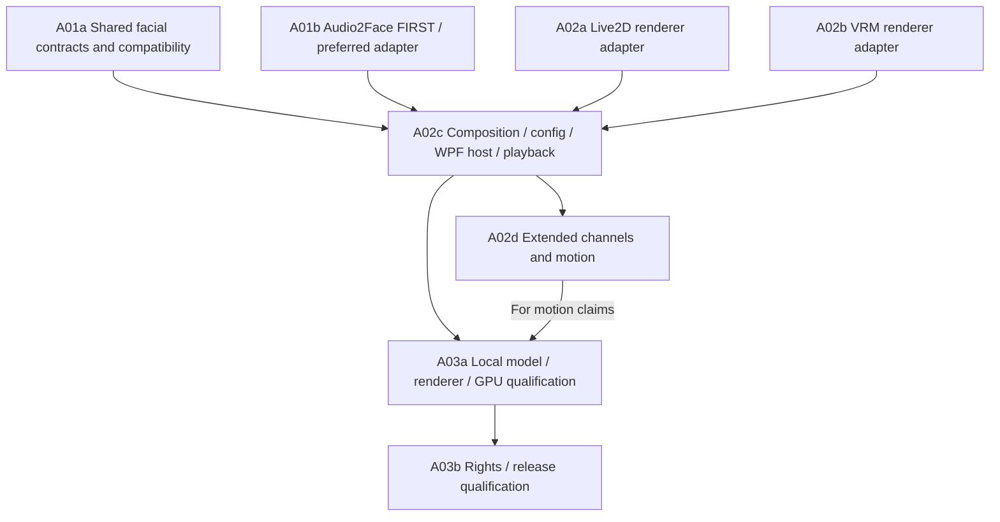

# Avatar guide: Live2D, VRM and speech animation

**Default character shipped, 2026-09-28.** Official builds bundle the Live2D
Cubism runtime and the Hiyori sample model. **Show character** on the main window
opens her as a transparent desktop overlay: authored idle motions, eye blink,
breathing, physics, cursor look-at and lip-sync. Automatic lip-sync uses a local
Audio2Face service when one is running on the PC, else a paired Martlet host that
runs Audio2Face on its NVIDIA GPU (host role installed with [`martlet-host add audio2face`](../deploy/host/README.md)),
else the loudness of Martlet's own voice; no microphone or upload is used. Users can switch
to their own Live2D `.model3.json` or VRM `.vrm` model in **Character settings**
and optionally show the character automatically at launch. See the
[Desktop integration guide](../src/Martlet.Avatar.Hosting/README.md) and the
[Live2D module](../src/Martlet.Avatar.Live2D/README.md#bundled-runtime-and-default-character).
The local package producer and current reader are implemented with manifest 3 /
provenance 2 / CycloneDX 1.6; reader support for legacy manifest 1 and manifest
2 / provenance 1 is preserved.

The character is **OFF until the user shows it**. No-avatar voice/text is a
normal supported product path. Live2D's Expandable Application review (required
because users can load their own models) has been applied for by the owner; a
public release bundling Live2D waits for that approval.

## 1. Choose a renderer, analyzer and feature owners separately

A renderer draws a model. An analyzer derives animation from speech. A mapping
converts that output into parameters the particular model actually has.
Motion sources supply other behavior. Selecting one does not select all four.

**Default preset:** the bundled Hiyori Live2D character with **Automatic**
lip-sync: a local Audio2Face service is used whenever one is running (NVIDIA GPU),
and voice loudness otherwise, so it works on every machine. **Richest preset:**
Audio2Face plus a detailed VRM face with an authored, calibrated ARKit mapping.
Neither an arbitrary `.vrm` nor a Cubism model is guaranteed to have ARKit shapes.
Audio2Face produces facial animation, not whole-body gestures. The status line
reports which lip-sync source is active and why Audio2Face is unavailable; voice
never waits for animation and Martlet never switches to another model or a
paid/cloud service.

| Choice | Role and constraints |
| --- | --- |
| Live2D | Cubism model parameters, motions and physics. Lip-sync groups identify parameters, not a universal viseme rig. Model-specific ranges and mouth/expression mapping are required. |
| VRM | Humanoid model, expressions, look-at and spring-bone capabilities depend on the actual model/version. Basic `aa`, `ih`, `ou`, `ee`, `oh`, blink/emotion expressions are all optional. Detailed ARKit shapes/custom expressions must be authored and mapped. |
| Audio2Face | Preferred speech-to-face source. First lane: explicitly user-provisioned, already-running literal-loopback Audio2Face-3D NIM v2 service and official bidirectional `ProcessAudioStream` gRPC contract (v2 reuses `nvidia_ace` v1.2). Not a native SDK bridge or bundled NIM installation. |
| Amplitude | **Implemented** loudness lip-sync: mouth opening from the RMS of outgoing generated PCM in 20 ms windows, presented on the playback device clock. Less articulation than phonemes/visemes; drives the model's `LipSync` group (Live2D) or `aa` expression (VRM). Local only; the Automatic mode's fallback and the explicit `Loudness` mode. |
| Procedural/clip motion | Live2D: authored idle motions, eye blink, breathing, physics, pose and cursor look-at through the official Framework. VRM: relaxed arms, breathing, blink, head look-at and spring bones. Not inferred from Audio2Face availability. |

Primary-source constraints are recorded in [Research S42-S47](RESEARCH.md#s42);
[Architecture](ARCHITECTURE.md#avatar-boundaries-accepted-direction-2026-09-23)
owns the system boundaries.

## 2. Current slice versus the complete product

| Deliverable | Current scope / evidence limit |
| --- | --- |
| Shared contracts, A01a | Implemented standalone [Martlet.Avatars contracts](../contracts/avatars/README.md), locally integrated/reviewed with production-path checks. Strict v1 facial frames use Core correlation IDs, epoch/sequence and **original PCM** sample rate/offset; exact 52-name ARKit catalog plus separate typed semantic vowels/blinks/emotions. `aa` is not an ARKit name. No skeleton or general pose/body wire payload. |
| Audio2Face, A01b | Implemented [NIM gRPC adapter](../src/Martlet.Avatar.Audio2Face/README.md) through bounded nonblocking live `GeneratedSpeechStream`. **Automatic (default)**: Desktop TCP-probes the configured loopback endpoint before each sentence, then a paired Martlet host's [gateway relay](../deploy/host/README.md) (pinned TLS, signed chunked requests), and uses the saved or built-in mouth mapping, falling back to loudness. Actual HTTP/2 fixtures and an end-to-end gateway test establish protocol behavior, not live NVIDIA inference. Speech never waits for analysis. Requires a NIM service (user-run locally, or installed on a Martlet host as the `audio2face` role: this PC via Docker Desktop, or another computer over SSH with Docker or native Ubuntu, from Martlet > **Martlet hosts**), permitted models and a supported NVIDIA GPU. SDK MIT does not license NIM or weights. |
| Live2D, A02a | Implemented [renderer adapter and animator](../src/Martlet.Avatar.Live2D/README.md) on official Cubism Web Framework 5-r.4 and Core **05.01.0000**, downloaded at build time from Live2D (SHA-256 pinned) and bundled with the Hiyori sample. Idle motions, eye blink, breathing, physics, pose, look-at and loudness lip-sync run; composed A2F writes apply before physics. Real Core/GPU rendering of Hiyori verified locally in browser and WebView2 overlay. Cubism 5.3 blend/offscreen features and unsupported MOC versions are rejected. |
| VRM, A02b | Implemented/reviewed standalone [VRM importer/facial mapping/renderer adapter](../src/Martlet.Avatar.Vrm/README.md): Three.js 0.180.0 + three-vrm 3.5.5, conservative local self-contained VRM 1 subset. VRM 0, unsupported extensions, non-PNG textures, sparse accessors and embedded animations are rejected. Trusted local gaze/head controls are separate from A2F facial frames. Real-loader/control and bundle checks exist; review corrections are cleared. Actual graphics/artist-rig/device-sync qualification is NOT RUN. VRMA/body playback is **unsupported in the first slice**. |
| Composition/app integration, A02c | Main-window **Show character**, simple character settings (built-in/custom model, lip-sync mode, auto-show), atomic avatar-only sidecar and private WPF/WebView2 renderer host. Automatic lip-sync tees admitted generated PCM into loudness levels and, when detected, Audio2Face; explicit Audio2Face-only activation replaces both for the session. Local package producer/current-reader integration is implemented. |
| Rich motion, A02d | Planned capability/wire extensions and procedural/clip integration for head, body, gaze and secondary motion. A facial gaze mapping may consume actual ARKit eye-look channels; that does not create general gaze/pose support. |
| Qualification, A03 | Planned local real-model/renderer/GPU/device trials, performance and lifecycle evidence; separately reviewed rights/release. No end-to-end avatar acceptance is passed by this guide. |

The [contracts guide](../contracts/avatars/README.md) owns exact APIs/schema.
This user guide does not invent competing payload fields,
numerical import limits or settings versions. The current foundation supports
explicit per-aspect source selection and validated scalar mappings, **not**
arbitrary blending. The broader composition requirements below remain work
to deliver, not permission to silently reduce the product scope.

### Desktop controls

**Show character** / **Hide character** on the main window toggles the saved
character (Hiyori when nothing is configured; no Setup profile is required).
**Character settings** chooses the built-in character or a local model file,
the lip-sync mode (Automatic, voice loudness only, or Audio2Face only) and
whether the character shows automatically at launch. Settings are saved in the
avatar-only sidecar; opening Setup temporarily hides the character and restores
it afterwards.

The **Advanced** section holds the Audio2Face endpoint used by Automatic mode and
the Audio2Face-only lane: inspect actual targets, use the mapping helper and
editable shared-configuration JSON, validate compatibility and save (Automatic
mode also uses a saved mapping for the same model). It is **not a graphical
automatic-rig wizard**. Only Audio2Face mouth and expression aspects can
activate; gaze/head/body A2F composition and arbitrary blends are unsupported.
Audio2Face-only activation replaces loudness lip-sync for the session. **Armed,
awaiting generated speech** is not a verified runtime. **STOP**/Escape, relevant
edits, session lock and app exit revoke it; restarting never restores it. Hiding
the character does not stop voice.

## 3. Per-model capability and mapping checklist

Before offering an enabled preset, inspect the selected local model and bind
its capability record to an immutable asset identity, renderer/version and
mapping revision. Keep unknown facts unknown until inspected.

| Model fact | Required check and remedy |
| --- | --- |
| Identity and rights | Record author/source, model/texture/motion licenses, allowed use and import identity. Unclear rights/access blocks the affected use; user-supplied files are not automatically unrestricted. |
| Live2D rig | Inspect `.model3.json` references, lip-sync/blink groups, actual parameter IDs, minima/maxima/defaults, motions and physics. Author/calibrate missing mappings; reject nonexistent parameters. Never infer capability from a conventional parameter name alone. |
| VRM rig | Check supported VRM version, actual expression/morph bindings, binary versus continuous expressions, humanoid/look-at/spring-bone presence and expression overrides. Optional presets may be absent. Unsupported versions/features are visible, not silently stripped. |
| Detailed face | Compare every requested Audio2Face coefficient to an authored target. Record covered/omitted channels, ranges, neutral values and calibration. A reduced mouth mapping cannot be described as full ARKit fidelity. |
| Coupled controls | List every parameter/bone affected by an expression, clip or physics source. VRM `overrideMouth`, `overrideBlink` and `overrideLookAt` and Cubism motion/physics writes must be reflected in ownership. |
| Safety and cost | Enforce exact versioned import limits: archive/file bytes, expanded size/count/depth, decoded textures, geometry/parameters, motion duration and frame/queue budgets. Reject unsafe input before activation; do not guess GPU fit from file size. |

Mappings are bounded declarative data, not scripts. Calibrate neutral pose,
gain/range, smoothing and clipping with consented sample speech and a visible
preview. Replacing bytes at the same path invalidates the old capability and
mapping evidence. Saving a mapping is not evidence of rendering quality or
runtime readiness.

## 4. Feature ownership and deliberate partial combinations

| Aspect | Example owner | Conflict to prevent |
| --- | --- | --- |
| Mouth | Audio2Face, amplitude, supported provider visemes or later analyzer | Two sources opening the same mouth; expression or clip also writes jaw/lips |
| Non-mouth expression | A2F facial channels or authored emotion/blink controller | Two eyelid/brow writers; a supposedly non-mouth expression also deforms lips |
| Gaze | Mapped eye-look facial channels, later look-at or clip source | Eye expressions, eye bones and a clip independently drive the same gaze |
| Head | Later procedural or authored motion | Clip and procedural controller fight over neck/head transforms |
| Body | Later VRM humanoid/VRMA or authored Live2D motion | Two pose/parameter writers; pretending A2F generates body gestures |
| Secondary motion | Model-supported spring bones/Cubism physics | Multiple simulations or clips write the same affected target |

Default to a **single writer per conflicting channel and underlying target**.
Users may deliberately keep only selected aspects: for example A2F mouth,
authored blink and body-only idle with all clip mouth/face writes disabled.
The preview must list active sources, masks, omitted aspects, reduced mappings
and exact conflicts before activation. First-slice scalar ownership selection
is not general blending; later blends require explicit supported masks,
deterministic priorities and tested range/composition rules. Never resolve a
conflict by last callback wins, unchecked addition or a silent source switch.

An advanced resolver can disable conflicting aspects or select a **known**
alternate source/mapping with explicit approval. It cannot manufacture a
missing rig channel, reinterpret malformed schema, approve an unsafe asset,
override licensing/access, supply a missing runtime/GPU, or turn an unknown
measurement into a pass.

## 5. Permutations: works in principle is not verified working

**Compatible** describes a supported structural combination, not a witnessed
Martlet run. **Requires mapping / degraded** means a known reduction or mapping
step. **Blocked / unsupported** means a known missing requirement or absent
implementation. **Unknown / unqualified** means insufficient evidence, not
proof of incompatibility. In the contract these are represented by
`Supported`, `RequiresMapping`, `Reduced`, `Unsupported`, `Unknown` separately
from `RuntimeReadiness`. Record readiness and performance independently.

| Selection | Compatibility disposition | Concrete remedy / qualification |
| --- | --- | --- |
| Audio2Face + detailed authored VRM face | Compatible with a validated exact mapping; otherwise requires mapping | Author/calibrate target shapes and channels; verify NIM access/readiness and actual renderer/GPU playback. Richest intended face, not yet verified here. |
| Audio2Face + VRM with basic vowel expressions only | Requires mapping / degraded | Explicitly map a limited mouth subset, report omitted face detail; choose a richer authored rig for full output. Missing vowels remain unsupported. |
| Audio2Face + Live2D with approved mouth/face parameters | Requires mapping / degraded | Approve per-model reduction and masks; retain only expressible channels. Do not claim generic Cubism ARKit support. |
| Amplitude + existing Live2D mouth or VRM mouth expression | Implemented default (loudness lip-sync) | Uses the model's `LipSync` group / `ParamMouthOpenY` (Live2D) or `aa` (VRM); no viseme or detailed-emotion quality claim. |
| Audio2Face + amplitude both owning mouth | Arbitrated | Automatic mode sends both; renderers apply loudness only while no Audio2Face frame arrived in the last 250 ms. Explicit Audio2Face-only activation stops loudness. |
| Audio2Face mouth + idle non-mouth/pose | Compatible in principle only with disjoint actual targets | Mask clip/expression mouth writes and respect rig overrides. First-slice facial parts only; pose/body integration remains planned. |
| VRMA + capable VRM | Format-compatible; first-slice playback unsupported | Implement A02d/version-aware retargeting, masks and local motion qualification before enabling. |
| VRMA directly + Live2D | Unsupported | Use an authored Cubism motion or implement and qualify an explicit conversion/mapping; selecting a resolver cannot make skeletal data into Live2D motion. |
| Full A2F face requested on model lacking shapes | Unsupported for missing aspects | Author rig/mapping, select a suitable model, or explicitly omit those aspects and label reduced output. |
| Compatible A2F rig, missing NIM/GPU/model/access | Structurally compatible but readiness blocked/unknown | Automatic mode reports "No Audio2Face service" and uses loudness; the user may provision a service (see the Desktop guide). Audio2Face-only mode shows the segment as unavailable. |
| Arbitrary model/version/backend or untested combination | Unknown / unqualified | Inspect capability/schema and run exact permitted local checks; label verified/unsupported only when evidence supports it. |
| Scripted/remote-reference/oversized asset or invalid frame schema | Blocked safety/schema failure | Obtain a valid bounded local asset/frame; no advanced override. |
| Disabled/missing/crashed avatar | No-avatar voice remains independent | Show animation unavailable/off, preserve conversation settings; independent restart never replays canceled speech. |

Later candidates are not promises of currently implemented options:

| Candidate | Intended lane and restrictions |
| --- | --- |
| Live2D MotionSync | Later Live2D-specific viseme candidate; authored viseme shapes plus separate MotionSync Core/framework/runtime/terms qualification. Verified Unity plugin is not proof of a ready Web integration; do not add Unity for this candidate. Not the same as amplitude lip sync. |
| `wawa-lipsync` | Later CPU/web-audio candidate for a selected browser host; model mapping and Martlet playback-clock integration required. Do not add a second audible playback path. |
| `uLipSync` | Conditional Unity-only candidate with per-character calibration/runtime or prebake. Do not introduce Unity into WPF merely to list this option. |
| Rhubarb Lip Sync | Buffered/offline mouth-cue candidate; not presumed streaming realtime analysis. |
| Provider visemes | Only a named, explicitly implemented provider/model/format with timestamp support; generic TTS audio availability does not imply visemes. |

## 6. Playback, failure and comparison behavior

Analyze only authorized outgoing speech PCM, never implicitly activate the
microphone. Analysis may run ahead within bounded queues; animation presentation
must follow **timestamped actual playback progress**. Preserve original sample
offsets through resampling and analyzer seconds-to-samples conversion. Queued
PCM, TTS receipt and wall-clock time are not evidence of audible progress.
Pause/underrun freezes speech progression; absent reliable progress is unknown,
not permission to animate ahead.

**Integration checkpoint, 2026-09-23:** opt-in `IPlaybackClockDevice` now exposes
native WASAPI clock observations, and `PlaybackRun.DeviceClock` supplies clock
state and a nullable original-PCM sample offset. The existing audio
`PlaybackSnapshot.DeviceConsumedSamples` is derived from committed samples
minus device padding; `AudibleSamples` remains null. These legacy counters
are not the presentation clock. Clock/tee code is locally integrated with
controlled checks. The known zero-padding plus queued-refill defect is corrected:
clock validity is revoked before refilling an emptied running endpoint, even
when more PCM is already queued. Its regression and review are complete,
not native-device qualification. The normal app now consumes these clock and
PCM-observation boundaries; actual device/physical synchronization remains
unqualified. An unknown, stale or invalid clock makes the segment unavailable.
Underrun, including queued refill, freezes that segment's animation even if
voice resumes; only a fresh segment establishes a new clock/identity binding.
Unavailable/invalidated clock state must disable synchronized
animation, never substitute queue counters. A native clock still does not
prove physical audibility; device/listening qualification remains separate.

The Audio2Face adapter now implements bounded nonblocking live ingress;
buffered `GeneratedSpeechClip` remains a comparison/offline path, not the
normal live path. Concurrent input/output is exercised with actual HTTP/2
fixtures; that evidence is not actual device playback or NVIDIA inference.
The normal app attaches its bounded tee only after generated PCM admission and
wires it to the explicitly activated analyzer. Speech never waits for analyzer initialization, buffering,
completion, backpressure or renderer readiness. If animation cannot keep up,
report/drop obsolete animation or stop that optional path within its bounds;
do not delay speech, grow an unbounded buffer or replay late facial motion.

Stop, turn replacement, output loss or avatar disable invalidates the current
epoch and queued speech frames. Discard stale session/turn/request/epoch,
sequence and mapping/model revision output without changing current state;
only trusted Stop/reset/dispose resets speech-owned channels without
overwriting another source's legitimate channels. Late callbacks, stalled
cleanup and renderer restart must never resurrect canceled speech. Report
upstream compute abort separately from local discard.

The renderer host is an independent failure boundary. Bounded IPC/import/frame
streams must reject scripts, remote asset references, traversal/links escaping
the import root, malformed/nonfinite values and oversized/expansion-bomb assets.
Neither an unavailable analyzer nor a crashed renderer may block voice, change
provider credentials or force a session-core restart.

The full comparison experience remains an acceptance target, not a claim that
every analyzer or a dedicated comparison dashboard exists. Comparison presets
must keep conversation provider/model, persona, TTS voice,
sample speech, playback settings and asset identity unchanged when comparing
analyzers/mappings. Renderer comparisons necessarily use different models:
record both identities and the rig difference instead of attributing all
quality change to the analyzer. Configuration changes apply at a fresh safe
boundary; preserve previous settings and disclose selected/omitted features.
Offline replay of consented/licensed PCM avoids regenerating different speech
or incurring unapproved charges. Multi-renderer comparison must not duplicate
audible output or accidentally run additional paid/GPU jobs.

Report mapping coverage, visible artifacts, audio-to-animation offset,
frame drops, queue peaks, Stop/stale-frame outcomes, CPU/private RAM and GPU/
VRAM with exact versions, hardware, duration and sample count. Separate
compatibility, readiness, measured performance and perceived quality. Missing
measurements are **NOT RUN / unknown**, never zero latency or zero cost.

## 7. Dependency-aware delivery

A01a/A01b start early; Live2D and VRM develop in parallel against coordinated
interfaces. First-wave fixtures do not depend on licensed model/GPU access.
A02c now wires the locally integrated contracts/adapters and opt-in
clock/nonblocking PCM handoff into the normal internal app. Broader composition/
comparison acceptance and runtime qualification remain open. Package evidence
must identify the exact frozen source revision it covers.
A02d extends channels without claiming the v1 face frame carries
poses. A03a qualifies each advertised subset; facial-only trials need not wait
for body implementation, but full-motion claims do. Rights research may run
throughout; A03b release approval remains separate from development.

App/configuration and package producer/consumer owners coordinate shared boundaries.
Do not collide with installation/reconciliation settings lineage or introduce
a competing global `AppSettings` schema or authority. The coordinator approved
**one authoritative avatar-only sidecar**: a single atomic outer envelope
containing shared `AvatarConfiguration`, profile binding, resource identities
and runtime references, not a second unsynchronized paths file or global
settings version. `AvatarProfileStore` implements profile-bound, revision-checked
atomic `avatar.json` persistence under the existing data directory. The Avatar
window supplies local export and explicit restore, retaining prior bytes in
a unique `.bak`, clearing inspection binding and never granting activation.
The integration owner retains validation/recovery/deletion ownership.
Disable preserves saved preferences
but revokes activation; no activation permission is persisted. Existing global
backup/restore excludes the sidecar with visible disclosure until that lifecycle
integration is qualified. This feature-local recovery is not inclusion in
global backup, installer/update lifecycle qualification or release readiness.

The [local packaging pipeline](../packaging/windows/README.md) and
[current update reader](../src/Martlet.Updates/README.md#avatar-payload-schema-3)
now coordinate manifest 3 / provenance 2 / CycloneDX 1.6, including the real
Desktop, Doctor and private renderer contexts and browser evidence. The reader
retains legacy manifest 1 and manifest 2 / provenance 1 paths without rewriting
their history; older readers reject manifest 3. Actual self-contained payload,
three-document consumer conformance and repeated local package assertions have
passed for specific frozen builds. Those receipts do not transfer to a changed
source tree: every candidate requires its own frozen-source build and checks.
No published installer, signed release, native/model/GPU qualification or
executable update/rollback readiness follows from this metadata compatibility.

G2 voice reliability and G5 avatar release remain
intact; neither G2 nor G4 blocks independent avatar development. All execution
and review are local. [Delivery](DELIVERY.md#m5-optional-avatar) owns
A01-A03, AC-17 and new AC-27-AC-32; AC-18-AC-26 retain existing meanings.
