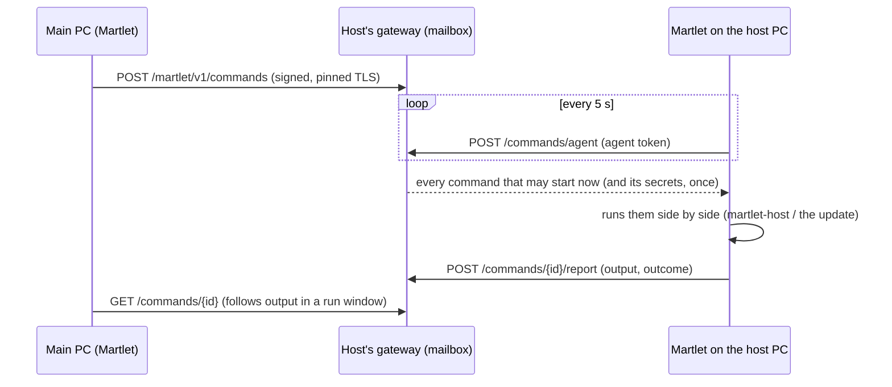

# One Martlet on all your computers

Martlet is **one app that lives on all your computers**. Install it on another
PC and it is the same Martlet: the same companion with the same personality,
settings, memories, people, voices and characters, the same Home Assistant and
the same API keys. Each computer is either a **companion PC** (where you talk
to Martlet) or a **host PC** (it lends its graphics card), and you can switch a
computer between the two in one click, on that computer or from any other
([Switching another computer](#switching-another-computer-between-companion-and-host)). Adding a host to your
[Martlet network](NETWORK.md) adds what it can do (thinking, listening,
speaking, lip-sync, Home Assistant, keeping everyone's logs) to the whole app; jobs move
between hosts on the spot and fail over when a host stops answering.

What differs from one computer to the next is only what belongs to that
computer itself: its microphone, speakers and cameras, its screens (where the
character and its speech bubble sit), whether it is a companion or a host PC,
how it starts, what it installed (Ollama models, Parakeet, a whisper package,
Windows voices, MCP servers, the terminal it may use) and its own security
choices. See
[What stays with each computer](#what-stays-with-each-computer).

Everything travels through your paired hosts: each keeps a private copy and
hands it only to your paired computers over their pinned, signed connection.
Hosts never talk to each other, so desktops carry changes between them. It is
**on by default**; one switch, **Devices > Settings for all devices > Keep
Martlet the same on all my computers**, turns all of it off (each computer then
keeps its own choices and memories, and a change made meanwhile is shared, with
its time, when you turn it on again). Failover stays a per-job **Fail over to
another host** choice.

| The same on every computer | How it travels | Details |
| --- | --- | --- |
| Who does each job (thinking, listening, speaking, lip-sync) | The cluster plan | [Model](#model) |
| How Martlet thinks, listens and speaks with the API keys, the Thinking fallback, the personality, replies, prompts, memory on or off, lorebooks, the character and its emotes and motions, how you talk, speech bubbles and subtitles, the theme, recognizing voices, Voice ID, what Martlet may do with Home Assistant, app updates | Shared settings | [One Martlet on every computer](#one-martlet-on-every-computer) |
| What Martlet remembers | Shared memories | [MEMORY](MEMORY.md#one-memory-on-every-computer) |
| The people and voices Martlet recognizes | The shared voice list | [The shared voice list](#the-shared-voice-list) |
| The voices Martlet speaks with and their recordings | Shared speaking voices | [The shared speaking voices](#the-shared-speaking-voices) |
| Your characters (Live2D and VRM models) | Shared character models | [The shared character models](#the-shared-character-models) |
| The Home Assistant connection | Shared Home Assistant | [The shared Home Assistant connection](#the-shared-home-assistant-connection) |
| Which computers belong, API keys for other apps, commands between computers, logs | Always on: the [network](NETWORK.md), [API keys](API.md), [commands](#commands-between-your-computers), [shared logs](DIAGNOSTICS.md#diagnostics-page-and-shared-logs) | Security and diagnostics, not settings |

## Model

- **Nodes** are your paired Martlet hosts (each runs the gateway) and the
  companion desktops that use them. Desktops are the only consumers of the
  jobs; hosts run the roles (Ollama, whisper, F5, Audio2Face).
- The shared configuration is the **cluster plan** (`Martlet.Core.Cluster`):
  - one entry per **job** (`thinking`, `listening`, `speaking`, `lip-sync`):
    the host in charge, or no host (the job's
    [shared route](#one-martlet-on-every-computer), or this PC for lip-sync),
    or nobody (lip-sync by voice loudness); whether it
    **fails over**; and `moved_from`, the host a failover moved it away from;
  - one entry per **host**: its address and the roles (with models) it was
    last seen running, or a `removed` tombstone after you forget it.
  - the `logs` entry, left by desktops older than
    [shared logs](DIAGNOSTICS.md#diagnostics-page-and-shared-logs): the single
    host they send every computer's logs to. Newer desktops share logs with every
    host and never set or use it; it is not a role and never moves or fails over.
- Every entry is a last-writer-wins register stamped with a hybrid revision,
  `max(newest revision known + 1, current Unix milliseconds)`, and the writer's
  device ID. Merging keeps, per job and per host, the entry with the highest
  (revision, writer, content). The merge is commutative, associative and
  idempotent, so every copy converges whatever order changes arrive in; a
  computer with a fast clock cannot make later changes lose.
- The plan holds no secrets or conversation data: host IDs, HTTPS origins,
  model names, flags and stamps only. JSON, snake case, schema 1, at most
  16 KiB, 8 jobs and 32 hosts; unknown fields and newer schemas are rejected.- **Background work across computers** is the speaking computer's own choice,
  not a job in the plan. Companion › Thinking pool may think on several paired
  computers at once (each one with a Thinking model joins by itself: its
  Thinking pool role, or its Ollama when that doesn't do this PC's Thinking;
  unticking *In the Thinking pool* keeps one out; `thinking-pool.json` on that
  PC, never shared). The computer you talk to keeps answering; each background think goes
  to a free one of those computers, the one sharing least with the conversation
  first (one doing none of its jobs before one that also speaks, before the
  computer doing Thinking), so with four computers one speaks and three think
  about three things at once. A member whose computer stops answering (the
  device sync check, or a pool job that can't reach it) gets no new work, and
  its slots leave the pool until it answers again; work waiting in line then
  starts there ([Computers that go
  offline](CONVERSATION.md#computers-that-go-offline)). Each result comes back to the speaking computer
  and is brought into its conversation as usual. Other kinds of background work
  use the same placement (`BackgroundPlaces`; see [Background job
  API](CONVERSATION.md#background-job-api-for-new-kinds-of-background-work)).
  The talk window, `background-jobs.json` and the desktop log name the computer
  each job runs on.

## Where copies live and how they sync

| Copy | Location | Written by |
| --- | --- | --- |
| Each host | `cluster.json` beside `host.json` (0600, gateway service owner). Not part of the approved configuration, so role changes never need re-approval | The gateway, when a paired desktop merges into it |
| Each desktop | `cluster.json` in Martlet's data folder; the on/off choice in `cluster-sync.txt` (missing means on; only `off` turns sync off) | Martlet |

The gateway serves `GET /martlet/v1/cluster` (its copy) and
`POST /martlet/v1/cluster` (merge a copy in, return the merged result) to any
paired device over its pinned, signed connection. The host never acts on the
plan. Hosts do not talk to each other: desktops carry changes between them,
so no new host-to-host trust exists. Since the desktops are the only users of
the jobs, a job never needs to move while no desktop runs. Which desktops a
host trusts at all is the [Martlet network](NETWORK.md): pair a host once and
every member desktop pairs with it by itself.

While sync is on, every 15 seconds (and right after any change or **Check
hosts**) the desktop:

1. notices jobs changed elsewhere in Martlet (for example in Setup) and
   records them as its newest choice;
2. checks every paired host: its routes and its copy of the plan;
3. merges every copy into its own and adds any job nobody has recorded yet
   from what this PC does now, when that is a real choice (a host does it, or
   lip-sync is off). A computer that just joined never records Martlet's
   defaults, so they can't override what your other computers chose when the
   plan reaches it a check later (before this, a new PC's default *Setup
   choice* could replace the host your computers used);
4. records the roles each reachable host runs;
5. applies failover (below);
6. follows the plan: each job moves to the planned host with this PC's own
   pairing, or back to the job's shared route (or, when this PC can't use it
   yet, its own saved Setup choice); an open conversation window reloads when
   idle;
7. merges its copy into every reachable host whose copy differs.

Changes made on this PC (the Devices page, Setup, forgetting a host, failover
choices) are recorded immediately, even while sync is off, so turning sync on
later keeps whichever change is actually newest. The same holds for computers
updated from a version where sync was off by default: on their first check
they adopt the newest change from any computer.

A PC set up as a host (*Use as a Martlet host*) uses no jobs, so it only takes
steps 2, 3 and 7: it receives the plan (so it shows who does what) and passes it
on. It never fails over or follows a job, and records only a job that was set up
to run on it (below). Its Devices
map draws each job where the plan puts it for your companion PCs (on the host
that does it, on the cloud service of the shared route, or on the companion
PCs for a route that runs on each of them), so it shows the same picture as
your main PC rather than the Setup choice it kept from before it became a host.
Before this, a
host PC skipped the sync entirely.

### The computer a job was set up on does it

Martlet is one app: a job set up on one computer is done by that computer for
all of them, whether it is a companion or a host PC, so a computer you make the
companion later (or one you just added) uses it rather than needing its own
copy. **Thinking with Ollama on this PC** on a computer that runs a host service
of its own (paired here, or a host PC's own) counts as that computer doing
Thinking through its host service: the plan names its host (*diva-host*), every
other computer follows it like any host, and the computer itself keeps
talking to its own Ollama directly, so its replies never take the extra hop.

- Choosing *This PC* for Thinking on such a computer records it at once.
- A setup made before this (the shared `thinking` route is Ollama on the
  computer itself, chosen on that computer, while the plan leaves Thinking to
  each computer's own choice) is taken on by that computer on its next check,
  as a companion or a host PC. A plan entry newer than its last look at the
  shared settings waits a check, so a change made elsewhere (a cloud provider,
  say) is seen first and wins.
- Its host service needs the Ollama role for the others to use it. Until then
  they keep what they use now and their Companion › Thinking says why; the
  computer's own Devices row says to add Ollama to its host service, and a host
  PC's Home puts **Add Ollama** first under *Add roles* (*Your computers use this
  PC for thinking, so add Ollama here*). Its model can differ from the
  computer's own Ollama model.
- Companion › Thinking, Voice and Listening on a computer that hasn't followed
  yet show *Another of your computers* and the network's host (*Your Martlet
  network does thinking on diva-host, as chosen on desktop-diva. This PC
  switches to it as soon as it can: pair diva-host with this PC first.*),
  not Martlet's default *This PC*.
- Listening and Speaking on *This PC* can already run through the computer's
  own host service, and then the plan names it the same way. A Windows voice,
  Parakeet or whisper inside Martlet runs on each companion PC.

## Sharing work between your computers

The plan gives each job one computer, but a computer runs one voice, one
Thinking reply and one transcription at a time: its gateway turns a second
request away at once (`job.busy`). Before this, a companion PC whose voice
computer was busy speaking for another companion PC lost that sentence.
**Devices › Sharing work** decides what happens instead, and is the same on
all your computers (`work-sharing.json`, the `work-sharing` shared setting).

Each request goes through Martlet's queue (`WorkQueue`, `Martlet.Core.Cluster`):

1. It goes to the first computer in its order. While that computer is free
   nothing changes: no extra request, no added latency.
2. A computer that is busy, or doesn't answer, or no longer runs the engine, is
   passed over for the next in order at once.
3. When every one is busy, the request waits in line and tries them again in
   order every 100 ms and whenever one of this PC's own requests finishes, so
   whichever computer frees first takes it (up to the request's deadline).
4. A computer this PC already has a request running on goes last for its next
   one, saving a round trip it would only refuse.
5. The live turn goes first (`WorkPriority`). A background request (remembering
   or naming on the conversation's own model, a Thinking pool job on a host's
   Ollama role) waits while a live request of its job waits, and a live request
   that finds a computer busy with this PC's own background request stops that
   request (`WorkPreemptedException`, which its caller treats as "go on later")
   and takes the computer as soon as it is free. A host that keeps its graphics
   card for a live turn refuses background work with `job.busy` and detail
   `live`, or stops it with `job.preempted`: that is `WorkRefusal.Preempted`,
   never a failure ([live floor](CONVERSATION.md#the-live-floor-the-live-turn-comes-first)).

The order (`WorkSharing.Order`) is deterministic and costs nothing: the paired
computers the shared plan says run the job's engine (the same voice engine
for Speaking; the same model for Thinking), from this PC's files. Without
choices it is the computer the job uses now, then this PC's own host service,
then the others, fewest plan jobs first. Per job you can:

| Choice | Effect |
| --- | --- |
| *Use another computer when this one is busy* | On for Speaking and Listening. Off for Thinking: another computer's model starts your conversation without its prompt cache (a later first word) and pushes that computer's own conversation out of its cache, so a reply waits for its own computer unless you turn it on |
| *Each companion PC tries its own computer first* | Puts `this-pc` first: every companion PC uses its own host service first, with no network hop |
| **Up** / **Down** | Sets the order every companion PC tries the computers in |
| *Use* (untick) | That computer never does this job, even when the plan names it (unless no other can) |

And per computer, *Keep a computer for one companion PC* (**Every companion
PC** or **Only** one): no other companion PC sends it work, whatever their
order. Deep thinking keeps its own places (Companion › Thinking pool), but a
computer unticked for it or kept for another companion PC can't run a think
from this PC.

For the four computers in the example (machines 1 and 3 companions with
Chatterbox, machine 2 a companion without a voice, machine 4 for lip-sync and
pictures) with *own computer first* on: machine 1 speaks on its own Chatterbox,
machine 3 on its own, and machine 2 on machine 1, or machine 3 when machine 1
is busy, or whichever of the two finishes first when both are. Keeping machine
3 for itself leaves machine 2 only machine 1.

Lip-sync, singing and pictures are not shared yet: each stays on its one
computer. Thinking with Ollama on a companion PC itself talks to that Ollama
directly, so the queue can't see those replies; Ollama queues them. The
Devices card's status line (`WorkSharingStatus`) and the desktop log
(`Sharing work: Speaking went to m3-host (1 busy) after 240 ms.`) say when a
request went elsewhere. **Qualification:** the planner, queue, settings and
Devices card are checked locally (`WorkSharingTests`,
`WorkSharingRosterTests`, MCP `work_sharing_status`, `work_sharing_check` and
the Devices card through `-Desktop`); requests between real hosts are **NOT
RUN**.

**Recommended setup.** Home's recommended setup for all your computers plans
who does each job, the Speaking and Listening pools above and the Thinking
pool from the hardware of every computer. It keeps companion PCs light and
never adds conversation latency. See
[Recommended setup for all your computers](RECOMMENDED_SETUPS.md#recommended-setup-for-all-your-computers).

### Live turn first on a shared graphics card

A host's live work (replies, voices, listening, lip-sync, reading) and its
Thinking pool work (the Deep thinking role's own Ollama) can share one graphics
card, and then each runs slower: a Chatterbox token takes about 11 ms alone and
about 30 ms beside another program on an RTX 4070. Windows has no priority
between programs on one card, so the host's gateway keeps it
([GPU priority](../src/Martlet.Gateway/README.md#gpu-priority-live-turn-first)):

- Each route advertises the cards it runs on (`gpus`; empty means unknown, the
  whole host) and its lane (`pool` for Deep thinking, `live` for the rest).
- While a live request runs on a card, or a companion PC holds it for a live
  turn (`ILiveGpuHold`, `HostLiveGpuHold`: hold for 10 s, renew every 5 s,
  release at the end), a new think there is turned away (`job.busy`, detail
  `live`) and a running one stops at once (`job.preempted`). The Thinking pool
  then runs it on another computer or later. Live requests never wait for pool
  work or holds.
- Pool work on a card of its own keeps running. On a host with two or more
  NVIDIA cards, pin each Ollama server to its own GPU (CUDA_VISIBLE_DEVICES):
  add the Deep thinking role again and choose a card that no live role uses.
  `martlet-host status`, the host log and `GET /martlet/v1/priority` say when
  Deep thinking shares a card with live roles.

**Qualification:** the gateway's arbitration, holds and wire format are checked
locally (`GpuPriorityTests`, MCP `gpu_priority_selftest` with fixture Ollama
servers on loopback); a real GPU, a real Ollama stopping mid-token and a host
with two or more cards are **NOT RUN**.

## Failover

With failover on for a job, when its host misses two consecutive checks
(about 30 seconds) the desktop moves the job to another paired host that
answered and advertises the job's route (the role is installed and its model
ready). Candidates are ranked by fewest other jobs, then most GPU memory
(from the host's hardware report), then host ID, so desktops that see the same
hosts pick the same one. The move is stamped with `moved_from` and shared; the
row says where it came from.

## When a computer goes away or comes back

Device sync's check of every paired host (every 15 seconds while *Keep Martlet
the same on all my computers* is on) and Thinking pool jobs feed one record of
which computers answer now (`HostPresence` in the desktop). It marks a host
offline at the first failed check, so the Thinking pool reacts at once. The
notices on a companion PC's Home add patience on top of it
(`PresenceWatch` in `Martlet.Core.Cluster`):

1. A computer that misses one check and then answers says nothing.
2. A computer that stays silent for 30 seconds (two checks) is **missing**.
   Home shows a warning, *Working with less: gpu-box isn't answering*, with
   what it did for you, from the shared plan: the jobs a failover moved
   ("Martlet moved Speaking to desk-host."), the jobs that stay with it until it
   is back, the pools it was in (Speaking pool, Listening pool, Thinking pool)
   and whether they go on with your other computers, and roles no other
   computer runs. The item ID is `presence-missing-<hostId>`. The Devices map
   row says *Not answering for N min*.
3. A computer still missing after the time chosen in **Settings › Your other
   computers** (*Look for a better setup when a computer is away for N
   minutes*: 2 to 60 minutes, 10 by default, kept per PC in
   `node-presence.txt`) has **stayed away**, once per absence.
4. A missing computer that answers again for 30 seconds is **back**. Home shows
   *gpu-box is back* with how long it was away and the jobs that a failover
   moved and that stay where they are. The item ID is `presence-back-<hostId>`.
   You can dismiss it, and it clears by itself after 10 minutes.
5. A computer that flaps (answers again for less than 30 seconds, then goes
   silent again) stays one absence: it is missing once, stays away once and is
   back once, when it answers for 30 seconds.

Each of these is an event for the recommended setup on the companion PC:
`MainWindow.PresenceChanged` (`PresenceChange(HostId, Name, Kind, At)`, where
`Kind` is `WentMissing`, `StayedAway` or `CameBack`), raised on the UI thread
on a companion PC only. `MainWindow.OfflineFor(hostId)` says how long a
computer hasn't answered. This PC's own host service is left out, because Home
has its own item for it. A host PC's Home is the host dashboard and shows none
of these. The desktop writes `node-presence.json` (host IDs, computer names,
states and times, and the notices) when a computer's state changes, for the
`node_presence_status` MCP tool. Nothing here runs on the reply path: a
5-second timer on the UI thread does nothing while every computer answers.

## Edge cases

| Case | Behavior |
| --- | --- |
| No other host runs the engine | The job stays; its row says no other paired host can take over. It never falls back to a cloud provider or this PC's Setup choice by itself |
| Failover off | The job stays; its row on the Devices page says the host is not doing it and offers failover |
| This PC reaches no host at all | No failover: its own network is the likelier problem |
| Host answers but lost the role (removed, model gone) | Counts as not serving the job, like an unreachable host |
| Flapping host | Two consecutive misses are needed; a moved job never moves back by itself (no ping-pong). Choose the original host again to move it back |
| Two desktops fail over at once | Same ranking, so normally the same target; otherwise the newest stamp wins everywhere within a check |
| Change made on another desktop | Followed within a check; the status line names the computer that chose it |
| Planned host not paired with this PC | This PC keeps its current route and its row says to pair that host here; the shared plan is not overwritten. A host of your [Martlet network](NETWORK.md) is paired by itself within a minute, so this lasts only until then |
| Speaking moves to another F5 host | The applied reference voice is reused (same `f5-host` destination), and the new host already holds its recording ([shared speaking voices](#the-shared-speaking-voices)). A desktop without a voice keeps its route and asks you to add one |
| Another computer switches the voice engine on the speaking host | A host runs one voice engine at a time, so the engine Speaking used there stops. Every other computer follows the engine the host runs now on its next check (its own engine choice, `speaking-engine.txt`, follows too) and keeps the voice chosen on all computers, so all of them speak with the same engine. Failover then looks for another host with that engine |
| A role's model changes on a host that does a job (*Change model*, *Change ... settings*) | The host keeps serving the old model until the new one is ready. Then every computer whose job (or Deep thinking) stays on that host saves the route again with the new model on its next check, since a route names its model and the host answers only for the one it serves. Speaking keeps its voice |
| Host model differs | The new route records the model the host advertises; the failover confirmation says the model may differ |
| Host older than cluster sync | Still usable and a failover candidate; it keeps no copy, and the status line suggests **Update host** |
| New host paired | It receives the plan and appears as a node on the next check |
| New computer joins, or one becomes the companion | It follows the plan (the hosts your computers use) once paired; its own defaults are never recorded over it |
| Thinking set up on a companion PC that becomes a host PC | It keeps doing Thinking for your computers through its host service ([above](#the-computer-a-job-was-set-up-on-does-it)); its Home asks for the Ollama role when its host service lacks it |
| Host forgotten here | Its node gets a tombstone; a desktop still paired with it re-adds it |
| Unreadable or malformed copy | A desktop starts empty and a host ignores it; both are restored from the other copies |
| User change racing a check | Checks never follow while a role change runs, and user changes always merge into the newest plan |
| Settings changed during a follow | The save conflicts and nothing changes; the next check retries |
| Newer plan schema | Rejected by older hosts (they keep theirs); update hosts to the desktop's version |

## Qualification

Merge rules, the endpoint (in-process, including signing and rejection) and
failover ranking were checked locally. Multi-host failover on real hosts and
networks is **NOT RUN**.

## One Martlet on every computer

The plan above says *who* does each job. What a job uses when no host does it,
and everything else that makes Martlet the same companion, travels as **shared
settings** through the same paired hosts, so any of your computers can be the
companion (or a host) and Martlet stays familiar on all of them. Before this, a
job nobody's host did used *each desktop's own Setup choice*: a PC switched to
OpenRouter kept OpenRouter, while the other PC, made the companion later, kept
NVIDIA Build and its old key.

| Shared setting | What travels | Stays with each computer |
| --- | --- | --- |
| `thinking`, `listening`, `speaking` | The route a job uses when no paired host does it: provider (OpenAI, OpenRouter, NVIDIA Build or any OpenAI-compatible server, Ollama on the computer itself, Windows speech, Parakeet), model, voice and **the API key** | Host routes and pairings (the plan above); a local whisper package |
| `thinking-fallback` | The *If Thinking fails* endpoint, model and its own key (or none) | |
| `companion` | The personalities (same IDs, so lorebooks stay linked) and which one is used | |
| `replies`, `prompts`, `memory` | Reply settings, edited prompts, memory on or off (the memories themselves travel as [shared memories](MEMORY.md#one-memory-on-every-computer)) | Where memory is stored on this PC |
| `lorebooks` | Every lorebook and the scan settings (up to 1 MiB) | |
| `character` | The character shown: a bundled one, one of [your characters](#the-shared-character-models) by its ID (each computer shows its own copy), or a model file at the same path; its renderer, its Audio2Face mapping, show at start | The overlay's place and zoom; who does lip-sync (the plan) |
| `character-actions` | Every model's emotes and motions (`character-actions.json`): what the Thinking model named them, the owner's tags, voice cues, when to use each and which are on, so a model is named once for all computers | |
| `talk` | Always listening or push-to-talk, pause length, interrupting, spoken replies, letting Thinking hear you, how chatty Martlet is about what it sees and what the PC plays (Martlet decides included; a computer on an older Martlet reads it as Chatty) | Microphone sensitivity, cameras and video addresses, Watch on or off and what it looks at (consent at that screen), echo reduction, hearing what the PC plays |
| `speech-display` | Whether speech bubbles and subtitles show | Where the bubble sits (beside the character or in one place, and its offsets): it depends on this PC's screens |
| `appearance` | The theme | |
| `voice-recognition` | Whether Martlet recognizes the people it hears (Companion › People) | |
| `voice-id` | Voice ID on or off and the owner's voiceprint (numbers only, never audio; Companion › Listening) | |
| `smart-home` | What Martlet may do with Home Assistant: use it when asked, locks, doors and alarms, flexible requests | |
| `updates` | Looking for updates, how often, installing them as soon as they're downloaded, keeping hosts on the newest version | |
| `model-abilities` | What Thinking models hear (recordings) and see (pictures), as Martlet found out: from the server's own model metadata when a model is chosen, tested or checked, from Companion › Listening › **Test hearing**, or from a model refusing a recording (`model-abilities.json`). Found out once, on any computer, for all of them; a computer checking its own Ollama later replaces it | |
| `work-sharing` | Devices › [Sharing work](#sharing-work-between-your-computers): which jobs go to another computer when theirs is busy, in what order, which computers never do a job and which are kept for one companion PC (`work-sharing.json`) | |
| `pc.<device ID>` | One per computer, written only by that computer: whether it is a companion or a host PC and the host service Martlet runs on it, so every [Devices map](NETWORK.md#who-is-connected) draws it the same way. Never applied anywhere, not counted as a shared setting, and the first to leave when a copy is full (64 entries), so a computer retired long ago never pushes out a setting | |
| `role.<device ID>` | One per computer: whether it should be a companion or a host PC. That computer records its own choice there, and any other computer writes it to switch it ([Switching another computer](#switching-another-computer-between-companion-and-host)). Like `pc.<device ID>`, not counted as a shared setting and among the first to leave when a copy is full | |
| `reminders.<device ID>` | One per computer, written only by that computer: the [reminders](CONVERSATION.md#reminders) set on it and what it did about anyone's (offered to say one, took it, said it, canceled it), so any companion PC can list, cancel and say them and the one used most recently says a due one once. Like `pc.<device ID>`, not counted as a shared setting and among the first to leave when a copy is full | |

Conversations are not shared; what Martlet makes from them is (the [shared creations](#the-shared-creations)).

### What stays with each computer

These describe the computer itself, so they never travel:

| Stays here | Why |
| --- | --- |
| Microphone, speakers, cameras, video addresses, microphone sensitivity, echo reduction, hearing what the PC plays | This PC's devices |
| Watch my screen or a camera (on or off, what it looks at) | It captures this PC's screen or camera, so it is chosen at that screen |
| Where the character and its speech bubble sit, and the character's zoom | This PC's screens |
| Companion PC or host PC, the host service on it, *When Martlet starts* and closing choices, Start with Windows | What this computer is for and how it starts (another of your computers can still [switch it](#switching-another-computer-between-companion-and-host)) |
| Paired hosts, SSH keys, *Let my other computers find this PC*, *Let my other paired computers update Martlet here* | How this computer reaches others, and who may reach it |
| Where memory is stored | A folder on this PC (the memories travel) |
| Installed engines and models: Ollama models, Parakeet, a whisper package, Windows voices, MCP servers (`mcp.json`) and their secrets | Programs on this PC; a shared route that needs one this PC lacks waits and says why |
| The terminal Martlet may use while you talk (`terminal.json`: on or off, shell, start folder, time limit, asking first) | It runs commands as you on this PC, so it is allowed at that PC |
| Context limits Martlet found for local models (`model-limits.json`) | Measured on this PC |

### Conflicts and offline changes

Each setting is its own last-writer-wins register (`Martlet.Core.Sync.SharedSettings`)
stamped with the same hybrid revision as the plan,
`max(newest revision known + 1, current Unix milliseconds)`, the writer's device
ID and the time. Merging keeps, per setting, the highest (revision, writer,
content), so every copy converges whatever order changes arrive in, and changes
to *different* settings made on different computers are all kept.

- **Changes made here** are noticed every 15 seconds by comparing what this PC
  has with a digest of what it had last time (kept in `shared-settings.json`),
  and stamped then. This happens even while sync is off or no host answers, so
  an edit made offline keeps its time and wins only if nothing newer was
  changed elsewhere meanwhile. The same setting edited offline on two
  computers ends as the later edit everywhere.
- **Following** a newer setting goes through the same rules as Martlet's own
  pages: a key this PC already has for that provider is used again, a replaced
  key the owner typed on this PC is set aside and listed under *Keys from
  before* on the job's Companion page (never orphaned), and a replaced key
  this PC only had because another computer shared it is removed
  (`shared-keys.txt` lists those). The owner's
  choice is recorded as made on the computer where it was made. A setting
  followed from elsewhere is not counted as a change made here.
- **A setting this PC can't use yet** (a Windows voice not installed, the
  Parakeet model not downloaded, Ollama without the model, a character file not at the same
  path, a job a paired host does now, Home Assistant not connected here yet,
  emotes and motions while the Thinking model names them here) keeps its
  current value and is tried on every check; *Settings for all devices* lists
  it with why, and it is never shared back as this PC's choice.
- **A failed push** is not lost: the change is in this PC's copy and goes to
  every host whose copy differs on the next check; a host that was off gets it
  when it answers again, and a restarted host serves its saved copy.
- **The first sync after updating** (or on a new computer) has no record of
  when each setting changed. A value that is still Martlet's default never
  overrides one; otherwise the evidence of when it last changed here decides:
  the write time of its API key in Windows Credential Manager, else the file's
  time. So the PC where you set up OpenRouter most recently wins over a PC that
  set up NVIDIA Build earlier, whichever syncs first.
- **Use this PC's settings on all my computers** stamps everything this PC has
  as changed now, for when the computers disagree and you want this one.
- When the plan hands a job back from a host (*Setup choice*), the shared route
  is used rather than whatever the PC kept aside.

### Where copies live

| Copy | Location |
| --- | --- |
| Each host | `shared-settings.json` beside `host.json` (0600, gateway service owner), with the API keys |
| Each desktop | `shared-settings.json` in Martlet's data folder: the merged copy **without any key** and the digests of what it last saw; keys stay in Windows Credential Manager |

The gateway serves `GET /martlet/v1/settings`, `GET /martlet/v1/settings/digest`
and `POST /martlet/v1/settings` (merge and return) to paired devices only, over
their pinned, signed connection; API keys for other apps may not use them
([gateway contract](../src/Martlet.Gateway/README.md)). Desktops read a host's
copy only when its digest changed and give their copy to every host whose
digest differs. Secrets are pooled by SHA-256 of the key, and only those a
setting still uses are kept. Like the shared Home Assistant token, the keys are
readable by every paired device and kept in the host's private file; they are
not encrypted end to end between desktops yet.

### Qualification

`settings_sync_selftest` (MCP) runs it end to end on loopback: two real
gateways, three simulated desktops with real settings files and the real sync
engine and sections, covering the owner's case in both orders, model and key
changes, offline edits on both sides, a host that missed a change and
restarted, a stale copy, a newer Martlet's setting, a Windows voice a new
computer lacks, a new computer, the fallback and its key, lorebooks, no keys in
desktop files and an unsigned request refused. The desktop window's own sync
(status, the character, how you talk, speech bubbles and theme; and, on a
disposable data folder through `-Desktop` with `--allow-ui-effects`, turning on
automatic installs and turning off recognizing voices recorded as `updates` and
`voice-recognition` changes made on this PC) was checked through MCP. Two real
computers with real paired hosts, a real Credential Manager across them, the
emotes, Voice ID and smart-home sections between real computers, and the Linux
host's file are **NOT RUN**.

### Switching another computer between companion and host

On the Devices map, another of your computers that says what it is (its
`pc.<device ID>`) offers **Make it a host PC** (or, on a host PC, **Make it a
companion PC**) on its row. After a confirmation this PC writes that computer's
`role.<device ID>` entry and gives it to your hosts at once; that computer
follows it on its next settings sync (within 15 seconds while Martlet runs
there, or when Martlet starts there next), exactly as if you had chosen *Use as
a Martlet host* on it: it ends a conversation and hides the character, keeps its
companion choices for later, and shows its host dashboard, which sets up its host
service if it has none yet (installing Docker Desktop may still need someone at
that PC once). It waits while Martlet is replying or hearing you there and
switches right after. Until it has switched, its row says who asked and when,
and the command becomes **Keep it a companion PC**, which withdraws the ask.

Each computer also records its own choice in its `role.<device ID>`, so the
newest choice wins wherever it was made: a computer switched back on itself
stays switched back, and an ask from elsewhere made later wins again. The ask
travels with the shared settings, so it needs *Keep Martlet the same on all my
computers* on and a host both computers sync with. A computer on a Martlet
older than this keeps the entry unread until it is updated (its row keeps
saying it was asked), and one that never said what it is offers no switch.

Checked locally: the merge rules with a unit test, and through MCP on disposable
data folders: a desktop whose shared settings held another computer's ask
switched to *Host PC* on its own and recorded it in `pc.<device ID>`, and a
desktop in a fixture network (a signed roster with a second member) showed
*Make it a host PC* on that member, wrote `role.desktop-b` after the
confirmation and then showed the waiting ask and *Keep it a companion PC*. Two
real computers switching each other through a real host is **NOT RUN**.

## The shared memories

What Martlet remembers travels in its own document, one last-writer-wins entry
per fact (forgotten facts leave tombstones): each host keeps `memories.json`
beside `host.json` (0600, gateway service owner) and serves
`GET /martlet/v1/memories`, `GET /martlet/v1/memories/digest` and
`POST /martlet/v1/memories` (merge and return) to paired devices only. Desktops
sync every 30 seconds while memory is on and Martlet is the same on all your
computers. See [MEMORY](MEMORY.md#one-memory-on-every-computer).

## The shared voice list

The voices Martlet recognizes (Companion › People) travel the same way, in
their own document: each host keeps `voices.json` beside `cluster.json` and
serves `GET`/`POST /martlet/v1/voices`; desktops merge every 30 seconds while
Martlet is the same on all your computers (the one switch above; whether
Martlet recognizes voices at all is the `voice-recognition` shared setting).
Each voice is a last-writer-wins entry with the same hybrid revisions;
forgotten and merged voices leave tombstones. See [VOICES](VOICES.md#sharing-between-your-computers).

## The shared speaking voices

The voices Martlet **speaks** with (Companion › Voice › Voices) and their
recordings are on every node, so a reply never waits for a recording to travel
and any of your PCs can be the companion with the same voices. There are no
built-in voices: a new list starts with Martlet's starter voices, which are
removed like any other ([F5 voice](F5_VOICE.md#one-voice-list-on-every-computer)).

- **The list** (`Martlet.Core.Voices.SpeakingVoiceLibrary`): one
  last-writer-wins entry per voice, keyed by its reference revision (SHA-256 of
  the recording's SHA-256 and the transcript's), with its name, transcript,
  recording SHA-256 and length, why it may be used and when it joined; and one
  entry for the voice chosen on all computers. Same hybrid revisions and merge
  rules as the plan; removed voices leave tombstones. Starter entries are
  revision 1, so a removal anywhere wins everywhere. JSON, snake case, schema 1,
  at most 1 MiB, 32 voices and 64 tombstones.
- **A voice made from several recordings** (2 to 10, each at least 0.5 s) is
  still one recording on the wire: the desktop joins them, in order, after a
  0.5 s pause each, at the highest sample rate among them (others resampled), and
  their transcripts with spaces; together at most 30 s and 4 MB. Its entry adds
  `clips` (each recording's `transcript`, `start_sample` and `sample_count` in
  the joined recording) and the joined `sample_rate`, so the recording, its
  sharing and its SHA-256 work like any other voice's. A Martlet older than this
  can't read a list holding such a voice (unknown fields are refused) until it
  updates.
- **Each host** keeps `speaking-voices.json` and one `speaking-voice-<sha256>.wav`
  per live voice beside `host.json` (0600, gateway service owner; not part of the
  approved configuration). A recording no live voice uses is deleted.
- **Each desktop** keeps `speaking-voices.json` in its data folder and its copy
  of every recording in its F5 voice store (`f5-voices`).

| Endpoint (paired devices only, over the pinned, signed connection; API keys may not) | What |
| --- | --- |
| `GET /martlet/v1/speaking-voices` | The host's list and the SHA-256 of each recording it holds (`present`) |
| `POST /martlet/v1/speaking-voices` | Merge a desktop's list in; returns the merged list and `present` |
| `GET /martlet/v1/speaking-voices/audio/<sha256>` | One recording (`reference.missing` when the host has none) |
| `POST /martlet/v1/speaking-voices/audio/<sha256>` | Send `{"audio_base64": ...}` for a live voice; refused (`request.invalid`) for a wrong SHA-256, a recording no live voice has, or anything but a mono 16-bit PCM WAV of 1 to 30 seconds |

Every 30 seconds while any host is paired and Martlet is the same on all your
computers (and two seconds after you add, use or
remove a voice) the desktop reads every paired host's list, merges them into
its own, copies each recording it lacks from a host that has it (starter
recordings come from Martlet itself), deletes removed voices' copies (not the
one it still speaks with), gives every host whose list differs the merged list
and sends each host every recording it lacks. Then it follows the voice chosen
on another computer once its recording is here and the speaking engine can use
it (an open conversation reloads when idle). Voices > *F5VoicesShared* says with
how many computers the voices are shared. Nothing is written while no host is
paired or while the switch is off.

A speaking request names its recording by SHA-256 (`reference_audio_base64` is
optional); the host's gateway hands its engine the copy it keeps. A host that
lacks it answers `reference.missing` and the desktop sends the request again
with the recording, which the host then keeps when a live voice uses it. A host
older than shared speaking voices refuses the request with `request.invalid`;
the desktop then sends the recording with every request to that host, as
before, and the status asks you to update it.

For a voice made from several recordings, the host's gateway looks the voice up
in its own copy of the list. An engine that learns from several recordings
(`SpeechEngine.MultipleReferences`: XTTS-v2 and GPT-SoVITS) gets the joined
recording plus `reference.clips` (where each lies and its words) when at least
one recording fits its length bounds, and its service cuts them apart: XTTS-v2
computes its speaker from every recording, and GPT-SoVITS prompts with the
first 3-10 second recording and adds the others' tone (`aux_ref_audio_paths`).
Every other engine (Chatterbox Turbo, F5-TTS, Dia), or a host whose list lacks
the voice, clones the joined recording, so a voice usable as one recording is
always usable. The engine's length check takes either: GPT-SoVITS can speak a
14-second voice through one of its 3-10 second recordings.

Checked locally with `speaking_voices_selftest` (MCP): two real gateways and
two simulated desktops with real voice stores on loopback, including a voice
of three recordings shared between them and handed to the XTTS-v2 relay as
three recordings and to F5-TTS joined. The desktop's
sync window with real paired hosts, the Linux files, real voice engines and two
real computers are **NOT RUN**.

## The shared character models

The character models the owner adds (Companion › Character › *Your characters*,
or a model file shown or saved in the character settings window) are copied to
every Martlet computer that can be the companion: each Martlet desktop, whether
it is a companion or a host PC right now (a host PC can become the companion in
one click and then already has them). Desktops reach each other only through
paired hosts, so each host keeps a copy too, only to pass it on; a host never
shows a character. Which character is shown travels with the
[shared settings](#one-martlet-on-every-computer) (`character`), naming one of
these models by its ID, so every computer shows its own copy of the same
character (a computer still copying it keeps its current one until the copy is
complete). The built-in character is part of Martlet and never in the list.

- **The list** (`Martlet.Core.Characters.CharacterModelLibrary`): one
  last-writer-wins entry per model, keyed by its ID (SHA-256 of its renderer,
  model file and every file's path, SHA-256 and length, so the same model is the
  same entry everywhere), with its name, renderer (`live2d` or `vrm`), model
  file, files, the computer it was added on and when. Each file lists the
  SHA-256 of every 3 MiB piece: a file travels piece by piece, each piece in
  one signed request within the gateway's request limit, and an interrupted copy
  continues where it stopped. Same hybrid revisions and merge rules as the plan;
  removed models leave tombstones. JSON, snake case, schema 1, at most 2 MiB,
  16 models (512 MB together; older ones leave the list when newer ones need
  the room) and 64 tombstones. Each model follows the renderer's rules: a VRM is
  one `.vrm` of at most 32 MB; a Live2D model is its `.model3.json` and the
  files it declares, `.json`, `.moc3`, `.png` and `.wav` only (128 files,
  128 folders, 64 MB per file, 1 MB per JSON, 128 MB in all), never scripts;
  other files beside it (VTube Studio settings, readmes) are not copied.
- **Each host** keeps `character-models.json` and one
  `character-model-chunk-<sha256>.bin` per piece of a live model beside
  `host.json` (0600, gateway service owner; not part of the approved
  configuration). Pieces live on disk, not in memory; a piece no live model uses
  is deleted.
- **Each desktop** keeps `character-models.json` in its data folder and each
  model's files in `character-models\<first 16 hex digits of its ID>`, laid out
  like the original folder, so the renderer shows the copy exactly like the
  original (the original can be moved or deleted afterwards). Pieces arriving
  from another computer wait in `character-models-incoming` until the model is
  complete and every file's SHA-256 checks; then it moves into place in one step.

| Endpoint (paired devices only, over the pinned, signed connection; API keys may not) | What |
| --- | --- |
| `GET /martlet/v1/character-models` | The host's list and the SHA-256 of each piece it holds (`present`) |
| `POST /martlet/v1/character-models` | Merge a desktop's list in; returns the merged list and `present` |
| `GET /martlet/v1/character-models/chunks/<sha256>` | One piece (`chunk.missing` when the host has none) |
| `POST /martlet/v1/character-models/chunks/<sha256>` | Send `{"data_base64": ...}` for a live model; refused (`request.invalid`) for a wrong SHA-256 or a piece no live model has |

Every 30 seconds while any host is paired and Martlet is the same on all your
computers (and two seconds after you add, use or
remove a character) the desktop reads every paired host's list, merges them into
its own, copies the pieces of each model it lacks from hosts that have them,
assembles and checks the model, deletes removed models' copies (not the one it
shows, until another character is chosen there), gives every host whose list
differs the merged list and sends each host every piece it lacks. A model file
this PC showed before characters were shared joins the list on the first sync,
and the PC then shows Martlet's copy (the same files). Companion › Character's
`CharacterModelsShared` says with how many computers the characters are shared.
Nothing is written while no host is paired or while the switch is off. A host
older than shared characters refuses with `request.invalid`; the status asks you
to update it. Each model's emotes and motions travel with the shared settings
(`character-actions`), keyed by the same model ID.

Checked locally with `character_models_selftest` (MCP): two real gateways and
three simulated desktops on loopback with generated Live2D and VRM fixtures, and
the desktop UI (adding, showing, switching and removing a real Live2D model's
copy on a disposable data folder). The Linux host's file custody was checked on
the fake Linux file system. The desktop's sync with real paired hosts, a real
Linux host's files, rendering a copy on another computer and two real computers
are **NOT RUN**.

## The shared creations

Everything Martlet makes (songs now, other kinds later) is a
[creation](CREATIONS.md), kept the same on every Martlet computer the way the
character models are: one last-writer-wins entry per creation with tombstones
(`Martlet.Core.Creations.CreationLibrary`, the same hybrid revisions and merge
rules), and assets stored once by SHA-256 that travel in 3 MiB pieces, each in one
signed request. Every desktop, companion or host PC, keeps every creation, so
Martlet on any computer can perform any of them; each host keeps
`creations.json` and `creation-chunk-<sha256>.bin` beside `host.json` (0600,
gateway service owner) only to pass them on, so a desktop that was off catches up
from any host.

| Endpoint (paired devices only, over the pinned, signed connection; API keys may not) | What |
| --- | --- |
| `GET /martlet/v1/creations` | The host's list and the pieces it holds (`present`) |
| `GET /martlet/v1/creations/digest` | Digests of the list and of `present`, so unchanged hosts aren't read |
| `POST /martlet/v1/creations` | Merge a desktop's list in; returns the merged list and `present` |
| `GET /martlet/v1/creations/chunks/<sha256>` | One piece (`chunk.missing` when the host has none) |
| `POST /martlet/v1/creations/chunks/<sha256>` | Send a piece of a live creation; refused (`request.invalid`) for a wrong SHA-256 or length, or a piece no live creation has |

Desktops sync every 30 seconds while any host is paired and Martlet is the same on
all your computers (and two seconds after a change), with the same engine MCP's
`creations_check` rehearses on loopback. The desktop's sync with real paired
hosts, the Linux host's files and two real computers are **NOT RUN**.

## The shared Home Assistant connection

Home Assistant is one connection for the whole app. Each host keeps one
`home-assistant.json` beside `cluster.json`/`voices.json`; any paired desktop
can read it and replace it via `GET`/`POST /martlet/v1/home-assistant`, newest
revision wins. While Martlet is the same on all your computers:

- connecting Home Assistant on any computer (setup, sign-in or a pasted token)
  gives every host that connection at once, and every other computer takes it
  within a minute, replacing whatever it used before;
- a computer connected before connections were shared, while no host
  answered or while the switch was off, gives its connection to the hosts when
  they keep none or an older one;
- **Disconnect** writes a tombstone (a null address and token, keeping the
  latest revision): the hosts forget the token and every computer disconnects;
- what Martlet may do with it (use it when asked; locks, doors and alarms;
  flexible requests) is the `smart-home` shared setting.

With the switch off, a connection stays on the computer where it was made. The
document contains a secret, the Home Assistant token: Linux hosts keep it as a
0600 service-owner file and the gateway sends it only to paired devices over
the pinned, signed connection. See [SMART_HOME](SMART_HOME.md).

## Commands between your computers

Any paired computer can ask a host to **update**, **install or remove a role**
or **show its status**, without SSH and without anyone typing a command on
that computer. The host's gateway is a mailbox; the **Martlet app on the host
computer** (a PC set up with *Use as a Martlet host*) is its **agent** and
runs the commands there. On the Devices map such a host is reached
*Through Martlet on that computer (paired connection)*, which replaced the old
*I run its commands on it myself*; hosts saved that way are moved over
automatically. Linux computers without Martlet keep using SSH.

| Endpoint (all over the paired, pinned, signed connection) | Who | What |
| --- | --- | --- |
| `GET /martlet/v1/commands` | any paired device | the agent (device, last seen, Martlet version, kinds it runs, whether it runs commands side by side) and recent commands |
| `POST /martlet/v1/commands` | any paired device | send a command; the same one while it waits or runs returns that one |
| `GET /martlet/v1/commands/{id}` | any paired device | one command with the last 120 lines of its output |
| `POST /martlet/v1/commands/{id}/cancel` | any paired device | withdraw a waiting command, or ask the agent to stop a running one |
| `POST /martlet/v1/commands/agent` | the agent (token) | take the next command that may start beside the ones it lists as `running`, or resume one it took before restarting (an agent that sends no `running` list gets one at a time) |
| `POST /martlet/v1/commands/{id}/report` | the agent (token) | add output and, at the end, the outcome |

Commands (`Martlet.Core.Nodes`, checked on both ends; anything else is
refused with `request.invalid`):

| Kind | Arguments | What the agent does |
| --- | --- | --- |
| `martlet.update` | `version` | Updates Martlet itself to at least that version from its GitHub Release (checked against GitHub's SHA-256 digest, installed as soon as no reply or other work there would be cut short, with no installer window at all, then restarts by itself, minimized, with the character, listening and watching as they were, and continues; each step is in that PC's log), then the host service to Martlet's version |
| `host.status` | none | `martlet-host status` |
| `host.describe-role` | `role` | `martlet-host describe <role>` (its terms, secrets and choices, for the sender's install dialog) |
| `host.add-role` | `role`, `choice.<VAR>`; secrets `secret.<name>` | `martlet-host add <role>` with the answers on stdin |
| `host.remove-role` | `role` | `martlet-host remove <role>` |
| `host.exposure` | `outside` (up to four canonical `name:port` addresses, comma-separated; empty removes them), `pairing_codes_outside` and `treat_all_as_outside` (`yes` or `no`) | `martlet-host exposure` with exactly those options ([Outside access](NETWORK.md#reaching-your-network-from-outside-home)); its gateway restarts |

Security:

- Sending needs a paired device's signed request (HMAC with nonce and clock
  window, pinned TLS); anonymous and replayed requests are refused.
- Only the agent can take or report commands: at each start the gateway writes
  a fresh random token to `agent.token` beside `host.json` (0600, service
  owner), which only the host computer itself can read (Martlet reads it with
  `docker exec martlet-host-gateway cat ...`). The previous start's token stops
  working. A paired computer elsewhere never sees it.
- Secrets (for example an NGC API key) stay in the gateway's memory until the
  agent takes the command, are handed over once and never appear in command
  lists, output or `commands.json`. A waiting command's secrets are dropped
  after 15 minutes; a gateway restart fails a waiting command that had them.
- The gateway runs nothing. The agent runs only the kinds above, through the
  same `martlet-host` engine as every other route; updates come only from
  official releases. The owner can turn it off on the host PC: **Settings ›
  Your other computers › Let my other paired computers update Martlet here
  and manage this PC's host service** (on by default; `node-commands.txt`
  holds `off`). Commands then wait.
- Bounds: 8 waiting or running commands, 24 kept, 120 output lines of at most
  1,000 characters each; waiting commands expire after a day, running ones
  that stop reporting after two hours. `commands.json` keeps state and the last
  20 output lines, so commands survive a gateway restart (including the
  gateway's own update) and the agent finishes them afterwards.

Martlet on a PC that runs a host service keeps it on its own Martlet version by
itself, whatever *Keep my Martlet hosts on this PC's version* says. After
Martlet installs its own update it comes back first (its window is usable at
once) and then, in the background, builds the new `martlet-host` image and runs
`update` (with `--yes`, as keeping this PC's host service current always has:
the configuration it approves comes from the release this PC just installed;
exit 75 *busy*: tried again three minutes later; it waits while Martlet
replies or hears you, for this PC's own pending update, and for another route
already updating it). It checks again every minute until the host service runs
this version, for example once Docker Desktop starts; Settings › App updates
says where that stands. So a host service from before commands existed (for
example 0.14.1) is updated by itself the next time Martlet runs on that PC; from
then on the main PC updates and manages it from here. With *Keep my Martlet
hosts on this PC's version* on, the main PC sends `martlet.update` to such hosts
in the background; it runs as soon as Martlet runs there.

### When updates and other work meet

Updates arrive from several directions (Martlet installing its own update,
another computer's `martlet.update`, automatic host updates from any desktop)
while a host may be busy installing a role, pairing or serving its console.
Nothing is interrupted and nothing is lost:

- **On the host, changes side by side.** Every route ends in the same
  `martlet-host` engine, whose kernel locks let changes to different roles run
  at once and make only what truly collides wait
  ([Changes side by side](../deploy/host/README.md#changes-side-by-side)): a
  second change to the same role (or to another engine of its exclusive group,
  such as the voice engines), a setup or update, which runs alone, and the
  moment a change restarts the gateway to publish its role. A change asked for
  by someone (a run window, a command from another computer) that collides
  waits and its output says what it waits for. An automatic background update
  doesn't queue: it stops at once without changing anything (exit 75,
  `MARTLET-BUSY ...`).
- **Automatic host updates try again.** A host found busy keeps its update
  pending, not failed: its Devices card says what the host is busy with, and
  Martlet tries it again every three minutes until it is free (this PC's own
  host service likewise). A host whose gateway doesn't answer while it
  restarts for another computer's update is asked again the same way.
  *Update hosts now* waits its turn instead (up to 30 minutes) and then updates.
- **Martlet never races itself.** Every route that updates a host from one
  Martlet (an *Update host* run window, a command from another computer,
  keeping this PC's own host service current, the automatic pass) claims that
  host first. The automatic pass leaves a claimed host to that run instead of
  starting a second `update` that would find the host locked by Martlet's own
  update and call it busy, and this PC's own host service is updated once per
  pass, not once as its pairing and again as "this PC". When a host is updated
  by any route, or a pass or check finds it current (*Check connection*, the
  release it announces, or this PC reading its own host service), its retry
  goes and an earlier "waiting to update" note on its Devices card becomes
  *Updated to Martlet ...*.
- **Commands side by side on a host PC.** Its Martlet takes every command
  that may start now and runs each in the background, so several computers
  (or one computer several times) can install different roles on it at once
  (`NodeCommandSchedule` in `Martlet.Core.Nodes`). Only a true collision waits:
  adding or removing a role waits for an earlier change to that same role
  (*Martlet on gpu-pc is already changing singing: Install singing (from
  desktop-a). This runs right after it; everything else runs side by side.*),
  and an update runs alone: it waits for the commands already running, and
  the commands sent after it wait for it, including while it waits until
  nothing needs Martlet there and while Martlet restarts into it (*Martlet on
  gpu-pc is updating first: Update to Martlet 0.22.0 (from desktop-a). This
  runs right after it.*). Changes that collide only on the host itself (two
  voice engines, the gateway's restart) wait inside the engine and say so in
  their output. Sending (and the first look at the host) keeps trying for up
  to five minutes while that host's gateway restarts. A host PC with an older
  Martlet (no `running` list) still runs one command at a time, oldest first,
  and an older gateway hands a newer Martlet one at a time; the sender's
  explanation follows what the agent does (`parallel` in the agent info).
- **Martlet installs its own update only when nothing needs it.** Besides you,
  the character and a conversation, that means no setup task, no host service
  update, no command from another computer running and no update check or
  download under way. Settings › App updates says what the downloaded update
  waits for; a `martlet.update` from another computer tells that computer the
  same. An update that computer asked for joins an update check or download
  already under way instead of failing, and Martlet there doesn't also ask
  whether to install it: it installs with no installer window and restarts by
  itself, minimized (or in the notification area). While Martlet exits to install, it
  takes no new command; commands sent meanwhile wait in the mailbox.
- **Every computer hears of an update.** A host announces the Martlet release
  it runs on every network sync ([NETWORK](NETWORK.md#when-a-computer-is-updated)),
  so once Martlet on a host PC has updated itself and its host service (or any
  computer updated a host), all your other computers show the new release
  within 20 seconds and stop offering or retrying an update it no longer needs.

Checked locally: `node_link_check` (MCP) runs the protocol end to end on
loopback with the real gateway, desktop client and agent loop, including three
commands running side by side, a second change to one role waiting for the
first, an update that waits for what runs and holds what was sent after it,
and an older agent still getting one at a time; `host_engine_check` (MCP) runs
the real `martlet-host` engine's locks in a disposable container (adds of
different roles side by side, the same role or exclusive group waiting, setup
and update running alone); `host_update_check` (MCP) rehearses how one Martlet keeps
its own host updates from colliding with its production update tracker, and how
this PC's own host service follows the app's version after an update;
`app_update_check` (MCP) runs the desktop's real update helper with stand-ins for
Martlet and the installer (it waits for Martlet to exit, runs the installer with
no window, logs each step and restarts Martlet minimized). The same client and agent ran against a real Linux
gateway container built from this source (token read with `docker exec`,
`commands.json` without secrets, a new token after restart). The desktop's own
runner on a real host PC (installing an update, `martlet-host` runs, real
installs side by side), the engine locks on a real Docker-method host, an older
gateway refusing the `running` list, and two real computers are **NOT RUN**.
