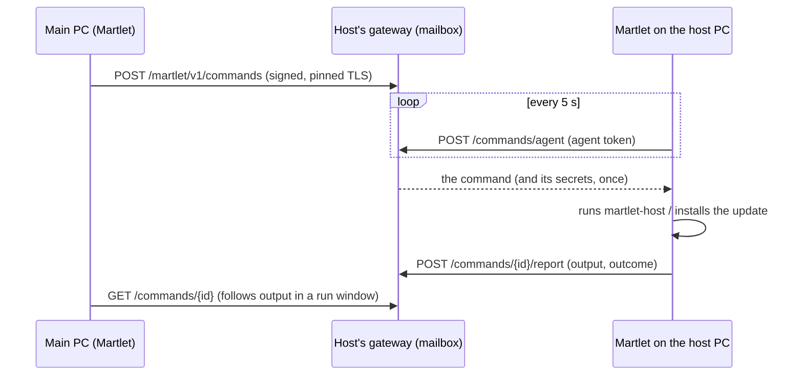

# Shared "who does what" and failover

Martlet can keep **who does what** (which computer handles thinking,
listening, speaking and lip-sync) the same on every computer you own, move
jobs between computers on the spot, and move a job to another host when its
host stops answering. Sync is **on by default** (turn it off in **Devices >
Settings for all devices > Keep who does what in sync on all my computers**);
failover stays a per-job **Fail over to another host** choice.

## Model

- **Nodes** are your paired Martlet hosts (each runs the gateway) and the
  companion desktops that use them. Desktops are the only consumers of the
  jobs; hosts run the roles (Ollama, whisper, F5, Audio2Face).
- The shared configuration is the **cluster plan** (`Martlet.Core.Cluster`):
  - one entry per **job** (`thinking`, `listening`, `speaking`, `lip-sync`):
    the host in charge, or each desktop's own choice (its Setup route, or this
    PC for lip-sync), or nobody (lip-sync by voice loudness); whether it
    **fails over**; and `moved_from`, the host a failover moved it away from;
  - one entry per **host**: its address and the roles (with models) it was
    last seen running, or a `removed` tombstone after you forget it.
- Every entry is a last-writer-wins register stamped with a hybrid revision,
  `max(newest revision known + 1, current Unix milliseconds)`, and the writer's
  device ID. Merging keeps, per job and per host, the entry with the highest
  (revision, writer, content). The merge is commutative, associative and
  idempotent, so every copy converges whatever order changes arrive in; a
  computer with a fast clock cannot make later changes lose.
- The plan holds no secrets or conversation data: host IDs, HTTPS origins,
  model names, flags and stamps only. JSON, snake case, schema 1, at most
  16 KiB, 8 jobs and 32 hosts; unknown fields and newer schemas are rejected.

## Where copies live and how they sync

| Copy | Location | Written by |
| --- | --- | --- |
| Each host | `cluster.json` beside `host.json` (0600, gateway service owner). Not part of the approved configuration, so role changes never need re-approval | The gateway, when a paired desktop merges into it |
| Each desktop | `cluster.json` in Martlet's data folder; the on/off choice in `cluster-sync.txt` (missing means on; only `off` turns sync off) | Martlet |

The gateway serves `GET /martlet/v1/cluster` (its copy) and
`POST /martlet/v1/cluster` (merge a copy in, return the merged result) to any
paired device over its pinned, signed connection. The host never acts on the
plan. Hosts do not talk to each other: desktops carry changes between them,
so no new host-to-host trust exists. Since the desktops are the only users of
the jobs, a job never needs to move while no desktop runs.

While sync is on, every 15 seconds (and right after any change or **Check
hosts**) the desktop:

1. notices jobs changed elsewhere in Martlet (for example in Setup) and
   records them as its newest choice;
2. checks every paired host: its routes and its copy of the plan;
3. merges every copy into its own and adds any job nobody has recorded yet
   from what this PC does now;
4. records the roles each reachable host runs;
5. applies failover (below);
6. follows the plan: each job moves to the planned host with this PC's own
   pairing, or back to this PC's saved Setup choice; an open conversation
   window reloads when idle;
7. merges its copy into every reachable host whose copy differs.

Changes made on this PC (the Devices page, Setup, forgetting a host, failover
choices) are recorded immediately, even while sync is off, so turning sync on
later keeps whichever change is actually newest. The same holds for computers
updated from a version where sync was off by default: on their first check
they adopt the newest change from any computer.

## Failover

With failover on for a job, when its host misses two consecutive checks
(about 30 seconds) the desktop moves the job to another paired host that
answered and advertises the job's route (the role is installed and its model
ready). Candidates are ranked by fewest other jobs, then most GPU memory
(from the host's hardware report), then host ID, so desktops that see the same
hosts pick the same one. The move is stamped with `moved_from` and shared; the
row says where it came from.

## Edge cases

| Case | Behavior |
| --- | --- |
| No other host runs the engine | The job stays; its row says no other paired host can take over. It never falls back to a cloud provider or this PC's Setup choice by itself |
| Failover off | The job stays; its row on the Devices page says the host is not doing it and offers failover |
| This PC reaches no host at all | No failover: its own network is the likelier problem |
| Host answers but lost the role (removed, model gone) | Counts as not serving the job, like an unreachable host |
| Flapping host | Two consecutive misses are needed; a moved job never moves back by itself (no ping-pong). Choose the original host again to move it back |
| Two desktops fail over at once | Same ranking, so normally the same target; otherwise the newest stamp wins everywhere within a check |
| Change made on another desktop | Followed within a check; the status line names the computer that chose it |
| Planned host not paired with this PC | This PC keeps its current route and its row says to pair that host here; the shared plan is not overwritten |
| Speaking moves to another F5 host | The applied reference voice is reused (same `f5-host` destination). A desktop without an F5 voice keeps its route and asks you to pick the voice |
| Host model differs | The new route records the model the host advertises; the failover confirmation says the model may differ |
| Host older than cluster sync | Still usable and a failover candidate; it keeps no copy, and the status line suggests **Update host** |
| New host paired | It receives the plan and appears as a node on the next check |
| Host forgotten here | Its node gets a tombstone; a desktop still paired with it re-adds it |
| Unreadable or malformed copy | A desktop starts empty and a host ignores it; both are restored from the other copies |
| User change racing a check | Checks never follow while a role change runs, and user changes always merge into the newest plan |
| Settings changed during a follow | The save conflicts and nothing changes; the next check retries |
| Newer plan schema | Rejected by older hosts (they keep theirs); update hosts to the desktop's version |

## Qualification

Merge rules, the endpoint (in-process, including signing and rejection) and
failover ranking were checked locally. Multi-host failover on real hosts and
networks is **NOT RUN**.

## The shared voice list

The voices Martlet recognizes (Companion › People) travel the same way, in
their own document: each host keeps `voices.json` beside `cluster.json` and
serves `GET`/`POST /martlet/v1/voices`; desktops merge every 30 seconds while
sharing is on (its own choice, on by default, independent of the who-does-what
sync). Each voice is a last-writer-wins entry with the same hybrid revisions;
forgotten and merged voices leave tombstones. See [VOICES](VOICES.md#sharing-between-your-computers).

## Commands between your computers

Any paired computer can ask a host to **update**, **install or remove a role**
or **show its status**, without SSH and without anyone typing a command on
that computer. The host's gateway is a mailbox; the **Martlet app on the host
computer** (a PC set up with *Use as a Martlet host*) is its **agent** and
runs the commands there. On the Devices map such a host is reached
*Through Martlet on that computer (paired connection)*, which replaced the old
*I run its commands on it myself*; hosts saved that way are moved over
automatically. Linux computers without Martlet keep using SSH.

| Endpoint (all over the paired, pinned, signed connection) | Who | What |
| --- | --- | --- |
| `GET /martlet/v1/commands` | any paired device | the agent (device, last seen, Martlet version, kinds it runs) and recent commands |
| `POST /martlet/v1/commands` | any paired device | send a command; the same one while it waits or runs returns that one |
| `GET /martlet/v1/commands/{id}` | any paired device | one command with the last 120 lines of its output |
| `POST /martlet/v1/commands/{id}/cancel` | any paired device | withdraw a waiting command, or ask the agent to stop a running one |
| `POST /martlet/v1/commands/agent` | the agent (token) | take the next command, or resume one it took before restarting |
| `POST /martlet/v1/commands/{id}/report` | the agent (token) | add output and, at the end, the outcome |

Commands (`Martlet.Core.Nodes`, checked on both ends; anything else is
refused with `request.invalid`):

| Kind | Arguments | What the agent does |
| --- | --- | --- |
| `martlet.update` | `version` | Updates Martlet itself to at least that version from its GitHub Release (checked against GitHub's SHA-256 digest, installed when Martlet is idle, then restarts and continues), then the host service to Martlet's version |
| `host.status` | none | `martlet-host status` |
| `host.describe-role` | `role` | `martlet-host describe <role>` (its terms, secrets and choices, for the sender's install dialog) |
| `host.add-role` | `role`, `choice.<VAR>`; secrets `secret.<name>` | `martlet-host add <role>` with the answers on stdin |
| `host.remove-role` | `role` | `martlet-host remove <role>` |

Security:

- Sending needs a paired device's signed request (HMAC with nonce and clock
  window, pinned TLS); anonymous and replayed requests are refused.
- Only the agent can take or report commands: at each start the gateway writes
  a fresh random token to `agent.token` beside `host.json` (0600, service
  owner), which only the host computer itself can read (Martlet reads it with
  `docker exec martlet-host-gateway cat ...`). The previous start's token stops
  working. A paired computer elsewhere never sees it.
- Secrets (for example an NGC API key) stay in the gateway's memory until the
  agent takes the command, are handed over once and never appear in command
  lists, output or `commands.json`. A waiting command's secrets are dropped
  after 15 minutes; a gateway restart fails a waiting command that had them.
- The gateway runs nothing. The agent runs only the kinds above, through the
  same `martlet-host` engine as every other route; updates come only from
  official releases. The owner can turn it off on the host PC: **Settings ›
  Your other computers › Let my other paired computers update Martlet here
  and manage this PC's host service** (on by default; `node-commands.txt`
  holds `off`). Commands then wait.
- Bounds: 8 waiting or running commands, 24 kept, 120 output lines of at most
  1,000 characters each; waiting commands expire after a day, running ones
  that stop reporting after two hours. `commands.json` keeps state and the last
  20 output lines, so commands survive a gateway restart (including the
  gateway's own update) and the agent finishes them afterwards.

The agent also keeps its own host service on its Martlet version, so a host
service from before commands existed (for example 0.14.1) is updated by itself
the next time Martlet runs on that PC; from then on the main PC updates and
manages it from here. With *Keep my Martlet hosts on this PC's version* on, the
main PC sends `martlet.update` to such hosts in the background; it runs as soon
as Martlet runs there.

Checked locally: `node_link_check` (MCP) runs the protocol end to end on
loopback with the real gateway, desktop client and agent loop; the same client
and agent ran against a real Linux gateway container built from this source
(token read with `docker exec`, `commands.json` without secrets, a new token
after restart). The desktop's own runner on a real host PC (installing an
update, `martlet-host` runs) and two real computers are **NOT RUN**.
