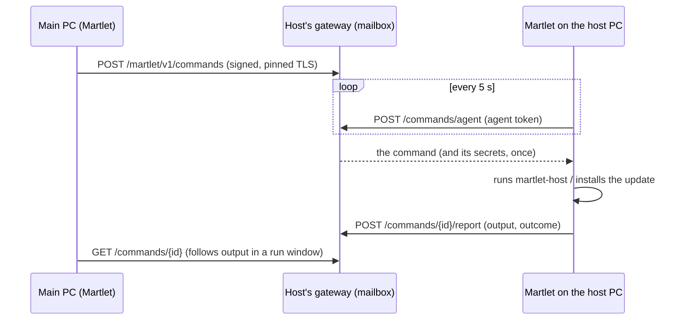

# Shared "who does what", shared settings and failover

Martlet is one companion with many computers attached. It keeps **who does
what** (which computer handles thinking, listening, speaking and lip-sync) and
**its settings** (how it thinks, listens and speaks with your API keys, its
character, personality and replies; see
[One Martlet on every computer](#one-martlet-on-every-computer)) the same on
every computer you own, moves jobs between computers on the spot, and moves a
job to another host when its host stops answering. Sync is **on by default**
(turn it off in **Devices > Settings for all devices > Keep Martlet the same on
all my computers**); failover stays a per-job **Fail over to another host**
choice.

## Model

- **Nodes** are your paired Martlet hosts (each runs the gateway) and the
  companion desktops that use them. Desktops are the only consumers of the
  jobs; hosts run the roles (Ollama, whisper, F5, Audio2Face).
- The shared configuration is the **cluster plan** (`Martlet.Core.Cluster`):
  - one entry per **job** (`thinking`, `listening`, `speaking`, `lip-sync`):
    the host in charge, or each desktop's own choice (its Setup route, or this
    PC for lip-sync), or nobody (lip-sync by voice loudness); whether it
    **fails over**; and `moved_from`, the host a failover moved it away from;
  - one entry per **host**: its address and the roles (with models) it was
    last seen running, or a `removed` tombstone after you forget it.
  - the `logs` entry: the paired host that collects every computer's logs
    (the [log host](DIAGNOSTICS.md#diagnostics-page-and-the-log-host)), or
    nobody. It is not a role: it never moves, fails over or follows a Setup
    choice, and desktops older than shared logs pass it through untouched.
- Every entry is a last-writer-wins register stamped with a hybrid revision,
  `max(newest revision known + 1, current Unix milliseconds)`, and the writer's
  device ID. Merging keeps, per job and per host, the entry with the highest
  (revision, writer, content). The merge is commutative, associative and
  idempotent, so every copy converges whatever order changes arrive in; a
  computer with a fast clock cannot make later changes lose.
- The plan holds no secrets or conversation data: host IDs, HTTPS origins,
  model names, flags and stamps only. JSON, snake case, schema 1, at most
  16 KiB, 8 jobs and 32 hosts; unknown fields and newer schemas are rejected.

## Where copies live and how they sync

| Copy | Location | Written by |
| --- | --- | --- |
| Each host | `cluster.json` beside `host.json` (0600, gateway service owner). Not part of the approved configuration, so role changes never need re-approval | The gateway, when a paired desktop merges into it |
| Each desktop | `cluster.json` in Martlet's data folder; the on/off choice in `cluster-sync.txt` (missing means on; only `off` turns sync off) | Martlet |

The gateway serves `GET /martlet/v1/cluster` (its copy) and
`POST /martlet/v1/cluster` (merge a copy in, return the merged result) to any
paired device over its pinned, signed connection. The host never acts on the
plan. Hosts do not talk to each other: desktops carry changes between them,
so no new host-to-host trust exists. Since the desktops are the only users of
the jobs, a job never needs to move while no desktop runs. Which desktops a
host trusts at all is the [Martlet network](NETWORK.md): pair a host once and
every member desktop pairs with it by itself.

While sync is on, every 15 seconds (and right after any change or **Check
hosts**) the desktop:

1. notices jobs changed elsewhere in Martlet (for example in Setup) and
   records them as its newest choice;
2. checks every paired host: its routes and its copy of the plan;
3. merges every copy into its own and adds any job nobody has recorded yet
   from what this PC does now;
4. records the roles each reachable host runs;
5. applies failover (below);
6. follows the plan: each job moves to the planned host with this PC's own
   pairing, or back to this PC's saved Setup choice; an open conversation
   window reloads when idle;
7. merges its copy into every reachable host whose copy differs.

Changes made on this PC (the Devices page, Setup, forgetting a host, failover
choices) are recorded immediately, even while sync is off, so turning sync on
later keeps whichever change is actually newest. The same holds for computers
updated from a version where sync was off by default: on their first check
they adopt the newest change from any computer.

A PC set up as a host (*Use as a Martlet host*) uses no jobs, so it only takes
steps 2, 3 and 7: it receives the plan (so it knows the
[log host](DIAGNOSTICS.md#diagnostics-page-and-the-log-host) and shows who does
what) and passes on its own changes, such as choosing the log host on its
Diagnostics page. It never records, fails over or follows a job. Before this, a
host PC skipped the sync entirely and never learned the log host chosen
elsewhere.

## Failover

With failover on for a job, when its host misses two consecutive checks
(about 30 seconds) the desktop moves the job to another paired host that
answered and advertises the job's route (the role is installed and its model
ready). Candidates are ranked by fewest other jobs (being the log host counts
as one), then most GPU memory
(from the host's hardware report), then host ID, so desktops that see the same
hosts pick the same one. The move is stamped with `moved_from` and shared; the
row says where it came from.

## Edge cases

| Case | Behavior |
| --- | --- |
| No other host runs the engine | The job stays; its row says no other paired host can take over. It never falls back to a cloud provider or this PC's Setup choice by itself |
| Failover off | The job stays; its row on the Devices page says the host is not doing it and offers failover |
| This PC reaches no host at all | No failover: its own network is the likelier problem |
| Host answers but lost the role (removed, model gone) | Counts as not serving the job, like an unreachable host |
| Flapping host | Two consecutive misses are needed; a moved job never moves back by itself (no ping-pong). Choose the original host again to move it back |
| Two desktops fail over at once | Same ranking, so normally the same target; otherwise the newest stamp wins everywhere within a check |
| Change made on another desktop | Followed within a check; the status line names the computer that chose it |
| Planned host not paired with this PC | This PC keeps its current route and its row says to pair that host here; the shared plan is not overwritten. A host of your [Martlet network](NETWORK.md) is paired by itself within a minute, so this lasts only until then |
| Speaking moves to another F5 host | The applied reference voice is reused (same `f5-host` destination), and the new host already holds its recording ([shared speaking voices](#the-shared-speaking-voices)). A desktop without a voice keeps its route and asks you to add one |
| Host model differs | The new route records the model the host advertises; the failover confirmation says the model may differ |
| Host older than cluster sync | Still usable and a failover candidate; it keeps no copy, and the status line suggests **Update host** |
| New host paired | It receives the plan and appears as a node on the next check |
| Host forgotten here | Its node gets a tombstone; a desktop still paired with it re-adds it |
| Unreadable or malformed copy | A desktop starts empty and a host ignores it; both are restored from the other copies |
| User change racing a check | Checks never follow while a role change runs, and user changes always merge into the newest plan |
| Settings changed during a follow | The save conflicts and nothing changes; the next check retries |
| Newer plan schema | Rejected by older hosts (they keep theirs); update hosts to the desktop's version |

## Qualification

Merge rules, the endpoint (in-process, including signing and rejection) and
failover ranking were checked locally. Multi-host failover on real hosts and
networks is **NOT RUN**.

## One Martlet on every computer

The plan above says *who* does each job. What a job uses when no host does it,
and everything else that makes Martlet the same companion, travels as **shared
settings** through the same paired hosts, so any of your computers can be the
companion (or a host) and Martlet stays familiar on all of them. Before this, a
job nobody's host did used *each desktop's own Setup choice*: a PC switched to
OpenRouter kept OpenRouter, while the other PC, made the companion later, kept
NVIDIA Build and its old key.

| Shared setting | What travels | Stays with each computer |
| --- | --- | --- |
| `thinking`, `listening`, `speaking` | The route a job uses when no paired host does it: provider (OpenAI, OpenRouter, NVIDIA Build or any OpenAI-compatible server, Ollama on the computer itself, Windows speech, Parakeet), model, voice and **the API key** | Host routes and pairings (the plan above); a local whisper package |
| `thinking-fallback` | The *If Thinking fails* endpoint, model and its own key (or none) | |
| `companion` | The personalities (same IDs, so lorebooks stay linked) and which one is used | |
| `replies`, `prompts`, `memory` | Reply settings, edited prompts, memory on or off | Where memory is stored, and the memories themselves |
| `lorebooks` | Every lorebook and the scan settings (up to 1 MiB) | |
| `character` | The character model (a bundled one, or a model file at the same path), renderer, its Audio2Face mapping, show at start | The overlay's place and zoom; who does lip-sync (the plan) |
| `talk` | Always listening or push-to-talk, pause length, interrupting, spoken replies, letting Thinking hear you, screen chattiness | Microphone sensitivity, cameras, Voice ID, echo reduction |
| `speech-display`, `appearance` | Speech bubbles and subtitles, the theme | |

Audio devices, the device role (companion or host PC), startup choices, MCP
servers, updates and host pairings stay with each computer. Conversations are
not shared.

### Conflicts and offline changes

Each setting is its own last-writer-wins register (`Martlet.Core.Sync.SharedSettings`)
stamped with the same hybrid revision as the plan,
`max(newest revision known + 1, current Unix milliseconds)`, the writer's device
ID and the time. Merging keeps, per setting, the highest (revision, writer,
content), so every copy converges whatever order changes arrive in, and changes
to *different* settings made on different computers are all kept.

- **Changes made here** are noticed every 15 seconds by comparing what this PC
  has with a digest of what it had last time (kept in `shared-settings.json`),
  and stamped then. This happens even while sync is off or no host answers, so
  an edit made offline keeps its time and wins only if nothing newer was
  changed elsewhere meanwhile. The same setting edited offline on two
  computers ends as the later edit everywhere.
- **Following** a newer setting goes through the same rules as Martlet's own
  pages: a key this PC already has for that provider is used again, a replaced
  key the owner typed on this PC is set aside for removal in Advanced setup
  (never orphaned), and a replaced key this PC only had because another
  computer shared it is removed (`shared-keys.txt` lists those). The owner's
  choice is recorded as made on the computer where it was made. A setting
  followed from elsewhere is not counted as a change made here.
- **A setting this PC can't use yet** (a Windows voice not installed, Parakeet
  not downloaded, Ollama without the model, a character file not at the same
  path, a job a paired host does now) keeps its current value and is tried on
  every check; *Settings for all devices* lists it with why, and it is never
  shared back as this PC's choice.
- **A failed push** is not lost: the change is in this PC's copy and goes to
  every host whose copy differs on the next check; a host that was off gets it
  when it answers again, and a restarted host serves its saved copy.
- **The first sync after updating** (or on a new computer) has no record of
  when each setting changed. A value that is still Martlet's default never
  overrides one; otherwise the evidence of when it last changed here decides:
  the write time of its API key in Windows Credential Manager, else the file's
  time. So the PC where you set up OpenRouter most recently wins over a PC that
  set up NVIDIA Build earlier, whichever syncs first.
- **Use this PC's settings on all my computers** stamps everything this PC has
  as changed now, for when the computers disagree and you want this one.
- When the plan hands a job back from a host (*Setup choice*), the shared route
  is used rather than whatever the PC kept aside.

### Where copies live

| Copy | Location |
| --- | --- |
| Each host | `shared-settings.json` beside `host.json` (0600, gateway service owner), with the API keys |
| Each desktop | `shared-settings.json` in Martlet's data folder: the merged copy **without any key** and the digests of what it last saw; keys stay in Windows Credential Manager |

The gateway serves `GET /martlet/v1/settings`, `GET /martlet/v1/settings/digest`
and `POST /martlet/v1/settings` (merge and return) to paired devices only, over
their pinned, signed connection; API keys for other apps may not use them
([gateway contract](../src/Martlet.Gateway/README.md)). Desktops read a host's
copy only when its digest changed and give their copy to every host whose
digest differs. Secrets are pooled by SHA-256 of the key, and only those a
setting still uses are kept. Like the shared Home Assistant token, the keys are
readable by every paired device and kept in the host's private file; they are
not encrypted end to end between desktops yet.

### Qualification

`settings_sync_selftest` (MCP) runs it end to end on loopback: two real
gateways, three simulated desktops with real settings files and the real sync
engine and sections, covering the owner's case in both orders, model and key
changes, offline edits on both sides, a host that missed a change and
restarted, a stale copy, a newer Martlet's setting, a Windows voice a new
computer lacks, a new computer, the fallback and its key, lorebooks, no keys in
desktop files and an unsigned request refused. The desktop window's own sync
(status, the character, how you talk, speech bubbles and theme) was checked on
a disposable data folder through `-Desktop`. Two real computers with real paired
hosts, a real Credential Manager across them and the Linux host's file are
**NOT RUN**.

## The shared voice list

The voices Martlet recognizes (Companion › People) travel the same way, in
their own document: each host keeps `voices.json` beside `cluster.json` and
serves `GET`/`POST /martlet/v1/voices`; desktops merge every 30 seconds while
sharing is on (its own choice, on by default, independent of the who-does-what
sync). Each voice is a last-writer-wins entry with the same hybrid revisions;
forgotten and merged voices leave tombstones. See [VOICES](VOICES.md#sharing-between-your-computers).

## The shared speaking voices

The voices Martlet **speaks** with (Companion › Voice › Voices) and their
recordings are on every node, so a reply never waits for a recording to travel
and any of your PCs can be the companion with the same voices. There are no
built-in voices: a new list starts with Martlet's starter voices, which are
removed like any other ([F5 voice](F5_VOICE.md#one-voice-list-on-every-computer)).

- **The list** (`Martlet.Core.Voices.SpeakingVoiceLibrary`): one
  last-writer-wins entry per voice, keyed by its reference revision (SHA-256 of
  the recording's SHA-256 and the transcript's), with its name, transcript,
  recording SHA-256 and length, why it may be used and when it joined; and one
  entry for the voice chosen on all computers. Same hybrid revisions and merge
  rules as the plan; removed voices leave tombstones. Starter entries are
  revision 1, so a removal anywhere wins everywhere. JSON, snake case, schema 1,
  at most 1 MiB, 32 voices and 64 tombstones.
- **A voice made from several recordings** (2 to 10, each at least 0.5 s) is
  still one recording on the wire: the desktop joins them, in order, after a
  0.5 s pause each, at the highest sample rate among them (others resampled), and
  their transcripts with spaces; together at most 30 s and 4 MB. Its entry adds
  `clips` (each recording's `transcript`, `start_sample` and `sample_count` in
  the joined recording) and the joined `sample_rate`, so the recording, its
  sharing and its SHA-256 work like any other voice's. A Martlet older than this
  can't read a list holding such a voice (unknown fields are refused) until it
  updates.
- **Each host** keeps `speaking-voices.json` and one `speaking-voice-<sha256>.wav`
  per live voice beside `host.json` (0600, gateway service owner; not part of the
  approved configuration). A recording no live voice uses is deleted.
- **Each desktop** keeps `speaking-voices.json` in its data folder and its copy
  of every recording in its F5 voice store (`f5-voices`).

| Endpoint (paired devices only, over the pinned, signed connection; API keys may not) | What |
| --- | --- |
| `GET /martlet/v1/speaking-voices` | The host's list and the SHA-256 of each recording it holds (`present`) |
| `POST /martlet/v1/speaking-voices` | Merge a desktop's list in; returns the merged list and `present` |
| `GET /martlet/v1/speaking-voices/audio/<sha256>` | One recording (`reference.missing` when the host has none) |
| `POST /martlet/v1/speaking-voices/audio/<sha256>` | Send `{"audio_base64": ...}` for a live voice; refused (`request.invalid`) for a wrong SHA-256, a recording no live voice has, or anything but a mono 16-bit PCM WAV of 1 to 30 seconds |

Every 30 seconds while any host is paired (and two seconds after you add, use or
remove a voice) the desktop reads every paired host's list, merges them into
its own, copies each recording it lacks from a host that has it (starter
recordings come from Martlet itself), deletes removed voices' copies (not the
one it still speaks with), gives every host whose list differs the merged list
and sends each host every recording it lacks. Then it follows the voice chosen
on another computer once its recording is here and the speaking engine can use
it (an open conversation reloads when idle). Voices > *F5VoicesShared* says with
how many computers the voices are shared. Nothing is written while no host is
paired.

A speaking request names its recording by SHA-256 (`reference_audio_base64` is
optional); the host's gateway hands its engine the copy it keeps. A host that
lacks it answers `reference.missing` and the desktop sends the request again
with the recording, which the host then keeps when a live voice uses it. A host
older than shared speaking voices refuses the request with `request.invalid`;
the desktop then sends the recording with every request to that host, as
before, and the status asks you to update it.

For a voice made from several recordings, the host's gateway looks the voice up
in its own copy of the list. An engine that learns from several recordings
(`SpeechEngine.MultipleReferences`: XTTS-v2 and GPT-SoVITS) gets the joined
recording plus `reference.clips` (where each lies and its words) when at least
one recording fits its length bounds, and its service cuts them apart: XTTS-v2
computes its speaker from every recording, and GPT-SoVITS prompts with the
first 3-10 second recording and adds the others' tone (`aux_ref_audio_paths`).
Every other engine (Chatterbox Turbo, F5-TTS, Dia), or a host whose list lacks
the voice, clones the joined recording, so a voice usable as one recording is
always usable. The engine's length check takes either: GPT-SoVITS can speak a
14-second voice through one of its 3-10 second recordings.

Checked locally with `speaking_voices_selftest` (MCP): two real gateways and
two simulated desktops with real voice stores on loopback, including a voice
of three recordings shared between them and handed to the XTTS-v2 relay as
three recordings and to F5-TTS joined. The desktop's
sync window with real paired hosts, the Linux files, real voice engines and two
real computers are **NOT RUN**.

## The shared character models

The character models the owner adds (Companion › Character › *Your characters*,
or a model file shown or saved in the character settings window) are copied to
every Martlet computer that can be the companion: each Martlet desktop, whether
it is a companion or a host PC right now (a host PC can become the companion in
one click and then already has them). Desktops reach each other only through
paired hosts, so each host keeps a copy too, only to pass it on; a host never
shows a character. Which character a computer shows stays its own choice. The
built-in character is part of Martlet and never in the list.

- **The list** (`Martlet.Core.Characters.CharacterModelLibrary`): one
  last-writer-wins entry per model, keyed by its ID (SHA-256 of its renderer,
  model file and every file's path, SHA-256 and length, so the same model is the
  same entry everywhere), with its name, renderer (`live2d` or `vrm`), model
  file, files, the computer it was added on and when. Each file lists the
  SHA-256 of every 3 MiB piece: a file travels piece by piece, each piece in
  one signed request within the gateway's request limit, and an interrupted copy
  continues where it stopped. Same hybrid revisions and merge rules as the plan;
  removed models leave tombstones. JSON, snake case, schema 1, at most 2 MiB,
  16 models (512 MB together; older ones leave the list when newer ones need
  the room) and 64 tombstones. Each model follows the renderer's rules: a VRM is
  one `.vrm` of at most 32 MB; a Live2D model is its `.model3.json` folder of
  `.json`, `.moc3`, `.png` and `.wav` files only (128 files, 128 folders,
  16 MB per file, 1 MB per JSON, 64 MB in all), never scripts.
- **Each host** keeps `character-models.json` and one
  `character-model-chunk-<sha256>.bin` per piece of a live model beside
  `host.json` (0600, gateway service owner; not part of the approved
  configuration). Pieces live on disk, not in memory; a piece no live model uses
  is deleted.
- **Each desktop** keeps `character-models.json` in its data folder and each
  model's files in `character-models\<first 16 hex digits of its ID>`, laid out
  like the original folder, so the renderer shows the copy exactly like the
  original (the original can be moved or deleted afterwards). Pieces arriving
  from another computer wait in `character-models-incoming` until the model is
  complete and every file's SHA-256 checks; then it moves into place in one step.

| Endpoint (paired devices only, over the pinned, signed connection; API keys may not) | What |
| --- | --- |
| `GET /martlet/v1/character-models` | The host's list and the SHA-256 of each piece it holds (`present`) |
| `POST /martlet/v1/character-models` | Merge a desktop's list in; returns the merged list and `present` |
| `GET /martlet/v1/character-models/chunks/<sha256>` | One piece (`chunk.missing` when the host has none) |
| `POST /martlet/v1/character-models/chunks/<sha256>` | Send `{"data_base64": ...}` for a live model; refused (`request.invalid`) for a wrong SHA-256 or a piece no live model has |

Every 30 seconds while any host is paired (and two seconds after you add, use or
remove a character) the desktop reads every paired host's list, merges them into
its own, copies the pieces of each model it lacks from hosts that have them,
assembles and checks the model, deletes removed models' copies (not the one it
shows, until another character is chosen there), gives every host whose list
differs the merged list and sends each host every piece it lacks. A model file
this PC showed before characters were shared joins the list on the first sync,
and the PC then shows Martlet's copy (the same files). Companion › Character's
`CharacterModelsShared` says with how many computers the characters are shared.
Nothing is written while no host is paired. A host older than shared characters
refuses with `request.invalid`; the status asks you to update it.

Checked locally with `character_models_selftest` (MCP): two real gateways and
three simulated desktops on loopback with generated Live2D and VRM fixtures, and
the desktop UI (adding, showing, switching and removing a real Live2D model's
copy on a disposable data folder). The Linux host's file custody was checked on
the fake Linux file system. The desktop's sync with real paired hosts, a real
Linux host's files, rendering a copy on another computer and two real computers
are **NOT RUN**.

## The shared Home Assistant connection

The Home Assistant address and long-lived access token can travel through the
same paired-host path. Each host keeps one `home-assistant.json` beside
`cluster.json`/`voices.json`; any paired desktop can read it and replace it via
`GET`/`POST /martlet/v1/home-assistant`. A null address/token is a tombstone
that stops sharing while keeping the latest revision. This document contains a
secret: the HA token. Linux hosts keep it as a 0600 service-owner file and the
gateway sends it only to paired devices over the pinned, signed connection.

## Commands between your computers

Any paired computer can ask a host to **update**, **install or remove a role**
or **show its status**, without SSH and without anyone typing a command on
that computer. The host's gateway is a mailbox; the **Martlet app on the host
computer** (a PC set up with *Use as a Martlet host*) is its **agent** and
runs the commands there. On the Devices map such a host is reached
*Through Martlet on that computer (paired connection)*, which replaced the old
*I run its commands on it myself*; hosts saved that way are moved over
automatically. Linux computers without Martlet keep using SSH.

| Endpoint (all over the paired, pinned, signed connection) | Who | What |
| --- | --- | --- |
| `GET /martlet/v1/commands` | any paired device | the agent (device, last seen, Martlet version, kinds it runs) and recent commands |
| `POST /martlet/v1/commands` | any paired device | send a command; the same one while it waits or runs returns that one |
| `GET /martlet/v1/commands/{id}` | any paired device | one command with the last 120 lines of its output |
| `POST /martlet/v1/commands/{id}/cancel` | any paired device | withdraw a waiting command, or ask the agent to stop a running one |
| `POST /martlet/v1/commands/agent` | the agent (token) | take the next command, or resume one it took before restarting |
| `POST /martlet/v1/commands/{id}/report` | the agent (token) | add output and, at the end, the outcome |

Commands (`Martlet.Core.Nodes`, checked on both ends; anything else is
refused with `request.invalid`):

| Kind | Arguments | What the agent does |
| --- | --- | --- |
| `martlet.update` | `version` | Updates Martlet itself to at least that version from its GitHub Release (checked against GitHub's SHA-256 digest, installed when Martlet is idle, then restarts and continues), then the host service to Martlet's version |
| `host.status` | none | `martlet-host status` |
| `host.describe-role` | `role` | `martlet-host describe <role>` (its terms, secrets and choices, for the sender's install dialog) |
| `host.add-role` | `role`, `choice.<VAR>`; secrets `secret.<name>` | `martlet-host add <role>` with the answers on stdin |
| `host.remove-role` | `role` | `martlet-host remove <role>` |

Security:

- Sending needs a paired device's signed request (HMAC with nonce and clock
  window, pinned TLS); anonymous and replayed requests are refused.
- Only the agent can take or report commands: at each start the gateway writes
  a fresh random token to `agent.token` beside `host.json` (0600, service
  owner), which only the host computer itself can read (Martlet reads it with
  `docker exec martlet-host-gateway cat ...`). The previous start's token stops
  working. A paired computer elsewhere never sees it.
- Secrets (for example an NGC API key) stay in the gateway's memory until the
  agent takes the command, are handed over once and never appear in command
  lists, output or `commands.json`. A waiting command's secrets are dropped
  after 15 minutes; a gateway restart fails a waiting command that had them.
- The gateway runs nothing. The agent runs only the kinds above, through the
  same `martlet-host` engine as every other route; updates come only from
  official releases. The owner can turn it off on the host PC: **Settings ›
  Your other computers › Let my other paired computers update Martlet here
  and manage this PC's host service** (on by default; `node-commands.txt`
  holds `off`). Commands then wait.
- Bounds: 8 waiting or running commands, 24 kept, 120 output lines of at most
  1,000 characters each; waiting commands expire after a day, running ones
  that stop reporting after two hours. `commands.json` keeps state and the last
  20 output lines, so commands survive a gateway restart (including the
  gateway's own update) and the agent finishes them afterwards.

The agent also keeps its own host service on its Martlet version, so a host
service from before commands existed (for example 0.14.1) is updated by itself
the next time Martlet runs on that PC; from then on the main PC updates and
manages it from here. With *Keep my Martlet hosts on this PC's version* on, the
main PC sends `martlet.update` to such hosts in the background; it runs as soon
as Martlet runs there.

### When updates and other work meet

Updates arrive from several directions (Martlet installing its own update,
another computer's `martlet.update`, automatic host updates from any desktop)
while a host may be busy installing a role, pairing or serving its console.
Nothing is interrupted and nothing is lost:

- **On the host, one change at a time.** Every route ends in the same
  `martlet-host` engine, which holds a kernel lock while it changes the host
  ([One change at a time](../deploy/host/README.md#one-change-at-a-time)). A
  change asked for by someone (a run window, a command from another computer)
  waits for the one already running and its output says what it waits for. An
  automatic background update doesn't queue: it stops at once without changing
  anything (exit 75, `MARTLET-BUSY ...`).
- **Automatic host updates try again.** A host found busy keeps its update
  pending, not failed: its Devices card says what the host is busy with, and
  Martlet tries it again every three minutes until it is free (this PC's own
  host service likewise). A host whose gateway doesn't answer while it
  restarts for another computer's update is asked again the same way.
  *Update hosts now* waits its turn instead (up to 30 minutes) and then updates.
- **Martlet never races itself.** Every route that updates a host from one
  Martlet (an *Update host* run window, a command from another computer,
  keeping this PC's own host service current, the automatic pass) claims that
  host first. The automatic pass leaves a claimed host to that run instead of
  starting a second `update` that would find the host locked by Martlet's own
  update and call it busy, and this PC's own host service is updated once per
  pass, not once as its pairing and again as "this PC". When a host is updated
  by any route, or a pass or check finds it current (*Check connection*, the
  release it announces, or this PC reading its own host service), its retry
  goes and an earlier "waiting to update" note on its Devices card becomes
  *Updated to Martlet ...*.
- **One command at a time per host PC.** Its Martlet takes the next command
  only after the current one ends. An update that waits (until nothing needs
  Martlet there, or while Martlet restarts into it) stays first, so a command
  sent meanwhile runs right after it. The computer that sent it sees why it
  waits: *Martlet on gpu-pc is updating first: Update to Martlet 0.22.0 (from
  desktop-a). This runs right after it.* Sending (and the first look at the
  host) keeps trying for up to five minutes while that host's gateway restarts.
- **Martlet installs its own update only when nothing needs it.** Besides you,
  the character and a conversation, that means no setup task, no host service
  update, no command from another computer running and no update check or
  download under way. Settings › App updates says what the downloaded update
  waits for; a `martlet.update` from another computer tells that computer the
  same. An update that computer asked for joins an update check or download
  already under way instead of failing. While Martlet exits to install, it
  takes no new command; commands sent meanwhile wait in the mailbox.
- **Every computer hears of an update.** A host announces the Martlet release
  it runs on every network sync ([NETWORK](NETWORK.md#when-a-computer-is-updated)),
  so once Martlet on a host PC has updated itself and its host service (or any
  computer updated a host), all your other computers show the new release
  within 20 seconds and stop offering or retrying an update it no longer needs.

Checked locally: `node_link_check` (MCP) runs the protocol end to end on
loopback with the real gateway, desktop client and agent loop, including a
command queued behind a running one and an update that waits and holds the
queue; `host_engine_check` (MCP) runs the real `martlet-host` engine's lock in a
disposable container; `host_update_check` (MCP) rehearses how one Martlet keeps
its own host updates from colliding with its production update tracker. The same client and agent ran against a real Linux
gateway container built from this source (token read with `docker exec`,
`commands.json` without secrets, a new token after restart). The desktop's own
runner on a real host PC (installing an update, `martlet-host` runs), the
engine lock on a real Docker-method host and two real computers are **NOT RUN**.
