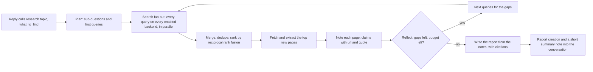

# Deep research: web search and long research jobs

Design for giving Martlet web search, page reading and *deep research*: a
background job that loops for many minutes on the Deep thinking model, sends
many queries to several search backends, reads many pages and comes back with a
cited report while the conversation carries on. Research behind it is
[S51](RESEARCH.md#s51-web-search-and-deep-research-2026-10-06); sources are
listed [below](#sources).

## What Martlet already has

Most of the machinery exists; deep research is a new kind of background work, not
a new subsystem.

| Piece | Where | What research reuses |
| --- | --- | --- |
| Background jobs | `Martlet.Conversation.BackgroundJobs`, [Background job API](CONVERSATION.md#background-job-api-for-new-kinds-of-background-work) | A `research` kind: limits, cancel, time limit, the talk window chip, delivery of results into the conversation |
| Deep thinking | `ThinkLonger`, `BackgroundThink`, `DeepThinkingPlan` | The model that runs the loop, beside the conversation (cloud, a second Ollama model, a paired computer's Thinking pool role) |
| Function calling and MCP | `TextTools`, `McpToolService`, `Martlet.Mcp.Client` | The reply's `research` tool; any search MCP server the owner adds |
| Creations | [Creations](CREATIONS.md) | A `report` kind keeps the finished report on every computer |
| Host roles | [Cluster](CLUSTER.md), [Network](NETWORK.md) | A self-hosted search engine as a host role on a Docker or Linux host |

## Limits in the current code

- One request carries at most 8 tool rounds
  (`BoundedTextInput.HardMaxToolRounds`), 16 calls a round and 12,000 characters
  a tool result. A research loop runs for dozens of steps, so it can't be one
  long tool conversation. The job drives the loop itself: each step is a fresh,
  bounded request that carries compressed notes, not the whole history.
- A paired computer's Deep thinking route (`deep-thinking-chat`) takes no tools
  (`ThinkLonger.HostBounds`). Research steps therefore ask for **JSON output**
  (queries, URLs to read, notes) instead of native function calls, so the same
  loop runs on every Deep thinking location, including a model with no tool
  support.
- A background job kind's time limit is at most 30 minutes (`BackgroundJobKind`),
  or none. Research has none, like a think: its budget of searches, pages and
  steps ends it, and Cancel stops it.
- [Never add conversation latency](../AGENTS.md#never-add-conversation-latency):
  the reply only gains one tool definition that is always offered in the same
  place while research is on, so the request start and prompt cache stay the
  same. The loop runs on Deep thinking, never on Thinking's model on this PC or
  a computer that is answering. Search and fetch are network I/O on the thread
  pool.

## How a research job runs

1. **Plan** (one Deep thinking request, JSON): 3-6 sub-questions and 2-4 search
   queries for each, from the topic, `what_to_find` and the conversation's last
   exchanges.
2. **Search fan-out**: every query goes to every enabled backend at once, with a
   small per-backend concurrency cap. Results are merged by normalized URL and
   ranked with reciprocal rank fusion, so a page that several engines or queries
   find comes first. Pages already read are skipped.
3. **Fetch and extract**: the top N new URLs are fetched in parallel through the
   safe fetcher (below) and reduced to clean text (readable article text, PDF
   text) of at most about 12,000 characters each.
4. **Notes** (one request per page or small batch, JSON): what the page says
   about the open sub-questions, as `{claim, url, quote}` records. Only the notes
   go forward, never raw pages. This compression is what keeps a 30-minute loop
   inside the model's context.
5. **Reflect** (JSON): which sub-questions are answered, which gaps remain, and
   the next queries, or `done`. The loop stops when the model says done, the
   step, page or query budget runs out, or the time limit nears. Time is always
   kept back for the report.
6. **Report**: one long request (Thinking steps On, the effort's output budget)
   that writes the report from the notes, citing `[n]` for numbered sources. Any
   citation that isn't in the notes is dropped.
7. **Delivery**: the full report becomes a `report` creation (Markdown plus its
   source list). The job's result is a short spoken-length summary and the
   creation's ID, delivered like any background job (*"That research is done:
   ... want the details?"*).

### Budgets

| Depth | Rounds | Queries | Pages read | Time limit |
| --- | --- | --- | --- | --- |
| Quick | 1-2 | up to 8 | up to 8 | 5 min |
| Standard (default) | up to 4 | up to 24 | up to 25 | 15 min |
| Deep | up to 8 | up to 60 | up to 60 | 30 min |

These match what open-source research agents use (breadth 3-10 queries a round,
depth 2-5 rounds). One job at a time, a few an hour, like `think`. A later step
may run 2-4 sub-researchers in parallel, one per sub-question, each with its own
notes, when Deep thinking answers several requests at once (a cloud provider).
Anthropic reports this works far better but costs about 15 times the tokens of a
chat, so it stays opt-in.

The first slice uses one budget, about what a careful person reads to research
something thoroughly (`WebResearch.Budget`): up to 30 searches, 60 pages and 40
model steps, one job at a time, with no time limit and no hourly limit. Each step
carries the model's own notes (at most 5,000 characters) instead of every page,
so the job fits one message however long it runs.

## Search backends

All backends sit behind one seam, `IWebSearchProvider.SearchAsync(query, count,
token) -> [{title, url, snippet, content?}]`. The owner turns each on under
Companion › Thinking pool › *Web research*, and research sends every query to
every enabled backend. Keys go in Windows Credential Manager, like other provider
keys.

| Backend | Cost | Why | Status |
| --- | --- | --- | --- |
| **SearXNG on your own host** | Free, self-hosted | Meta-search over many engines, JSON API, no key, nothing leaves your network except the engines' own queries. Fits Martlet's host roles: a `search` role runs `searxng/searxng` (with Redis) on a Docker or Linux host, with `formats: [html, json]` and the limiter off on the private network | **Recommended default** |
| **Ollama web search** (`ollama.com/api/web_search`, `web_fetch`) | Free tier with an Ollama account key | No infrastructure; `web_fetch` returns clean Markdown | Good zero-setup option |
| **Tavily** | 1,000 credits a month free | Built for LLM use; can return extracted page content | Optional key |
| **Brave Search API** | $5 monthly credit (about 1,000 queries), card required | Its own independent index | Optional key |
| **Exa** | $10 monthly credit | Semantic search with full page contents | Optional key |
| **An MCP search server** | Depends on the server | Any search tool the owner added on the Tools page | Optional |
| **DuckDuckGo HTML** | Free, no key | No official API. Scraping `html.duckduckgo.com` isn't sanctioned and gets rate-limited or CAPTCHA'd | Last-resort fallback only, never relied on |

Not used: Bing Search API (retired August 2025), Google Custom Search JSON API
(closed to new customers, shuts down 1 January 2027) and Whoogle (breaks as
Google blocks it).

### Provider-native research (paid, opt-in)

Some cloud providers already search and research by themselves. Martlet can hand
a job to one instead of running its own loop:

- **OpenAI Deep Research API** (`o4-mini-deep-research`, `o3-deep-research` on
  Responses with `background: true`): runs the whole job in the cloud and returns
  a cited report. The job polls it and delivers it the same way. This costs
  real money per job (dollars for o3), so it needs its own consent.
- **OpenAI Responses `web_search`**, **OpenRouter `openrouter:web_search`** (its
  older `:online` suffix is deprecated) and **Gemini Search grounding**: search
  billed per call while the model works. These can serve as a search backend for
  a cloud Deep thinking model.

These are never the default and never chosen silently: the card shows that they
cost money, like other paid provider choices.

## Reading pages safely

Every fetch goes through one fetcher in the desktop process:

- **SSRF guard**: only `http`/`https` on ports 80 and 443. The host is resolved
  first, and the request is refused if any address is loopback, private
  (RFC 1918, CGNAT), link-local (including `169.254.169.254`), multicast or IPv6
  ULA. The address is checked again on every redirect (at most 5) and the
  connection is pinned to the checked address, so DNS rebinding can't reach the
  home network, the gateway or Home Assistant. A self-hosted SearXNG is reached
  through its host role's route, not through this fetcher.
- **Bounds**: 2 MiB a page, 15 seconds a fetch, `text/html`, `text/plain`,
  `application/pdf` only, a per-domain concurrency cap and an honest
  `User-Agent` (`Martlet-Research/<version>`). `robots.txt` is checked in code,
  not left to the model.
- **Extraction**: SmartReader (a Readability port) for article text, AngleSharp
  as a fallback, PdfPig for PDFs. A JavaScript-only page is skipped; Playwright is
  not shipped by default because it's large.
- **Prompt injection** (OWASP LLM01): page text is data. Each step's prompt marks
  it as untrusted quoted material, and research steps have no tools that act on
  anything: they can only ask for more searches and reads. The finished report
  goes into the conversation as a note like any job result, and the reply's
  normal tool confirmations still apply to anything it does afterwards.

## Privacy and consent

- Web research is **on by default**, so asking Martlet to look something up
  works at once. Its card says what leaves the PC, and the owner can turn it off
  there: search queries, written by the model from the conversation, go to every
  enabled backend, and fetched sites see the request.
- The model is told to keep personal details (names, addresses, health,
  anything from memory) out of queries unless the user asked for exactly that.
- Paid backends and provider-native research each need their own consent and
  show their price class.
- The desktop log notes each job's start, steps, counts and end, never queries,
  URLs or report text, like `Background thinking:` lines. Queries and URLs stay
  in the report's source list, which the owner can delete.

## Observability (MCP)

The same change that adds research adds:

- A `research_check` tool (a fixture search backend plus a fixture model
  served locally, like `ThinkLongerCheck`) that runs a whole job headlessly and
  reports steps, queries, pages, notes and report length.
- `SafeValues` for the Web research card (switch, enabled backends, last job's
  counts) and automation IDs for its controls.
- A Doctor probe per enabled backend (reachable, JSON enabled for SearXNG, key
  present), with no query text.

## Delivery order

1. **R0: first slice** (done): `research` job kind and the
   `research(topic, what_to_find)` tool, the loop on Deep thinking with notes
   carried from step to step, the safe fetcher, a built-in search, the `report`
   creation kind, the WebResearch switch (on by default) and `research_check`.
2. **R1: backends**: `IWebSearchProvider` with SearXNG (URL or host role),
   Ollama web search, Tavily, Brave and Exa; fan-out with rank fusion; Doctor
   probes.
3. **R2: SearXNG host role**: `search` role on Docker and Linux hosts
   (`searxng/searxng` and Redis, JSON on, limiter off, paired-only route), added
   like other host roles.
4. **R3: parallel sub-researchers** when Deep thinking answers several requests
   at once, with the depth presets above.
5. **R4: cloud research hand-off**: OpenAI Deep Research in background mode,
   opt-in and paid.
6. **R5: research without a conversation**: start a job from the Creations page
   or a Research box and follow it in Background tasks.

## Sources

Accessed 2026-10-06.

- Search APIs: [Brave plans](https://api-dashboard.search.brave.com/app/plans),
  [Tavily pricing](https://help.tavily.com/articles/8816424538-pricing),
  [Exa pricing](https://exa.ai/pricing), [Jina Reader](https://jina.ai/reader/),
  [Kagi API](https://help.kagi.com/kagi/api/api-portal.html),
  [Google Custom Search JSON API](https://developers.google.com/custom-search/v1/overview),
  [Bing Search API retirement](https://learn.microsoft.com/en-us/lifecycle/announcements/bing-search-api-retirement),
  [Ollama web search](https://ollama.com/blog/web-search),
  [Perplexity Agent API](https://docs.perplexity.ai/docs/agent-api/migrate-from-sonar/overview).
- Self-hosted: [SearXNG search API](https://docs.searxng.org/dev/search_api.html).
- Provider-native: [OpenAI Responses tools and deep research](https://openai.com/index/new-tools-and-features-in-the-responses-api/),
  [Azure OpenAI deep research](https://learn.microsoft.com/en-us/azure/foundry/openai/how-to/deep-research),
  [OpenRouter web search](https://openrouter.ai/docs/guides/features/plugins/web-search),
  [Gemini pricing](https://ai.google.dev/gemini-api/docs/pricing),
  [Anthropic pricing](https://platform.claude.com/docs/en/docs/about-claude/pricing.md).
- Agent designs: [open_deep_research](https://github.com/langchain-ai/open_deep_research),
  [local-deep-researcher](https://github.com/langchain-ai/local-deep-researcher),
  [GPT-Researcher architecture](https://deepwiki.com/assafelovic/gpt-researcher/3-core-architecture),
  [STORM](https://github.com/stanford-oval/storm/blob/main/README.md),
  [dzhng/deep-research](https://deepwiki.com/dzhng/deep-research/2-core-architecture),
  [node-DeepResearch](https://deepwiki.com/jina-ai/node-DeepResearch/3-core-architecture),
  [smolagents open Deep Research](https://huggingface.co/blog/open-deep-research),
  [Anthropic multi-agent research system](https://www.anthropic.com/engineering/multi-agent-research-system),
  [Microsoft Agent Framework](https://github.com/microsoft/agent-framework).
- Extraction and safety: [SmartReader](https://github.com/strumenta/SmartReader),
  [PdfPig](https://uglytoad.github.io/PdfPig/),
  [OWASP LLM prompt injection prevention](https://cheatsheetseries.owasp.org/cheatsheets/LLM_Prompt_Injection_Prevention_Cheat_Sheet.html).
