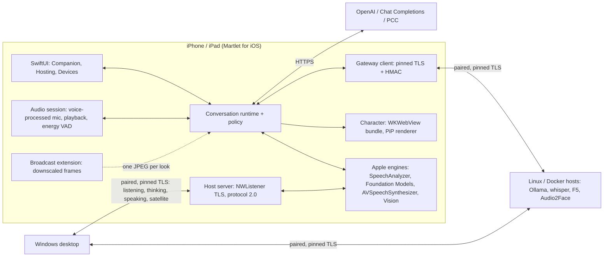

# iOS and iPadOS: what it takes, and the plan

**Plan, 2026-09-30. No iOS code, build or device test exists yet; everything
below is design and dated platform research, and every device result is NOT
RUN.** The owner asked what supporting iOS would take, in two roles, with as
many features as possible:

- **A. Companion on iPhone/iPad (main client):** Martlet runs on the device
  you play on, talks with you while an iOS game (or a streamed PC game) is in
  front, watches the game when you allow it and shows the character.
- **B. iPhone/iPad as a host:** a paired device lends one or more Martlet
  roles (listening, thinking, speaking, microphone/speaker) to the Windows
  desktop or to another companion, like a Linux/Docker host does today.

This is a separate post-MVP track. It does not change the Windows product or
promise a cross-platform desktop ([non-goals](../DEVELOPMENT_PLAN.md#explicit-non-goals-for-mvp)).

## Short answer

1. **A new native Swift/SwiftUI app, not a port.** The Windows app is WPF and
   its gateway is ASP.NET Core Kestrel, which does not run on iOS. The best iOS
   engines (Foundation Models, SpeechAnalyzer) are Swift-only. The portable C#
   libraries (`Martlet.Core`, `Conversation`, `Providers`) could be reused from
   .NET for iOS, but the host server, broadcast extension, Picture-in-Picture,
   audio session and Apple engines would still be Swift or bindings. See
   [Technology decision](#technology-decision).
2. **The gateway protocol is the seam.** An iPhone that implements gateway
   protocol 2.0 pairs with today's desktop through the existing
   `martlet-pair-v1.` pairing code and serves routes the desktop **already
   dispatches**: `martlet.gateway.transcription.v1` (Listening) and
   `martlet.gateway.ollama-chat.v1` (Thinking). Only engine labels, a
   "managed on the device" host type and one new generic speech route need
   desktop work. C# stays the protocol authority; Swift proves conformance
   against golden vectors generated from it.
3. **Builds need macOS, not a Mac on the desk.** A manual-dispatch release
   workflow on a GitHub-hosted macOS runner (free for this public repository)
   builds an unsigned `.ipa`. Users sign it on install with their own Apple ID
   (AltStore, SideStore or Sideloadly), like the unsigned Windows installer.
   A free Apple ID means re-signing every 7 days and at most 3 sideloaded apps.
   **Decided 2026-10-01: no paid Apple programs.** Everything in this plan works
   with a free Apple ID; see [Decisions](#decisions-2026-10-01).
4. **What an iPhone is good at hosting:** on-device speech recognition, Apple
   voices including your own Personal Voice, Apple Intelligence's on-device
   model (vision input from iOS 27), Vision OCR, and acting as a wireless
   microphone/speaker. **What it cannot host:** Audio2Face (NVIDIA only), large
   GPU models, Voice Studio training, or anything that must run while the app
   is suspended.
5. **What limits the companion while gaming:** it keeps running in the
   background only while its audio session is active (listening or speaking);
   watching another app needs a user-started system broadcast; a character
   over a full-screen game is only possible through Picture-in-Picture
   (experimental) or iPad windowing.

**Recommended order:** host first (IO01-IO04: smallest path to an iPhone doing
real work for the existing desktop, and it builds the protocol stack the
companion also needs), then the companion (IO05-IO09), then satellite and Mac
extras (IO10-IO11). See [Delivery slices](#delivery-slices).

## Feature matrix

"Today" is the Windows desktop. **Yes** = planned with a known Apple
mechanism; **Partial** = planned with a stated limit; **No** = not planned.

| Feature | Today (Windows) | A. iOS companion | B. iOS host | Apple mechanism | Slice |
| --- | --- | --- | --- | --- | --- |
| Typed conversation | Yes | Yes | - | URLSession streaming to OpenAI / Chat Completions | IO05 |
| Push-to-talk | Yes | Yes (on-screen button, Action button via App Intents) | - | AVAudioEngine, `playAndRecord` | IO05 |
| Hands-free listening | Yes (energy VAD) | Yes, also in the background while gaming | - | `UIBackgroundModes: audio`, voice processing (AEC) | IO05 |
| Listening: OpenAI STT | Yes | Yes | - | Upload like Windows | IO05 |
| Listening: on-device | Windows speech, whisper.cpp | **Yes: Apple SpeechAnalyzer** (free, private) | **Yes: serves the existing transcription route** | `SpeechAnalyzer` / `SpeechTranscriber` (iOS 26) | IO03, IO05 |
| Listening: paired host whisper | Yes | Yes | - | Gateway client | IO09 |
| Thinking: OpenAI / OpenRouter / NVIDIA Build / any Chat Completions | Yes | Yes | - | Same HTTPS APIs | IO05 |
| Thinking: on-device | Loopback Ollama/LM Studio | **Yes: Apple Intelligence on-device model** | **Yes: serves the existing chat route** | `FoundationModels` `SystemLanguageModel` (Apple Intelligence devices) | IO03, IO05 |
| Thinking: Apple Private Cloud Compute | - | Not planned: needs Apple's entitlement and a paid team | Not planned | `PrivateCloudComputeLanguageModel` | - |
| Thinking: paired host Ollama | Yes | Yes | - | Gateway client | IO09 |
| Speaking: OpenAI TTS | Yes | Yes | - | Streaming PCM | IO05 |
| Speaking: on-device voices | Windows voices | **Yes: Apple voices and Personal Voice** | **Yes: new generic speech route** | `AVSpeechSynthesizer.write(_:toBufferCallback:)`, Personal Voice authorization | IO04, IO05 |
| Speaking: F5 voice cloning | Paired host | Yes via paired host | Mac only (MLX F5, existing F5 route) | f5-tts-swift (MLX) | IO09, IO11 |
| Voice ID (only respond to me) | Yes | Yes (port GE2E encoder) | - | Accelerate | IO09 |
| Persona, response styles, participation policy | Yes | Yes (port) | - | Swift port | IO05 |
| Local memory | Yes | Yes (port lexical store) | - | Swift port, file protection | IO09 |
| Watch my screen (game commentary) | Yes (Desktop Duplication, GDI fallback) | **Partial: user starts a system broadcast** | - | ReplayKit Broadcast Upload Extension | IO06 |
| Phone camera as a Watch source | Yes (webcams, capture cards, phone-as-webcam apps, http snapshot/MJPEG, rtsp) | Planned: serve the camera as an HTTP JPEG snapshot/MJPEG that the desktop's address source reads | - | AVCaptureSession | IO06 |
| Vision model for screen commentary | OpenAI, Chat Completions, host Ollama | Same, plus **on-device model with image input (iOS 27)** | Chat route accepts the image (iOS 27) | `FoundationModels` image attachments | IO03, IO06 |
| On-screen text hints | - | Yes | Possible (perception OCR route) | Vision `VNRecognizeTextRequest` | IO06 |
| Character (VRM / Live2D) | Yes (overlay) | Yes in the app; reuses the web bundles | - | `WKWebView` (WebGL2) | IO07 |
| Character over a full-screen game | Yes | **Partial: Picture-in-Picture, experimental** | - | `AVPictureInPictureController` + `AVSampleBufferDisplayLayer` | IO08 |
| Character beside a game on iPad | - | Yes (iPadOS windows / Split View) | - | Multiple windows | IO07 |
| Loudness lip-sync | Yes | Yes | - | PCM level to the web view | IO07 |
| Audio2Face lip-sync | This PC or host | Yes via paired NVIDIA host | **No** (NVIDIA only) | Gateway client | IO07 |
| Status while in a game | Tray | Live Activity / Dynamic Island (listening, speaking) | Hosting status screen | ActivityKit | IO08 |
| Pair with hosts, who does what, failover | Yes | Yes (QR or pasted code) | Appears as a host node | Gateway client, cluster plan | IO09 |
| Microphone/speaker satellite for the PC companion | - | - | **Yes** (new satellite routes) | AVAudioEngine | IO10 |
| Host role install/remove over SSH/Docker | Yes | No | No: roles are toggled on the device | - | - |
| Setup advisor, prerequisites installer, Doctor, MCP | Yes | Minimal in-app checks only | Hosting checks only | - | IO05 |
| App updates | GitHub Releases | AltStore/SideStore source (no TestFlight: it needs the paid program) | Same | - | IO02 |
| Voice Studio training | Planned | No | No (Mac later, maybe) | - | - |

## Platform constraints and the design answer

| Constraint (source) | Design answer |
| --- | --- |
| Apps are suspended in the background unless a background mode keeps them running. `audio` keeps an app running while it plays or records ([UIBackgroundModes](https://developer.apple.com/documentation/bundleresources/information-property-list/uibackgroundmodes)) | The companion holds an active `playAndRecord` session only while you have listening on or a reply is playing, exactly the Windows "while Start listening is on" rule. No silent-audio keep-alive: it misuses the mode (App Review 2.5.4) and would hide real state. |
| A suspended app loses its listening sockets; a running one keeps them ([TN2277](https://developer.apple.com/library/archive/technotes/tn2277/_index.html)) | **Host mode is a foreground mode:** a full-screen "Hosting" screen, idle timer disabled while hosting ([isIdleTimerDisabled](https://developer.apple.com/documentation/uikit/uiapplication/isidletimerdisabled)), charger recommended, Guided Access optional. The listener closes on suspension and reopens on return; the desktop sees the host as unreachable meanwhile and opt-in failover applies. A companion session that is already running in the background may keep serving the satellite routes. |
| Game Mode (iOS 18+) prioritizes the foreground game and reduces background activity ([Apple](https://support.apple.com/en-us/105118)); its effect on active audio apps is not documented | Keep the background path light: no screen analysis on the phone during a look (the image goes to the Thinking route), streaming audio only. Measure on a device (IO05 acceptance). |
| Local network access needs permission (`NSLocalNetworkUsageDescription`, `NSBonjourServices`) ([docs](https://developer.apple.com/documentation/bundleresources/information-property-list/nslocalnetworkusagedescription)) | Ask on first pairing or hosting, with the reason. Hosts bind only the Wi-Fi private address; no Bonjour trust (discovery supplies an address, never trust, as on Windows). |
| No one-call API to create a self-signed TLS identity on iOS | Generate a P-256 key and self-signed certificate on the device with [apple/swift-certificates](https://github.com/apple/swift-certificates), keep both in the Keychain (`ThisDeviceOnly`), serve with Network.framework `NWListener` + TLS 1.2/1.3. Host ID and SPKI pin use the gateway's existing derivation. |
| Clients pin by SPKI | `sec_protocol_options_set_verify_block` (Network.framework) or a `URLSession` trust delegate compares SHA-256 of the SPKI with the paired pin. |
| Broadcast Upload Extensions are limited to about 50 MB (consistently reported on Apple forums) and are started by the user from a system picker | The extension only downscales to 1024 px, compares a 16x9 grey thumbnail and hands at most one JPEG per look to the app; the pacer and model call stay in the app (which is running because the companion session holds audio). Frames go to the app over a loopback socket with a per-session token, never an App Group: App Groups are reported unavailable to free Apple IDs, and Martlet uses only free signing. The red recording indicator is the visible state. |
| ScreenCaptureKit is documented for iOS/iPadOS 26 ([Apple](https://developer.apple.com/documentation/screencapturekit/capturing-screen-content-on-ios)), not verified here | Evaluate in IO06 as a replacement for the extension; ReplayKit is the baseline. |
| No always-on-top overlay API | Picture-in-Picture fed with rendered frames through `AVSampleBufferDisplayLayer` ([ContentSource](https://developer.apple.com/documentation/avkit/avpictureinpicturecontroller/contentsource-swift.class), iOS 15+). The character is rendered to pixel buffers (native VRM renderer or WebGL snapshots, chosen by measured cost). App Review acceptance of non-video PiP is uncertain; sideloaded builds are unaffected. On iPad, the Martlet window beside the game is the reliable route. |
| Foundation Models: Apple Intelligence devices only (iPhone 15 Pro or later, iPhone 16/17/Air, A17 Pro iPad mini, M1+ iPad; [Apple](https://support.apple.com/en-us/121115)), 4,096-token context on iOS 26 ([docs](https://developer.apple.com/documentation/foundationmodels/managing-the-context-window)), shared system resource, Swift-only | Route shown only when `SystemLanguageModel` reports available. Persona, style, memory facts and history are trimmed to the model's reported context (iOS 26.4 token-count APIs) instead of the desktop's fixed byte budget. Image input only on iOS 27 ([WWDC26 session 241](https://developer.apple.com/videos/play/wwdc2026/241/)); the vision classification says so per OS. |
| Private Cloud Compute model (iOS 27): 32K context, reasoning, free under 2M first-time downloads, per-user daily limit, **requires an entitlement** | Not planned: the entitlement most likely needs the paid Apple Developer Program, which Martlet does not use. |
| Personal Voice needs per-app user authorization; no documented rule against sending its generated audio to another device (App Review stance unverified) | Personal Voice is offered on the phone only after authorization, and as a host voice only with an extra on-phone confirmation that replies in your voice will play on the paired computer. |
| Hosted runner images lag Xcode releases: `macos-26` ships Xcode 26.x (image 20260907) | Build against the iOS 26 SDK; iOS 27-only APIs (FM image input, PCC) sit behind `#if compiler`/`if #available` and light up when the workflow's Xcode supports them. |
| Free Apple ID signing: 7-day expiry, 3 active apps and 10 App IDs a week (the app and each extension use one; [AltStore](https://faq.altstore.io/altstore-classic/app-ids)), Developer Mode on the device; App Groups and Private Cloud Compute need a paid team | Ship one app bundle with one extension (2 App IDs). Document the weekly refresh (AltStore/SideStore refresh over Wi-Fi). A build that expired stops opening; as a host it then simply stops answering, and the desktop's coverage card says so. No feature depends on a paid capability. |
| Thermal and battery | Hosting screen shows thermal state (`ProcessInfo.thermalState`) and pauses new jobs at `.serious` with a visible reason; the desktop sees `busy`, not silent slowness. |

## Technology decision

| Option | For | Against |
| --- | --- | --- |
| **Native Swift / SwiftUI + `MartletKit` Swift package (chosen)** | Direct access to every needed API (Foundation Models, SpeechAnalyzer, ReplayKit, PiP, ActivityKit, Network.framework, CryptoKit); small broadcast extension; the same host code runs on macOS | Conversation and provider logic is re-implemented; must be kept in sync with C# |
| .NET 10 for iOS (with or without MAUI) | Reuses the portable `net10.0` libraries (`Martlet.Core`, `Conversation`, `Providers`, `Participation`, `Memory`) | Kestrel/ASP.NET Core is not supported on iOS, so the gateway server is rewritten anyway; Foundation Models and SpeechAnalyzer need hand-written Swift shims (Swift interop in .NET 10 is low-level only); a .NET runtime in a 50 MB broadcast extension is impractical; still needs macOS to build |

Keeping one source of truth: the C# gateway, cluster and provider contracts
remain authoritative. IO01 generates golden vectors from the C# code into
`contracts/gateway/`; `MartletKit` tests must reproduce them byte for byte.
A protocol change lands in C# first, with regenerated vectors.

Layout (one `apple/` folder shared with the [macOS app](MACOS.md#proposed-layout), decided 2026-10-01):

```text
apple/
  project.yml                 XcodeGen spec (reviewable text, no .xcodeproj churn)
  MartletKit/                 Swift package
    Sources/Gateway/          pairing code, pinned client, HMAC signer/verifier, host server, routes
    Sources/Cluster/          cluster plan and merge (same rules as Martlet.Core.Cluster)
    Sources/Conversation/     turn runtime, sentence segmenter, participation policy, persona
    Sources/Providers/        OpenAI, Chat Completions, Apple on-device (STT, LLM, TTS)
    Sources/Audio/            session, capture with voice processing, energy VAD, playback
    Tests/                    conformance against contracts/gateway vectors
  Martlet/                    app: Companion, Hosting, Devices, Settings
  MartletBroadcast/           ReplayKit Broadcast Upload Extension
.github/workflows/ios-release.yml   manual dispatch only; builds and uploads the unsigned .ipa
```

## Architecture



As on Windows, the device you talk to owns consent, capture, playback,
orchestration and credentials (Keychain, `ThisDeviceOnly`). Hosts never call
each other; each role has one destination and never silently falls back.

## What an iOS host implements

The subset of [gateway protocol 2.0](../src/Martlet.Gateway/README.md) that
today's desktop uses, with the same bounds and strict JSON:

| Endpoint | Notes for iOS |
| --- | --- |
| `GET /health/live`, `GET /health/ready` | Unchanged documents |
| `POST /martlet/v1/pair` | Pairing starts only from **Pair a computer** on the Hosting screen: one-use 5-minute invitation, shown as a QR code and as the `martlet-pair-v1.` line (`{o,h,s,i,t}`, as in `Martlet.Gateway.Host.Linux/PairingCode.cs`); the phone screen is the local approval. Permanent pairing, rotation and revocation follow protocol 2.0; secrets and HMAC verifiers live in the Keychain |
| `GET /martlet/v1/version`, `capabilities`, `status` | Advertises only roles switched on and ready on the device (for example no chat route without Apple Intelligence) |
| `GET /martlet/v1/machine` | `method: app`, `platform: ios`, `os_version`, `architecture: arm64`, memory, no GPUs, and `features` such as `apple-intelligence`, `foreground-only` and `battery` ([platform fields](PLATFORMS.md#machine-report-platform-fields)); the desktop uses them to offer only what the device can do |
| `GET`/`POST /martlet/v1/cluster` | Stores its copy like a Linux host; never acts on it |
| `POST /martlet/v1/inference/transcription` | Existing contract (16 kHz mono PCM16, at most 30 s, text events) served by SpeechAnalyzer; model ID `apple-speech-<locale>` |
| `POST /martlet/v1/inference/ollama-chat` | Existing request/event contract served by `SystemLanguageModel` (model ID `apple-on-device`); the optional screen image is accepted only on iOS 27 |
| `POST /martlet/v1/inference/speech` | **New** generic text-to-PCM route (24 kHz mono PCM16, named voice), IO04 |
| `POST /martlet/v1/inference/satellite-*` | **New** microphone/speaker routes, IO10 |
| `POST /martlet/v1/inference/cancel` | Request abort; SpeechAnalyzer and Foundation Models tasks are cancelled cooperatively |

Every request is authenticated with the existing `Martlet-HMAC` scheme
(`martlet-request-v1` canonical bytes, timestamp window, nonce replay store).
Unpaired callers see only liveness and pairing.

**Desktop changes:** [PL01](PLATFORMS.md#delivery-slices) already handles hosts
that report `platform: ios`: they are managed on the device (no SSH/Docker
add/remove, update or prepare commands), shown with a phone icon, labeled by
the model they advertise, marked as hosting only while the app is open, and
refused for impossible engines (Ollama, F5, Audio2Face) with the reason.
Still to do: the generic speech route (`SetupRouteType.GatewaySpeech`) and
vision classification for `apple-on-device` (image input only when the host
reports iOS 27).
Failover already works by advertised route, so an iPhone and a Linux host that
both serve Listening can fail over to each other.

## Delivery slices

Sizes are relative (S/M/L). Risk: L low, M medium, H high. All device
acceptance is manual on a real device and stays NOT RUN until done.

| ID | Deliverable | Depends on | Acceptance | Size / risk |
| --- | --- | --- | --- | --- |
| IO01 | Gateway conformance vectors: a C# generator writes `contracts/gateway/` vectors for pairing code, host ID/SPKI derivation, canonical request bytes and HMAC, pairing/version/capabilities/machine documents, inference event streams for transcription and chat, and cluster merge cases | - | Vectors regenerate identically from C#; each field is covered by at least one reject case | S / L |
| IO02 | `apple/` XcodeGen project, `MartletKit` protocol core passing IO01, and `ios-release.yml` (manual dispatch, macOS runner, `CODE_SIGNING_ALLOWED=NO`, `Martlet-<version>-ios.ipa` plus an AltStore/SideStore source file on the GitHub release) | IO01 | Release build produces an installable unsigned IPA; sideload with a free Apple ID launches the app | M / M |
| IO03 | **iOS host: Listening and Thinking.** Hosting screen, TLS identity, pairing (QR + code), Keychain authority, the endpoints above with SpeechAnalyzer and Foundation Models; desktop engine labels and "managed on the device" hosts | IO02 | Windows desktop pairs by pasting the code, hands Listening and Thinking to the iPhone on the Devices page, and holds a voice conversation; suspending the app shows the host unreachable and resumes cleanly | L / H |
| IO04 | **Speaking route.** Generic `martlet.gateway.speech.v1` contract in C# (gateway, client, Desktop `GatewaySpeech`), served on iOS by Apple voices and, after authorization and confirmation, Personal Voice | IO03 | Desktop speaks replies with an iPhone voice; F5 and OpenAI routes unchanged | M / M |
| IO05 | **Companion conversation.** Typed, push-to-talk and hands-free (voice processing, energy VAD port, re-arm after reply) with OpenAI, Chat Completions and Apple on-device STT/LLM/TTS; persona and styles; per-action authorization and disclosure mirroring Windows; Keychain credentials; background audio while another app is in front | IO02 | Hands-free conversation continues while an iOS game is in front, with game audio mixed; Stop/mute end capture; nothing uploads without the per-action permission | L / M |
| IO06 | **Watch my screen on iOS.** Broadcast Upload Extension, frame hand-off, pacer port (chattiness, looks per hour, never while you talk), vision through the current Thinking route including on-device iOS 27; optional Vision OCR hints; ScreenCaptureKit evaluation | IO05 | During a user-started broadcast of a game, remarks follow the Windows pacer rules; stopping the broadcast stops watching; extension stays under its memory limit on an iPad | M / H |
| IO07 | **Character in the app.** VRM and Live2D web bundles in `WKWebView`, loudness lip-sync bridge, Audio2Face via a paired NVIDIA host, iPad side-by-side layout | IO05, IO09 for Audio2Face | Character talks in sync in the app and beside a game on iPad | M / M |
| IO08 | **Character over games and status.** PiP renderer from pixel buffers (experimental), Live Activity with listening/speaking state | IO07 | PiP character animates over a full-screen game for 10 minutes without dropping the conversation; measured frame cost recorded | M / H |
| IO09 | **Devices, cluster, memory, Voice ID.** Pair the companion with hosts (QR/paste), use host Ollama/whisper/F5/Audio2Face routes, join who-does-what sync and failover; port local memory and the GE2E Voice ID encoder | IO03, IO05 | Companion uses a Linux host's roles; a Who does what change on Windows reaches the phone within a check | L / M |
| IO10 | **Satellite.** The Windows companion listens and speaks through a paired iPhone (voice-processed microphone utterances and reply playback as satellite routes) | IO03, IO04 | Talk to the Windows companion from another room through the phone | M / M |
| IO11 | **Mac host (bonus).** The same Swift host as a macOS LaunchAgent on Apple silicon: Apple engines plus MLX F5 ([f5-tts-swift](https://github.com/lucasnewman/f5-tts-swift)) on the existing F5 route and MLX LLM/VLM models on the chat route. Detailed as MA02-MA03 in the [macOS plan](MACOS.md#delivery-slices) | IO03 | Desktop hands Speaking to a Mac with a cloned F5 voice | M / M |

## Decisions (2026-10-01)

The owner asked to decide everything that costs nothing and skip anything
that costs money. Decided:

- **No paid Apple programs.** No Apple Developer Program, TestFlight, App
  Store or Private Cloud Compute. Installs use a **free Apple ID** through
  AltStore, SideStore or Sideloadly, re-signed every 7 days. No feature depends
  on a paid capability: the broadcast extension talks to the app over a
  loopback socket instead of an App Group.
- **Folder:** `apple/`, shared by the iPhone, iPad and Mac apps.
- **Releases:** the unsigned `.ipa` and the AltStore/SideStore source file are
  attached to the same `v<version>` GitHub release as the Windows installer.
- **Live2D:** the same bundled Cubism Core for Web as on Windows, under the
  same terms (Live2D lists iOS Safari as a supported Web SDK platform). The
  owner names iOS/iPadOS in the Expandable Application review already applied
  for; VRM needs no review.
- **Test devices:** only devices the owner already has; nothing is bought.
  Acceptance on hardware nobody has stays NOT RUN.

Still needed from the owner (free): an Apple ID for sideloading, and Developer
Mode turned on on the iPhone or iPad.

## Not planned

Host role installation over SSH/Docker from or onto iOS; Audio2Face on Apple
hardware; Voice Studio training on iOS; MCP control; Windows-style self-update
(the sideload source handles updates); always-on or automatic
screen capture.

## Sources

Accessed 2026-09-30. Platform facts are upstream statements, not Martlet
measurements.

- Foundation Models: [framework](https://developer.apple.com/documentation/foundationmodels),
  [context window](https://developer.apple.com/documentation/foundationmodels/managing-the-context-window),
  [WWDC26 "What's new in the Foundation Models framework"](https://developer.apple.com/videos/play/wwdc2026/241/)
  (iOS 27 on-device vision, `PrivateCloudComputeLanguageModel`, `LanguageModel` protocol),
  [Apple Intelligence devices and languages](https://support.apple.com/en-us/121115)
- Speech: [SpeechAnalyzer](https://developer.apple.com/documentation/speech/speechanalyzer),
  [SpeechTranscriber](https://developer.apple.com/documentation/speech/speechtranscriber)
- Voices: [write(_:toBufferCallback:)](https://developer.apple.com/documentation/avfaudio/avspeechsynthesizer/write(_:tobuffercallback:)),
  [requestPersonalVoiceAuthorization](https://developer.apple.com/documentation/avfaudio/avspeechsynthesizer/requestpersonalvoiceauthorization(completionhandler:))
- Background and networking: [UIBackgroundModes](https://developer.apple.com/documentation/bundleresources/information-property-list/uibackgroundmodes),
  [TN2277 Networking and Multitasking](https://developer.apple.com/library/archive/technotes/tn2277/_index.html),
  [isIdleTimerDisabled](https://developer.apple.com/documentation/uikit/uiapplication/isidletimerdisabled),
  [Game Mode](https://support.apple.com/en-us/105118),
  [NSLocalNetworkUsageDescription](https://developer.apple.com/documentation/bundleresources/information-property-list/nslocalnetworkusagedescription),
  [sec_protocol_options_set_verify_block](https://developer.apple.com/documentation/security/sec_protocol_options_set_verify_block(_:_:_:)),
  [apple/swift-certificates](https://github.com/apple/swift-certificates)
- Screen and overlay: [RPBroadcastSampleHandler](https://developer.apple.com/documentation/replaykit/rpbroadcastsamplehandler),
  [ScreenCaptureKit on iOS](https://developer.apple.com/documentation/screencapturekit/capturing-screen-content-on-ios),
  [AVPictureInPictureController.ContentSource](https://developer.apple.com/documentation/avkit/avpictureinpicturecontroller/contentsource-swift.class),
  [Vision text recognition](https://developer.apple.com/documentation/vision/recognizing-text-in-images),
  [Live2D Cubism SDK for Web platforms](https://docs.live2d.com/en/cubism-sdk-manual/platform/)
- .NET: [Kestrel platforms](https://learn.microsoft.com/aspnet/core/fundamentals/servers/kestrel?view=aspnetcore-10.0),
  [Swift interop types](https://learn.microsoft.com/dotnet/api/system.runtime.interopservices.swift?view=net-10.0),
  [Pair to Mac](https://learn.microsoft.com/dotnet/maui/ios/pair-to-mac?view=net-maui-10.0)
- Build and on-device models: [macos-26 runner image](https://github.com/actions/runner-images/blob/main/images/macos/macos-26-arm64-Readme.md)
  (Xcode 26.x, image 20260907),
  [mlx-swift-examples](https://github.com/ml-explore/mlx-swift-examples),
  [f5-tts-swift](https://github.com/lucasnewman/f5-tts-swift) (declares iOS 16 / macOS 14),
  [Argmax open-source SDK (WhisperKit)](https://github.com/argmaxinc/argmax-oss-swift)

**Unverified and to be checked on a device or against current Apple terms:**
free Personal Team limits (7 days, 3 apps) and App Group availability, the
ReplayKit extension memory figure, Game Mode's effect on apps with an active
audio session, App Review stance on non-video PiP and on sending Personal Voice
audio to another device, and ScreenCaptureKit behavior on iPhone.
