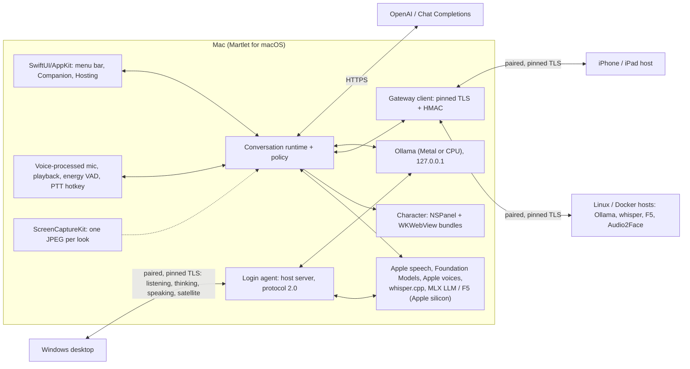

# macOS: what it takes, and the plan

**Plan, 2026-09-30. No macOS code, build or Mac test exists yet; everything
below is design and dated platform research, and every Mac result is NOT
RUN.** The owner wants Macs supported in both roles, on both Apple silicon and
older Intel Macs, as part of "make use of any old hardware a user has":

- **A. Mac as the companion:** the computer you talk to (and maybe game on).
  It listens, speaks, shows the character over your game, watches the screen
  when you allow it, and uses hosts like the Windows desktop does.
- **B. Mac as a host:** a paired Mac lends roles (listening, thinking,
  speaking, microphone/speaker) to the Windows desktop or another companion,
  like a Linux/Docker host does today.

This builds on the [iOS and iPadOS plan](IOS.md): the same Swift package
(`MartletKit`), the same C#-generated conformance vectors (IO01) and the same
Swift host (IO03). It is a separate post-MVP track and does not change the
Windows product ([non-goals](../DEVELOPMENT_PLAN.md#explicit-non-goals-for-mvp)).

## Short answer

1. **One native Swift app does both roles.** A SwiftUI/AppKit app shares
   `MartletKit` with iOS: a companion window and menu bar item, plus **Lend
   this Mac**, which runs the Swift host in a background login agent. Reusing
   the C# libraries through .NET for macOS, Avalonia or MAUI would add a third
   UI codebase and still need Swift for the Apple engines. See
   [Technology decision](#technology-decision).
2. **An Apple silicon Mac is the best non-NVIDIA host Martlet can get.**
   Unified memory lets a 16-64 GB Mac run larger local models than most
   gaming GPUs, with Ollama and whisper.cpp on Metal, F5 voice cloning on
   MLX, and Apple's free on-device speech, voices and Apple Intelligence
   model. It can never run Audio2Face (NVIDIA only).
3. **Old Intel Macs still help.** Intel Macs stop at macOS 26 Tahoe (2019-2020
   models); the app's floor, macOS 14, covers most Intel Macs from 2018 on. They
   can listen (whisper on the CPU), speak with Apple voices, act as a
   microphone/speaker in another room or be the companion with cloud models.
   Older Macs can be reinstalled with Ubuntu and become a normal Linux host.
   See [Old hardware](#old-hardware-intel-macs-and-apple-silicon-generations).
4. **Free builds, no Apple fee.** A manual-dispatch workflow on GitHub's free
   macOS runner builds two downloads (Apple silicon and Intel). They are not
   notarized: on first launch the user clicks **Open Anyway** in System
   Settings > Privacy & Security once. Notarization needs the $99/year Apple
   Developer Program, which Martlet does not use ([Decisions](#decisions-2026-10-01)). See
   [Unsigned builds](#unsigned-builds-what-the-user-sees).
5. **What limits the companion while gaming:** watching the screen needs the
   Screen & System Audio Recording permission (macOS 15+ asks again
   periodically); the character floats over full-screen games with standard
   window settings (unverified with real games); push-to-talk works as a
   global hotkey without any special permission.

**Recommended order:** MA01 (app shell and release), then the host (MA02-MA03:
the Mac is also the easiest place to build the Swift host the iPhone needs),
then the companion (MA04-MA07, with updates MA08 in its first release), then
satellite (MA09). MA10 (Docker and Linux routes for old Macs) is independent.
See [Delivery slices](#delivery-slices).

## Feature matrix

"Today" is the Windows desktop. **Yes** = planned with a known Apple
mechanism; **Partial** = planned with a stated limit; **No** = not planned.

| Feature | Today (Windows) | A. Mac companion | B. Mac host | Apple mechanism | Slice |
| --- | --- | --- | --- | --- | --- |
| Typed conversation | Yes | Yes | - | URLSession streaming | MA04 |
| Push-to-talk | Yes | Yes: hold a global hotkey, even inside a full-screen game | - | Carbon hot key (key down/up), no permission | MA04 |
| Hands-free listening | Yes (energy VAD) | Yes, with echo cancellation | - | AVAudioEngine voice processing | MA04 |
| Listening: OpenAI | Yes | Yes | - | Upload like Windows | MA04 |
| Listening: on this computer | Windows speech, whisper.cpp | **Yes: Apple speech (macOS 26) or whisper.cpp** | **Yes: serves the existing transcription route** | `SpeechAnalyzer`; whisper.cpp XCFramework (Metal on Apple silicon) | MA02, MA04 |
| Thinking: OpenAI / OpenRouter / NVIDIA Build / any Chat Completions | Yes | Yes (also loopback Ollama/LM Studio on this Mac) | - | Same HTTPS APIs | MA04 |
| Thinking: on this computer | Loopback Ollama/LM Studio | **Yes: Apple Intelligence model, Ollama, MLX** (Apple silicon) | **Yes: serves the existing chat route** | `FoundationModels`, native Ollama (Metal), mlx-swift-lm | MA02, MA04 |
| Thinking: Apple Private Cloud Compute | - | No (needs the paid program, see below) | No | `PrivateCloudComputeLanguageModel` (macOS 27, entitlement) | - |
| Thinking/listening/speaking/lip-sync on paired hosts | Yes | Yes | - | Gateway client | MA07 |
| Speaking: OpenAI | Yes | Yes | - | Streaming PCM | MA04 |
| Speaking: on-device voices | Windows voices | **Yes: Apple voices and Personal Voice** | **Yes: new generic speech route (IO04)** | `AVSpeechSynthesizer.write(_:toBufferCallback:)` | MA03, MA04 |
| Speaking: F5 voice cloning | Paired NVIDIA host | Yes: on this Mac (MLX) or a paired host | **Yes on Apple silicon: existing F5 route via MLX** | [f5-tts-swift](https://github.com/lucasnewman/f5-tts-swift) | MA03 |
| Voice ID | Yes | Yes (port of the GE2E encoder, shared with IO09) | - | Accelerate | MA07 |
| Persona, response styles, participation policy | Yes | Yes (shared with IO05) | - | Swift port | MA04 |
| Local memory | Yes | Yes (shared with IO09) | - | Swift port | MA07 |
| Watch my screen (game commentary) | Yes | **Yes, after the screen-recording permission** | - | ScreenCaptureKit | MA06 |
| Vision model for screen looks | OpenAI, Chat Completions, host Ollama | Same, plus on-device Apple model (macOS 27) and MLX vision models | Chat route accepts the image | `FoundationModels` images, mlx-swift-lm VLMs | MA02, MA06 |
| Character (VRM / Live2D) over games | Yes (overlay) | **Yes: transparent floating panel**, reuses the web bundles | - | `NSPanel` + `WKWebView` | MA05 |
| Speech bubbles and subtitles | Yes (optional) | Yes: bubble beside the character, subtitles on the active screen | - | Second transparent `NSPanel` | MA05 |
| Loudness lip-sync | Yes | Yes | - | PCM level to the web view | MA05 |
| Audio2Face lip-sync | This PC or host | Yes via a paired NVIDIA host | **No** (NVIDIA only) | Gateway client | MA05 |
| Status while in a game | Tray | Menu bar item (listening, speaking, watching) | Hosting window and menu bar item | `MenuBarExtra` | MA04 |
| Pair with hosts, who does what, failover | Yes | Yes (paste code or QR) | Appears as a host node | Gateway client, [cluster plan](CLUSTER.md) | MA02, MA07 |
| Microphone/speaker satellite for another companion | - | - | **Yes** (IO10 routes) | AVAudioEngine | MA09 |
| Host role install/remove over SSH or Docker | Yes | No | No: roles are toggled on the Mac (Docker method: MA10) | - | MA10 |
| Setup advisor, prerequisites tool, Doctor, MCP | Yes | Minimal in-app checks | Hosting checks | - | MA04 |
| App updates | GitHub Releases | GitHub Releases via Sparkle, off by default | Same app | Sparkle 2, EdDSA | MA08 |
| Voice Studio training | Planned | No | No | - | - |

## Platform constraints and the design answer

| Constraint (source) | Design answer |
| --- | --- |
| Gatekeeper: since macOS 15 Control-click **Open** no longer overrides it for software that is not notarized; the user goes to System Settings > Privacy & Security ([Apple](https://developer.apple.com/news/?id=saqachfa), [support](https://support.apple.com/en-us/102445)). Apple silicon runs no native arm64 code without at least an ad-hoc signature ([Apple](https://support.apple.com/guide/security/rosetta-2-on-a-mac-with-apple-silicon-secebb113be1/web)) | Ship ad-hoc or self-signed builds and document the one-time **Open Anyway** step; never claim they are signed by an identified developer or notarized; never suggest turning Gatekeeper off. Details in [Unsigned builds](#unsigned-builds-what-the-user-sees). |
| Privacy permissions (microphone, screen recording) follow the app's code identity. Ad-hoc signed code "has a DR but it's tied to that specific version of the code", so macOS cannot carry a permission across versions ([TN3127](https://developer.apple.com/documentation/technotes/tn3127-inside-code-signing-requirements)); keychain items behave the same way | Sign releases with one stable **self-made certificate** (free, created once, stored as a repository secret): macOS then sees each update as the same app. Without it, each update asks again for the microphone, screen recording and keychain access. Decided: use it ([Decisions](#decisions-2026-10-01)). |
| Key events from other apps need Accessibility (`NSEvent` global monitor) or Input Monitoring (event taps) ([docs](https://developer.apple.com/documentation/appkit/nsevent/addglobalmonitorforevents(matching:handler:))) | Push-to-talk uses a registered global hot key (Carbon `RegisterEventHotKey` through [KeyboardShortcuts](https://github.com/sindresorhus/KeyboardShortcuts), which reports key down and key up and works sandboxed) and needs no permission. The combination is swallowed, so the game does not see it. Default combos include Command or Control (macOS 15.0 rejected Option-only hot keys, [forum](https://developer.apple.com/forums/thread/763878)). Mouse-button push-to-talk would need Input Monitoring: later, opt-in. |
| ScreenCaptureKit needs the **Screen & System Audio Recording** permission, and an app must restart after it is granted ([sample](https://developer.apple.com/documentation/screencapturekit/capturing-screen-content-in-macos)); macOS 15+ periodically asks the user to re-confirm (reported monthly; interval not documented by Apple). `SCContentSharingPicker` and `SCScreenshotManager` need macOS 14 | **Start watching** explains the permission and the restart before triggering it; a re-confirmation prompt is shown as "macOS asks again", not an error. Watching never starts by itself and is never saved as on, as on [Windows](SCREEN_COMMENTARY.md). Whether the system picker avoids the standing permission is unverified. |
| Full-screen apps live in their own Space. A window joins every Space with `canJoinAllSpaces` and shows beside a full-screen window with `fullScreenAuxiliary` ([docs](https://developer.apple.com/documentation/appkit/nswindow/collectionbehavior-swift.struct/fullscreenauxiliary)) | The character is a borderless, transparent, non-activating `NSPanel` at floating level with those behaviors, so it never steals focus from the game. Games that capture the display exclusively (legacy `CGDisplayCapture`) may hide it; the voice conversation continues regardless. |
| Game Mode (Apple silicon, macOS 14+) gives the full-screen game top CPU/GPU priority and lowers background tasks ([Apple](https://support.apple.com/en-us/105118)) | Keep the overlay light (WebGL at a capped frame rate) and the look path cheap (downscale, one JPEG per look). Measure overlay frame cost and reply delay in Game Mode (MA05 acceptance). |
| Voice processing (echo cancellation) ducks other audio by default; macOS 14 adds a ducking configuration ([docs](https://developer.apple.com/documentation/avfaudio/avaudiovoiceprocessingotheraudioduckingconfiguration)) | Hands-free uses voice processing so Martlet does not hear itself, with minimum ducking so game audio stays audible. Verified in MA04. |
| Local network privacy (macOS 15+): outgoing LAN connections need the user's OK; **accepting incoming TCP does not**; login agents are not exempt ([TN3179](https://developer.apple.com/documentation/technotes/tn3179-understanding-local-network-privacy)) | The companion asks when you first pair a host (`NSLocalNetworkUsageDescription`). The host only accepts connections and talks to loopback engines, so hosting itself needs no prompt. |
| Background work: macOS throttles hidden apps (App Nap); a login agent runs only while the user is logged in ([SMAppService](https://developer.apple.com/documentation/servicemanagement/smappservice), macOS 13+) | While listening or hosting, hold `ProcessInfo.beginActivity` and a "prevent idle sleep" power assertion ([IOPMAssertionCreateWithName](https://developer.apple.com/documentation/iokit/1557134-iopmassertioncreatewithname)); the display may still sleep. **Lend this Mac** registers a login agent; an always-on Mac mini needs automatic login (not available with FileVault on) and "wake for network access". A MacBook with its lid closed sleeps unless in clamshell mode; the Hosting window says so. |
| Apple Intelligence: Mac with M1 or later (and MacBook Neo), enabled by the user, device and Siri language matching, up to 8-14 GB of storage ([Apple](https://support.apple.com/en-us/121115)); 4,096-token context per session ([docs](https://developer.apple.com/documentation/foundationmodels/managing-the-context-window)); image input from macOS 27; Private Cloud Compute needs macOS 27 and a managed entitlement ([docs](https://developer.apple.com/documentation/foundationmodels/privatecloudcomputelanguagemodel)) | Same rules as IO03/IO05: offered only when `SystemLanguageModel` reports available, context trimmed to the model, image input only on macOS 27. Private Cloud Compute is out until the owner joins the paid program. |
| Apple speech: `SpeechTranscriber` reports per device whether its models are supported; `DictationTranscriber` is documented as "compatible with older devices" ([docs](https://developer.apple.com/documentation/speech/speechtranscriber)) | Use `SpeechTranscriber` when available, else `DictationTranscriber`, else whisper.cpp. Intel support is checked on a real Intel Mac before it is advertised. |
| Unified memory: the GPU should stay under `recommendedMaxWorkingSetSize`, an approximation below total memory ([docs](https://developer.apple.com/documentation/metal/mtldevice/recommendedmaxworkingsetsize)) | The machine report includes unified memory and this figure; model suggestions use it like `choice_by_vram` does for NVIDIA hosts. |
| Docker on a Mac has no GPU: `--gpus` passthrough exists only on Windows/WSL 2 ([Docker](https://docs.docker.com/desktop/features/gpu/)); Docker Desktop supports the current and two previous macOS releases ([Docker](https://docs.docker.com/desktop/setup/install/mac-install/)) | Native engines are the main path; the Docker method is a CPU-only fallback (MA10). |
| MLX needs Apple silicon and macOS 14+ ([MLX](https://github.com/ml-explore/mlx/blob/main/docs/src/install.rst)) | Separate Apple silicon and Intel builds; the Intel build compiles without MLX and Apple Intelligence code. |
| A downloaded app run straight from the disk image or Downloads may run from a temporary read-only location (app translocation), which breaks login agents and updates | On first launch outside `/Applications`, Martlet asks to be moved there. |
| Thermal state | Same as iOS: pause new host jobs at `.serious` with a visible reason (`busy`), never silent slowness. |

## Technology decision

### Companion app

| Option | For | Against |
| --- | --- | --- |
| **Native Swift / SwiftUI + AppKit, sharing `MartletKit` with iOS (chosen)** | Same conversation, provider, gateway and host code as iPhone/iPad; direct access to ScreenCaptureKit, `NSPanel` levels and Spaces, Foundation Models, SpeechAnalyzer, MLX; small app, no runtime | Conversation and provider logic is re-implemented in Swift (already accepted for iOS, held to C# by IO01 vectors) |
| .NET 10 for macOS (`net10.0-macos`, AppKit bindings) | Reuses the portable C# libraries (`Martlet.Core`, `Conversation`, `Providers`, `Participation`, `Memory`, the managed Voice ID encoder) | A third UI codebase next to WPF and the iOS SwiftUI app; Foundation Models, SpeechAnalyzer and MLX are Swift-only, so Swift shims are needed anyway; duplicates `MartletKit` |
| Avalonia 12 (with its now open-source [WebView](https://github.com/AvaloniaUI/Avalonia.Controls.WebView)) | One C# UI could in principle also run on Windows | Rewriting the WPF desktop is out of scope; floating non-activating panels, Spaces and ScreenCaptureKit still need native interop; same Swift shims |
| .NET MAUI (Mac Catalyst) | Microsoft-supported | iPad-style UI on the Mac; window levels and floating panels need AppKit bridging; same Swift shims |
| Port the WPF app | - | WPF is Windows-only |

### Host

| Option | For | Against |
| --- | --- | --- |
| **(b) The Swift host from IO03, inside the Mac app as a login agent (chosen)** | One Apple host for iPhone, iPad and Mac; direct Apple engines and MLX; Keychain; no .NET runtime; the Mac is the easiest place to build and debug it (no weekly re-signing, runs in the background) | Needs IO01-IO02 first; Swift re-implements the Ollama relay and embeds whisper.cpp, checked against the IO01 vectors; managed on the Mac, not over SSH from Windows |
| (a) The existing .NET gateway (`Martlet.Gateway.Host.Linux`) for osx-arm64/osx-x64 under launchd | Protocol authority with its Ollama, whisper, F5 and Audio2Face relays; could be driven over SSH like Linux hosts (macOS allows SSH-started tools on the LAN, TN3179) | Its state custody backend (`Martlet.Gateway.Persistence`) is Linux-only (`openat2`, `statx`, `renameat2`, glibc and ext4 checks) and needs a macOS backend; `martlet-host` needs a launchd method; every Apple engine would still need a Swift helper process; .NET 10 needs macOS 14+ ([Microsoft](https://learn.microsoft.com/dotnet/core/install/macos)); a second Apple-side host to keep in sync with the iPhone's |
| (c) The `martlet-host` Docker method on Docker Desktop for Mac | No new Mac code; same commands | Containers get no Metal GPU (CPU only, inside a VM with fixed memory); the host image downloads x86_64 Docker CLI/Compose, so Apple silicon needs a multi-architecture fix; F5 and Audio2Face impossible; Docker Desktop supports only the current and two previous macOS releases (15 and later once it supports 27) |

(c) stays as a fallback for Intel Macs that already run Docker (MA10). If the
Swift stack slips and a Mac host is wanted sooner, (a) is the fallback, at
the cost of the macOS custody backend; it would be retired when (b) lands.

### Proposed layout

The Mac app joins the IO02 project in the shared `apple/` folder (decided
2026-10-01).

```text
apple/
  project.yml                 XcodeGen spec: iOS app, broadcast extension, MartletMac, MartletHostAgent
  MartletKit/                 Swift package, now also built for macOS 14+
    Sources/Host/             host server shared by iPhone, iPad and Mac (IO03)
    Sources/Engines/          Apple speech, Foundation Models, Apple voices, whisper.cpp (XCFramework),
                              Ollama relay; MLX LLM and MLX F5 only in Apple silicon builds
  MartletMac/                 AppKit/SwiftUI app: menu bar item, Companion, character panel, Watch my screen, Hosting
  MartletHostAgent/           login agent (SMAppService) that runs the host while you are logged in
.github/workflows/macos-release.yml   manual dispatch only; builds both .dmg files and attaches them to the release
```

## Architecture



As on Windows, the computer you talk to owns consent, capture, playback,
orchestration and credentials (login keychain). A Mac that is both companion
and host uses its own engines directly; the host serves other computers.
Hosts never call each other; each role has one destination and never silently
falls back.

## What a Mac host implements

The same gateway protocol 2.0 subset as the
[iOS host](IOS.md#what-an-ios-host-implements) (health, pairing, version,
capabilities, status, machine, cluster, cancel; `Martlet-HMAC` on every
request), running in the login agent instead of a foreground screen. Each
route is served by one engine at a time, chosen in the Hosting window, and the
advertised model ID names it (for example `ollama:gemma3:12b`,
`apple-on-device`, `whisper:large-v3-turbo`, `apple-speech-en-US`).

| Route | Apple silicon | Intel |
| --- | --- | --- |
| `martlet.gateway.transcription.v1` (existing) | whisper.cpp on Metal (models as the `stt` role, pinned SHA-256), Apple speech on macOS 26 | whisper.cpp on the CPU (`base`/`small`); Apple speech if supported |
| `martlet.gateway.ollama-chat.v1` (existing) | relay to native Ollama (Metal), Apple Intelligence model, MLX LLM/VLM; screen image accepted by vision models | relay to native Ollama on the CPU (small models) |
| `martlet.gateway.f5-synthesis.v1` (existing) | f5-tts-swift on MLX; the reference recording is resampled to the 24 kHz mono it expects | not offered |
| `martlet.gateway.speech.v1` (new, IO04) | Apple voices; Personal Voice only after authorization and an on-Mac confirmation | Apple voices |
| satellite routes (new, IO10) | yes | yes |
| `martlet.gateway.audio2face.v1` | never (NVIDIA only) | never |

Ollama is installed by the user from ollama.com (Martlet links to it and
detects it on 127.0.0.1:11434); Martlet pulls a model through Ollama's API
only after you choose it, suggested by unified memory. The machine report
(`GET /martlet/v1/machine`) gains optional fields: chip, unified memory, the
GPU working-set size and Apple Intelligence availability, with `method:
native`.

**Desktop changes (small, mostly shared with IO03):** engine labels from the
advertised route and model; the **managed on the device** host type; the
generic speech route; a Mac icon on the Devices map; the setup advisor learns
"Apple silicon Mac, N GB unified memory" and "Intel Mac" as computer choices
and suggests jobs by memory. Failover already works by advertised route, so a
Mac and a Linux host serving the same job fail over to each other.

## Old hardware: Intel Macs and Apple silicon generations

### Intel Macs

Intel Macs get no macOS after 26 Tahoe: macOS 27 Golden Gate supports Apple
silicon only ([Apple](https://support.apple.com/en-us/127255)).

| Intel Mac | Newest macOS | What Martlet can use it for |
| --- | --- | --- |
| MacBook Pro 16-inch 2019, MacBook Pro 13-inch 2020 (four ports), iMac 27-inch 2020, Mac Pro 2019 | 26 Tahoe ([Apple](https://support.apple.com/en-us/122867)) | Everything the Intel column of the [capability table](#capability-table-for-the-platform-matrix) allows; Apple speech if it proves supported |
| MacBook Air 2020, other MacBook Pro 2018-2019, iMac 2019, Mac mini 2018, iMac Pro 2017 | 15 Sequoia ([Apple](https://support.apple.com/en-us/120282)) | Same, without macOS 26 Apple speech; Docker Desktop while 15 stays in its support window |
| MacBook Air 2018-2019 | 14 Sonoma ([Apple](https://support.apple.com/en-us/105113)) | Same; no Docker Desktop |
| 2017 MacBook Pro, iMac, MacBook | 13 Ventura ([Apple](https://support.apple.com/en-us/102861)) | Below the app's floor: reinstall with Ubuntu (Linux host) |
| 2015-2016 models, Mac mini 2014, Mac Pro 2013 | 12 Monterey ([Apple](https://support.apple.com/kb/HT212551)) | Reinstall with Ubuntu (Linux host) |
| 2013-2014 models | 11 Big Sur ([Apple](https://support.apple.com/kb/HT211238)) | Reinstall with Ubuntu (Linux host) |

No Intel Mac can use Apple Intelligence, MLX (so no MLX F5) or Audio2Face, and
Ollama on Intel runs on the CPU only ([Ollama](https://docs.ollama.com/macos)).
Useful jobs for an old Intel MacBook or Mac mini, best first:

1. **Listening host:** whisper.cpp `base`/`small` on the CPU takes speech
   recognition off the gaming PC and keeps microphone audio at home.
2. **Speaking host with Apple voices:** free and offline, including the
   downloadable Enhanced/Premium voices.
3. **Microphone and speaker in another room** (satellite, MA09).
4. **Companion** with cloud models: talk, character, screen watching.
5. **Small local thinking** (1-4B models on the CPU) only if offline matters;
   expect slow replies.

**Ubuntu on old Macs:** an Intel Mac reinstalled with Ubuntu 24.04 is a normal
x86_64 Linux host for today's native and Docker methods (CPU roles: `stt`,
small `ollama`). Macs with the T2 chip (2018-2020) need the community
[t2linux](https://wiki.t2linux.org/) kernel for keyboard, trackpad and Wi-Fi;
older Macs may need a Wi-Fi driver (wired Ethernet avoids that). Not run on
Mac hardware.

### Apple silicon

Memory size matters more than chip generation. Unified memory is shared by
macOS, apps and the GPU; leave several GB for macOS and Martlet. Model sizes
reuse the [recommended-setups](RECOMMENDED_SETUPS.md#choose-a-goal) estimates
(Q4: 3-4B ~3 GB, 7-9B ~5-7 GB, 12-14B ~9-11 GB, 24-32B ~16-22 GB, 70B ~40-48 GB,
plus 1-2 GB of context). Planning figures, not measurements.

| Unified memory | Good host jobs | Largest local LLM that fits well |
| --- | --- | --- |
| 8 GB (base M1/M2/M3) | Companion with Apple Intelligence; listening (Apple speech or whisper `small`); Apple voices; one job at a time | 3-4B (`gemma3:4b`, `llama3.2:3b`) |
| 16 GB | All of the above plus F5 voice cloning (MLX) **or** a 7-8B model such as `qwen2.5vl:7b`, which also sees the screen | 7-8B |
| 24-32 GB | Voice host (whisper `large-v3-turbo` + F5) and a 12-14B model together; `gemma3:27b` alone on 32 GB | 12-14B, 27B alone |
| 64 GB | Dedicated thinking host: 32B comfortably, 70B Q4 just fits | 70B Q4 |
| 96 GB+ (Max/Ultra) | Large thinking host | 100B+ |

Apple Intelligence works on every M1 or later Mac, including 8 GB ones; M3 or
later Macs with 12 GB+ may use up to 14 GB of storage for it
([Apple](https://support.apple.com/en-us/121115)).

## Unsigned builds: what the user sees

Martlet publishes normal releases without paid code signing, as on Windows.
On a Mac that means:

- **Build signature:** every build carries at least an ad-hoc signature (the
  Apple toolchain adds one; Apple silicon refuses unsigned native code). With
  the recommended self-made certificate the signature is stable across
  versions. Neither is a Developer ID signature, and neither is notarized.
- **First launch:** the browser marks the download as quarantined. Opening
  Martlet shows that Apple cannot check it for malicious software, with
  **Done** or **Move to Trash**. Choose Done, then open **System Settings >
  Privacy & Security**, scroll down, click **Open Anyway** and confirm. macOS
  remembers the exception for that app
  ([Apple](https://support.apple.com/en-us/102445)). On macOS 15 and later,
  Control-click **Open** no longer bypasses this.
- **Terminal alternative** (advanced): `xattr -dr com.apple.quarantine
  /Applications/Martlet.app` removes the quarantine mark. Release notes show
  it only as an alternative; Martlet never asks users to disable Gatekeeper
  globally.
- **Permissions after updates:** with a stable self-made certificate the
  microphone, screen-recording and keychain choices carry over; with ad-hoc
  builds macOS asks again after each update
  ([TN3127](https://developer.apple.com/documentation/technotes/tn3127-inside-code-signing-requirements)).
- **Notarization** (no Open Anyway step at all) requires a Developer ID
  certificate from the Apple Developer Program, $99/year
  ([Developer ID](https://developer.apple.com/developer-id/),
  [enroll](https://developer.apple.com/programs/enroll/)). Martlet does not
  use it: it costs money.

A GitHub asset digest checks that the download is intact; it does not prove
who published it. Martlet's release notes and in-app text say exactly this.

## Build and distribution

- **Workflow:** `macos-release.yml`, `workflow_dispatch` with the version
  input only (no push, PR, tag or schedule triggers, no tests), guarded like
  `windows-release.yml` (main branch, first attempt, public repository).
  Runs on `macos-26` (arm64, free and unlimited for this public repository;
  image 20260907 ships macOS 26.6.2 with Xcode 26.6 by default,
  [GitHub](https://docs.github.com/en/actions/reference/runners/github-hosted-runners)).
  The `xcode-27` image (public preview) can build macOS 27 APIs such as image
  input; those sit behind availability checks.
- **Steps:** build the avatar web bundles (`npm ci`), generate the Xcode
  project, build Release for arm64 and for x86_64 (cross-compiled on the same
  arm64 runner, MLX and Apple Intelligence code excluded), sign (ad-hoc, or the
  self-made identity imported from a secret into a temporary keychain), make
  `.dmg` files with `hdiutil`, sign the Sparkle update archives (MA08) and
  attach `Martlet-<version>-macos-arm64.dmg` and
  `Martlet-<version>-macos-x64.dmg` to the existing `v<version>` release.
  The release must already exist (created by the Windows release); otherwise
  the run fails with that reason.
- **Two downloads, not a universal binary:** MLX is Apple-silicon-only, so
  separate builds are simpler and each download is smaller. The release notes
  say which to pick (Apple menu > About This Mac: "Chip" = Apple silicon,
  "Processor" = Intel). The `macos-26-intel` runner exists if cross-compiling
  ever fails.
- **Updates (MA08):** [Sparkle 2](https://sparkle-project.org/documentation/)
  with an EdDSA-signed appcast per architecture published as a release asset
  (`releases/latest/download/...`, so drafts and prereleases are never
  offered). Mirrors Windows: checks **off by default**, same interval choices,
  install only on your OK or when idle. The EdDSA signature proves an update
  came from Martlet's release workflow, which is stronger than the Windows
  digest check.
- **The host ships inside the app.** No separate Mac host download; the .NET
  gateway is not shipped for macOS.

## Delivery slices

Sizes are relative (S/M/L). Risk: L low, M medium, H high. All Mac acceptance
is manual on a real Mac and stays NOT RUN until done.

| ID | Deliverable | Depends on | Acceptance | Size / risk |
| --- | --- | --- | --- | --- |
| MA01 | **Mac app shell and release.** macOS 14+ target in the IO02 project, `MartletKit` built for macOS, menu bar item with empty Companion and Hosting windows, move-to-Applications check, `macos-release.yml` producing both `.dmg` files (signed with the self-made identity once its script has run, ad-hoc until then) and first-launch instructions in the release notes | IO02 | A manual run attaches both `.dmg` files to the `v<version>` release; after Open Anyway the app opens on an Apple silicon Mac and the x64 build opens on an Intel Mac | M / M |
| MA02 | **Mac host: Listening and Thinking.** **Lend this Mac**: login agent, TLS identity and pairing (QR and code) as IO03, Keychain authority, transcription route (whisper.cpp Metal/CPU; Apple speech on 26), chat route (Ollama relay with memory-based model suggestion, Apple Intelligence model, MLX LLM/VLM), sleep and App Nap assertions, thermal pause, machine report fields; desktop engine labels, managed-on-the-device hosts, Mac icon and advisor entries | IO01, IO02, MA01 (host code shared with IO03; whichever lands first owns it) | The Windows desktop pairs with a Mac by pasting the code, hands it Listening and Thinking on the Devices page and holds a voice conversation; Ollama runs on Metal on Apple silicon; quitting the app keeps hosting and logging in again restarts it; failover between the Mac and a Linux host works | L / H |
| MA03 | **Mac host: Speaking.** Existing F5 route served by f5-tts-swift (MLX) with reference resampling; generic speech route (IO04) served by Apple voices and, after authorization and confirmation, Personal Voice | MA02, IO04 | The desktop speaks replies in a cloned voice from an Apple silicon Mac and with an Apple voice from an Intel Mac; F5 latency recorded per chip and memory size | M / H |
| MA04 | **Mac companion conversation.** Typed, push-to-talk hotkey (hold to talk), hands-free (voice processing, minimal ducking, energy VAD port, re-arm after reply) with OpenAI, Chat Completions, Apple speech/Intelligence/voices, this Mac's whisper.cpp and Ollama; persona and styles; per-action authorization and disclosure as on Windows; login keychain credentials; menu bar status | MA01, IO05 (shared conversation code) | Hands-free conversation continues while a full-screen game is in front with its audio audible; the hotkey works inside the game without Accessibility permission; Stop/mute end capture; nothing uploads without the per-action permission | L / M |
| MA05 | **Character over games.** Transparent non-activating `NSPanel` on all Spaces and beside full-screen apps, `WKWebView` with the existing VRM and Live2D bundles, click-through except the character (drag it to move; hide and reset in the main window, as on Windows), optional speech bubbles and subtitles, loudness lip-sync, Audio2Face via a paired NVIDIA host | MA04, IO07; MA07 for Audio2Face | The character talks in sync over a full-screen game for 10 minutes without taking focus; frame cost with Game Mode on is recorded | M / H |
| MA06 | **Watch my screen.** ScreenCaptureKit for the active window or its display, 3-second thumbnail compare, pacer port (shared with IO06), exclusions (Martlet's windows, minimized windows, password managers, private browser windows), protected video skipped, looks through the Thinking route including on-device images on macOS 27 and MLX vision models | MA04, IO06 pacer | During a full-screen game remarks follow the Windows pacer rules; Stop ends capture; the permission, restart and periodic re-confirmation are explained in the app | M / M |
| MA07 | **Devices, who does what, memory, Voice ID.** Pair the Mac companion with Linux, Windows, Mac and iPhone hosts; use their Ollama, whisper, F5 and Audio2Face routes; cluster sync as a desktop node with failover; memory and GE2E Voice ID ports | MA04, IO09 | The Mac companion uses a Linux host's roles; a Who does what change on Windows reaches the Mac within a check | L / M |
| MA08 | **App updates.** Sparkle 2, per-architecture EdDSA-signed appcasts as release assets, Windows-equivalent choices, off by default | MA01; ships with the first MA04 release | An installed version updates to the next release after the user turns checks on; with the self-made identity, microphone and screen permissions survive the update | S / M |
| MA09 | **Satellite.** The Mac lends its microphone and speakers to a Windows (or Mac) companion through the IO10 routes | MA02, IO10 | Talk to the Windows companion from another room through a Mac | M / M |
| MA10 | **Docker and Linux routes for old Macs.** Multi-architecture `martlet-host` image (Docker CLI and Compose per architecture) so the Docker method runs on Docker Desktop for Mac, CPU only; host guide section for Intel Macs reinstalled with Ubuntu (t2linux for T2 models) | - | `setup`, `pair` and `add stt` run on Docker Desktop on an Apple silicon and an Intel Mac; an Ubuntu-on-Mac host pairs over SSH from Windows | S / L |

MA02 and MA03 deliver the iOS plan's IO11 (Mac host).

## Capability table for the platform matrix

Cell values: `yes`, `no: <reason>`, `limited: <limit>`, `unknown: <what to
verify>`. Nothing in this table has run on a Mac.

| Job or feature | Engine id | Mac as companion (Apple silicon) | Mac as companion (Intel) | Mac as host (Apple silicon) | Mac as host (Intel) | Minimum macOS | Hardware/permission requirement | Status |
| --- | --- | --- | --- | --- | --- | --- | --- | --- |
| Listening: OpenAI | openai-stt | yes | yes | no: cloud routes run on the companion, never on a host | no: cloud routes run on the companion | 14 | API key; Microphone permission | planned MA04 |
| Thinking: OpenAI | openai-llm | yes | yes | no: cloud routes run on the companion | no: cloud routes run on the companion | 14 | API key | planned MA04 |
| Speaking: OpenAI voices | openai-tts | yes | yes | no: cloud routes run on the companion | no: cloud routes run on the companion | 14 | API key | planned MA04 |
| Thinking: any Chat Completions endpoint (OpenRouter, NVIDIA Build, loopback Ollama/LM Studio) | chat-completions | yes | yes | no: cloud routes run on the companion | no: cloud routes run on the companion | 14 | Endpoint and key; LAN endpoints need HTTPS | planned MA04 |
| Thinking: Ollama | ollama | yes: this Mac's Ollama on Metal, or a paired host | limited: this Mac's Ollama is CPU-only (1-4B models, slow); paired hosts fine | yes: native Ollama on Metal, model suggested by unified memory | limited: CPU only, 1-4B models, slow | 14 | Ollama app installed by the user; memory per model | planned MA02 (host), MA04 (companion) |
| Listening: whisper.cpp | whisper | yes: on this Mac with Metal | yes: on this Mac, CPU, `base`/`small` | yes: Metal, up to `large-v3-turbo` | limited: CPU only, `base`/`small` | 14 | Microphone permission (companion) | planned MA02 (host), MA04 (companion) |
| Speaking: F5 voice cloning (PyTorch worker) | f5 | yes: via a paired NVIDIA host | yes: via a paired NVIDIA host | no: the worker needs NVIDIA CUDA (use f5-mlx) | no: needs NVIDIA CUDA | 14 | Paired NVIDIA host (6 GB+) | planned MA07 (companion); host: not planned: NVIDIA only |
| Speaking: F5 voice cloning on MLX | f5-mlx | yes: on this Mac or a paired Apple silicon Mac | limited: only through a paired Apple silicon Mac | yes: serves the existing F5 route | no: MLX needs Apple silicon | 14 | Apple silicon, 16 GB+ suggested; voice-rights confirmation | planned MA03 |
| Lip-sync: Audio2Face | audio2face | yes: via a paired NVIDIA host | yes: via a paired NVIDIA host | no: NVIDIA only | no: NVIDIA only (Mac GPUs have no CUDA; Docker on Mac has no GPU) | 14 | Paired NVIDIA host (4 GB+) | planned MA05 (companion); host: not planned: NVIDIA only |
| Lip-sync: voice loudness | loudness-lipsync | yes | yes | no: runs where the character is drawn | no: runs where the character is drawn | 14 | None | planned MA05 |
| Listening: Apple on-device speech | apple-speech | yes | unknown: whether `SpeechTranscriber` models run on Intel (`DictationTranscriber` is the documented fallback) | yes: serves the transcription route | unknown: same as Intel companion | 26 | Microphone permission; locale assets downloaded by macOS | planned MA02 (host), MA04 (companion) |
| Thinking: Apple Intelligence on-device model | apple-on-device-llm | yes: text on 26, screen images on 27 | no: Apple Intelligence needs Apple silicon | yes: serves the chat route | no: needs Apple silicon | 26 (images 27) | M1 or later (or MacBook Neo); Apple Intelligence turned on; supported language; 8-14 GB storage | planned MA02 (host), MA04 (companion) |
| Thinking: Apple Private Cloud Compute | apple-pcc | limited: macOS 27, managed entitlement, daily limits, Apple's servers | no: macOS 27 is Apple silicon only | limited: same as companion | no: macOS 27 is Apple silicon only | 27 | Managed entitlement (likely needs the paid Developer Program) | not planned: needs the paid Apple Developer Program and Apple's entitlement; Martlet skips paid programs |
| Speaking: Apple voices | apple-voices | yes | yes | yes: serves the new speech route (IO04) | yes: serves the new speech route (IO04) | 14 | Optional downloaded Enhanced/Premium voices | planned MA03 (host), MA04 (companion) |
| Speaking: Personal Voice | personal-voice | yes: after per-app authorization | unknown: creating one needs Apple silicon; using a synced voice on Intel is unverified | limited: only after an on-Mac confirmation that replies in your voice play on another computer | unknown: same as Intel companion | 14 | Apple silicon to create the voice; Personal Voice authorization | planned MA03 (host), MA04 (companion) |
| Thinking and vision: MLX models | mlx-llm | yes: on this Mac | no: MLX needs Apple silicon | yes: serves the chat route, including screen images with vision models | no: MLX needs Apple silicon | 14 | Apple silicon; memory per model | planned MA02 |
| Watch my screen | screen-watch | yes: ScreenCaptureKit | yes: ScreenCaptureKit | no: watching runs on the companion | no: watching runs on the companion | 14 | Screen & System Audio Recording permission (re-confirmed periodically on 15+); protected video reads black | planned MA06 |
| Character overlay | character-overlay | yes: floating panel over full-screen Spaces | yes: WebGL on Intel graphics, heavier | no: drawn on the companion | no: drawn on the companion | 14 | None; behavior over games that capture the display exclusively is unverified | planned MA05 |
| Voice ID | voice-id | yes | yes | no: runs on the companion before upload | no: runs on the companion before upload | 14 | Microphone permission; local enrollment | planned MA07 |
| Local memory | memory | yes | yes | no: stays on the companion | no: stays on the companion | 14 | None | planned MA07 |
| Push-to-talk hotkey | ptt-hotkey | yes: global hotkey, no Accessibility permission | yes: global hotkey, no Accessibility permission | no: companion feature | no: companion feature | 14 | Combination with Command or Control; a mouse-button key would need Input Monitoring | planned MA04 |
| Hands-free listening | hands-free | yes: energy VAD with echo cancellation | yes: energy VAD with echo cancellation | no: companion feature | no: companion feature | 14 | Microphone permission | planned MA04 |
| Microphone/speaker satellite | satellite | no: a Mac companion using a satellite is not planned (IO10 targets the Windows companion) | no: same as Apple silicon companion | yes: lends its microphone and speakers to another companion | yes: lends its microphone and speakers to another companion | 14 | Microphone permission; user logged in | planned MA09 |
| Host through Docker Desktop for Mac | docker-host | no: host-only method | no: host-only method | limited: CPU only inside a Linux VM; host image needs the arm64 fix | unknown: expected to work like Docker Desktop on Windows, CPU only; never run | 15 (Docker supports the current and two previous macOS) | Docker Desktop, 4 GB+ RAM | planned MA10 |
| Old Intel Mac reinstalled with Ubuntu | linux-host | no: no longer runs macOS | no: no longer runs macOS | no: the native Linux method is x86_64 only | yes: becomes a normal Linux host (CPU roles) | none (replaces macOS) | Ubuntu 24.04 x86_64; T2 Macs (2018-2020) need the t2linux kernel | works today (Linux host route; never run on Mac hardware) |

## Decisions (2026-10-01)

The owner asked to decide everything that costs nothing and skip anything
that costs money. Decided:

- **No paid Apple programs.** No notarization, Developer ID, Mac App Store or
  Private Cloud Compute. Users click **Open Anyway** once per install.
- **Signing and update keys: yes, both free.** A self-made code-signing
  identity (so permissions survive updates) and a Sparkle EdDSA key (so the app
  verifies its updates), stored as repository secrets. MA01 adds
  `scripts/New-MacReleaseKeys.ps1`, which the owner runs once on their own
  computer (Windows with Git's `openssl`, or a Mac). It creates both, uploads
  them as secrets with `gh secret set` and leaves a copy for two offline
  backups. Keys are never committed, and no agent creates or keeps them.
  Until the script has run, releases are ad-hoc signed and in-app updates
  stay off.
- **Folder:** `apple/`, shared with the iPhone and iPad apps.
- **Releases:** the arm64 and x64 `.dmg` files are attached to the same
  `v<version>` GitHub release as the Windows installer.
- **Live2D:** the same bundled Cubism Core for Web as on Windows, under the
  same terms. The owner names macOS in the Expandable Application review
  already applied for; VRM needs no review.
- **Test Macs:** only Macs the owner already has; nothing is bought. Cells for
  hardware nobody has (an Intel Mac, macOS 27) stay NOT RUN.

## Not planned

Audio2Face on any Mac; the PyTorch F5 worker on Mac GPUs; the .NET gateway on
macOS (fallback only); SSH/Docker role management for the Swift host; Linux on
Apple silicon (Asahi) hosts; macOS older than 14; Private Cloud Compute in
free builds; Voice Studio training on Macs; capturing game or system audio;
kernel or audio drivers; automatic or always-on screen capture; asking users
to disable Gatekeeper.

## Sources

Accessed 2026-09-30. Platform facts are upstream statements, not Martlet
measurements.

- macOS versions: [macOS 27 Golden Gate Macs](https://support.apple.com/en-us/127255),
  [macOS 26 Tahoe Macs](https://support.apple.com/en-us/122867),
  [macOS 15 Sequoia](https://support.apple.com/en-us/120282),
  [macOS 14 Sonoma](https://support.apple.com/en-us/105113),
  [macOS 13 Ventura](https://support.apple.com/en-us/102861),
  [macOS 12 Monterey](https://support.apple.com/kb/HT212551),
  [macOS 11 Big Sur](https://support.apple.com/kb/HT211238)
- Apple Intelligence and Foundation Models: [devices, storage, languages](https://support.apple.com/en-us/121115),
  [SystemLanguageModel](https://developer.apple.com/documentation/foundationmodels/systemlanguagemodel) (macOS 26),
  [PrivateCloudComputeLanguageModel](https://developer.apple.com/documentation/foundationmodels/privatecloudcomputelanguagemodel) (macOS 27, managed entitlement),
  [context window](https://developer.apple.com/documentation/foundationmodels/managing-the-context-window),
  [WWDC26 session 241](https://developer.apple.com/videos/play/wwdc2026/241/)
- Speech and voices: [SpeechAnalyzer](https://developer.apple.com/documentation/speech/speechanalyzer),
  [SpeechTranscriber](https://developer.apple.com/documentation/speech/speechtranscriber),
  [DictationTranscriber](https://developer.apple.com/documentation/speech/dictationtranscriber),
  [write(_:toBufferCallback:)](https://developer.apple.com/documentation/avfaudio/avspeechsynthesizer/write(_:tobuffercallback:)),
  [requestPersonalVoiceAuthorization](https://developer.apple.com/documentation/avfaudio/avspeechsynthesizer/requestpersonalvoiceauthorization(completionhandler:)) (macOS 14),
  [Personal Voice](https://support.apple.com/en-us/104993),
  [voice processing](https://developer.apple.com/documentation/avfaudio/avaudioionode/setvoiceprocessingenabled(_:)),
  [ducking configuration](https://developer.apple.com/documentation/avfaudio/avaudiovoiceprocessingotheraudioduckingconfiguration) (macOS 14)
- Screen, windows and input: [ScreenCaptureKit](https://developer.apple.com/documentation/screencapturekit),
  [SCContentSharingPicker](https://developer.apple.com/documentation/screencapturekit/sccontentsharingpicker) (macOS 14),
  [SCScreenshotManager](https://developer.apple.com/documentation/screencapturekit/scscreenshotmanager) (macOS 14),
  [Capturing screen content in macOS](https://developer.apple.com/documentation/screencapturekit/capturing-screen-content-in-macos),
  [fullScreenAuxiliary](https://developer.apple.com/documentation/appkit/nswindow/collectionbehavior-swift.struct/fullscreenauxiliary),
  [canJoinAllSpaces](https://developer.apple.com/documentation/appkit/nswindow/collectionbehavior-swift.struct/canjoinallspaces),
  [NSPanel](https://developer.apple.com/documentation/appkit/nspanel),
  [underPageBackgroundColor](https://developer.apple.com/documentation/webkit/wkwebview/underpagebackgroundcolor),
  [addGlobalMonitorForEvents](https://developer.apple.com/documentation/appkit/nsevent/addglobalmonitorforevents(matching:handler:)),
  [KeyboardShortcuts](https://github.com/sindresorhus/KeyboardShortcuts),
  [Option-only hot keys on macOS 15](https://developer.apple.com/forums/thread/763878),
  [Game Mode](https://support.apple.com/en-us/105118),
  [Live2D Cubism SDK for Web platforms](https://docs.live2d.com/en/cubism-sdk-manual/platform/)
- Background, networking and power: [SMAppService](https://developer.apple.com/documentation/servicemanagement/smappservice) (macOS 13),
  [beginActivity](https://developer.apple.com/documentation/foundation/processinfo/beginactivity(options:reason:)),
  [IOPMAssertionCreateWithName](https://developer.apple.com/documentation/iokit/1557134-iopmassertioncreatewithname),
  [TN3179 local network privacy](https://developer.apple.com/documentation/technotes/tn3179-understanding-local-network-privacy),
  [recommendedMaxWorkingSetSize](https://developer.apple.com/documentation/metal/mtldevice/recommendedmaxworkingsetsize)
- Signing and Gatekeeper: [macOS Sequoia runtime protection](https://developer.apple.com/news/?id=saqachfa),
  [Safely open apps on your Mac](https://support.apple.com/en-us/102445),
  [Rosetta 2 and arm64 signatures](https://support.apple.com/guide/security/rosetta-2-on-a-mac-with-apple-silicon-secebb113be1/web),
  [TN3127 code signing requirements](https://developer.apple.com/documentation/technotes/tn3127-inside-code-signing-requirements),
  [Developer ID](https://developer.apple.com/developer-id/),
  [Apple Developer Program enrollment](https://developer.apple.com/programs/enroll/),
  [Sparkle documentation](https://sparkle-project.org/documentation/)
- Engines: [Ollama on macOS](https://docs.ollama.com/macos) (macOS 14+, Metal on Apple silicon, CPU on Intel; latest release v0.35.0, 2026-09-28),
  [whisper.cpp](https://github.com/ggml-org/whisper.cpp) (Metal, Core ML, XCFramework),
  [MLX install](https://github.com/ml-explore/mlx/blob/main/docs/src/install.rst) (Apple silicon, macOS 14+),
  [mlx-swift](https://github.com/ml-explore/mlx-swift),
  [mlx-swift-lm](https://github.com/ml-explore/mlx-swift-lm) (LLMs and VLMs, MIT),
  [f5-tts-swift](https://github.com/lucasnewman/f5-tts-swift) (MIT, macOS 14, 24 kHz reference, last change 2024-12-11),
  [Argmax open-source SDK (WhisperKit)](https://github.com/argmaxinc/argmax-oss-swift) (alternative)
- Containers, .NET and other UI stacks: [Docker Desktop on Mac](https://docs.docker.com/desktop/setup/install/mac-install/),
  [Docker GPU support](https://docs.docker.com/desktop/features/gpu/) (Windows/WSL 2 only),
  [.NET on macOS](https://learn.microsoft.com/dotnet/core/install/macos) (.NET 10 on macOS 14, 15, 26),
  [Avalonia WebView](https://github.com/AvaloniaUI/Avalonia.Controls.WebView)
- Build: [GitHub-hosted runners](https://docs.github.com/en/actions/reference/runners/github-hosted-runners) (free for public repositories; `macos-26` arm64, `macos-26-intel`, `xcode-27` preview),
  [macos-26 arm64 image](https://github.com/actions/runner-images/blob/main/images/macos/macos-26-arm64-Readme.md) (20260907, macOS 26.6.2, Xcode 26.6 default)
- Linux on old Macs: [t2linux wiki](https://wiki.t2linux.org/)

**Unverified and to be checked on a Mac or against current Apple terms:** the
character panel over full-screen games (and games that capture the display),
Game Mode's effect on the overlay and replies, how often macOS 15+ re-asks for
screen recording and whether the system picker avoids it, permission and
keychain persistence with a self-made certificate, Sparkle's handling of
quarantine on updates, app translocation with login agents, voice-processing
ducking of game audio, microphone permission for the login agent (satellite),
Apple speech and Personal Voice on Intel Macs, Personal Voice audio sent to
another computer, whether the Option-only hot key restriction still applies,
f5-tts-swift speed and compatibility with current MLX (unchanged since
2024-12), MLX on the MacBook Neo, model sizes per memory tier, the GPU
working-set fraction, Ollama and whisper.cpp speed on Intel CPUs, Ubuntu and
t2linux on Mac hardware, and the Docker host image on Docker Desktop for Mac.
