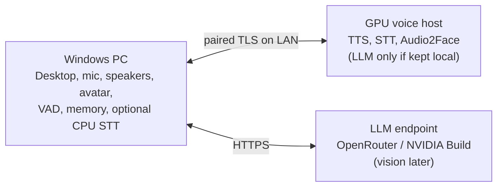
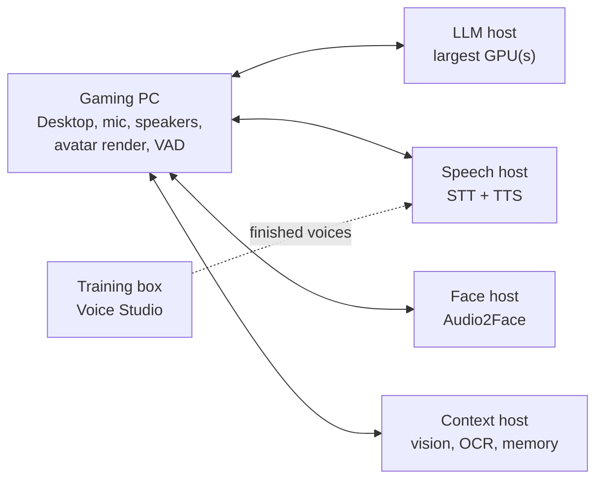

# Recommended setups: one machine to unlimited budget

**Planning guide, 2026-09-29.** This page answers "what must run on my PC,
what can an API or another machine do, and how should I split the work?"
VRAM/RAM figures are rough upstream model-size estimates for planning, **not
Martlet measurements**; no GPU/driver/model tuple is qualified yet
([Ubuntu host matrix](INSTALLATION_SUPPORT.md#proposed-matrix)). Leave 10-15%
VRAM headroom and measure your own machine.

**In the app:** **Which setup is right for me?** on the home screen asks for
your goal (balanced, smartest, fastest or private), features and computers. It
then shows this guidance for each role: where the role runs, what it does, why,
what data leaves your PC, how to set it up, and what to use until planned parts
arrive. It saves, installs and contacts nothing. The recommendations and availability labels live in
[`SetupAdvisor.cs`](../src/Martlet.Core/Installation/SetupAdvisor.cs); update
them when a route ships.

## 1. What must stay on the PC you talk to

These parts touch your devices, screen, keys or consent, so they always run in
the Windows Desktop app. None needs a strong GPU.

| Part | Why it is local | Compute |
| --- | --- | --- |
| Desktop app, setup, consent, Stop/mute | It is the control surface and owns every per-action permission | CPU |
| Microphone capture and speaker playback | Physical devices; the playback clock drives lip-sync | CPU |
| Turn orchestration, participation policy, persona, routing | The client decides which destination each role uses; hosts never call each other | CPU |
| Voice activity detection / future barge-in | Must sit next to the microphone to cut speech off quickly | CPU (small ONNX model) |
| API keys and host pairing secrets | Windows Credential Manager | CPU |
| Local memory store and retrieval | Only matching facts are sent to the LLM, never the whole store | CPU |
| Avatar renderer (Live2D/VRM overlay) and loudness lip-sync | Draws on your screen | Light WebGL; any GPU or iGPU |
| Selected-window capture (future screen context) | Capture is local; analysis may be remote | CPU |

## 2. What can be delegated

Each AI role below can run on a cloud API (where one is offered), on this PC
or on a paired Martlet host. Each role has exactly one destination and never
silently falls back to another provider. The one exception is lip-sync's
default **Auto** mode, which is documented below.

| Role | API option | Local CPU option | GPU option | Notes |
| --- | --- | --- | --- | --- |
| Speech-to-text (STT) | OpenAI transcription | Windows offline recognizer; whisper.cpp `base.en` (~150 MB, ~0.4 GB RAM) | Whisper large-v3-turbo class, ~2-4 GB VRAM | Most privacy-sensitive: raw microphone audio. CPU is enough for short push-to-talk turns. |
| Conversation LLM | Any OpenAI-compatible Chat Completions endpoint: **OpenRouter**, any chat model on **NVIDIA Build**, OpenAI, or another HTTPS provider | Not recommended (slow) | Ollama/llama.cpp: 7-9B Q4 ~5-7 GB, 12-14B Q4 ~9-11 GB, 24-32B Q4 ~16-22 GB, plus ~1-2 GB context | Largest VRAM consumer and the easiest role to offload. Hosted models are usually larger and smarter than what fits locally. |
| Text-to-speech (TTS) | OpenAI (fixed voices) | Windows installed voices (robotic, free) | One Voice Studio engine (F5, Qwen3-TTS, Chatterbox, GPT-SoVITS, XTTS-v2), ~2-6 GB | A custom or cloned voice requires self-hosted GPU TTS. Keep one engine resident. |
| Lip-sync analysis | None supported | Loudness lip-sync (built in) | NVIDIA Audio2Face-3D NIM, NVIDIA only, 4 GB+ | Automatic mode uses local Audio2Face, then a paired host, then loudness. |
| Screen understanding (future) | Vision-capable models on OpenRouter, NVIDIA Build or OpenAI | Tesseract OCR | Pinned unquantized LLaVA-NeXT 7B, ~16 GB+ | Bursty and heavy; keep it off the live voice GPU when possible. |
| Memory embeddings/reranking (future) | Possible | Small models run on CPU | Optional | Current memory is lexical and fully local. |
| Voice Studio training (future) | None | No | Often most of a 12-24 GB card for hours | Run it where it cannot stall live conversation. |

**Nothing requires a GPU.** The minimum working setup is the Windows app plus
an API. Only Audio2Face lip-sync strictly needs an NVIDIA GPU, and loudness
lip-sync replaces it on any PC.

### Offload the LLM first

The LLM uses the most VRAM and is the easiest role to move off your GPU.
Martlet's Chat Completions route accepts any OpenAI-compatible HTTPS base URL
(choose it under **Setup > Destinations > LLM provider / endpoint**; see
[Setup](SETUP.md)). Two endpoints are named in Martlet:
**OpenRouter** (`https://openrouter.ai/api/v1`, with models from many vendors
under one key) and **NVIDIA Build** (`https://integrate.api.nvidia.com/v1`,
any chat model in its catalog). Both host open-weight models much larger than
a consumer GPU can hold, and you can change the model ID without reinstalling
anything. This leaves the local GPU free for voice and face.

The tradeoff is data and cost. Transcripts and conversation text go to that
provider; OpenRouter also forwards requests to the upstream provider it routes
to. Pricing and retention vary by model, so check them before choosing.
Run the LLM locally if you need privacy, offline use, no per-token charges or
the fastest responses (see [Choose a goal](#choose-a-goal)).

### Where a GPU helps most

For the balanced default (best answers plus your own voice and face), spend
VRAM in this order:

1. **TTS**: custom voice, low latency, no per-character cost, small footprint.
2. **Audio2Face**: the only way to get rich facial animation.
3. **STT**: keeps microphone audio at home and improves accuracy. CPU is fine
   for push-to-talk, so this is optional.
4. **LLM**: uses the most VRAM. Offload it to OpenRouter or NVIDIA Build unless
   you need privacy, offline use, no per-token charges or the fastest responses.
5. **Vision**: heaviest and least latency-sensitive. Use a hosted vision model or a separate machine.

### Choose a goal

| Goal | LLM | STT | TTS | Why |
| --- | --- | --- | --- | --- |
| Best answers | Large hosted model (OpenRouter, NVIDIA Build, OpenAI) | CPU or API | Local GPU | Frontier-size models without VRAM limits |
| Fastest responses | Small or mid-size model on a **dedicated local GPU** | CPU | API, Windows voices, or GPU TTS on another machine | No internet round trip or provider queue for the slowest stage |
| Private or offline | Local | Local | Local | Nothing leaves your machines |
| Gaming on the Martlet PC | Hosted or on another machine | API, CPU or another machine | API or another machine | The game keeps the GPU |

**Why a local LLM can be fastest.** Martlet speaks sentence by sentence: the
first sentence goes to TTS while the LLM is still writing the rest. The wait
after you stop talking is roughly STT time, plus the LLM's time to its first
sentence, plus TTS time to first audio. A hosted LLM adds an internet round
trip and possible provider queueing before the first token. A small model that
fits entirely in an idle GPU's VRAM starts almost immediately and generates
quickly. The tradeoff is answer quality: smaller models are less capable than
large hosted ones. These are expectations, not Martlet measurements.

## 3. One machine (Windows PC with a good NVIDIA GPU)

Run Martlet natively on Windows. Run GPU services on the same PC through
**Martlet hosts > This PC** (Docker Desktop with WSL2). A native Windows LLM
server such as Ollama or LM Studio can use a loopback address. WSL2 uses the
same RAM and VRAM; it does not add capacity. Plan on **32 GB system RAM**
(64 GB is comfortable).

**If you game on this PC**, a game and local models compete for the same VRAM
and frame time. While gaming, put the LLM on OpenRouter or NVIDIA Build (and
STT/TTS on an API if you want), and use loudness lip-sync. Add local TTS and
Audio2Face only if the game leaves enough VRAM free.

**If the PC is mostly for Martlet**, the recommended default puts the LLM on an
endpoint (OpenRouter, NVIDIA Build or OpenAI), so VRAM goes to voice and face.
The last column shows what else fits if you want the LLM local too.

| VRAM | STT | TTS | Lip-sync | Vision | Local LLM that also fits |
| --- | --- | --- | --- | --- | --- |
| 8 GB | CPU | Local GPU (one engine) | Loudness, or Audio2Face instead of local TTS | Endpoint | None; use an endpoint |
| 12 GB | CPU | Local GPU | Audio2Face | Endpoint | 3-4B at most |
| 16 GB | CPU or local GPU | Local GPU | Audio2Face | Endpoint | 7-8B Q4, with STT on CPU |
| 24 GB | Local GPU | Local GPU | Audio2Face | Endpoint, or load on demand | 12-14B Q4 |
| 32 GB+ | Local GPU | Local GPU | Audio2Face | Local possible | 14B+ Q4, or 24B+ without local vision |

**Recommended hybrid:** LLM on OpenRouter or NVIDIA Build (any model you
like), local CPU STT, local GPU TTS with your voice, and local Audio2Face.
Microphone audio and your voice stay at home, and the GPU goes where it helps most.

**Fastest responses on one PC:** give the whole GPU to the LLM, and serve it
over loopback from Ollama, LM Studio or llama.cpp. Use STT on the CPU, and use
API speech or Windows voices for TTS, so nothing else competes for the GPU.
Use loudness lip-sync. Choose the smallest model whose answers you like, and
keep every layer in VRAM: spilling layers to system RAM makes generation much
slower.

| VRAM | Fast local LLM (all layers on GPU, room for context) |
| --- | --- |
| 8 GB | 3-4B, or 7-8B Q4 with a short context |
| 12 GB | 7-8B Q4-Q6 |
| 16 GB | 7-8B Q8, or 12-14B Q4 |
| 24 GB | 12-14B Q4-Q8 |
| 32 GB+ | 24-32B Q4, or a faster 12-14B at higher precision |

## 4. Two machines

- **PC 1: Windows client.** It runs everything in section 1, and the game gets
  its full GPU. Keep STT here on CPU if you do not want microphone audio on the LAN.
- **PC 2: voice host.** Use Ubuntu 24.04 with Docker and the NVIDIA Container
  Toolkit (preferred), or Windows with Docker Desktop. One paired gateway can
  serve TTS, STT and Audio2Face. With the LLM on OpenRouter or NVIDIA Build,
  an 8-12 GB card is enough. Add a local LLM only if you need it, and size it
  with the one-machine VRAM table.
- Use wired Ethernet between them. On a LAN, extra latency is small next to
  model time.
- **For the fastest responses**, run a local LLM on PC 2 as well, sized with
  the fastest-responses table above. Then no stage crosses the internet. If
  PC 2's GPU is small, give it the LLM alone and use API speech or Windows voices.
  The Chat Completions route accepts plain HTTP only on loopback, so a LAN LLM
  needs HTTPS or the planned Martlet host LLM role.

## 5. Three machines

With the LLM on OpenRouter or NVIDIA Build, most people do not need a third
machine. Add one when you want a local LLM, local vision or voice training:

- **Client:** the Windows PC, as above.
- **Host 1: voice host** for latency-critical work: TTS, STT, Audio2Face, and
  the LLM if it is local.
- **Host 2: context host** for bursty or long jobs: vision/OCR, future memory
  embeddings/reranking, Voice Studio training and previews.

This split keeps a screenshot question or training job from taking VRAM from
live speech. If you want a local LLM and Host 1 cannot fit it with speech,
split by size: put the **LLM on the largest GPU** and speech (STT, TTS,
Audio2Face) on the other host. Then use a hosted model for vision. This
"LLM host + speech host" split is also the fastest three-machine layout:
neither GPU waits on the other, and no stage crosses the internet.

## 6. Four or more machines (unlimited budget)

With no budget limit, give every heavy role its own machine and leave the
gaming PC with only what must be local (section 1). The full layout below uses
six machines; with four or five, merge roles as described after the table.
Martlet's load on the gaming PC is then the Desktop app, audio devices, VAD and
avatar rendering (light WebGL), so the game keeps nearly all of its CPU and GPU.

| Machine | Runs | Suggested GPU class | Why separate |
| --- | --- | --- | --- |
| Gaming PC (client) | Section 1 only | Whatever the game needs | Martlet takes almost nothing from the game |
| LLM host | Conversation LLM | Fastest: a mid-size model fully on a 32 GB card. Smartest local: 70B-class Q4 needs ~40-48 GB (a 48 GB+ workstation card or several GPUs in one host); 100B+ needs ~96 GB+ | The LLM is the slowest stage; an idle dedicated GPU gives the quickest first sentence |
| Speech host | STT (large Whisper class) and your TTS voice | 16-24 GB | STT and TTS run back to back on every turn; nothing else delays them |
| Face host | Audio2Face | 8-16 GB NVIDIA | Animates one sentence while TTS makes the next, with no contention |
| Context host | Vision/OCR, future memory embeddings/reranking | 24-48 GB for a local vision model | Screenshot questions are bursty and heavy |
| Training box | Voice Studio fine-tuning and previews | 24 GB+ | Hours of training never touch the live path |

With four or five machines, merge in this order: training box into the context
host, face host into the speech host, then the context host into the speech
host or a hosted vision model. Rules that still apply:

- Each role has one destination. Martlet does not split a role across hosts or
  load-balance between them. A role can use several GPUs inside one host
  through the engine's own multi-GPU support.
- You can keep a fast local model and a large hosted model configured, but
  only one LLM route is active. Switching is a settings change, not automatic.
- Even here, a hosted frontier model (OpenRouter, NVIDIA Build) gives the best
  answers. Local hardware buys speed, privacy, a custom voice and a face.
- Put every machine on the same wired switch. Audio, text and screenshots are
  small, so 1 GbE is plenty, and a LAN hop adds only milliseconds per stage.
- More desktops can pair to the same hosts (run `pair` once per desktop). The
  F5 and vision workers run one job at a time (a second request gets `busy`),
  so desktops sharing a host take turns.

## 7. What works today

| Route | Status in the current Desktop |
| --- | --- |
| OpenAI STT, LLM, TTS | **Working** conversation route |
| OpenAI-compatible Chat Completions LLM (OpenRouter, NVIDIA Build, any HTTPS `/v1` API, loopback Ollama/LM Studio/llama.cpp/vLLM) | **Working** conversation route for the LLM; STT/TTS still use OpenAI |
| Live2D/VRM avatar and loudness lip-sync | **Working** on this PC |
| Audio2Face on this PC or a paired Martlet host | **Working path**; Docker method verified with a stand-in role, **not yet run on a real GPU** |
| Local memory, personas | **Working**, local only |
| Windows offline STT and Windows voices TTS | Libraries and setup exist; **not yet dispatched** |
| Host LLM (Ollama), F5 TTS, STT, vision | Worker/adapter foundations; **no host role or gateway relay yet** |
| whisper.cpp local STT, VAD/barge-in, Voice Studio synthesis/training | Disabled candidates or preparation only |

Today, a single GPU PC can run Martlet with API STT/TTS, an LLM on OpenAI,
OpenRouter, NVIDIA Build or a local loopback LLM server, plus a local avatar
and Audio2Face. The recommended layouts need these pieces, smallest first:

1. Dispatch the Windows offline STT/TTS routes for free, offline CPU speech.
2. Add gateway relay workers and `martlet-host` roles for F5 TTS, STT and the LLM,
   so GPU speech and LLM can run on this PC or a host.

See [installation design](INSTALLATION_SUPPORT.md#feature-first-multi-machine-setup),
[Martlet host](../deploy/host/README.md), [architecture](ARCHITECTURE.md#1-components-ownership-and-topology)
and [Voice Studio](VOICE_STUDIO.md) for details.
