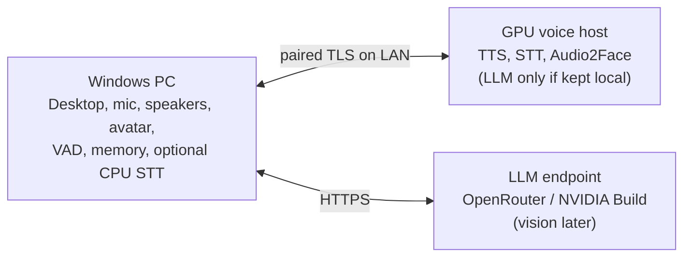
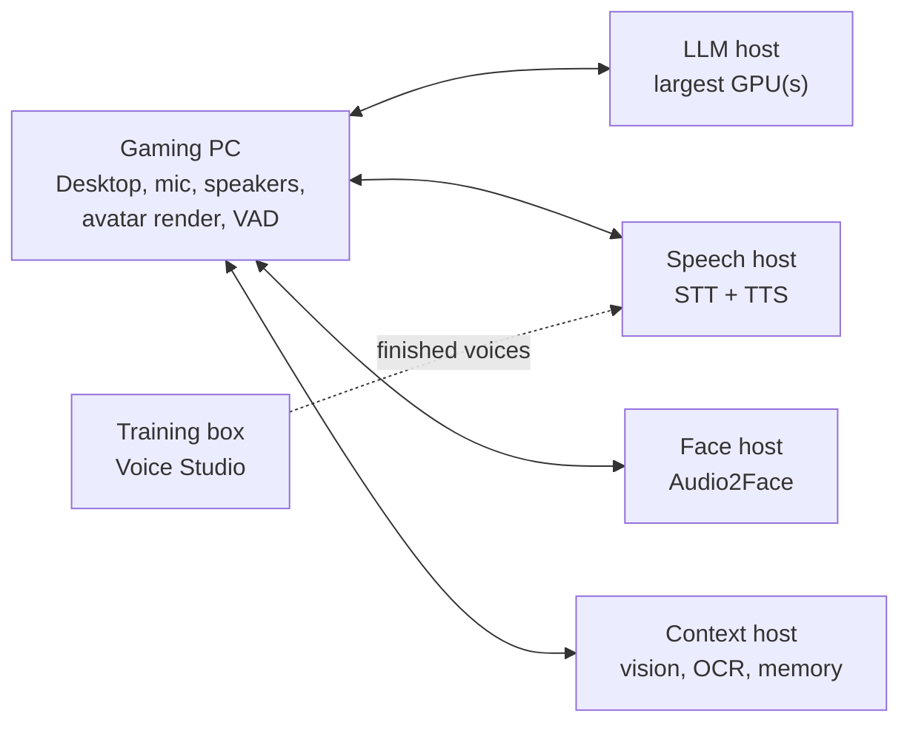

# Recommended setups: one machine to unlimited budget

**Planning guide, 2026-09-29.** This page answers "what must run on my PC,
what can an API or another machine do, and how should I split the work?"
VRAM/RAM figures are rough upstream model-size estimates for planning, **not
Martlet measurements**; no GPU/driver/model tuple is qualified yet
([Ubuntu host matrix](INSTALLATION_SUPPORT.md#proposed-matrix)). Leave 10-15%
VRAM headroom and measure your own machine. Per-model numbers, with which are
measured, sourced or estimated, are in [Resource footprints](RESOURCE_FOOTPRINTS.md).

**In the app:** the welcome tour's **Recommend a setup for me**, or **Plan a
setup from scratch** on Home, opens the setup advisor. It asks for
your goal (balanced, smartest, fastest or private), features and computers. For
computers it reads this PC's graphics card from Windows and fills in each paired
Martlet host with the GPU it reported (see
[What the host tells Martlet](../deploy/host/README.md#what-the-host-tells-martlet));
you pick the GPU of any other computer, one per computer, including "Has a GPU,
not sure which" (planned as an 8 GB NVIDIA card). It then recommends what each
computer should be used for and shows this guidance for each role: where the role runs, what it does, why,
what data leaves your PC, how to set it up, and what to use until planned parts
arrive. When the plan runs Ollama, Windows speech or Docker Desktop on this PC and
one is missing, **Install on this PC** installs just those; otherwise it saves,
installs and contacts nothing. The recommendations and availability labels live in
[`SetupAdvisor.cs`](../src/Martlet.Core/Installation/SetupAdvisor.cs); update
them when a route ships.

**Recommended setup on Home (the computers you have now):** on a companion PC,
**Recommended setup** plans all the computers in your Martlet network from what
this PC already knows. It contacts nothing to plan. It uses each computer's
hardware report, the roles its last check found, the shared "who does what"
plan, Devices › Sharing work, the Thinking pool, your voice engine and your
provider keys ([`RecommendedSetupInputs.cs`](../src/Martlet.Desktop/RecommendedSetupInputs.cs)).
The network recommender (`NetworkRecommender`) then applies
[its rules](#recommended-setup-for-all-your-computers). Companion PCs stay light because they often run games, and each graphics
card runs at most one language model. A review window first lists **every part,
in priority order** ([the priority list](#the-priority-list)): where each part
runs, or *Off* and why, with an **Off** choice for each optional part that
runs on your computers' host services (Vision, Reading, Hearing and Smart home
are turned off on their Companion pages). Then it
shows each computer today and in the recommended setup, with a resource bar
like the Devices page, including what a companion PC does itself (Thinking in
Ollama, Parakeet). It also shows who does each job (Speaking, Listening,
Thinking, lip-sync and the Thinking pool) and every change with why, in the
order Reconfigure makes them. It lists notes, downloads and what
needs someone at a computer. **Reconfigure** applies the setup on every computer
as a background task: its run window shows the progress, and Background tasks
keeps it after you hide that window. **Not now** closes the review, and this PC doesn't ask
about the same setup again. Nothing changes before Reconfigure. On a PC that is
in no Martlet network, the button runs **Set it all up for me** instead: the same
recommendation for one PC, with one confirmation. When a computer comes back,
or stays away longer than the time chosen in Settings › Your other computers (10
minutes by default), each companion PC checks again
in the background. It never checks while Martlet replies or hears you. When the
setup is already right, or only minor changes would help, nothing shows (one
log line). Otherwise the companion PC someone used in the last 10 minutes shows
**A better setup is ready for your computers** on Home, with **Review**. It
also shows a notification while Martlet's window is hidden. A companion PC
that nobody uses keeps the suggestion for an hour and asks when someone uses
it. Setups declined on that PC are not asked about again.

**Not in the installer:** setup asks no questions, so the advisor above is the
single place these rules live. The installer only offers to start Martlet, whose
welcome tour then asks what the PC is for.

## 1. What must stay on the PC you talk to

These parts touch your devices, screen, keys or consent, so they always run in
the Windows Desktop app. None needs a strong GPU.

| Part | Why it is local | Compute |
| --- | --- | --- |
| Desktop app, setup, consent, Stop/mute | It is the control surface and owns every per-action permission | CPU |
| Microphone capture and speaker playback | Physical devices; the playback clock drives lip-sync | CPU |
| Turn orchestration, participation policy, persona, routing | The client decides which destination each role uses; hosts never call each other | CPU |
| Voice activity detection / future barge-in | Must sit next to the microphone to cut speech off quickly | CPU (small ONNX model) |
| API keys and host pairing secrets | Windows Credential Manager | CPU |
| Local memory store and retrieval | Only matching facts are sent to the LLM, never the whole store | CPU |
| Avatar renderer (Live2D/VRM overlay) and loudness lip-sync | Draws on your screen | Light WebGL; any GPU or iGPU |
| Selected-window capture (future screen context) | Capture is local; analysis may be remote | CPU |

## 2. What can be delegated

Each AI role below can run on a cloud API (where one is offered), on this PC
or on a paired Martlet host. Each role has exactly one destination and never
silently falls back to another provider. The exceptions are lip-sync's
default **Auto** mode, documented below, and opt-in
[failover](CLUSTER.md#failover), which moves a job to another of your own
paired hosts running the same engine when its host stops answering (announced,
never to a cloud provider).

| Role | API option | Local CPU option | GPU option | Notes |
| --- | --- | --- | --- | --- |
| Speech-to-text (STT) | OpenAI transcription | Windows offline recognizer; whisper.cpp `base.en` (~150 MB, ~0.4 GB RAM) | Whisper large-v3-turbo class, ~2-4 GB VRAM | Most privacy-sensitive: raw microphone audio. CPU is enough for short push-to-talk turns. |
| Conversation LLM | Any OpenAI-compatible Chat Completions endpoint: **OpenRouter**, any chat model on **NVIDIA Build**, OpenAI, or another HTTPS provider | Not recommended (slow) | Ollama/llama.cpp: 7-9B Q4 ~5-7 GB, 12-14B Q4 ~9-11 GB, 24-32B Q4 ~16-22 GB, plus ~1-2 GB context | Largest VRAM consumer and the easiest role to offload. Hosted models are usually larger and smarter than what fits locally. |
| Text-to-speech (TTS) | OpenAI (fixed voices) | Chatterbox Nano on the processor (free, about 8 threads, needs Docker) | One Voice Studio engine (Chatterbox Turbo ~6 GB, the default, which can also laugh and sigh; F5 ~6 GB, XTTS-v2 ~4 GB, GPT-SoVITS ~4 GB or Dia ~8 GB (English only, can laugh, sigh and cough); Qwen3-TTS planned), ~2-6 GB | A custom or cloned voice requires self-hosted GPU TTS. Keep one engine resident. XTTS-v2 streams while it generates, so replies start sooner; F5 often sounds closer to the recording. The F5 and XTTS-v2 models are non-commercial only; Chatterbox and GPT-SoVITS are MIT; Dia is Apache-2.0. |
| Lip-sync analysis | None supported | Loudness lip-sync (built in) | NVIDIA Audio2Face-3D on a Martlet host (open-source engine, no key; or NVIDIA's NIM with an NGC key), NVIDIA RTX 20+ only, 4 GB+ | Automatic mode uses local Audio2Face, then a paired host, then loudness. |
| Screen understanding (future) | Vision-capable models on OpenRouter, NVIDIA Build or OpenAI | Tesseract OCR | Pinned unquantized LLaVA-NeXT 7B, ~16 GB+ | Bursty and heavy; keep it off the live voice GPU when possible. |
| Memory embeddings/reranking (future) | Possible | Small models run on CPU | Optional | Current memory is lexical and fully local. |
| Voice Studio training (future) | None | No | Often most of a 12-24 GB card for hours | Run it where it cannot stall live conversation. |

**Nothing requires a GPU or an account.** The minimum working setup is the
Windows app on its own: Thinking runs a small model on the processor (slower,
but free and with no sign-up). A graphics card makes it quicker, and an online
model is optional. Only Audio2Face lip-sync strictly needs an NVIDIA GPU, and loudness
lip-sync replaces it on any PC. The advisor and the **Martlet prerequisites**
tool install what each layout needs on the Windows PC (Windows speech, Ollama,
WSL 2 + Docker Desktop); see [Prerequisites](PREREQUISITES.md).

### An online LLM is optional

An online model is the easiest way to free your GPU, but it needs an account
with the provider (a sign-up and an API key). So the advisor's Balanced goal
keeps Thinking on your own computers, and only *Smartest answers* sends it online.
Martlet's Chat Completions route accepts any OpenAI-compatible HTTPS base URL
(choose it under **Setup > Destinations > LLM provider / endpoint**; see
[Setup](SETUP.md)). Two endpoints are named in Martlet:
**OpenRouter** (`https://openrouter.ai/api/v1`, with models from many vendors
under one key) and **NVIDIA Build** (`https://integrate.api.nvidia.com/v1`,
any chat model in its catalog). Both host open-weight models much larger than
a consumer GPU can hold, and you can change the model ID without reinstalling
anything. This leaves the local GPU free for voice and face.

The tradeoff is data, cost and the sign-up. Transcripts and conversation text go to that
provider; OpenRouter also forwards requests to the upstream provider it routes
to. Pricing and retention vary by model, so check them before choosing.
Run the LLM locally if you need privacy, offline use, no account, no per-token charges or
the fastest responses (see [Choose a goal](#choose-a-goal)).

### Where a GPU helps most

For the balanced default (the advisor's *Balanced* goal), spend VRAM in this
order. Martlet needs Thinking to answer, so it gets the card first:

1. **LLM**: free and private on your own card, with no account. With no card
   free, a small model runs on the processor. An online model (see above)
   frees the card if you have an account.
2. **TTS**: custom voice, low latency, no per-character cost, small footprint.
3. **Audio2Face**: the only way to get rich facial animation.
4. **STT**: keeps microphone audio at home and improves accuracy. CPU is fine
   for push-to-talk, so this is optional.
5. **Vision**: heaviest and least latency-sensitive. Use a hosted vision model or a separate machine.

### Choose a goal

| Goal | LLM | STT | TTS | Why |
| --- | --- | --- | --- | --- |
| Balanced (the default) | Local: the GPU first, else the processor | CPU | Local GPU when room is left, else CPU | Free, with no account or sign-up; Thinking gets the card first |
| Best answers | Large hosted model (OpenRouter, NVIDIA Build, OpenAI) | CPU or API | Local GPU | Frontier-size models without VRAM limits |
| Fastest responses | A **small** local model that hears (Gemma 4 E2B) on the GPU | Parakeet on the CPU, or none (the model hears) | Cloned voice on the same GPU | No internet round trip or provider queue; a small model answers soonest |
| Private or offline | Local | Local | Local | Nothing leaves your machines |
| Gaming on the Martlet PC | On another machine, else the processor (or hosted, with an account) | API, CPU or another machine | API or another machine | The game keeps the GPU |

**Why a local LLM can be fastest.** Martlet speaks sentence by sentence: the
first sentence goes to TTS while the LLM is still writing the rest. The wait
after you stop talking is roughly STT time, plus the LLM's time to its first
sentence, plus TTS time to first audio. A hosted LLM adds an internet round
trip and possible provider queueing before the first token. A small model that
fits entirely in an idle GPU's VRAM starts almost immediately and generates
quickly. The tradeoff is answer quality: smaller models are less capable than
large hosted ones. These are expectations, not Martlet measurements.

## 3. One machine (Windows PC with a good NVIDIA GPU)

Run Martlet natively on Windows. Run GPU services on the same PC through
**Martlet hosts > This PC** (Docker Desktop with WSL2). A native Windows LLM
server such as Ollama or LM Studio can use a loopback address. WSL2 uses the
same RAM and VRAM; it does not add capacity. Plan on **32 GB system RAM**
(64 GB is comfortable).

**If you game on this PC**, a game and local models compete for the same VRAM
and frame time. While gaming, the advisor's Balanced plan runs Thinking on
another of your computers, or on this PC's processor (slower, but free and with
no account). With an account, OpenRouter or NVIDIA Build is quicker (and
STT/TTS can use an API if you want). Use loudness lip-sync. Add local TTS and
Audio2Face only if the game leaves enough VRAM free.

**If the PC is mostly for Martlet**, the advisor's Balanced plan puts Thinking
on the graphics card first; the voice and lip-sync use the room that is left.
If you have an account with an online provider, an endpoint (OpenRouter,
NVIDIA Build or OpenAI) frees the VRAM for voice and face instead: the table
shows that layout, and its last column shows what else fits with the LLM local too.

| VRAM | STT | TTS | Lip-sync | Vision | Local LLM that also fits |
| --- | --- | --- | --- | --- | --- |
| 8 GB | CPU | Local GPU (one engine) | Loudness, or Audio2Face instead of local TTS | Endpoint | None; use an endpoint |
| 12 GB | CPU | Local GPU | Audio2Face | Endpoint | 3-4B at most |
| 16 GB | CPU or local GPU | Local GPU | Audio2Face | Endpoint | 7-8B Q4, with STT on CPU |
| 24 GB | Local GPU | Local GPU | Audio2Face | Endpoint, or load on demand | 12-14B Q4 |
| 32 GB+ | Local GPU | Local GPU | Audio2Face | Local possible | 14B+ Q4, or 24B+ without local vision |

**Hybrid with an account:** LLM on OpenRouter or NVIDIA Build (any model you
like; the prefilled defaults also see your screen, and NVIDIA Build's
`google/diffusiongemma-26b-a4b-it` is a fast Free Endpoint), local CPU STT, local GPU TTS with your voice, and local Audio2Face.
Microphone audio and your voice stay at home, and the GPU goes where it helps most.

**Fastest responses on one PC (the advisor's *Fastest* goal):** a small model
that hears, **Gemma 4 E2B in Ollama on this PC** (about 3.3 GB), beside your
cloned voice (Chatterbox Turbo, streaming) on the same graphics card, and
Parakeet speech-to-text on the processor. Measured on an RTX 4070 12 GB: about
0.73-0.81 s from the end of the recording to the first audio. With Thinking on
this PC, *Let Thinking hear my voice* is on unless you turn it off (the
recording never leaves this PC), so *Send my voice straight to Thinking* skips the
transcript on the way to the reply. Bigger models are smarter but slower (E4B, 12B: 100-200 ms more to
the first sentence), and one that overfills the card pages into system memory
and stalls. Keep every layer in VRAM ([Voice latency](VOICE_LATENCY.md#local-options-measured-voicebench)).

| VRAM | Fast local LLM (all layers on GPU, room for context) |
| --- | --- |
| 8 GB | Gemma 4 E2B (voice on another machine or the API), or 3-4B |
| 12 GB | Gemma 4 E2B beside the cloned voice (smarter: E4B or 7-8B Q4, slower) |
| 16 GB | Gemma 4 E2B beside the voice (smarter: 12-14B Q4) |
| 24 GB | Gemma 4 E2B beside the voice (smarter: 12-14B Q4-Q8) |
| 32 GB+ | Gemma 4 E2B beside the voice (smarter: 24-32B Q4) |

## 4. Two machines

- **PC 1: Windows client.** It runs everything in section 1, and the game gets
  its full GPU. Keep STT here on CPU if you do not want microphone audio on the LAN.
- **PC 2: voice host.** Use Ubuntu 24.04 with Docker and the NVIDIA Container
  Toolkit (preferred), or Windows with Docker Desktop. One paired gateway can
  serve TTS, STT and Audio2Face. With the LLM on OpenRouter or NVIDIA Build,
  an 8-12 GB card is enough. Add a local LLM only if you need it, and size it
  with the one-machine VRAM table.
- Use wired Ethernet between them. On a LAN, extra latency is small next to
  model time.
- **For the fastest responses**, run a local LLM on PC 2 as well, sized with
  the fastest-responses table above. Then no stage crosses the internet. If
  PC 2's GPU is small, give it the LLM alone and use API speech or Chatterbox Nano on the processor.
  The Chat Completions route accepts plain HTTP only on loopback, so a LAN LLM
  needs HTTPS or the planned Martlet host LLM role.

## 5. Three machines

With the LLM on OpenRouter or NVIDIA Build, most people do not need a third
machine. Add one when you want a local LLM, local vision or voice training:

- **Client:** the Windows PC, as above.
- **Host 1: voice host** for latency-critical work: TTS, STT, Audio2Face, and
  the LLM if it is local.
- **Host 2: context host** for bursty or long jobs: vision/OCR, future memory
  embeddings/reranking, Voice Studio training and previews.

This split keeps a screenshot question or training job from taking VRAM from
live speech. If you want a local LLM and Host 1 cannot fit it with speech,
split by size: put the **LLM on the largest GPU** and speech (STT, TTS,
Audio2Face) on the other host. Then use a hosted model for vision. This
"LLM host + speech host" split is also the fastest three-machine layout:
neither GPU waits on the other, and no stage crosses the internet.

## 6. Four or more machines (unlimited budget)

With no budget limit, give every heavy role its own machine and leave the
gaming PC with only what must be local (section 1). The full layout below uses
six machines; with four or five, merge roles as described after the table.
Martlet's load on the gaming PC is then the Desktop app, audio devices, VAD and
avatar rendering (light WebGL), so the game keeps nearly all of its CPU and GPU.

| Machine | Runs | Suggested GPU class | Why separate |
| --- | --- | --- | --- |
| Gaming PC (client) | Section 1 only | Whatever the game needs | Martlet takes almost nothing from the game |
| LLM host | Conversation LLM | Fastest: a mid-size model fully on a 32 GB card. Smartest local: 70B-class Q4 needs ~40-48 GB (a 48 GB+ workstation card or several GPUs in one host); 100B+ needs ~96 GB+ | The LLM is the slowest stage; an idle dedicated GPU gives the quickest first sentence |
| Speech host | STT (large Whisper class) and your TTS voice | 16-24 GB | STT and TTS run back to back on every turn; nothing else delays them |
| Face host | Audio2Face | 8-16 GB NVIDIA | Animates one sentence while TTS makes the next, with no contention |
| Context host | Vision/OCR, future memory embeddings/reranking | 24-48 GB for a local vision model | Screenshot questions are bursty and heavy |
| Training box | Voice Studio fine-tuning and previews | 24 GB+ | Hours of training never touch the live path |

With four or five machines, merge in this order: training box into the context
host, face host into the speech host, then the context host into the speech
host or a hosted vision model. Rules that still apply:

- Each role has one destination. Martlet does not split a role across hosts or
  load-balance between them. A role can use several GPUs inside one host
  through the engine's own multi-GPU support.
- You can keep a fast local model and a large hosted model configured, but
  only one LLM route is active. Switching is a settings change, not automatic.
- Even here, a hosted frontier model (OpenRouter, NVIDIA Build) gives the best
  answers. Local hardware buys speed, privacy, a custom voice and a face.
- Put every machine on the same wired switch. Audio, text and screenshots are
  small, so 1 GbE is plenty, and a LAN hop adds only milliseconds per stage.
- More desktops can pair to the same hosts (run `pair` once per desktop). The
  F5 and vision workers run one job at a time (a second request gets `busy`),
  so desktops sharing a host take turns.

## 7. What works today

| Route | Status in the current Desktop |
| --- | --- |
| OpenAI STT, LLM, TTS | **Working** conversation route |
| OpenAI-compatible Chat Completions LLM (OpenRouter, NVIDIA Build, any HTTPS `/v1` API, loopback Ollama/LM Studio/llama.cpp/vLLM) | **Working** conversation route for the LLM; STT/TTS still use OpenAI |
| Live2D/VRM avatar and loudness lip-sync | **Working** on this PC |
| Audio2Face on this PC or a paired Martlet host | **Working path**; Docker method verified with a stand-in role, **not yet run on a real GPU** |
| Local memory, personas | **Working**, local only |
| Windows offline STT | Library and setup exist; **not yet dispatched** (Windows voices were removed) |
| Host LLM (Ollama), F5 TTS, STT, vision | Worker/adapter foundations; **no host role or gateway relay yet** |
| whisper.cpp local STT, VAD/barge-in, Voice Studio synthesis/training | Disabled candidates or preparation only |

Today, a single GPU PC can run Martlet with API STT/TTS, an LLM on OpenAI,
OpenRouter, NVIDIA Build or a local loopback LLM server, plus a local avatar
and Audio2Face. The recommended layouts need these pieces, smallest first:

1. Dispatch the Windows offline STT/TTS routes for free, offline CPU speech.
2. Add gateway relay workers and `martlet-host` roles for F5 TTS, STT and the LLM,
   so GPU speech and LLM can run on this PC or a host.

See [installation design](INSTALLATION_SUPPORT.md#feature-first-multi-machine-setup),
[Martlet host](../deploy/host/README.md), [architecture](ARCHITECTURE.md#1-components-ownership-and-topology)
and [Voice Studio](VOICE_STUDIO.md) for details.

## Recommended setup for all your computers

Home's recommended setup plans every computer in your
[Martlet network](NETWORK.md) at once. The planner is
`NetworkRecommender` in
[`Martlet.Core/Planning`](../src/Martlet.Core/Planning/NetworkRecommender.cs).
It reads each computer's kind (companion PC or host), its graphics cards,
memory and processor, the host roles it runs, who does each job today and
your choices. It gives the recommended setup and the list of changes that get
there. It is pure: it reads no files and contacts no computer, and the same
network always gives the same recommendation.

### The priority list

One list decides what gets resources first and what Reconfigure sets up first.
It is `ComponentRanking` in
[`PlanComponent.cs`](../src/Martlet.Core/Planning/PlanComponent.cs), and the
placement engine, the network recommender, the setup advisor, the welcome tour
and the Devices page all use it. The review window shows it as **Every part, in
priority order**.

| # | Part | Needed or optional | Off means |
| --- | --- | --- | --- |
| 1 | Thinking | Needed: Martlet can't reply without it | Can't be off |
| 2 | Voice | Needed | Can't be off |
| 3 | Listening | Needed | Can't be off |
| 4 | Character | Needed (inside Martlet, needs very little) | Can't be off |
| 5 | Lip-sync (advanced, Audio2Face) | Optional | The character's face follows the voice's loudness |
| 6 | Vision (the image model) | Optional | Martlet doesn't look at your screen or camera |
| 7 | Reading (text on the screen) | Optional | Martlet doesn't read the text on your screen |
| 8 | Hearing (the audio model) | Optional | Martlet gets only the words you say, not how you say them |
| 9 | Deep thinking (the Thinking pool) | Optional | Martlet doesn't think things over in the background |
| 10 | Smart home (Home Assistant) | Optional | Martlet doesn't control your smart home |
| 11 | Singing | Optional | Martlet doesn't sing |
| 12 | Pictures | Optional | Martlet doesn't draw pictures |

The needed parts come first. The optional parts follow in the order they help
most. Vision, Reading and Hearing make every conversation better, and they
need nothing more while Thinking's own model sees and hears (Vision before
Reading, because Reading only reads while Martlet watches). Deep thinking
helps in the background. Smart home helps only in a home with smart devices.
Singing and pictures are fun on request, and they need the most graphics
memory.

- **Off is a normal state.** An optional part with no room, or with no
  processor option (singing, pictures, Deep thinking), is off. The review shows
  each part as *Off*, with why. You can also tick **Off** for an optional part
  in the review: Martlet saves the choice on this PC (`recommended-setup.json`),
  plans again without that part, and Reconfigure turns its roles off.
- **Turning a part off deletes nothing.** Reconfigure stops the part's roles
  and takes them out of the gateway, but the host keeps their models, images
  and data. Each host service reports the models it keeps (`downloads` in its
  machine report). When a part comes back, the review says *Start ... again*
  and *already downloaded*, and it shows no download size. The planner also
  prefers a computer that still has the model, and it does not need free disk
  space there.
- **Vision, Reading, Hearing and Smart home are this PC's choice.** You turn
  them on or off on their Companion pages (`sense-models.json`, `reading.json`,
  the talk preferences and the Home Assistant connection;
  `ComponentRanking.SetOnPage`). The review shows where each one runs and its
  page, but no **Off** box. Reading's role (`ocr`) goes when Reading is off on
  this PC and no other companion PC may use it. Home Assistant always stays,
  because it runs your home.
- **A companion PC's graphics card takes only Thinking and the voice.**
  Thinking goes first. Then comes your voice engine (Chatterbox Turbo) if it
  fits beside Thinking. If it doesn't fit, Chatterbox Nano goes on the card,
  or else on the processor. Everything else runs on the processor
  (Parakeet listening inside Martlet, Windows OCR, the Reading role, Home
  Assistant), or is off (advanced lip-sync then follows the voice's loudness).
  An image or audio model uses a companion PC's card only as Thinking's own
  model (a model that sees and hears, such as Gemma 4 E2B); the review notes
  when a model of its own runs there. What you already run on a companion PC's
  card stays only while room is left after Thinking and the voice.
- **Without an API key, Thinking runs on a graphics card first.** With no
  saved provider key, nothing hosted can think, so a local model (Gemma 4 E2B,
  or the model you used before, such as Gemma 4 E4B) takes a card before
  anything else. With a saved key, the voice may take the card, and Thinking
  then uses the hosted model when no card has room.
- **Reconfigure follows the same list.** It first removes optional parts that
  are going away (they free the card). Then it works job by job: Thinking first,
  then the jobs that free graphics memory (listening moving to the processor),
  then the rest in priority order. Each job is make before break: its new role,
  the job's move, then the old role. New Thinking pool models come last.

For example, one companion PC with a 12 GB RTX 4070, no API key and its hosts
switched off gets: Gemma 4 E4B (Thinking) and Chatterbox Turbo on the card,
Parakeet on the processor, lip-sync by the voice's loudness, and Deep thinking,
singing and pictures off. Reconfigure turns singing off first, then sets up
Thinking, then listening, lip-sync and the voice.

### Every way to extend Martlet

An audit (2026-10-08) of every host role in
[`deploy/host/roles`](../deploy/host/roles), every Companion page and every
feature. Each part that takes compute (a graphics card, a processor or an
online provider) is a ranked part in [the priority list](#the-priority-list),
with a catalog option and footprint for each way to run it
([`FootprintCatalog.Seed.cs`](../src/Martlet.Core/Planning/FootprintCatalog.Seed.cs),
[Resource footprints](RESOURCE_FOOTPRINTS.md)). `FootprintCatalogTests` checks
that every host role has a catalog option.

**Ranked parts** (they take compute):

| # | Part | What it is | Where it runs (compute) | Host role | Needed or optional | Can be off | Set up in |
| --- | --- | --- | --- | --- | --- | --- | --- |
| 1 | Thinking | The language model that writes every reply | A graphics card (any vendor, Ollama), the processor (slow), or online (NVIDIA Build, OpenRouter, OpenAI, any OpenAI-compatible server) | `ollama` | Needed | No | Companion › Thinking |
| 2 | Voice | Speaks every reply | An NVIDIA card (Chatterbox Turbo, Original or Nano, F5-TTS, XTTS-v2, GPT-SoVITS, Dia), the processor (Chatterbox Nano), or online (OpenAI, ElevenLabs) | `chatterbox`, `chatterbox-original`, `chatterbox-nano`, `f5`, `xtts`, `gpt-sovits`, `dia` | Needed | No | Companion › Voice |
| 3 | Listening | Turns speech into text; Voice ID, voice activity and echo cancellation run with it | The processor inside Martlet (Parakeet), an NVIDIA card or the processor (Whisper), or online (OpenAI) | `stt` | Needed | No | Companion › Listening |
| 4 | Character | Draws the Live2D or VRM character | Inside Martlet, any graphics card or iGPU | None | Needed | No | Companion › Character (and Speech bubbles, Emotes and motions, Eyes, Touch) |
| 5 | Lip-sync | Moves the character's face with the voice | Advanced: an NVIDIA RTX card (Audio2Face-3D); else the voice's loudness inside Martlet | `audio2face` | Optional (advanced) | Yes: loudness | Companion › Lip-sync |
| 6 | Vision | The image model: looks at your screen or a camera | Thinking's own model (nothing more), a graphics card (Ollama on this PC or a paired computer), or online | None (Ollama) | Optional | Yes | Companion › Vision |
| 7 | Reading | Reads the small text on the screen while Martlet watches | The processor: Windows OCR inside Martlet, or RapidOCR in the Reading role | `ocr` | Optional | Yes | Companion › Reading |
| 8 | Hearing | The audio model: hears how you say things | Thinking's own model (nothing more), a graphics card (Ollama on this PC), or online (NVIDIA Build's Nemotron 3 Nano Omni) | None (Ollama) | Optional | Yes | Companion › Hearing |
| 9 | Deep thinking | The Thinking pool: thinks longer, web research, screen and sound summaries, judges, helper jobs, check-ins | A graphics card, or online | `deep-thinking` | Optional | Yes | Companion › Thinking pool |
| 10 | Smart home | Home Assistant, the hub that controls your devices | The processor of a Linux computer with Docker Engine, always on, or your own hub | `home-assistant` | Optional | Yes | Companion › Smart home |
| 11 | Singing | Sings songs on request | A large NVIDIA card | `singing` | Optional | Yes | Companion › Singing |
| 12 | Pictures | Draws pictures on request | A large NVIDIA card (ComfyUI with Z-Image Turbo), or online (NVIDIA Build's FLUX, OpenRouter) | `pictures` | Optional | Yes | Companion › Pictures |

**Features without compute of their own** (they use the parts above, or
small work inside Martlet that the footprints count as always on):

| Feature | What it uses | Needed or optional | Can be off | Set up in |
| --- | --- | --- | --- | --- |
| Screen commentary, camera looks | Vision (and Reading); summaries on the Thinking pool | Optional | Yes | Companion › Vision |
| Web research | A search service online (a search API or your SearXNG), then Thinking or the Thinking pool | Optional, off by default | Yes | Companion › Thinking pool › Web research |
| Tools: MCP servers and the terminal | Programs you add, on this PC or online; the terminal runs PowerShell on this PC | Optional, the terminal off by default | Yes | Companion › Tools |
| Discord, Messaging (Telegram, WhatsApp) | The network, then Thinking, the voice and the other parts | Optional | Yes | Companion › Discord, Companion › Messaging |
| Memory, lorebooks | Words matched on this PC's processor (no embedding model) | Memory on by default; lorebooks optional | Yes | Companion › Memory, Companion › Lorebook |
| Check-ins and reminders | Thinking or the Thinking pool | Optional | Yes | Companion › Check-ins |
| People (voice recognition) | WeSpeaker on this PC's processor, inside Martlet (about 0.16 GB, 4 threads for 0.16 s per utterance) | On by default | Yes | Companion › People |
| Cloud providers | Online accounts and keys for Thinking, the voice, listening, Vision and Hearing | Optional | Yes | The page of each part |

Not in Martlet yet: Voice Studio training (it would take most of a large
graphics card for hours). When it ships, it becomes a ranked part.

### The rules

The planner uses these rules, in this order of importance:

1. **One language model per graphics card.** Thinking's model (the `ollama`
   role) and a Thinking pool model (the `deep-thinking` role) never share a
   card, and a host runs at most one of each. On a host with two or more
   NVIDIA cards, every role is pinned to one card
   ([`choice.gpu`](../deploy/host/README.md), `MARTLET_GPU`).
2. **One voice engine per card and per computer** (`exclusive=voice`;
   [Voice latency](VOICE_LATENCY.md)). Every computer uses your voice engine,
   because the Speaking pool needs the same engine everywhere.
3. **The voice gets its own card on Windows.** Windows moves a full card's
   memory into main memory instead of failing, and then the voice starts late
   ([Chatterbox](CHATTERBOX_VOICE.md#sharing-the-graphics-card)). When another
   card has room, the voice and the other jobs do not share a Windows card.
4. **Headroom.** Each card keeps 10% (at least 0.8 GB) free, and the planner
   never fills a card past that. It counts each model at its peak with its
   context, so every layer stays on the card
   ([Resource footprints](RESOURCE_FOOTPRINTS.md)).
5. **The live jobs come first.** A Thinking pool model goes on a card that no
   live job (thinking, listening, the voice, lip-sync) uses, when one exists
   ([Live turn first](CLUSTER.md#live-turn-first-on-a-shared-graphics-card)).
   Needed jobs always come before optional extras, in this order:
   1. Thinking (Martlet can't reply without it).
   2. The voice, listening and lip-sync (the rest of a conversation).
   3. Optional extras: Vision, Reading, Hearing, Deep thinking, Smart home,
      singing and pictures.

   Each needed job goes on a graphics card first and on the processor when no
   card has room, so Martlet never needs a provider that you must sign up for.
   Singing, pictures and the Reading role keep only the room that the needed
   jobs leave. When a needed job needs their room, they go (Required), and the
   change says that they are optional. A new role that nothing needs, such as
   a pool place, never pushes them out. Home Assistant stays where it runs.
6. **Companion PCs stay light.** They often run games, so they run only the
   parts inside Martlet while a host can do the work. A companion PC takes a
   job only when no host can do it and Martlet needs it (Thinking without a
   hosted provider, your voice engine). Then the companion PC with the most
   free hardware takes it. A companion PC's card takes only Thinking and the
   voice ([the priority list](#the-priority-list)), also when it is alone.
   Computers that aren't answering don't count, so a companion PC whose hosts
   are off plans like one alone: Thinking in its own Ollama on its card, then
   the voice on its card, listening in the app and lip-sync by the voice's
   loudness.
7. **No added latency.** A live job never moves to a model with a later first
   word or to a busier card than today's. The only exceptions are a computer
   that isn't answering and a card that is too full. New jobs get the fastest
   choices: a small model that hears (Gemma 4 E2B) on a card of its own.
   Other new roles go beside Thinking's model only when no other card has
   room.
8. **Your choices stay.** The planner keeps a hosted Thinking provider that you
   chose (unless you keep everything local), your voice engine, loudness
   lip-sync and your hosting preference. It changes where things run, not
   what runs. The voice is the one exception: when no computer has room for
   your voice engine, Chatterbox Nano speaks on a card, or else on the
   processor (about 8 free threads, in the host service, which needs Docker).
   A hosted voice speaks only when you saved its key. When nothing can speak,
   a note says so and how to set up the host service. Your engine comes back
   when a computer has room for it again. With no saved provider key, Home plans everything on your
   computers. With a saved key (for example a free NVIDIA Build key), the
   voice, listening and lip-sync get the cards first. Thinking then uses that
   hosted model only when no card has room for a local one, so the card goes
   to the voice and the face. A local model with room stays, because its first
   word comes sooner.
9. **Pools after the main jobs.** Your voice engine and listening go on more
   hosts for the Speaking and Listening pools, up to one place for each
   companion PC, least loaded first. Then each host with a free card gets a
   Thinking pool model, the biggest that fits. A host joins the Thinking pool
   by itself when it runs one, and hosts that you left out of the pool get
   none. Thinking's own job has no pool: another computer would start your
   conversation without its prompt cache.
10. **Computers that aren't answering.** A computer that isn't answering is not
    part of the network for the recommendation, from its first missed check:
    the planner plans without it, changes nothing there, and its jobs and pool
    places move (Required). Turn off your other computers and the PC you use
    gets a setup for itself at once. The time in Settings › Your other computers
    only decides when Martlet checks again by itself, so a computer that is off
    for a moment doesn't bring a suggestion. A computer without a hardware
    report stays as it is. The recommendation lists the computers that aren't
    answering, and it
    says when nobody can do Thinking and why (for example *no free API key is
    saved*), so the review window shows one sentence for each and doesn't
    read the change texts.
11. **Stability.** What runs stays where it runs unless the change helps. Each
    change is *Required* (something is missing, too full or on a computer that
    isn't answering), an *Improvement* (sooner replies, lighter companion PCs, more
    computers sharing the work) or *Minor* (a tidy-up). Automatic checks ask
    only about Required changes and Improvements. When today's setup is the
    recommended one, there are no changes. The fingerprint of the recommended
    setup does not change while the recommendation stays the same, so Martlet
    does not ask again about a recommendation that you declined.
12. **Setup order, make before break.** The changes follow the priority list
    (see [The priority list](#the-priority-list)): optional parts that go are
    removed first, then each job in turn, Thinking first. Within a job, its new
    role comes first, then the job moves, then its old role goes. So Martlet
    keeps working while the computers change, and a full card is emptied before
    a new model loads. A change on a computer that Martlet cannot change from
    here says that someone must make it at that computer.
13. **Off is a state.** Optional parts can be off: with no room, with no
    processor option, or because you ticked **Off** in the review. Their roles
    go and the review says why each part is off.

**Qualification:** `NetworkRecommenderTests` and the MCP tool
`network_recommendation_check` run the planner on fixture networks
([MCP](MCP.md)). They do not use real computers.
