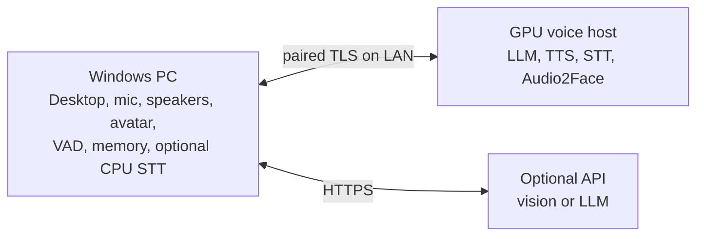

# Recommended setups: one, two or three machines

**Planning guide, 2026-09-29.** This page answers "what must run on my PC,
what can an API or another machine do, and how should I split the work?"
VRAM/RAM figures are rough upstream model-size estimates for planning, **not
Martlet measurements**; no GPU/driver/model tuple is qualified yet
([Ubuntu host matrix](INSTALLATION_SUPPORT.md#proposed-matrix)). Leave 10-15%
VRAM headroom and measure your own machine.

## 1. What must stay on the PC you talk to

These parts touch your devices, screen, keys or consent, so they always run in
the Windows Desktop app. None needs a strong GPU.

| Part | Why it is local | Compute |
| --- | --- | --- |
| Desktop app, setup, consent, Stop/mute | It is the control surface and owns every per-action permission | CPU |
| Microphone capture and speaker playback | Physical devices; the playback clock drives lip-sync | CPU |
| Turn orchestration, participation policy, persona, routing | The client decides which destination each role uses; hosts never call each other | CPU |
| Voice activity detection / future barge-in | Must sit next to the microphone to cut speech off quickly | CPU (small ONNX model) |
| API keys and host pairing secrets | Windows Credential Manager | CPU |
| Local memory store and retrieval | Only matching facts are sent to the LLM, never the whole store | CPU |
| Avatar renderer (Live2D/VRM overlay) and loudness lip-sync | Draws on your screen | Light WebGL; any GPU or iGPU |
| Selected-window capture (future screen context) | Capture is local; analysis may be remote | CPU |

## 2. What can be delegated

Each AI role below can run on a cloud API (where one is offered), on this PC
or on a paired Martlet host. Each role has exactly one destination and never
silently falls back to another provider. The one exception is lip-sync's
default **Auto** mode, which is documented below.

| Role | API option | Local CPU option | GPU option | Notes |
| --- | --- | --- | --- | --- |
| Speech-to-text (STT) | OpenAI transcription | Windows offline recognizer; whisper.cpp `base.en` (~150 MB, ~0.4 GB RAM) | Whisper large-v3-turbo class, ~2-4 GB VRAM | Most privacy-sensitive: raw microphone audio. CPU is enough for short push-to-talk turns. |
| Conversation LLM | OpenAI; OpenAI-compatible APIs (OpenRouter, NVIDIA Build) | Not recommended (slow) | Ollama/llama.cpp: 7-9B Q4 ~5-7 GB, 12-14B Q4 ~9-11 GB, 24-32B Q4 ~16-22 GB, plus ~1-2 GB context | Largest VRAM consumer. API models are usually smarter than what fits locally. |
| Text-to-speech (TTS) | OpenAI (fixed voices) | Windows installed voices (robotic, free) | One Voice Studio engine (F5, Qwen3-TTS, Chatterbox, GPT-SoVITS, XTTS-v2), ~2-6 GB | A custom or cloned voice requires self-hosted GPU TTS. Keep one engine resident. |
| Lip-sync analysis | None supported | Loudness lip-sync (built in) | NVIDIA Audio2Face-3D NIM, NVIDIA only, 4 GB+ | Automatic mode uses local Audio2Face, then a paired host, then loudness. |
| Screen understanding (future) | A vision-capable API | Tesseract OCR | Pinned unquantized LLaVA-NeXT 7B, ~16 GB+ | Bursty and heavy; keep it off the live voice GPU when possible. |
| Memory embeddings/reranking (future) | Possible | Small models run on CPU | Optional | Current memory is lexical and fully local. |
| Voice Studio training (future) | None | No | Often most of a 12-24 GB card for hours | Run it where it cannot stall live conversation. |

**Nothing requires a GPU.** The minimum working setup is the Windows app plus
an API. Only Audio2Face lip-sync strictly needs an NVIDIA GPU, and loudness
lip-sync replaces it on any PC.

### Where a GPU helps most

Spend VRAM in this order:

1. **TTS**: custom voice, low latency, no per-character cost, small footprint.
2. **Audio2Face**: the only way to get rich facial animation.
3. **STT**: keeps microphone audio at home and improves accuracy. CPU is fine
   for push-to-talk, so this is optional.
4. **LLM**: biggest cost in VRAM. Go local for privacy, offline use or cost.
   Otherwise, an API usually gives better answers.
5. **Vision**: heaviest and least latency-sensitive. Use an API or a separate machine.

## 3. One machine (Windows PC with a good NVIDIA GPU)

Run Martlet natively on Windows. Run GPU services on the same PC through
**Martlet hosts > This PC** (Docker Desktop with WSL2). A native Windows LLM
server such as Ollama or LM Studio can use a loopback address. WSL2 uses the
same RAM and VRAM; it does not add capacity. Plan on **32 GB system RAM**
(64 GB is comfortable).

**If you game on this PC**, a game and local models compete for the same VRAM
and frame time. While gaming, use the API for the LLM (and STT/TTS if you want),
and use loudness lip-sync. Add local TTS and Audio2Face only if the game leaves
enough VRAM free.

**If the PC is mostly for Martlet**, choose by VRAM:

| VRAM | LLM | STT | TTS | Lip-sync | Vision |
| --- | --- | --- | --- | --- | --- |
| 8 GB | API | CPU or API | Local GPU (one engine) | Loudness, or Audio2Face instead of local TTS | API |
| 12 GB | API (or local 3-4B) | CPU | Local GPU | Audio2Face | API |
| 16 GB | Local 7-8B Q4 | CPU | Local GPU | Audio2Face | API |
| 24 GB | Local 12-14B Q4 | Local GPU | Local GPU | Audio2Face | API, or load on demand |
| 32 GB+ | Local 14B+ Q4, or 24B+ without vision | Local GPU | Local GPU | Audio2Face | Local possible |

**Recommended hybrid:** API LLM, local CPU STT, local GPU TTS with your voice,
and local Audio2Face. This keeps audio and your voice at home and uses the GPU
where it matters most.

## 4. Two machines

- **PC 1: Windows client.** It runs everything in section 1, and the game gets
  its full GPU. Keep STT here on CPU if you do not want microphone audio on the LAN.
- **PC 2: voice host.** Use Ubuntu 24.04 with Docker and the NVIDIA Container
  Toolkit (preferred), or Windows with Docker Desktop. One paired gateway can
  serve LLM, TTS, STT and Audio2Face. Size it with the one-machine VRAM table.
- Use wired Ethernet between them. On a LAN, extra latency is small next to
  model time.
- If PC 2 has 8-12 GB, put TTS and Audio2Face there and use the API for the LLM.

## 5. Three machines

- **Client:** the Windows PC, as above.
- **Host 1: voice host** for latency-critical work: LLM, TTS, STT, Audio2Face.
- **Host 2: context host** for bursty or long jobs: vision/OCR, future memory
  embeddings/reranking, Voice Studio training and previews.

This split keeps a screenshot question or training job from taking VRAM from
live speech. If Host 1 cannot fit the LLM and speech together, split by size:
put the **LLM on the largest GPU** and speech (STT, TTS, Audio2Face) on the
other host. Then use an API for vision.

## 6. Four or more machines

More machines help less after three. Useful additions are a dedicated
training box, a separate vision host, or more desktops paired to the same
hosts (run `pair` once per desktop). The F5 and vision workers run one job at
a time (a second request gets `busy`), and a role never load-balances across
hosts, so desktops sharing a host take turns.

## 7. What works today

| Route | Status in the current Desktop |
| --- | --- |
| OpenAI STT, LLM, TTS | **Working** conversation route |
| Live2D/VRM avatar and loudness lip-sync | **Working** on this PC |
| Audio2Face on this PC or a paired Martlet host | **Working path**; Docker method verified with a stand-in role, **not yet run on a real GPU** |
| Local memory, personas | **Working**, local only |
| OpenAI-compatible LLM endpoints (OpenRouter, NVIDIA Build, loopback Ollama/LM Studio/llama.cpp) | Adapter and setup exist; **not yet dispatched** by the conversation |
| Windows offline STT and Windows voices TTS | Libraries and setup exist; **not yet dispatched** |
| Host LLM (Ollama), F5 TTS, STT, vision | Worker/adapter foundations; **no host role or gateway relay yet** |
| whisper.cpp local STT, VAD/barge-in, Voice Studio synthesis/training | Disabled candidates or preparation only |

Today, a single GPU PC can run Martlet with API STT/LLM/TTS plus local
avatar and Audio2Face. Fully local routes need these missing pieces, smallest
first:

1. Dispatch the Chat Completions LLM route. This enables a local LLM server on
   loopback, or another OpenAI-compatible API.
2. Dispatch the Windows offline STT/TTS routes for free, offline CPU speech.
3. Add gateway relay workers and `martlet-host` roles for F5 TTS, STT and the LLM,
   so GPU speech and LLM can run on this PC or a host.

See [installation design](INSTALLATION_SUPPORT.md#feature-first-multi-machine-setup),
[Martlet host](../deploy/host/README.md), [architecture](ARCHITECTURE.md#1-components-ownership-and-topology)
and [Voice Studio](VOICE_STUDIO.md) for details.
