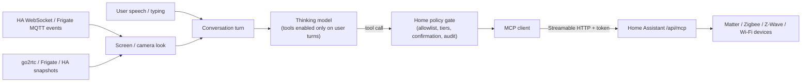

# Smart home and cameras

**Home Assistant control delivered 2026-10-01 (SH00); the rest is dated
research and plan. Every device result is NOT RUN.** The owner asked whether
Martlet can support smart home technology such as Matter, which other stacks
exist, whether IP security cameras fit, and how a user can optionally let the
companion act as a smart home assistant ("turn the lights down", "is the
garage open?", "who's at the door?"), then asked to add it.

This is a separate post-MVP track, like the [iOS plan](IOS.md). It touches an
MVP non-goal, **general tool execution**
([non-goals](../DEVELOPMENT_PLAN.md#explicit-non-goals-for-mvp)): Martlet adds
a narrow, opt-in home surface on the user's own turns, not arbitrary tool or
command execution.

## What works now (SH00)

**Companion > Smart home** connects one Home Assistant (address + long-lived
access token; the token is kept in Windows Credential Manager under
`Martlet/v3/home-assistant/<id>`, never in settings, and is only sent to that
address; plain `http` is accepted only for local-network addresses). With
**Let Martlet control and check my home when I ask** on:

1. On each turn **the user** starts (typed, push-to-talk or hands-free; never a
   screen or camera look), Martlet sends the user's words to Home Assistant's
   [Conversation API](https://developers.home-assistant.io/docs/intent_conversation_api/)
   (`POST /api/conversation/process`, `agent_id: conversation.home_assistant`).
   That is Home Assistant's **built-in Assist**: local sentence matching on the
   Home Assistant computer, no AI model, limited to entities exposed to voice
   assistants. It acts only on whole sentences it recognizes ("turn off the
   kitchen lights", "set the living room to 21 degrees", "is the garage door
   open?", "what's the temperature in the bedroom?") in its configured
   language, so it works with **every Thinking model, including ones without
   tool calling** (for example `gemma3`).
2. What Home Assistant did or answered goes to the Thinking model in a labeled
   block with the user's message (`extraInstructions`), and the persona
   replies in its own voice ("Done, the kitchen is dark now"). When Home
   Assistant did not recognize a command, the persona is told nothing changed,
   so it does not pretend to have acted.
3. **Safety tier** (`HomeCommandGuard`): a short request that mentions a lock,
   door, garage, gate, alarm or valve (common words in English, German,
   French, Spanish, Italian and Dutch) and is not a status question is
   **never sent** unless **Also locks, doors, garage doors, gates, alarms and
   valves** is on, and then only after the user clicks **Yes, send it** in
   the talk window (inline, so a dialog taking focus cannot revoke the turn;
   30 s, Stop or Close means no). Status questions ("is the front
   door locked?") always go through. Longer sentences that merely mention a
   door are treated as chat and not sent. If Home Assistant still reports
   operating such a device without confirmation, the summary says so and
   recommends unexposing it. Home Assistant's exposed-entities list remains the
   outer allowlist; it does not expose locks, garage doors or alarms by
   default.
4. The talk window shows a **Home Assistant:** line above the reply, its
   envelope discloses the smart home step, and Smart home lists the last 20
   actions in memory (never saved).
5. **Cameras:** a Home Assistant camera snapshot address
   (`<address>/api/camera_proxy/camera.front_door`) works as a phone or
   network camera source in Watch; Martlet adds the saved token itself and
   names the source after the entity. `SmartHome.CamerasAsync` lists camera
   entities for the Vision page's source list.

Code: `src/Martlet.Home` (endpoint rules, REST client, guard, persona
context), `src/Martlet.Desktop/SmartHome.cs` (connection, preferences in
`smart-home.json`, turn step), `MainWindow.SmartHome.cs` (page). Not yet done:
fuzzy commands through LLM tool calling, events, live camera requests ("look at
the front door") and native Matter (slices below).

## Short answer (research, 2026-09-30)

1. **Connect to Home Assistant first; do not write a Matter controller.**
   Home Assistant (Apache-2.0) already speaks Matter, Thread, Zigbee, Z-Wave,
   Hue, Shelly, ESPHome, cameras and thousands of other integrations. Since
   2025 it ships an official **Model Context Protocol Server** integration at
   `/api/mcp` (Streamable HTTP, long-lived token or OAuth) that exposes its
   Assist API as MCP tools, limited to the entities the user exposes to voice
   assistants. One Martlet integration therefore reaches almost every device a
   user owns, and Home Assistant stays the authority on what the companion may
   touch.
2. **Martlet needs two new capabilities for any of this:** LLM tool calling
   (today both chat adapters send `tools:[]` and `tool_choice:"none"`, see
   [Providers](../src/Martlet.Providers/README.md)) and an MCP *client*
   (`Martlet.Mcp` is a server only). Both are reusable beyond the smart home.
3. **Native Matter later, as an optional host role, not in .NET.** There is
   no mature .NET Matter controller. The maintained open-source controller is
   the Open Home Foundation **matterjs-server** (Node.js, Apache-2.0, Matter
   1.6, WebSocket API, beta, drop-in successor to the archived
   python-matter-server). A Linux host could run it as a container, and Martlet
   would join devices as an extra admin using a pairing code shared from
   Apple/Google/Alexa/Home Assistant (multi-admin), which avoids Bluetooth and
   Thread hardware on the PC.
4. **IP cameras overlap directly with video source input.** A camera is one
   more frame source for the existing glance/pacer/vision path in
   [screen commentary](SCREEN_COMMENTARY.md). Pull a JPEG snapshot from
   **go2rtc** (`/api/frame.jpeg`, MIT), **Frigate** (MIT NVR with object
   detection, MQTT events and generative-AI review summaries) or Home
   Assistant's camera snapshot endpoint, rather than decoding RTSP inside
   Martlet. Matter 1.5 cameras (WebRTC) arrive through the same bridges.
5. **The persona acts only when the user asks.** Tool calls are allowed only
   on turns started by the user's own speech or typing, never from a screen or
   camera look, and locks, garage doors, alarms and covers need a spoken
   confirmation each time (or stay unexposed). See [Safety](#safety-and-consent).

## Technology landscape

| Stack | What it is | Fit for Martlet | Notes |
| --- | --- | --- | --- |
| **Home Assistant MCP server** | Official HA integration; Assist API tools over MCP Streamable HTTP; `GetLiveContext` snapshot resource | **First choice** | Exposed-entities page is the allowlist; "Control Home Assistant" option can make it read-only. Sampling and notifications unsupported, so no push events over MCP |
| Home Assistant REST/WebSocket API | `/api/states`, `/api/services`, WebSocket event subscriptions, `/api/camera_proxy/<entity>` | Second channel | Needed for push events (doorbell, motion) and camera snapshots, which MCP does not stream |
| **Matter** (CSA) | IP-based device standard; 1.5 (Nov 2025) added cameras over WebRTC, closures, energy; 1.5.1 (Mar 2026) camera fixes; 1.6 (Jun 2026) NFC commissioning, Joint Fabric, thermostat suggestions | Via HA now; matterjs-server host role later | Commissioning needs BLE (or NFC on 1.6) and, for Thread devices, a Thread border router (HomePod/Apple TV, Nest hub, recent Echo, OpenThread BR). Multi-admin pairing codes sidestep both |
| matterjs-server / matter.js | OHF Node.js controller with WebSocket API (`@matter-server/ws-client`) | Optional host container | Beta, not yet re-certified by the CSA; Node 22.13+/24 |
| connectedhomeip | Official C++ Matter SDK | Not recommended | No .NET bindings; heavy native build |
| **Thread** | Low-power IPv6 mesh under Matter | Indirect | PCs rarely have a Thread radio; rely on an existing border router |
| **Zigbee** | Mesh radio (Hue, IKEA, Aqara) | Via HA (ZHA) or Zigbee2MQTT | Zigbee2MQTT is GPL-3.0: talk to it over MQTT as a separate service, never bundle |
| **Z-Wave** | Sub-GHz mesh (locks, sensors) | Via HA or Z-Wave JS UI WebSocket | Needs a USB stick |
| **MQTT** | Pub/sub bus (Mosquitto) used by Zigbee2MQTT, Frigate, Shelly, Tasmota | Event source | Useful for "react when the doorbell rings"; plain client library in .NET |
| ESPHome | DIY ESP32 devices, native protobuf API | Via HA | |
| Philips Hue | Bridge with local CLIP v2 HTTPS API and event stream | Possible direct adapter | Link-button pairing; local only |
| Shelly Gen2+ | Local HTTP/WebSocket RPC and MQTT | Possible direct adapter | |
| Google Home APIs | Device, Automation and Commissioning APIs | Not on Windows | Android (Kotlin) and iOS (Swift) SDKs only; relevant to the [iOS track](IOS.md) |
| Apple HomeKit | Home framework | iOS track only | Controller access exists only inside Apple apps; Martlet iOS could read/control Home accessories with the user's grant |
| SmartThings | Cloud REST API (token/OAuth); Home API preview for Matter on Android | Optional cloud adapter | Sends home data to Samsung's cloud |
| Amazon Alexa | Skills are inbound (Alexa calls you) | No | No general consumer control API |
| Google Nest (Device Access/SDM) | Cloud API incl. WebRTC camera streams | Not planned | One-time registration fee (spending); HA already integrates it |
| openHAB / Hubitat / Homey | Alternative hubs with REST APIs | Later, by demand | Same MCP/REST pattern if they expose one |
| Wyoming protocol | HA's TCP protocol for wake word/STT/TTS satellites | Reverse direction, later | Could let HA voice satellites use Martlet's voices, or Martlet's listening. Does not give Martlet device control |

### More technologies and integrations worth knowing (2026-10-01)

| Technology | What it gives Martlet | Route |
| --- | --- | --- |
| **HA Conversation API + built-in Assist** | Deterministic, local command matching in 50+ languages with no model; HA's own "prefer handling commands locally" pattern | **Delivered (SH00)** |
| HA notify / webhooks / MQTT into Martlet | Announcements: "the washing machine is done", "someone is at the door" spoken by the persona | Later (SH05), inbound only, never actions |
| Presence (HA `person`, mmWave sensors such as Aqara FP2, Bermuda BLE) | Greet the user when they come home or sit down; stay quiet when nobody is there | Later, read-only event source |
| Music Assistant (OHF, Apache-2.0) | One media control surface for Sonos, Chromecast, AirPlay, Spotify Connect speakers | Via HA media intents now |
| Home Assistant Voice PE / ESPHome voice satellites | Room microphones/speakers that could talk to the Martlet persona (HA conversation agent pointed at Martlet) | Later, reverse direction with Wyoming |
| Thread 1.4 | Shared Thread credentials across Apple/Google/Amazon border routers, fewer split networks | Indirect, through HA |
| Matter 1.5 cameras/closures, 1.6 Joint Fabric | Standard cameras and doors/gates across ecosystems | Through HA / matterjs-server (SH06) |
| Node-RED | Users' own visual automations that can call HA scripts Martlet triggers | Via exposed HA scripts |
| Scrypted | Bridges cameras into HomeKit/Google with NVR and detection | Snapshot URL like go2rtc |
| Homebridge | Brings non-HomeKit devices into Apple Home | iOS track (SH08) |
| Tuya local, TP-Link Kasa/Tapo, LIFX LAN, Govee LAN, WLED, Nanoleaf, Sonos, Google Cast | Local LAN device APIs | Via HA integrations, not direct adapters |
| IFTTT, SmartThings, Alexa/Google routines | Cloud automations | Not planned (cloud, accounts, fees); HA already bridges most

### IP security cameras

| Route | How Martlet gets a frame | Pros | Cons |
| --- | --- | --- | --- |
| **go2rtc** (MIT, single binary) | `GET /api/frame.jpeg?src=<name>` | Any RTSP/ONVIF/HomeKit/vendor stream; WebRTC/two-way audio for later live view | Another service to run (host container or the user's own) |
| **Frigate** (MIT NVR) | `/api/<camera>/latest.jpg`; MQTT `frigate/events`; GenAI review summaries (0.17+) | Person/car/package detection gives *meaningful* triggers instead of polling; works with Ollama | GPU/Coral recommended; Docker host |
| **Home Assistant** | `/api/camera_proxy/<entity_id>` (REST, token) | Zero extra setup if HA already has the camera, including Ring/Nest/Reolink/Tapo integrations | Snapshot quality and latency vary by integration |
| Direct RTSP/ONVIF in Martlet | FFmpeg/libVLC decode on the PC | No middleman | Codec/licensing/CPU cost, credential handling and per-brand quirks Martlet would own; not recommended |
| Matter 1.5 cameras | WebRTC via a Matter controller | Standard, cross-ecosystem | Very few shipping devices yet; comes "for free" through HA/matterjs-server |

All three recommended routes are **pull a JPEG on demand**, which matches the
screen watcher's one-image-per-look design and its image disclosure permission
(`AllowImageDisclosure`). Vendor clouds without local APIs (Ring, Arlo, Wyze)
are reached only through Home Assistant integrations, never scraped.

## Overlap with video source input

Screen commentary already has the pieces a camera needs: a capture source,
a change detector (16x9 thumbnail), a pacer, one JPEG per look, `[pass]`
handling and the vision-capable Thinking route. A camera should be a new
**frame source** behind the same seam, not a second pipeline:

| Concern | Screen (today) | Camera (planned) |
| --- | --- | --- |
| Source | DXGI Desktop Duplication / GDI (`ScreenGlancer`) | HTTP snapshot from go2rtc, Frigate or HA, keyed by a camera ID |
| Trigger | Pacer: change + time + presence | Pacer, **or** an event (Frigate MQTT object event, HA doorbell/motion state) |
| Prompt context | Window title, "friend in the room" | Camera name/area, event label ("person at front door"), "assistant at home" |
| Privacy filter | Window-title keyword list | Per-camera opt-in; bystander notice; never record |
| Output | Remark or `[pass]` | Remark, `[pass]`, or (only on user request) a home action |

Whatever abstraction the video-source work introduces should accept a
**pull-based snapshot source** with a stable ID and display name, so cameras
plug in without touching the pacer or the vision routes.

That seam now exists: `WatchSource` (kind, stable ID, display name) and
`IVideoInput` in `src/Martlet.Desktop/VideoSources.cs`. A go2rtc or Frigate
snapshot URL already works as a **phone or network camera address** source
([video sources](SCREEN_COMMENTARY.md#cameras-phones-and-other-video-sources));
Home Assistant's bearer-token `camera_proxy` still needs header support.

## Model requirements

Tool calling and vision are separate model abilities. Verified on
ollama.com on 2026-09-30:

| Ollama tag | Vision | Tools |
| --- | --- | --- |
| `gemma3` (`gemma3:4b` is today's suggested easy default) | Yes | **No** |
| `qwen2.5vl` | Yes | **No** |
| `qwen3-vl` | Yes | Yes |
| `gemma4` | Yes | Yes |

OpenAI `gpt-4.1`/`gpt-4.1-mini` support both. A `ToolModelCatalog` (same
curated Supported/Unsupported/Unknown pattern as `VisionModelCatalog`) must
drive the same kind of "can't control your home yet" warning that screen
watching shows for text-only models, and the host model suggestions should
move to a model that sees **and** calls tools.

## Proposed architecture

- **`Martlet.Home` library (delivered, SH00):** HA REST client (config,
  conversation, states), endpoint rules, the safety guard and persona context.
  The HA token lives in the Windows credential vault
  (`Martlet.Credentials.Windows`), never in prompts, settings exports or
  support bundles. The MCP route (SH02) reuses the shared `Martlet.Mcp.Client`
  as a Smart home-managed server instead of a second client.
- **Providers (SH01, MCP session):** add an opt-in tools path to the OpenAI Responses, Chat
  Completions and Ollama `/api/chat` encoders and parse streamed tool calls;
  the default stays `tool_choice:"none"`. Gateway relay of `tools` to a host's
  Ollama follows the screen-commentary `images` precedent.
- **Conversation:** a bounded tool loop (at most a few calls per turn, a short
  deadline, cancellation by Stop/Esc/barge-in), then the spoken reply in the
  persona's voice ("Done, the living room is at 30%").
- **Events:** subscribe to selected HA entities (doorbell, motion, door open)
  over the HA WebSocket API and, optionally, Frigate MQTT. An event can start a
  camera look or a short remark; it can never start an action.
- **Host role (later):** optional `home` role containers on a Linux host:
  go2rtc and/or matterjs-server, for users without Home Assistant. Users with
  HA should keep HA as the hub.

## Safety and consent

- **Off by default.** Connecting a home hub, enabling control, and enabling
  each camera are separate explicit settings; read-only status can be enabled
  without control.
- **Home Assistant's exposed entities are the outer allowlist.** Martlet adds
  tiers on top:
  - *Read:* states, sensors, "is the door locked?"
  - *Comfort:* lights, media, fans, climate within a range, scenes.
  - *Sensitive:* locks, garage doors, covers, alarm panels, valves, anything
    that opens the home: **disabled by default**; when enabled, each action
    needs a spoken or clicked confirmation that names the device.
- **No autonomous actions.** Tools are offered to the model only on turns the
  user started by speech, typing or push-to-talk. Screen looks, camera looks,
  events and memory recall never get tools: on-screen text, a camera image or
  a TV in the room can contain instructions (prompt injection), and Martlet has
  no speaker identification, so anyone in the room can talk to it.
- **Visible and reversible.** Every action is shown in the conversation and in
  a local action log, spoken back, and stopped by Stop/Esc. Martlet never
  creates or edits Home Assistant automations, users or integrations.
- **Cameras show other people.** Each camera needs its own opt-in, frames are
  never saved, logged or put in memory, and sending a frame to a cloud model
  uses the same image disclosure permission and destination wording as screen
  watching. Prefer a local vision model for cameras; the setup should say so.
- **Network:** connect only to the user-entered HA/go2rtc/Frigate URL; HTTPS
  or a LAN address; no port opening, cloud relay or remote access setup by
  Martlet.

## Delivery slices

| Slice | Outcome | Depends on |
| --- | --- | --- |
| SH00 | **Delivered 2026-10-01.** HA connection page, vaulted token, built-in Assist on user turns for every model, safety tier with click confirmation, action list, persona context, HA camera snapshot addresses in Watch | - |
| SH01 | Opt-in tool calling in the chat encoders + streamed tool-call parsing + `ToolModelCatalog`; default unchanged (owned by the MCP client session, `Martlet.Mcp.Client`) | - |
| SH02 | HA `/api/mcp` registered as a Smart home-managed server in the shared MCP client (no second client), for fuzzy requests ("make it cozy"); Assist pre-step off on those turns to avoid double actions | SH01 |
| SH03 | Per-tool approval hook on managed servers (not yet in `Martlet.Mcp.Client`; the MCP session uses inline per-call approvals): comfort tools auto-approved, lock/door/garage/gate/alarm/valve tools ask every time or are denied; tools only on user-started turns; spoken result | SH02 |
| SH04 | HA cameras listed as Vision sources; "Look at the front door" on request | video source input, SH00 |
| SH05 | Event-triggered looks/remarks from HA WebSocket and optional Frigate MQTT (doorbell, person detected); announcements; never actions | SH04 |
| SH06 | Host `home` role: go2rtc and matterjs-server containers; multi-admin Matter pairing from a shared code | SH02, host roles |
| SH07 | Direct adapters only if users lack HA: Hue CLIP v2, Shelly RPC, MQTT | SH03 |
| SH08 | iOS track: HomeKit read/control through the Home framework | [iOS plan](IOS.md) |

SH00 delivers "my waifu turns off the lights" for anyone with Home Assistant.
SH01-SH03 add free-form requests on tool-capable models. SH04 is the camera
overlap and should land with the Vision page's source list.

## Owner decisions

- **Home Assistant is the hub** for v1 (accepted 2026-10-01 by asking to add
  smart home support) rather than a native Matter controller. Users without HA
  install HA (or the SH06 host role) first.
- **The "general tool execution" non-goal** stays: SH00 sends only the user's
  own words to HA's sentence matcher; SH02-SH03 add a narrow, user-turn-only
  tool surface through the shared MCP client.
- **Default host vision model** change from `gemma3`/`qwen2.5vl` to a
  vision + tools model (`qwen3-vl` or `gemma4`) once SH01 lands.

## Not planned

- Writing a Matter, Thread, Zigbee or Z-Wave stack in .NET.
- Autonomous routines decided by the companion, editing HA automations, or
  any action triggered by a screen, camera, event or memory.
- Recording, storing or searching camera footage (that is an NVR's job).
- Face recognition or identifying people on camera.
- Cloud-relay or remote access to the home from outside the LAN.

## Sources

Accessed 2026-09-30. Summary in the
[research ledger, S49](RESEARCH.md#s49-smart-home-matter-and-ip-camera-research-2026-09-30).

- Home Assistant MCP Server integration:
  <https://www.home-assistant.io/integrations/mcp_server/>
- Home Assistant LLM API developer docs:
  <https://developers.home-assistant.io/docs/core/llm/>
- Home Assistant REST and WebSocket APIs:
  <https://developers.home-assistant.io/docs/api/rest/>,
  <https://developers.home-assistant.io/docs/api/websocket/>
- CSA Matter 1.5 and 1.6 announcements: <https://csa-iot.org/newsroom/>
- matterjs-server (Open Home Foundation): <https://github.com/matter-js/matterjs-server>
- python-matter-server (archived): <https://github.com/home-assistant-libs/python-matter-server>
- Matter SDK: <https://github.com/project-chip/connectedhomeip>
- go2rtc: <https://github.com/AlexxIT/go2rtc>
- Frigate: <https://docs.frigate.video/>
- Wyoming protocol: <https://github.com/OHF-Voice/wyoming>
- Zigbee2MQTT: <https://www.zigbee2mqtt.io/>; Z-Wave JS UI: <https://github.com/zwave-js/zwave-js-ui>
- Philips Hue CLIP API v2: <https://developers.meethue.com/develop/hue-api-v2/>
- Shelly Gen2+ API: <https://shelly-api-docs.shelly.cloud/gen2/>
- Google Home APIs: <https://developers.home.google.com/apis>
- SmartThings API: <https://developer.smartthings.com/docs/api/public>
- Apple HomeKit: <https://developer.apple.com/documentation/homekit>
- Ollama model capabilities: <https://ollama.com/library/qwen3-vl>,
  <https://ollama.com/library/gemma4>, <https://ollama.com/library/gemma3>
