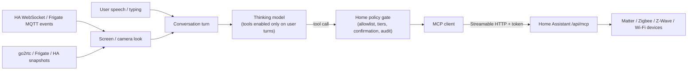

# Smart home and cameras

**Home Assistant control delivered 2026-10-01 (SH00); the rest is dated
research and plan. Every device result is NOT RUN.** The owner asked whether
Martlet can support smart home technology such as Matter, which other stacks
exist, whether IP security cameras fit, and how a user can optionally let the
companion act as a smart home assistant ("turn the lights down", "is the
garage open?", "who's at the door?"), then asked to add it. Whether Martlet
can also install, onboard and manage Home Assistant is researched in
[Installing and managing Home Assistant](#installing-and-managing-home-assistant-research-2026-10-01).

This is a separate post-MVP track, like the [iOS plan](IOS.md). It touches an
MVP non-goal, **general tool execution**
([non-goals](../DEVELOPMENT_PLAN.md#explicit-non-goals-for-mvp)): Martlet adds
a narrow, opt-in home surface on the user's own turns, not arbitrary tool or
command execution.

## What works now (SH00-SH03)

**Companion > Smart home** connects one Home Assistant (address + long-lived
access token; the token is kept in Windows Credential Manager under
`Martlet/v3/home-assistant/<id>`, never in settings, and is only sent to that
address; plain `http` is accepted only for local-network addresses). With
**Let Martlet control and check my home when I ask** on:

1. On each turn **the user** starts (typed, push-to-talk or hands-free; never a
   screen or camera look), Martlet sends the user's words to Home Assistant's
   [Conversation API](https://developers.home-assistant.io/docs/intent_conversation_api/)
   (`POST /api/conversation/process`, `agent_id: conversation.home_assistant`).
   That is Home Assistant's **built-in Assist**: local sentence matching on the
   Home Assistant computer, no AI model, limited to entities exposed to voice
   assistants. It acts only on whole sentences it recognizes ("turn off the
   kitchen lights", "set the living room to 21 degrees", "is the garage door
   open?", "what's the temperature in the bedroom?") in its configured
   language, so it works with **every Thinking model, including ones without
   tool calling** (for example `gemma3`).
2. What Home Assistant did or answered goes to the Thinking model in a labeled
   block with the user's message (`extraInstructions`), and the persona
   replies in its own voice ("Done, the kitchen is dark now"). When Home
   Assistant did not recognize a command, the persona is told nothing changed,
   so it does not pretend to have acted.
3. **Safety tier** (`HomeCommandGuard`): a short request that mentions a lock,
   door, garage, gate, alarm or valve (common words in English, German,
   French, Spanish, Italian and Dutch) and is not a status question is
   **never sent** unless **Also locks, doors, garage doors, gates, alarms and
   valves** is on, and then only after the user clicks **Yes, send it** in
   the talk window (inline, above the message box; 30 s, Stop or Close means
   no). Status questions ("is the front
   door locked?") always go through. Longer sentences that merely mention a
   door are treated as chat and not sent. If Home Assistant still reports
   operating such a device without confirmation, the summary says so and
   recommends unexposing it. Home Assistant's exposed-entities list remains the
   outer allowlist; it does not expose locks, garage doors or alarms by
   default.
4. The talk window's history shows a **Home Assistant:** line above the reply,
   the Smart home page discloses the step, and it lists the last 20 actions in
   memory (never saved).
5. **Cameras:** a Home Assistant camera snapshot address
   (`<address>/api/camera_proxy/camera.front_door`) works as a phone or
   network camera source in Watch; Martlet adds the saved token itself and
   names the source after the entity. Companion › Vision › **Use a Home Assistant camera** lists the camera entities (`SmartHome.CamerasAsync`) and fills in the chosen one's address.
6. **Free-form requests (SH02-SH03):** with **Let the Thinking model use Home
   Assistant's tools** on, Smart home registers Home Assistant's
   [MCP Server](https://www.home-assistant.io/integrations/mcp_server/)
   (`<address>/api/mcp`, the same vaulted token as a Bearer header) as a
   managed server named `home-assistant` in the shared MCP client
   (`McpToolService.SetManagedServer`, shown read-only on the Tools page). On a
   user-started turn whose toolset includes it (OpenAI or Chat Completions
   routes with tool calling), the Assist step is skipped so nothing runs twice,
   and the persona is told to act only on what the user asked; otherwise
   Assist runs as in 1. Every call passes `SmartHome.Policy`
   (`HomeCommandGuard.AssessTool`): status tools (`GetLiveContext`,
   `GetDateTime`, ...) and Home Assistant intents (`Hass*`) on ordinary devices
   run at once; anything naming a lock, door, garage, gate, alarm or valve in
   the tool name, its arguments, a `domain`/`device_class`, or a name of such
   an entity read from `/api/states` (refreshed at most every 5 minutes) is
   blocked or asks every time per the setting above; other tools (exposed
   scripts) ask every time; Always allow is never offered. If the entity list
   can't be read, intents that address a device only by name ask first.
   Requires Home Assistant's Model Context Protocol Server integration.

Code: `src/Martlet.Home` (endpoint rules, REST client, guard, persona
context), `src/Martlet.Desktop/SmartHome.cs` (connection, preferences in
`smart-home.json`, turn step, managed MCP server and its approval policy),
`MainWindow.SmartHome.cs` (page). Not yet done: events, live camera requests
("look at the front door") and native Matter (slices below). Device aliases
defined only in Home Assistant's voice settings are not in the sensitive-name
list; leave locks and garage doors unexposed to be safe.

## Installing, setting up and managing Home Assistant (SH09-SH12, delivered 2026-10-02)

Companion › Smart home now gets a user from nothing to a working Home
Assistant without leaving Martlet:

1. **Find on my network** asks once for Home Assistant's mDNS service type
   (`_home-assistant._tcp.local`, `HomeAssistantDiscovery`) on each local
   network and lists who answers; **Use this one** checks it. Nothing is
   scanned.
2. **Set up a new one**: when a Home Assistant has no owner yet (unauthenticated
   `GET /api/onboarding`), a form asks for the owner's name, username and
   password. Martlet creates that account (an administrator) through the
   onboarding API, gives Home Assistant Windows' time zone, country, currency,
   units and language (`config/core/update`), leaves analytics off, finishes the
   remaining onboarding steps, mints its own long-lived token
   (`auth/long_lived_access_token`, named "Martlet on <PC> (<time>)"), revokes the
   short setup session and connects. The password goes only to Home Assistant
   and is never stored. A Home Assistant restarted after setup no longer serves
   the onboarding API; Martlet recognizes it by `/auth/providers`.
3. **Sign in with Home Assistant** (existing installs, the usual case): Home
   Assistant's own sign-in page opens in the browser with a loopback client
   (`http://127.0.0.1:<port>/`, accepted by its IndieAuth rules); Martlet receives
   the one-time code on that port, mints its own token and revokes the session.
   Pasting a long-lived token still works.
4. **Install on a Linux Martlet host**: the `home-assistant` host role
   ([host README](../deploy/host/README.md#roles)) runs the official container
   with host networking, privileged (USB radios) and D-Bus (Bluetooth) on a
   Linux computer with Docker Engine, installed through the host's usual route
   (SSH from Martlet, or `martlet-host add home-assistant` there). It publishes
   no gateway route: the host reports `home-assistant` in its machine report, and
   desktops reach it at `http://<host>:8123`. Docker Desktop (Windows, macOS) is
   refused with an explanation, so on Windows the feature is a Linux host or an
   existing Home Assistant address. The host also reports what Home Assistant can
   use (an MQTT broker, Zigbee2MQTT, Z-Wave JS, Frigate, go2rtc, ESPHome,
   Node-RED, Matter server, Music Assistant, Zigbee/Z-Wave/USB radios,
   Bluetooth) and refuses to install over another Home Assistant on port 8123.
   After installing, Martlet opens the setup form for it. The Devices map offers
   **Install Home Assistant** / **Remove Home Assistant** on eligible hosts.
5. **Sharing with the owner's other computers** (owner decisions 2026-10-02
   and 2026-10-03: Home Assistant is one connection for the whole app). While
   **Keep Martlet the same on all my computers** is on, a connection made on any
   computer (setup, sign-in or token) goes to every paired host at once
   (`/martlet/v1/home-assistant`, newest revision wins; hosts keep it 0600, see
   [CLUSTER](CLUSTER.md#the-shared-home-assistant-connection)). Every 60 seconds
   each desktop reads its hosts' copies and takes a newer connection, replacing
   whatever it used (turning on "Use Home Assistant when I ask" the first time it
   connects); a computer whose connection the hosts don't know yet gives it to
   them. **Disconnect** disconnects every computer (the hosts forget the token).
   What Martlet may do with it ("Use Home Assistant when I ask", locks, doors and
   alarms, flexible requests) is a [shared setting](CLUSTER.md#one-martlet-on-every-computer)
   too. With the switch off, the connection stays on the computer where it was
   made.
6. **Devices Home Assistant found** lists Home Assistant's open discovery flows
   (`config_entries/flow/progress`, with integration names from
   `manifest/list`). **Add** confirms a step that needs no input; a step that
   needs a code, key or choice (or failed to connect) opens Home Assistant's
   Integrations page. **Ignore** uses `config_entries/ignore_flow`. When the
   host running this Home Assistant has an MQTT broker, **Add MQTT to Home
   Assistant** starts the MQTT integration with it. New lights, switches,
   climate, media and covers are exposed to Assist by Home Assistant's own
   defaults; locks stay hidden.
7. **Manage Home Assistant**: version, installation type (`hassio` among
   `/api/config` components means Home Assistant OS), integrations, last backup
   (`backup/info`), waiting updates (update entities that are on) with
   **Install update** (`update.install`), **Back up now** (`backup/generate` to
   the local agent), **Restart** (`homeassistant.restart`) and **Open Home
   Assistant**. These need an administrator token, run only on the owner's
   clicks and are never offered to the Thinking model. A Martlet-installed
   container gets new Home Assistant versions with **Update host**, which now
   re-applies role files that changed.

Code: `src/Martlet.Home` (`HomeAssistantClient.Setup.cs`,
`HomeAssistantClient.Admin.cs`, `HomeAssistantSocket.cs`,
`HomeAssistantSignIn.cs`, `HomeAssistantDiscovery.cs`),
`src/Martlet.Desktop/SmartHome.cs`, `MainWindow.SmartHome.cs`,
`MainWindow.HomeShare.cs`, `HomeAssistantHosts.cs`, the gateway's
`GatewayHomeAssistant.cs` and `deploy/host/roles/home-assistant`. MCP:
`home_assistant_probe`, `home_assistant_find`, `smart_home_status` and the
Smart home page's status fields ([MCP](MCP.md)).

**Verified 2026-10-02 on this PC** against a disposable Home Assistant 2026.9.4
container (Docker Desktop, published port 18123): setup through the Smart home
page via MCP (owner account, regional settings, token, connection, integrations
and version read back), backup created and shown, a discovered device (a fake
ESPHome device advertised over mDNS inside Docker) listed, **Add** (Home
Assistant reported `connection_error`, as expected for a fake device),
**Ignore**, **Restart**, connecting with a pasted token, recognizing an
already set-up Home Assistant after a restart, browser sign-in with the
loopback client (the browser played by Home Assistant's login-flow API) and
**Find on my network** against a python-zeroconf responder announcing Home
Assistant's TXT records. `node_link_check` passes the gateway's shared
connection (real gateway, pinned TLS, two devices, revisions, tombstones,
restart, token kept out of logs). **NOT RUN:** installing the role on a real
Linux Docker Engine host (this PC has only Docker Desktop, which the role
refuses), desktop-to-host sharing with a real paired host, Home Assistant OS
updates and apps, and real devices.

## Short answer (research, 2026-09-30)

1. **Connect to Home Assistant first; do not write a Matter controller.**
   Home Assistant (Apache-2.0) already speaks Matter, Thread, Zigbee, Z-Wave,
   Hue, Shelly, ESPHome, cameras and thousands of other integrations. Since
   2025 it ships an official **Model Context Protocol Server** integration at
   `/api/mcp` (Streamable HTTP, long-lived token or OAuth) that exposes its
   Assist API as MCP tools, limited to the entities the user exposes to voice
   assistants. One Martlet integration therefore reaches almost every device a
   user owns, and Home Assistant stays the authority on what the companion may
   touch.
2. **Martlet needs two new capabilities for any of this:** LLM tool calling
   (today both chat adapters send `tools:[]` and `tool_choice:"none"`, see
   [Providers](../src/Martlet.Providers/README.md)) and an MCP *client*
   (`Martlet.Mcp` is a server only). Both are reusable beyond the smart home.
3. **Native Matter later, as an optional host role, not in .NET.** There is
   no mature .NET Matter controller. The maintained open-source controller is
   the Open Home Foundation **matterjs-server** (Node.js, Apache-2.0, Matter
   1.6, WebSocket API, beta, drop-in successor to the archived
   python-matter-server). A Linux host could run it as a container, and Martlet
   would join devices as an extra admin using a pairing code shared from
   Apple/Google/Alexa/Home Assistant (multi-admin), which avoids Bluetooth and
   Thread hardware on the PC.
4. **IP cameras overlap directly with video source input.** A camera is one
   more frame source for the existing glance/pacer/vision path in
   [screen commentary](SCREEN_COMMENTARY.md). Pull a JPEG snapshot from
   **go2rtc** (`/api/frame.jpeg`, MIT), **Frigate** (MIT NVR with object
   detection, MQTT events and generative-AI review summaries) or Home
   Assistant's camera snapshot endpoint, rather than decoding RTSP inside
   Martlet. Matter 1.5 cameras (WebRTC) arrive through the same bridges.
5. **The persona acts only when the user asks.** Tool calls are allowed only
   on turns started by the user's own speech or typing, never from a screen or
   camera look, and locks, garage doors, alarms and covers need a spoken
   confirmation each time (or stay unexposed). See [Safety](#safety-and-consent).

## Technology landscape

| Stack | What it is | Fit for Martlet | Notes |
| --- | --- | --- | --- |
| **Home Assistant MCP server** | Official HA integration; Assist API tools over MCP Streamable HTTP; `GetLiveContext` snapshot resource | **First choice** | Exposed-entities page is the allowlist; "Control Home Assistant" option can make it read-only. Sampling and notifications unsupported, so no push events over MCP |
| Home Assistant REST/WebSocket API | `/api/states`, `/api/services`, WebSocket event subscriptions, `/api/camera_proxy/<entity>` | Second channel | Needed for push events (doorbell, motion) and camera snapshots, which MCP does not stream |
| **Matter** (CSA) | IP-based device standard; 1.5 (Nov 2025) added cameras over WebRTC, closures, energy; 1.5.1 (Mar 2026) camera fixes; 1.6 (Jun 2026) NFC commissioning, Joint Fabric, thermostat suggestions | Via HA now; matterjs-server host role later | Commissioning needs BLE (or NFC on 1.6) and, for Thread devices, a Thread border router (HomePod/Apple TV, Nest hub, recent Echo, OpenThread BR). Multi-admin pairing codes sidestep both |
| matterjs-server / matter.js | OHF Node.js controller with WebSocket API (`@matter-server/ws-client`) | Optional host container | Beta, not yet re-certified by the CSA; Node 22.13+/24 |
| connectedhomeip | Official C++ Matter SDK | Not recommended | No .NET bindings; heavy native build |
| **Thread** | Low-power IPv6 mesh under Matter | Indirect | PCs rarely have a Thread radio; rely on an existing border router |
| **Zigbee** | Mesh radio (Hue, IKEA, Aqara) | Via HA (ZHA) or Zigbee2MQTT | Zigbee2MQTT is GPL-3.0: talk to it over MQTT as a separate service, never bundle |
| **Z-Wave** | Sub-GHz mesh (locks, sensors) | Via HA or Z-Wave JS UI WebSocket | Needs a USB stick |
| **MQTT** | Pub/sub bus (Mosquitto) used by Zigbee2MQTT, Frigate, Shelly, Tasmota | Event source | Useful for "react when the doorbell rings"; plain client library in .NET |
| ESPHome | DIY ESP32 devices, native protobuf API | Via HA | |
| Philips Hue | Bridge with local CLIP v2 HTTPS API and event stream | Possible direct adapter | Link-button pairing; local only |
| Shelly Gen2+ | Local HTTP/WebSocket RPC and MQTT | Possible direct adapter | |
| Google Home APIs | Device, Automation and Commissioning APIs | Not on Windows | Android (Kotlin) and iOS (Swift) SDKs only; relevant to the [iOS track](IOS.md) |
| Apple HomeKit | Home framework | iOS track only | Controller access exists only inside Apple apps; Martlet iOS could read/control Home accessories with the user's grant |
| SmartThings | Cloud REST API (token/OAuth); Home API preview for Matter on Android | Optional cloud adapter | Sends home data to Samsung's cloud |
| Amazon Alexa | Skills are inbound (Alexa calls you) | No | No general consumer control API |
| Google Nest (Device Access/SDM) | Cloud API incl. WebRTC camera streams | Not planned | One-time registration fee (spending); HA already integrates it |
| openHAB / Hubitat / Homey | Alternative hubs with REST APIs | Later, by demand | Same MCP/REST pattern if they expose one |
| Wyoming protocol | HA's TCP protocol for wake word/STT/TTS satellites | Reverse direction, later | Could let HA voice satellites use Martlet's voices, or Martlet's listening. Does not give Martlet device control |

### More technologies and integrations worth knowing (2026-10-01)

| Technology | What it gives Martlet | Route |
| --- | --- | --- |
| **HA Conversation API + built-in Assist** | Deterministic, local command matching in 50+ languages with no model; HA's own "prefer handling commands locally" pattern | **Delivered (SH00)** |
| HA notify / webhooks / MQTT into Martlet | Announcements: "the washing machine is done", "someone is at the door" spoken by the persona | Later (SH05), inbound only, never actions |
| Presence (HA `person`, mmWave sensors such as Aqara FP2, Bermuda BLE) | Greet the user when they come home or sit down; stay quiet when nobody is there | Later, read-only event source |
| Music Assistant (OHF, Apache-2.0) | One media control surface for Sonos, Chromecast, AirPlay, Spotify Connect speakers | Via HA media intents now |
| Home Assistant Voice PE / ESPHome voice satellites | Room microphones/speakers that could talk to the Martlet persona (HA conversation agent pointed at Martlet) | Later, reverse direction with Wyoming |
| Thread 1.4 | Shared Thread credentials across Apple/Google/Amazon border routers, fewer split networks | Indirect, through HA |
| Matter 1.5 cameras/closures, 1.6 Joint Fabric | Standard cameras and doors/gates across ecosystems | Through HA / matterjs-server (SH06) |
| Node-RED | Users' own visual automations that can call HA scripts Martlet triggers | Via exposed HA scripts |
| Scrypted | Bridges cameras into HomeKit/Google with NVR and detection | Snapshot URL like go2rtc |
| Homebridge | Brings non-HomeKit devices into Apple Home | iOS track (SH08) |
| Tuya local, TP-Link Kasa/Tapo, LIFX LAN, Govee LAN, WLED, Nanoleaf, Sonos, Google Cast | Local LAN device APIs | Via HA integrations, not direct adapters |
| IFTTT, SmartThings, Alexa/Google routines | Cloud automations | Not planned (cloud, accounts, fees); HA already bridges most

### IP security cameras

| Route | How Martlet gets a frame | Pros | Cons |
| --- | --- | --- | --- |
| **go2rtc** (MIT, single binary) | `GET /api/frame.jpeg?src=<name>` | Any RTSP/ONVIF/HomeKit/vendor stream; WebRTC/two-way audio for later live view | Another service to run (host container or the user's own) |
| **Frigate** (MIT NVR) | `/api/<camera>/latest.jpg`; MQTT `frigate/events`; GenAI review summaries (0.17+) | Person/car/package detection gives *meaningful* triggers instead of polling; works with Ollama | GPU/Coral recommended; Docker host |
| **Home Assistant** | `/api/camera_proxy/<entity_id>` (REST, token) | Zero extra setup if HA already has the camera, including Ring/Nest/Reolink/Tapo integrations | Snapshot quality and latency vary by integration |
| Direct RTSP/ONVIF in Martlet | FFmpeg/libVLC decode on the PC | No middleman | Codec/licensing/CPU cost, credential handling and per-brand quirks Martlet would own; not recommended |
| Matter 1.5 cameras | WebRTC via a Matter controller | Standard, cross-ecosystem | Very few shipping devices yet; comes "for free" through HA/matterjs-server |

All three recommended routes are **pull a JPEG on demand**, which matches the
screen watcher's one-image-per-look design and its image disclosure permission
(`AllowImageDisclosure`). Vendor clouds without local APIs (Ring, Arlo, Wyze)
are reached only through Home Assistant integrations, never scraped.

## Overlap with video source input

Screen commentary already has the pieces a camera needs: a capture source,
a change detector (16x9 thumbnail), a pacer, one JPEG per look, `[pass]`
handling and the vision-capable Thinking route. A camera should be a new
**frame source** behind the same seam, not a second pipeline:

| Concern | Screen (today) | Camera (planned) |
| --- | --- | --- |
| Source | DXGI Desktop Duplication / GDI (`ScreenGlancer`) | HTTP snapshot from go2rtc, Frigate or HA, keyed by a camera ID |
| Trigger | Pacer: change + time + presence | Pacer, **or** an event (Frigate MQTT object event, HA doorbell/motion state) |
| Prompt context | Window title, "friend in the room" | Camera name/area, event label ("person at front door"), "assistant at home" |
| Privacy filter | Window-title keyword list | Per-camera opt-in; bystander notice; never record |
| Output | Remark or `[pass]` | Remark, `[pass]`, or (only on user request) a home action |

Whatever abstraction the video-source work introduces should accept a
**pull-based snapshot source** with a stable ID and display name, so cameras
plug in without touching the pacer or the vision routes.

That seam now exists: `WatchSource` (kind, stable ID, display name) and
`IVideoInput` in `src/Martlet.Desktop/VideoSources.cs`. A go2rtc or Frigate
snapshot URL already works as a **phone or network camera address** source
([video sources](SCREEN_COMMENTARY.md#cameras-phones-and-other-video-sources));
Home Assistant's bearer-token `camera_proxy` still needs header support.

## Model requirements

Tool calling and vision are separate model abilities. Verified on
ollama.com on 2026-09-30:

| Ollama tag | Vision | Tools |
| --- | --- | --- |
| `gemma3` | Yes | **No** |
| `qwen2.5vl` | Yes | **No** |
| `qwen3-vl` | Yes | Yes |
| `gemma4` (`gemma4:e2b` is today's suggested easy default) | Yes | Yes |

OpenAI `gpt-4.1`/`gpt-4.1-mini` support both, as do the named Chat Completions
defaults (NVIDIA Build `google/diffusiongemma-26b-a4b-it`, checked with a tool
call on 2026-10-01, and OpenRouter `google/gemma-4-26b-a4b-it`). A
`ToolModelCatalog` (same curated Supported/Unsupported/Unknown pattern as
`VisionModelCatalog`) must drive the same kind of "can't control your home yet"
warning that screen watching shows for text-only models.

## Proposed architecture

- **`Martlet.Home` library (delivered, SH00):** HA REST client (config,
  conversation, states), endpoint rules, the safety guard and persona context.
  The HA token lives in the Windows credential vault
  (`Martlet.Credentials.Windows`), never in prompts, settings exports or
  support bundles. The MCP route (SH02) reuses the shared `Martlet.Mcp.Client`
  as a Smart home-managed server instead of a second client.
- **Providers (SH01, MCP session):** add an opt-in tools path to the OpenAI Responses, Chat
  Completions and Ollama `/api/chat` encoders and parse streamed tool calls;
  the default stays `tool_choice:"none"`. Gateway relay of `tools` to a host's
  Ollama follows the screen-commentary `images` precedent.
- **Conversation:** a bounded tool loop (at most a few calls per turn, a short
  deadline, cancellation by Stop/Esc/barge-in), then the spoken reply in the
  persona's voice ("Done, the living room is at 30%").
- **Events:** subscribe to selected HA entities (doorbell, motion, door open)
  over the HA WebSocket API and, optionally, Frigate MQTT. An event can start a
  camera look or a short remark; it can never start an action.
- **Host role (later):** optional `home` role containers on a Linux host:
  go2rtc and/or matterjs-server, for users without Home Assistant. Users with
  HA should keep HA as the hub.

## Safety and consent

- **Off by default.** Connecting a home hub, enabling control, and enabling
  each camera are separate explicit settings; read-only status can be enabled
  without control.
- **Home Assistant's exposed entities are the outer allowlist.** Martlet adds
  tiers on top:
  - *Read:* states, sensors, "is the door locked?"
  - *Comfort:* lights, media, fans, climate within a range, scenes.
  - *Sensitive:* locks, garage doors, covers, alarm panels, valves, anything
    that opens the home: **disabled by default**; when enabled, each action
    needs a spoken or clicked confirmation that names the device.
- **No autonomous actions.** Tools are offered to the model only on turns the
  user started by speech, typing or push-to-talk. Screen looks, camera looks,
  events and memory recall never get tools: on-screen text, a camera image or
  a TV in the room can contain instructions (prompt injection), and Martlet has
  no speaker identification, so anyone in the room can talk to it.
- **Visible and reversible.** Every action is shown in the conversation and in
  a local action log, spoken back, and stopped by Stop/Esc. Martlet never
  creates or edits Home Assistant automations. It creates the owner account
  only in a Home Assistant nobody has set up, and adds integrations, installs
  updates, backs up and restarts only on the owner's clicks on the Smart home
  page; the Thinking model never gets these.
- **Cameras show other people.** Each camera needs its own opt-in, frames are
  never saved, logged or put in memory, and sending a frame to a cloud model
  uses the same image disclosure permission and destination wording as screen
  watching. Prefer a local vision model for cameras; the setup should say so.
- **Network:** connect only to the user-entered or user-picked HA/go2rtc/Frigate
  URL; HTTPS or a LAN address; no port opening, cloud relay or remote access
  setup by Martlet. Finding Home Assistant is one mDNS question when the user
  presses Find. The shared connection travels only to paired hosts and
  computers over their pinned, signed connection.

## Delivery slices

| Slice | Outcome | Depends on |
| --- | --- | --- |
| SH00 | **Delivered 2026-10-01.** HA connection page, vaulted token, built-in Assist on user turns for every model, safety tier with click confirmation, action list, persona context, HA camera snapshot addresses in Watch | - |
| SH01 | **Delivered 2026-10-01 (MCP session).** Opt-in tool calling in the chat encoders, streamed tool-call parsing and the shared `Martlet.Mcp.Client` | - |
| SH02 | **Delivered 2026-10-01.** HA `/api/mcp` as a Smart home-managed server in the shared MCP client, for free-form requests ("make it cozy"); Assist step skipped on those turns | SH01 |
| SH03 | **Delivered 2026-10-01.** Per-call policy on the managed server: status and ordinary devices auto-approved, lock/door/garage/gate/alarm/valve calls ask every time or are blocked, other tools ask; tools only on user-started turns | SH02 |
| SH04 | **Delivered 2026-10-01 (talk panel session).** HA cameras listed as Vision sources; still to do: "Look at the front door" on request | video source input, SH00 |
| SH05 | Event-triggered looks/remarks from HA WebSocket and optional Frigate MQTT (doorbell, person detected); announcements; never actions | SH04 |
| SH06 | Host `home` role: go2rtc and matterjs-server containers; multi-admin Matter pairing from a shared code | SH02, host roles |
| SH07 | Direct adapters only if users lack HA: Hue CLIP v2, Shelly RPC, MQTT | SH03 |
| SH08 | iOS track: HomeKit read/control through the Home framework | [iOS plan](IOS.md) |
| SH09 | **Delivered 2026-10-02.** Find Home Assistant over mDNS; browser sign-in with a loopback client mints Martlet's token | SH00 |
| SH10 | **Delivered 2026-10-02.** "Devices Home Assistant found": discovered flows, one-click confirms, Ignore, Integrations page for steps that need input, MQTT from the host's broker. Exposure left to Home Assistant's defaults | SH09 |
| SH11 | **Delivered 2026-10-02 (host install NOT RUN on real Linux).** `home-assistant` host role (Container, host network, privileged, D-Bus, inventory of existing services and radios), setup of new installs, sharing the connection through the hosts, Install/Remove on the Devices map | SH09, host roles |
| SH12 | **Partly delivered 2026-10-02.** Management from the desktop: version, installation type, integrations, updates (update entities), backups, restart. Still open: HA OS apps through `supervisor/api` and companion roles for Container installs (with SH06) | SH10 |
| SH13 | Optional, not planned now. Martlet app for HA OS; HA OS in Hyper-V on Windows (the owner chose Linux hosts or an existing address instead); a gateway relay of conversation and MCP (replaced by sharing the connection) | SH11 |

SH00 delivers "my waifu turns off the lights" for anyone with Home Assistant;
SH02-SH03 add free-form requests on tool-capable models.

## Owner decisions

- **Home Assistant is the hub** for v1 (accepted 2026-10-01 by asking to add
  smart home support) rather than a native Matter controller. Users without HA
  install HA (or the SH06 host role) first.
- **The "general tool execution" non-goal** stays: SH00 sends only the user's
  own words to HA's sentence matcher; SH02-SH03 add a narrow, user-turn-only
  tool surface through the shared MCP client.
- **Default host vision model** moved from `gemma3`/`qwen2.5vl` to vision +
  tools models (`gemma4`, with `qwen3-vl:8b` for on-screen text) on 2026-10-01,
  on the host role, Companion › Thinking › This PC and the prerequisites tool.
- **Installing and managing Home Assistant (accepted 2026-10-02):** Martlet
  may create the owner account of a Home Assistant nobody has set up and add
  integrations on the owner's clicks; a host keeps the Home Assistant
  connection (address and token) and shares it with every paired computer; on
  Windows the feature is a Linux Martlet host or an existing Home Assistant
  address (no Hyper-V or Docker Desktop install); installation runs through the
  existing host connections.

## Installing and managing Home Assistant (research, 2026-10-01)

The owner asked whether Martlet can install Home Assistant itself, configure
it automatically (find devices and services already on the network) and use a
Martlet host on the Home Assistant machine to manage Home Assistant remotely,
while smart home commands keep going to the Home Assistant endpoint.
**Short answer: yes, mostly through Home Assistant's own APIs; how it gets
installed depends on the machine.** Most of this is now delivered (see
[Installing, setting up and managing Home Assistant](#installing-setting-up-and-managing-home-assistant-sh09-sh12-delivered-2026-10-02));
the design below is the research as written.

### Verified upstream facts

| Fact | Consequence for Martlet |
| --- | --- |
| Only **Home Assistant OS** and **Container** are supported; Core (Python venv) and Supervised lost support with 2025.12, and 32-bit builds ended. Opt-in analytics on 2026-09-30: 551k OS (80%) and 121k Container (17%) of 692k installs | Martlet installs Container on a Linux Docker host, or HA OS in a VM or on a dedicated device. Most existing users run HA OS, where Martlet need not install anything |
| Container needs Docker **Engine** 23+, `network_mode: host`, `privileged` (or mapped `/dev/tty*` radios), `/run/dbus:ro` for Bluetooth and a 60 s stop grace period; HA's docs say **Docker Desktop will not work** | A `home-assistant` host role breaks the role pattern (loopback only, shared gateway namespace): it needs host networking and LAN port 8123. No *This PC* Docker Desktop route |
| Container has **no apps** (formerly add-ons) and no Supervisor: no app store, no install-managed updates or backups, and the Matter Server must run separately | Martlet roles can stand in for the common apps (Matter Server, Mosquitto, Z-Wave JS, Zigbee2MQTT) and `martlet-host update` for the Supervisor's updater, a real gap Martlet fills |
| Windows: HA OS images for Hyper-V (`.vhdx`), VirtualBox and VMware; UEFI and a **bridged** network | Automatable with the Hyper-V PowerShell module (administrator, Windows Pro/Enterprise, an external switch), but Hyper-V has no USB passthrough (no Zigbee/Z-Wave sticks) and a sleeping desktop takes the home hub down |
| **Onboarding is an HTTP API.** Unauthenticated `GET /api/onboarding` (steps done) and `POST /api/onboarding/users` (`name`, `username`, `password`, `client_id`, `language`) create the owner (administrator) and return an `auth_code`; `POST /auth/token` exchanges it; authenticated `POST /api/onboarding/core_config`, `/analytics` and `/integration` finish it; admin WebSocket `config/core/update` sets location, time zone, units and country | Martlet can finish onboarding without a browser right after installing. Until then anyone on the LAN can claim the instance, so onboarding must follow readiness immediately |
| WebSocket `auth/long_lived_access_token` (`client_name`, `lifespan` in days) | Martlet mints its own token |
| HA's IndieAuth accepts a loopback or private-address `client_id` whose `redirect_uri` has the same scheme, host and port | For an **existing** HA: "Sign in with Home Assistant" in the browser with a `http://127.0.0.1:<port>/` callback, then mint the token; replaces pasting one |
| HA advertises itself over mDNS as `_home-assistant._tcp.local.` with `uuid`, `version`, `internal_url` and `base_url` | "Find my Home Assistant": one opt-in service-type browse, not a subnet scan |
| HA discovers devices itself (zeroconf, SSDP, DHCP, Bluetooth, USB, HomeKit); each becomes an in-progress config flow. Admin WebSocket `config_entries/flow/progress` and `config_entries/flow/subscribe` list them, REST `POST /api/config/config_entries/flow[/<flow_id>]` starts or continues one, `config_entries/ignore_flow` dismisses one, and `homeassistant/expose_entity` exposes entities to Assist | Martlet never scans: it shows what HA found ("Hue bridge, 2 Sonos, 3 Cast devices") and walks through each flow. Confirm-only steps are one click; Hue's link button is "press it, then Continue"; OAuth/cloud flows open HA |
| On HA OS, admin WebSocket `supervisor/api` forwards any Supervisor endpoint (apps, backups, Core/OS updates, host reboot), plus `hassio/update/core` and `hassio/update/addon` | Full remote management of HA OS from the desktop with an admin token, **no Martlet host needed** |
| HA OS apps can declare `host_network`, `hassio_api` with `hassio_role` (`manager`/`admin`), `homeassistant_api` and `ingress` | A **Martlet app** for HA OS is possible: the gateway on the HA box, paired and on the Devices map. GPU roles do not fit there |

### By situation

| The user has | Install | Configure | Manage remotely |
| --- | --- | --- | --- |
| HA OS already (most) | Nothing | Find over mDNS, browser sign-in, then the discovered-devices list | Desktop to HA WebSocket (`supervisor/api`) with an admin token; optional Martlet app |
| HA Container already | Nothing | Same | The user's own; adopting it into a Martlet role is an explicit migration |
| A Linux computer with Docker (a Martlet host or a new one over SSH) | `martlet-host add home-assistant` | Automatic onboarding, discovered devices, optional companion roles | `martlet-host` update, restart, backup and logs over the owner's SSH channel; HA API for configuration |
| Only this Windows PC | Advanced: HA OS in Hyper-V; otherwise recommend a dedicated device | Same once it runs | Hyper-V cmdlets locally, then as HA OS |
| Nothing | Recommend an always-on HA OS device (Home Assistant Green, Raspberry Pi, mini PC); Martlet finds and onboards it | Same | As HA OS |

### Proposed design

1. **Find** (opt-in): browse `_home-assistant._tcp`; list name, version and
   address; the user picks. An instance whose onboarding is not done offers
   **Set up this Home Assistant**.
2. **Connect:** browser sign-in mints Martlet's token into Credential Manager;
   pasting a token stays as a fallback.
3. **Install on a Linux host:** a `home-assistant` role with host networking,
   LAN port 8123, the host's time zone, a `martlet-home-assistant-config`
   volume, a pinned image tag, no `privileged` by default but detected radios
   from `/dev/serial/by-id` and `/run/dbus:ro` mapped. An inventory step first
   reports what already runs (HA, Mosquitto, Zigbee2MQTT, Z-Wave JS, Frigate,
   go2rtc containers; ports 8123 and 1883 in use; USB radios; Bluetooth) so
   Martlet reuses rather than duplicates. Needs new `role.conf` keys for host
   networking, LAN ports and devices; the gateway still gets no Docker socket.
4. **Onboard** at readiness with an owner name and password the user chooses
   (the account is the user's; the password is never stored), location, time
   zone and units from Windows, analytics left off unless the user opts in,
   then mint the token.
5. **Devices found:** a list from `config_entries/flow/progress` with one-click
   confirm steps, a small form renderer for simple fields, **Ignore**, and
   **Open in Home Assistant** for anything else; then offer to expose the new
   lights, switches, climate and media to Assist (sensitive domains stay
   unexposed, as today).
6. **Manage:** a Home Assistant card on the host's Devices entry: version,
   update available, last backup, **Update**, **Restart**, **Back up**,
   **Logs**, **Open**. Container on a Martlet host goes through `martlet-host`;
   HA OS through `supervisor/api`.
7. **Optional relay:** a `home-assistant` gateway kind relaying only
   `/api/conversation/process` and `/api/mcp` over pinned TLS with a control
   token held by the host, so every paired desktop gets smart home control
   after pairing and the token never crosses the LAN over plain HTTP. Admin
   endpoints are never relayed.

**Safety.** Two tokens: a control token for every turn (ideally a separate
non-admin HA user) and an admin token used only by owner clicks in setup and
management, never offered to the model. HA has only admin and non-admin users;
a non-admin token can still call any service over REST, because exposure limits
Assist and MCP only. The admin token stays in Credential Manager and never
enters prompts, support bundles or the cluster plan.

**Risks.** Discovery needs the HA machine on the same network segment as the
devices: VLANs, guest Wi-Fi or client isolation, multicast-filtering mesh
routers and Docker Desktop or WSL NAT hide them. Onboarding, config-flow and
`supervisor/api` are frontend APIs without a stability promise, so pin tested
HA versions and fall back to opening HA. Matter commissioning needs Bluetooth
on the HA machine (and a Thread border router for Thread devices); Zigbee and
Z-Wave need a USB or network coordinator. First starts download large images,
so progress must stay visible.

## Not planned

- Writing a Matter, Thread, Zigbee or Z-Wave stack in .NET.
- Autonomous routines decided by the companion, editing HA automations, or
  any action triggered by a screen, camera, event or memory.
- Recording, storing or searching camera footage (that is an NVR's job).
- Face recognition or identifying people on camera.
- Cloud-relay or remote access to the home from outside the LAN.

## Sources

Accessed 2026-09-30. Summary in the
[research ledger, S49](RESEARCH.md#s49-smart-home-matter-and-ip-camera-research-2026-09-30).

- Home Assistant MCP Server integration:
  <https://www.home-assistant.io/integrations/mcp_server/>
- Home Assistant LLM API developer docs:
  <https://developers.home-assistant.io/docs/core/llm/>
- Home Assistant REST and WebSocket APIs:
  <https://developers.home-assistant.io/docs/api/rest/>,
  <https://developers.home-assistant.io/docs/api/websocket/>
- CSA Matter 1.5 and 1.6 announcements: <https://csa-iot.org/newsroom/>
- matterjs-server (Open Home Foundation): <https://github.com/matter-js/matterjs-server>
- python-matter-server (archived): <https://github.com/home-assistant-libs/python-matter-server>
- Matter SDK: <https://github.com/project-chip/connectedhomeip>
- go2rtc: <https://github.com/AlexxIT/go2rtc>
- Frigate: <https://docs.frigate.video/>
- Wyoming protocol: <https://github.com/OHF-Voice/wyoming>
- Zigbee2MQTT: <https://www.zigbee2mqtt.io/>; Z-Wave JS UI: <https://github.com/zwave-js/zwave-js-ui>
- Philips Hue CLIP API v2: <https://developers.meethue.com/develop/hue-api-v2/>
- Shelly Gen2+ API: <https://shelly-api-docs.shelly.cloud/gen2/>
- Google Home APIs: <https://developers.home.google.com/apis>
- SmartThings API: <https://developer.smartthings.com/docs/api/public>
- Apple HomeKit: <https://developer.apple.com/documentation/homekit>
- Ollama model capabilities: <https://ollama.com/library/qwen3-vl>,
  <https://ollama.com/library/gemma4>, <https://ollama.com/library/gemma3>

Install and management research, accessed 2026-10-01
([S50](RESEARCH.md#s50-installing-and-managing-home-assistant-2026-10-01)):

- Installation types and deprecations:
  <https://www.home-assistant.io/installation/linux>,
  <https://www.home-assistant.io/installation/windows>,
  <https://www.home-assistant.io/blog/2025/05/22/deprecating-core-and-supervised-installation-methods-and-32-bit-systems/>
- Install analytics: <https://analytics.home-assistant.io/current_data.json>
- Onboarding, auth, IndieAuth, zeroconf, config flows, exposure, core config
  and Supervisor WebSocket (Home Assistant Core `dev` branch):
  `homeassistant/components/onboarding/views.py`, `auth/__init__.py`,
  `auth/indieauth.py`, `zeroconf/const.py`, `config/config_entries.py`,
  `homeassistant/exposed_entities.py`, `config/core.py`,
  `hassio/websocket_api.py` at <https://github.com/home-assistant/core>
- Data entry flows: <https://developers.home-assistant.io/docs/data_entry_flow_index/>
- App configuration: <https://developers.home-assistant.io/docs/apps/configuration>
- Matter Server for Container installs: <https://www.home-assistant.io/integrations/matter/>
