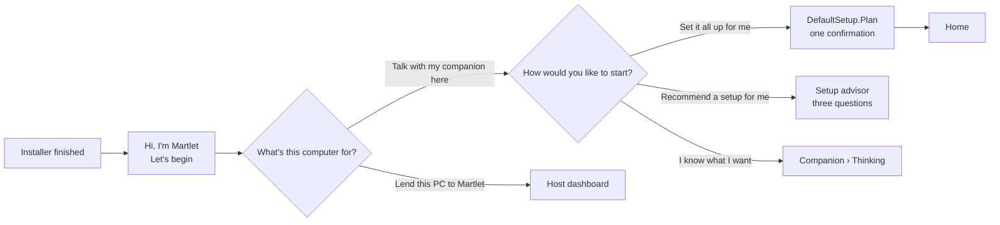
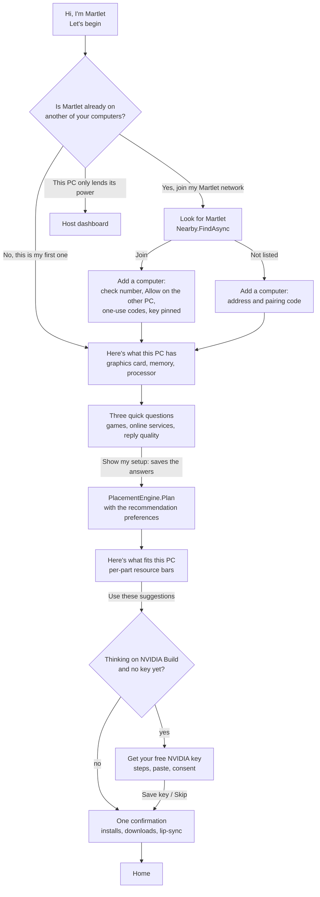

# The welcome wizard

The welcome wizard is the first thing Martlet shows after it is installed and
started on a computer that hasn't chosen its role yet (no `device-role.txt` in
the [PC folder](ACCOUNTS.md#pc-scope), `%ProgramData%\Martlet`). It also shows
for a Windows user who hasn't chosen yet on a companion PC that another Windows
user set up; on a host PC that user lands on the host dashboard. Settings ›
*This PC's role* › *Replay the welcome tour* shows it again.
The code is in `src/Martlet.Desktop/MainWindow.Welcome.cs` (steps),
`MainWindow.xaml` (the `Tour` overlay), `DefaultSetup.cs` (planning) and
`MainWindow.DefaultSetup.cs` (applying).

## How it worked before (up to 0.49)

The quick installer asks no setup questions and installs no prerequisites. Its
Finished page starts Martlet, and the first launch showed a three-card tour:

- **Role** saved `device-role.txt` (Companion or Host). A host PC's tour ended
  on the host dashboard.
- **Set it all up for me** (hidden when the PC was already paired with another
  computer) ran `DefaultSetup.Plan`: a hand-written rule set reading the NVIDIA
  card with nvidia-smi. Thinking was always Gemma 4 E2B in Ollama here; a voice
  engine (Chatterbox Turbo) went on the card if it had 4 GB left beside
  Thinking, otherwise a Windows voice; Listening was Parakeet on the processor,
  or Whisper on the card when room was left after the voice. One
  confirmation (`DefaultSetupQuestion`) listed the downloads, then
  `SetUpDefaultsAsync` installed Ollama and the model, switched to a Windows
  voice and Parakeet at once, and set up the voice engine and Whisper in the
  background. Lip-sync was not touched (the default looks for an Audio2Face
  service before each sentence and falls back to the voice's loudness).
- Joining another computer was a separate path: Devices › *Add a computer*
  (`HostsWindow`) finds Martlet on the local network (`Nearby`, UDP/TCP 9444),
  both computers show a six-digit check number, the owner allows it on the
  computer with the hosts, and this PC redeems one-use pairing codes with each
  host, which pins the host's key. The tour never offered it.
- Nothing asked whether online services were acceptable, nothing showed how
  much of the PC each part would use, and the NVIDIA Build key had to be found
  and pasted in Companion › Thinking by hand.

## How it works now

1. **Network.** *No, this is my first one* starts a new Martlet network on this
   PC. *Yes, join my Martlet network* looks for Martlet on the local network
   the way *Add a computer* does (`Nearby.FindAsync`: about two seconds of
   broadcast queries on the private subnets, never a scan) and lists each
   computer that answered with its hosts. *Join* opens *Add a computer* already
   asking that computer: both show the same check number, the owner presses
   Allow there, and this PC pairs with each host using the one-use codes it
   receives, so trust and key pinning are exactly as in *Add a computer*.
   *It isn't listed* opens the address-and-code path. Only a computer that runs
   a host (or reaches one over SSH) with *Let my other computers find this PC*
   on answers. *This PC only lends its power to my other computers* makes this
   a host PC and ends on the host dashboard. Choosing a network saves the
   companion role.
2. **This PC's hardware.** Martlet reads the graphics card (nvidia-smi for
   NVIDIA cards, including the memory in use now; otherwise the card Windows
   reports, with its vendor), memory and processor threads, all on this PC,
   and builds the planning contract's `MachineSpecs.ThisPc`.
3. **Three questions** ([Recommendation design](RECOMMENDATION_DESIGN.md#what-martlet-asks)).
   Martlet asks no question about models, memory or graphics cards.
   - *Do you play games or use heavy apps on this PC?* Yes or No. Martlet
     selects Yes when it finds a game library with a game in it on this PC
     (Steam, Epic, GOG, Xbox, EA, Ubisoft, Riot, Rockstar or Amazon;
     `GameLibraries.Found` in `PcActivity.cs`), and the hint under the question
     says so. Yes sets `MachineSpecs.KeepGpuForGames` for this PC: its card
     takes only Thinking and the voice.
   - *May Martlet use free online services?* Never / Only as a backup (the
     default) / Yes, when they're faster or smarter. Never plans with
     `HostingPreference.PreferLocal`, only as a backup with `Backup` (no live
     job online; Deep thinking and a backup for Thinking may be), and Yes with
     `Balanced` (online options compete with local ones).
   - *What matters more in a conversation?* Quick replies / Balanced (the
     default) / Smarter replies: Thinking's first word within 0.25 s, 0.4 s or
     1 s. Martlet takes the smartest model that meets it and leaves room for
     the voice.

   *Show my setup* saves the answers as the recommendation preferences
   (`recommendation-preferences.json`, shared with your other computers; the
   games answer is this PC's) and shows the suggestion. Settings ›
   *Recommended setup preferences* and Recommended setup's *Your preferences*
   change them later.
4. **Suggestion.** `DefaultSetup.Recommend` calls `PlacementEngine.Plan` for
   Thinking, Voice, Listening, Character and Lip-sync (deep thinking, singing
   and pictures are set up later from their own pages). Each part shows what
   does it, where (this PC, online, another of your computers), the engine's
   reason and three bars: its share of the card's memory, of system memory and
   of the processor's threads. Parts left out say why. The totals line adds
   them up. When this PC joined a network, the plan includes the paired hosts
   (`MachineSpecs.FromHostHardware` from their hardware reports) and
   *What changes now that this PC joined* lists
   `PlacementEngine.SuggestForJoiningMachine` (take over from a hosted model,
   add lip-sync, and so on). Jobs already set up keep their route. *Ask me three
   questions instead* opens the setup advisor and *I'll choose myself* opens
   Companion › Thinking.
5. **NVIDIA key** (only when Thinking goes to NVIDIA Build and no Thinking is
   set up yet). The steps follow
   [HOSTED_THINKING.md](HOSTED_THINKING.md#nvidia-build-key): sign in or create
   a free account at build.nvidia.com, *Generate API Key* on the API Keys page,
   copy the `nvapi-` key, paste it, tick the consent and *Save key*. The key is
   saved the same way as Companion › Thinking › *A cloud provider* (Windows
   Credential Manager, route consent) with the catalog's NVIDIA Build model.
   *Skip the key* sets up everything else; Home then asks for Thinking.
6. **Apply.** *Use these suggestions* (or saving the key) closes the wizard on
   Home and asks the one *Set it all up for me* confirmation, which now also
   names lip-sync and whether Thinking is online. It sets up what the plan puts
   on this PC (Ollama and the model, the voice engine,
   Parakeet then Whisper), skips jobs that are already set up or that another
   computer or online service does, and sets lip-sync: Audio2Face on this PC's
   host service when the plan placed it on the card, on the host the plan chose
   when that host is paired, otherwise the voice's loudness (`LoudnessLipSync`:
   the mouth opens with the speech's level, nothing installed).

Accepting the suggestion is one click plus the confirmation; downloads,
installs, Docker Desktop's terms and the key's consent are still asked
separately. Home's *Set it all up for me* fixes use the same engine with
`PreferLocal` and the saved reply quality, hearing preference and games answer.

## Limits

- Martlet can only find a network through a computer that runs a host (or
  reaches one over SSH). Two companion PCs without a host can't see each other.
- Until the Devices view's mapping from saved routes to the planner's
  `CurrentAssignment`s lands, the join suggestion compares against the engine's
  own plan for the network without this PC rather than what it runs today.
- The plan's Thinking backup (a local model when NVIDIA Build is down) is shown
  but not set up; set it in Companion › Thinking › *If Thinking fails*.

## MCP

Automation IDs: `TourBegin`, `TourBack`, `TourSkip`; step 1 `WizardNewNetwork`,
`WizardJoinNetwork`, `WizardScanAgain`, `WizardScanStatus`, `WizardFound-<n>`,
`WizardConnect-<n>`, `WizardJoinManual`, `TourHost`; step 2
`WizardSpecRow-Gpu|Vram|Ram|Cpu`, `WizardSpecs`, `WizardSpecsNext`; step 3
`WizardGamesYes`, `WizardGamesNo`, `WizardGamesHint`, `WizardOnlineNever`,
`WizardOnlineBackup`, `WizardOnlineYes`, `WizardQualityQuick`,
`WizardQualityBalanced`, `WizardQualitySmarter`, `WizardQuestionsNext` (it
saves the answers); step 4 `WizardPlanSummary`,
`WizardPlanItem-Thinking|Voice|Listening|LipSync`, `WizardJoinSuggestion-<n>`,
`WizardPlanTotals`, `WizardAccept`, `TourAdvisor`, `TourSetup`; step 5
`WizardKeyIntro`, `WizardKeySteps`, `WizardKeyOpen`, `WizardKey`,
`WizardKeyConsent`, `WizardKeyStatus`, `WizardKeySave`, `WizardKeySkip`. See
[MCP](MCP.md) for which need `--allow-ui-effects`. A fresh disposable data
directory (`scripts\Invoke-MartletMcp.ps1 -Desktop`) starts on the wizard.
